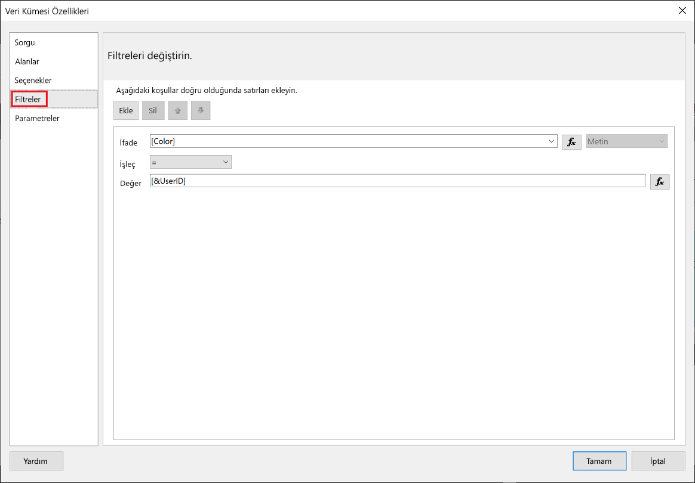
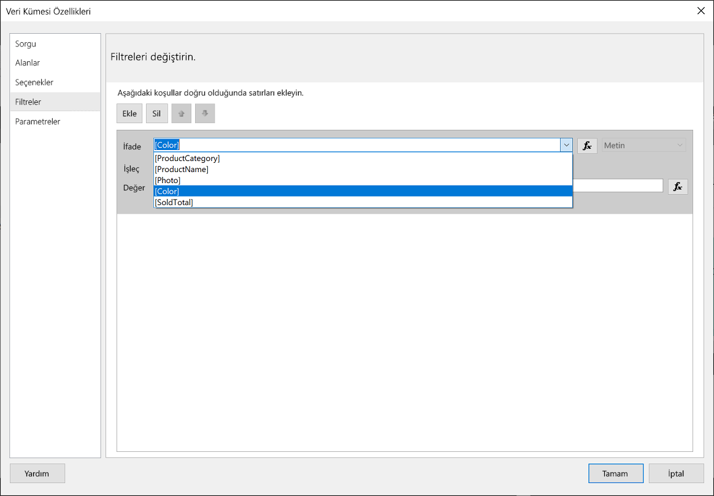
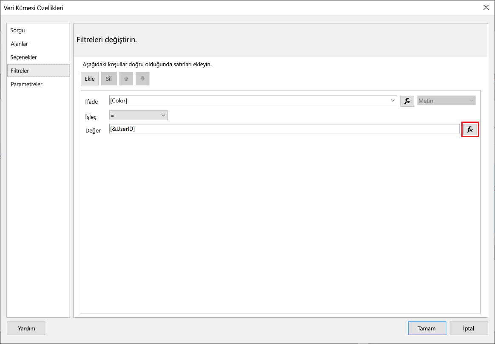
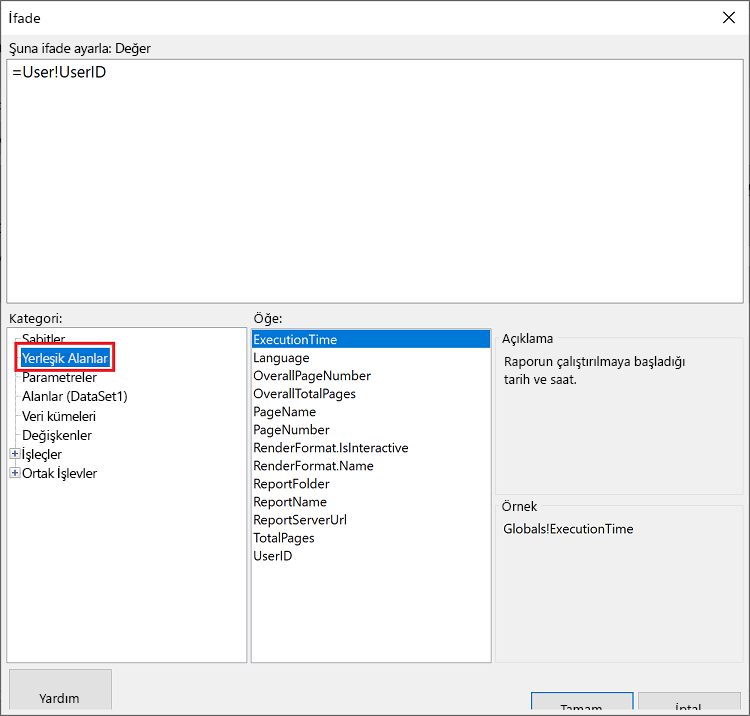
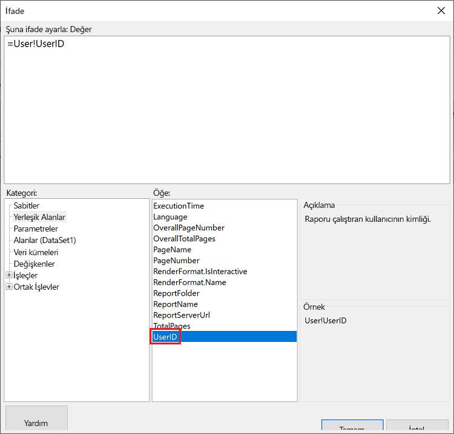
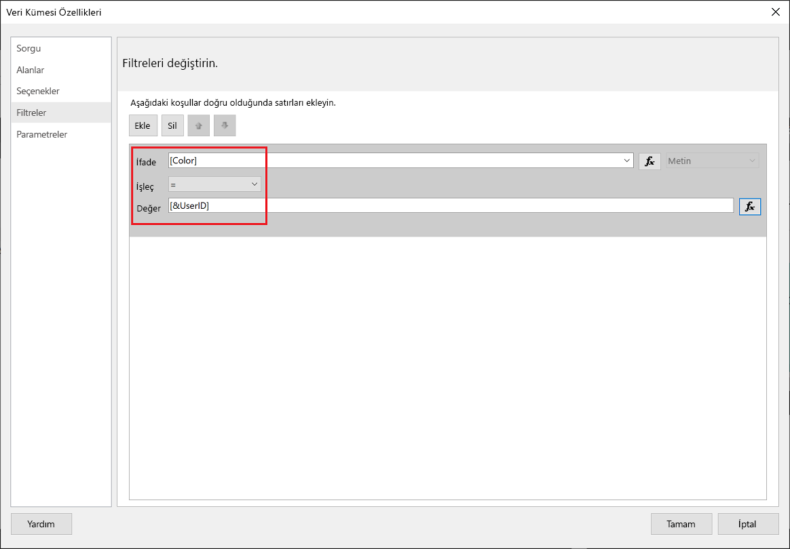
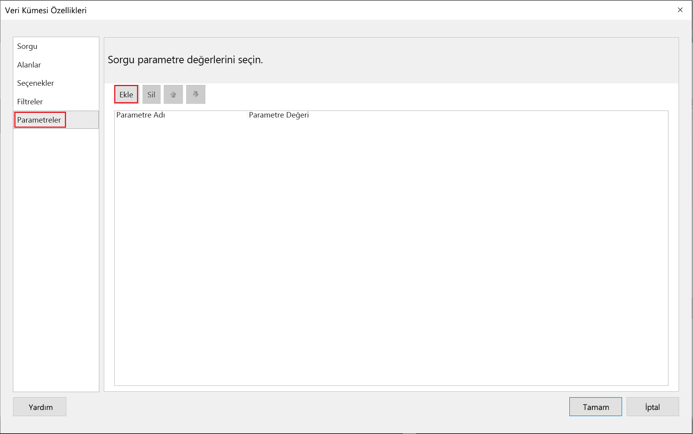
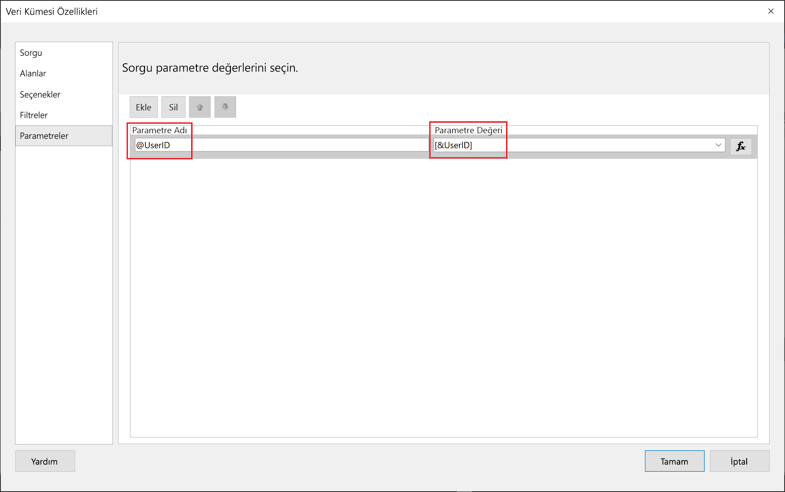
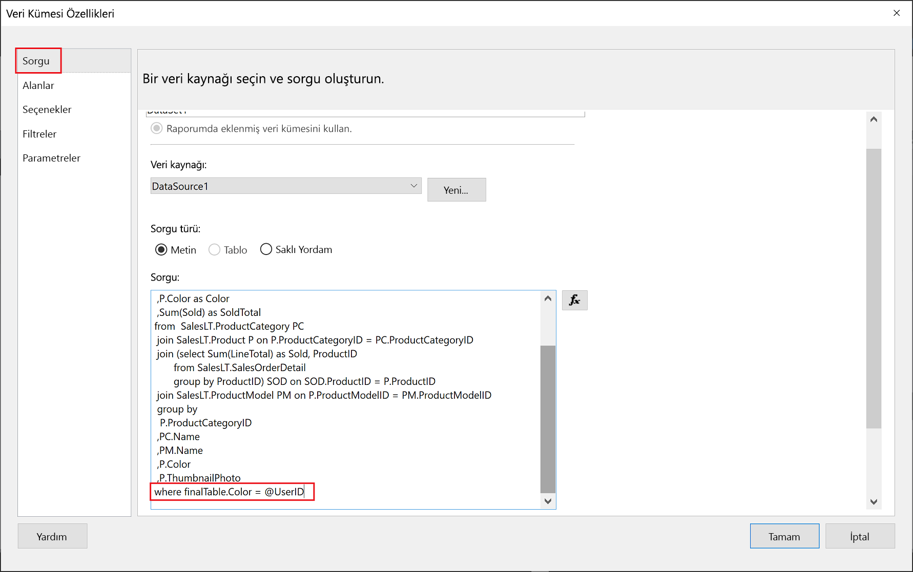

# <a name="implementing-row-level-security-in-embedded-paginated-reports-preview"></a>Eklenen sayfalandırılmış raporlarda satır düzeyinde güvenlik uygulama (önizleme)

Eklediğiniz sayfalandırılmış raporda görüntülenecek verileri denetleyebilirsiniz. Bu sayede görüntülenen bilgileri kullanıcıya göre biçimlendirebilirsiniz. Örneğin küresel satış sonuçlarını içeren bir Power BI sayfalandırılmış raporunuz varsa bunu yalnızca belirli bir bölgeye ait satış sonuçlarını gösterecek şekilde ekleyebilirsiniz.

Bu özellik sayesinde verilerin bir alt kümesini görüntüleyebilir, geri kalanının güvenliğini tehlikeye atmamış olursunuz. Bu açıdan Power BI raporlarında (sayfalandırılmış olmayan), panolarında, kutucuklarında ve veri kümelerinde verilerin güvenli bir şekilde görüntülenmesini sağlayan [Satır Düzeyi Güvenlik (RLS)](embedded-row-level-security.md) özelliğine benzer.  

> [!NOTE]
> Bu özellik, müşteriler için eklenen sayfalandırılmış raporlarla birlikte çalışır.

## <a name="configuring-a-parameter-to-filter-the-dataset"></a>Veri kümesini filtrelemek için bir parametre yapılandırma

Bir Power BI sayfalandırılmış raporuna satır düzeyi güvenlik uygulamak için **UserID** özniteliğine bir [parametre](../../paginated-reports/report-builder-parameters.md) atamanız gerekir. Bu parametre, rapor eklenmeden önce veri kümesinden çekilen verileri kısıtlar.

Parametreyi **UserID** özniteliğine atadıktan sonra [Reports GenerateTokenForCreateInGroup](https://docs.microsoft.com/rest/api/power-bi/embedtoken/reports_generatetokenforcreateingroup) API'sini kullanarak ekleme belirtecini alabilirsiniz.

## <a name="use-userid-as-a-filter-at-report-or-query-level"></a>UserID özniteliğini rapor veya sorgu düzeyinde filtre olarak kullanma

**UserId** özniteliğini [Power BI Report Builder](../../paginated-reports/report-builder-power-bi.md)'da veri kaynağı için bir *filtre* veya *sorgu* olarak kullanabilirsiniz.

### <a name="using-the-filter"></a>Filtreyi kullanma

1. **Veri Kümesi Özellikleri** penceresinde soldaki bölmeden **Filtre**'yi seçin.

    

2. **İfade** açılan menüsünden verileri filtrelemek için kullanmak istediğiniz parametreyi seçin.

     

3. **Değer** işlev düğmesine tıklayın. 

    

4. **İfade** penceresindeki **Kategori** listesinden **Yerleşik Alanlar**'ı seçin.

    

5. **Öğe** listesinden **UserID** değerini seçip **Tamam**'a tıklayın.

    

6. **Veri Kümesi Özellikleri** penceresinde ifadenin *seçtiğiniz parametre = UserID* olduğunu doğrulayın ve **Tamam**'a tıklayın.

    

### <a name="using-a-query"></a>Sorgu kullanma

1. **Veri Kümesi Özellikleri** penceresinde soldaki bölmeden **Parametreler**'i seçin ve **Ekle**'ye tıklayın.

    

2. **Parametre Adı** alanına **\@UserID** girin, **Parametre Değeri** alanına ise **[&UserID]** ekleyin.

     

3. Soldaki bölmeden **Sorgu**'yu seçin ve Sorgu bölmesinde **UserID** parametresini sorgunuza ekleyip **Tamam**'a tıklayın.
    > [!NOTE]
    > Aşağıdaki ekran görüntüsünde renk parametresi örnek olarak kullanılmıştır (whereFinalTable.Color = @UserID). Gerekirse daha karmaşık bir sorgu oluşturabilirsiniz.

    

## <a name="passing-the-configured-parameter-using-the-embed-token"></a>Ekleme belirtecini kullanarak yapılandırılan parametreyi geçirme

Müşterileriniz için bir sayfalandırılmış rapor eklerken, ekleme belirtecini almak için [Reports GenerateTokenForCreateInGroup](https://docs.microsoft.com/rest/api/power-bi/embedtoken/reports_generatetokenforcreateingroup) API'si kullanılır. Bu belirteç, sayfalandırılmış rapordan alınan verilerin bir bölümünü filtrelemek için de kullanılabilir.

Verilerin yalnızca bir bölümünü kullanıma sunmak için `username` alanına görüntülenmesini istediğiniz bilgileri atayın. Örneğin renk parametresine sahip olan bir sayfalandırılmış raporda `username` alanına *yeşil* yazmanız durumunda ekleme belirteci eklenen verileri yalnızca renk sütununda *yeşil* değerine sahip olan verileri görüntüleyecek şekilde kısıtlar.

```JSON
{
    "accessLevel": "View",
    "reportId": "cfafbeb1-8037-4d0c-896e-a46fb27ff229",
    "identities": [
            {
                    // Replace the 'username' with a paginated report parameter
                    "username":     "...",
                    "reports: [
                        "cfafbeb1-8037-4d0c-896e-a46fb27ff229"
                    ]
            }
    ]
}
```
