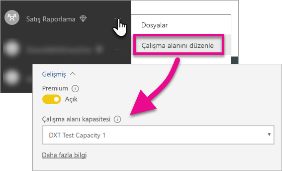

# Power BI panolarınızı, raporlarınızı ve kutucuklarınızı ekleme

Power BI içeriğini uygulamanıza eklemek için gerçekleştirmeniz gereken işlemler hakkında bilgi edinin.

Microsoft kullanıcılara içerikle ilgili erişme, paylaşma ve dağıtma konularında daha fazla esneklik sunan yeni bir kapasite tabanlı lisanslama modeli olan [Power BI Premium'u duyurdu](https://powerbi.microsoft.com/blog/microsoft-accelerates-modern-bi-adoption-with-power-bi-premium/). Bu teklif ayrıca Power BI hizmeti için ek ölçeklenebilirlik ve performansı da beraberinde getirdi. Microsoft Azure'da kapasite oluşturmaya olanak sağlayan Power BI Embedded da duyuruldu. Power BI Embedded, uygulamanıza ve müşterilerinize odaklanmış bir çözümdür. 

Bu makalede Power BI içeriğini hem kuruluşunuz hem de müşterileriniz için ekleme seçenekleri ele alınmıştır. İki senaryonun adımları birbirine benzerdir. Müşterileriniz için içerik eklemeye özgü adımlar için açıklama balonları eklenmiştir.

Bunu mümkün hale getirmek için uygulamanızda yapmanız gereken birkaç işlem vardır. Katıştırılmış içerik oluşturmanız ve bu içeriği uygulamanızda kullanmanız için gerekli adımlar konusunda size rehberlik edeceğiz.

> [!NOTE]
> Power BI API'lerde uygulama çalışma alanları hâlâ gruplar olarak adlandırılmaktadır. Gruplara yapılan başvurular, uygulama çalışma alanlarıyla çalıştığınızı gösterir.

## 1. Adım: Katıştırılmış analiz geliştirme ortamınızı kurma

Panoları ve raporları uygulamanıza eklemeye başlamadan önce ortamınızın ekleme işlevlerine izin verecek şekilde ayarlanmış olduğundan emin olmanız gerekir. Kurulumun bir parçası olarak aşağıdaki işlemleri yapmanız gerekir.

* [Azure Active Directory kiracısına sahip olduğunuzdan emin olun](embedding-content.md#azureadtenant)
* [Power BI Pro hesabınızı oluşturun](embedding-content.md#proaccount)

Hızlıca çalışmaya başlamak ve bir örnek uygulama indirmek için [Ekleme deneyimi aracını](https://aka.ms/embedsetup) inceleyebilirsiniz.

Size uygun olan çözümü seçin:
* [Embedding for your customers](embedding.md#embedding-for-your-customers) seçeneği, Power BI hesabı olmayan kullanıcılar için panolar ve raporlar eklemenize olanak sağlar. [Embed for your customers](https://aka.ms/embedsetup/AppOwnsData) çözümünü çalıştırın.
* [Embedding for your organization](embedding.md#embedding-for-your-organization) seçeneği, Power BI hizmetinin kapsamını genişletmenize olanak tanır. [Embed for your organization](https://aka.ms/embedsetup/UserOwnsData) çözümünü çalıştırın.

Ancak, ortamı el ile ayarlamayı seçerseniz aşağıdaki adımlara devam edebilirsiniz. 

> [!NOTE]
> Uygulamanızın geliştirilmesi için ayrılmış kapasite gerekli değildir. Uygulama geliştiricilerinin Power BI Pro lisansına sahip olması gerekir.

### Azure Active Directory kiracısı

Power BI’den öğe eklemek için bir Azure Active Directory (Azure AD) kiracınızın olması gerekir. Bu kiracıda en az bir Power BI Pro kullanıcısı bulunmalıdır. Ayrıca kiracı içinde bir Azure AD uygulaması da tanımlamanız gerekir. Var olan Azure AD kiracısını kullanabilir veya ekleme için kullanmak üzere yeni bir kiracı oluşturabilirsiniz.

Müşterileriniz için içerik ekliyorsanız hangi kiracıyı kullanacağınızı belirlemeniz gerekir.

* Var olan kurumsal Power BI kiracınızı mı kullanacaksınız?
* Uygulamanız için ayrı bir kiracı mı kullanacaksınız?
* Her müşteri için ayrı bir kiracı mı kullanacaksınız?

Var olan kiracınızı kullanmak istemiyorsanız uygulamanız veya her müşteri için yeni bir kiracı oluşturabilirsiniz, bkz. [Azure Active Directory kiracısı oluşturma](create-an-azure-active-directory-tenant.md) veya [How to get an Azure Active Directory tenant (Azure Active Directory kiracısı edinme)](https://docs.microsoft.com/azure/active-directory/develop/active-directory-howto-tenant).

### Power BI Pro kullanıcı hesabı oluşturma

İçerik eklemek için yalnızca bir Power BI Pro hesabına ihtiyacınız vardır. Ancak yalnızca bazı öğelere erişimi bulunan birkaç farklı kullanıcıya sahip olmak isteyebilirsiniz. Kiracınızda bulunmasını isteyebileceğiniz kullanıcılar aşağıda verilmiştir.

Aşağıdaki hesapların kiracınızda bulunması ve hepsine birer Power BI Pro lisansı atanmış olması gerekir. Power BI içindeki uygulama çalışma alanlarıyla çalışmak için Power BI Pro lisansı gereklidir.

#### Kuruluş/kiracı yönetici kullanıcısı

Müşterileriniz için ekleme yapıyorsanız kuruluş/kiracı Genel Yönetici kullanıcınızın, uygulamanızın kullandığı hesap olarak kullanılmaması önerilir. Bunun nedeni uygulama hesabının kiracınız içindeki erişimini en aza indirmektir. Yönetici kullanıcının, ekleme için oluşturulan tüm uygulama çalışma alanlarında yönetici olması önerilir.

#### İçerik oluşturan çözümleyicilerin hesapları

Power BI'da içerik oluşturacak birden fazla kullanıcı bulunabilir. Power BI'da içerik oluşturan ve dağıtan her çözümleyici için bir Power BI Pro hesabı olması gerekir.

#### Müşterileriniz için içerik ekleme amacıya kullanılacak uygulama *ana* kullanıcı hesabı

Ana hesap, uygulamanızın müşterileriniz için içerik eklerken kullandığı hesaptır. Bu senaryo genelde ISV uygulamalarında kullanılır. Ana hesap, kuruluşunuzda gerekli olan tek hesaptır. Yönetici ve analist hesabı olarak da kullanılabilir ancak bu kullanım önerilmez. Bu hesabın kimlik bilgileri, uygulamanızın arka ucunda depolanır ve Power BI API'ler ile kullanılacak Azure AD kimlik doğrulama belirteçlerini almak için kullanılır. Bu hesap müşterileriniz için içerik ekleme amacıyla kullanılacak uygulamanın ekleme belirtecini oluşturur.

Ana hesap, uygulamanızda kullandığınız ve Power BI Pro lisansına sahip olan normal bir kullanıcıdır. Hesabın, içerik ekleme için kullanılan uygulama çalışma alanının yöneticisi olması gerekir.

###  Uygulama kaydı ve izinler

REST API çağrıları gerçekleştirmek için uygulamanızı Azure AD'ye kaydetmeniz gerekir. Daha fazla bilgi için bkz. [Bir Azure AD uygulamasını Power BI içeriği eklemek üzere kaydetme](register-app.md).

### Uygulama çalışma alanları oluşturma

Pano ve raporları müşteriniz için ekliyorsanız bu pano ve raporların bir uygulama çalışma alanına eklenmesi gerekir. Yukarıda bahsedilen *ana* hesabın, uygulama çalışma alanında yönetici olması gerekir.

[!INCLUDE [powerbi-service-create-app-workspace](../includes/powerbi-service-create-app-workspace.md)]

> [!NOTE]
> Yönetici olmayan bir kullanıcı en fazla yalnızca 250 uygulama çalışma alanı oluşturabilir. Daha fazla uygulama çalışma alanı oluşturmak için bir kiracı yönetici hesabı kullanmanız gerekir.
>

### Raporlarınızı oluşturma ve karşıya yükleme

Power BI Desktop'ı kullanarak raporlarınızı ve veri kümelerinizi oluşturabilir, ardından bu raporları uygulama çalışma alanında yayımlayabilirsiniz. Raporları yayımlayan son kullanıcının uygulama çalışma alanında yayımlama yapabilmesi için bir Power BI Pro lisansına sahip olması gerekir.

## 2. Adım: İçeriğinizi ekleme

Uygulamanızın içinde Power BI kimlik doğrulaması gerçekleştirmeniz gerekir. Müşterileriniz için içerik ekliyorsanız *ana* hesabın kimlik bilgilerini uygulamanızda depolamanız gerekir. Daha fazla bilgi için bkz. [Power BI uygulamanız için kullanıcıların kimliğini doğrulama ve Azure AD erişim belirteci alma](get-azuread-access-token.md).

Uygulamanız içinde kimlik doğrulamasını geçtikten sonra panoları ve raporları uygulamanıza eklemek için Power BI REST API'lerini ve JavaScript API'lerini kullanabilirsiniz. 

**Kuruluşunuz için içerik ekleme** konusunda bilgi almak için aşağıdaki adım adım kılavuzları inceleyin:

* [Panoları uygulamalarla tümleştirme](integrate-dashboard.md)
* [Kutucukları uygulamalarla tümleştirme](integrate-tile.md)
* [Raporları uygulamalarla tümleştirme](integrate-report.md)

Tipik bir ISV senaryosu olan **müşterileriniz için içerik ekleme** hakkında bilgi almak için aşağıdakileri inceleyin:

* [Uygulamanıza bir pano, kutucuk veya rapor tümleştirme](embed-sample-for-customers.md)

Müşterileriniz için içerik eklerken bir ekleme belirteci kullanmanız gerekir. Daha fazla bilgi edinmek için bkz. [Ekleme Belirteci](https://docs.microsoft.com/rest/api/power-bi/embedtoken).

## 3. Adım: Çözümünüzü üretime yükseltme

Üretim aşamasına geçmeniz için gerçekleştirmeniz gereken birkaç ek işlem vardır.

### Kuruluşunuz için içerik ekleme

Kuruluşunuz için içerik ekliyorsanız kullanıcıları uygulamanıza yönlendirmeniz yeterlidir. 

Ücretsiz kullanıcılar, ayrılmış kapasite ile desteklenen bir uygulama çalışma alanından (gruptan) eklenmiş olan içeriği kullanabilir. Ücretsiz kullanıcıyı uygulama çalışma alanına (gruba) üye olarak ekleyin, aksi halde 401 yetkisiz erişim hatası alırsınız. Aşağıdaki tabloda Office 365'te kullanılabilecek olan Power BI Premium SKU'ları yer almaktadır.

| Kapasite Düğümü | Toplam çekirdek *(Arka uç + ön uç)* | Arka Uç Çekirdekleri | Ön Uç Çekirdekleri | DirectQuery/canlı bağlantı sınırları | Yoğun saatlerde işlenen maksimum sayfa sayısı |
| --- | --- | --- | --- | --- | --- |
| EM3 |4 sanal çekirdek |2 çekirdek, 10 GB RAM |2 çekirdek | |601-1200 |
| P1 |8 sanal çekirdek |4 çekirdek, 25 GB RAM |4 çekirdek |saniyede 30 |1201-2400 |
| P2 |16 sanal çekirdek |8 çekirdek, 50 GB RAM |8 çekirdek |saniyede 60 |2401-4800 |
| P3 |32 sanal çekirdek |16 çekirdek, 100 GB RAM |16 çekirdek |saniyede 120 |4801-9600 |

> [!NOTE]
> Power BI Premium lisansını satın alabilmek için kiracınızda Genel Yönetici veya Faturalama Yöneticisi olmanız gerekir. Power BI Premium'u satın alma hakkında bilgi için bkz. [Power BI Premium'u satın alma](../service-admin-premium-purchase.md).

>[!Note]
>[Kuruluşunuz için tümleşik analiz ortamınızı ayarlayın.](#step-1-setup-your-embedded-analytics-development-environment)
>

### Müşterileriniz için içerik ekleme

Müşterileriniz için ekliyorsanız aşağıdaki işlemleri yapın.

* Geliştirme için ayrı bir kiracı kullanıyorsanız uygulama çalışma alanlarınızın, panolarınızın ve raporlarınızın üretim ortamınızda kullanılabilir durumda olduğundan emin olmanız gerekir. Uygulamayı üretim kiracınızın Azure AD ortamında oluşturduğunuzdan ve 1. Adım ile belirtilen gerekli uygulama izinlerini atadığınızdan emin olun.
* İhtiyaçlarınıza uygun bir kapasite satın alın. İhtiyacınız olan Power BI Embedded kapasitesi SKU seviyesini belirlemek için aşağıdaki tabloyu kullanabilirsiniz. Daha ayrıntılı bilgi için bkz. [Embedded analytics capacity planning (Katıştırılmış analiz kapasite planlama) teknik incelemesi](https://aka.ms/pbiewhitepaper). Satın almaya hazır olduğunuzda [Microsoft Azure portalını](https://portal.azure.com) ziyaret edebilirsiniz. Power BI Embedded kapasitesi oluşturma hakkında ayrıntılı bilgi için bkz. [Create Power BI Embedded capacity in the Azure portal (Azure portalında Power BI Embedded kapasitesi oluşturma)](https://docs.microsoft.com/azure/power-bi-embedded/create-capacity).

> [!IMPORTANT]
> Ekleme belirteçleri yalnızca geliştirici testlerine yönelik olduğundan, bir Power BI ana hesabının oluşturabileceği ekleme belirteçlerinin sayısı sınırlıdır. Üretim ekleme senaryoları için [kapasite satın alınmalıdır](https://docs.microsoft.com/power-bi/developer/embedded-faq#technical). Ayrılmış bir kapasite satın alındıktan sonra, ekleme belirteci oluşturmayla ilgili bir sınır yoktur. Kaç tane ekleme belirtecinin kullanılıp kullanılmadığını kontrol etmek için [Kullanılabilir Özellikler](https://docs.microsoft.com/rest/api/power-bi/availablefeatures) bölümüne gidin.

| Kapasite Düğümü | Toplam çekirdek *(Arka uç + ön uç)* | Arka Uç Çekirdekleri | Ön Uç Çekirdekleri | DirectQuery/canlı bağlantı sınırları | Yoğun saatlerde işlenen maksimum sayfa sayısı |
| --- | --- | --- | --- | --- | --- |
| A1 |1 sanal çekirdek |0,5 çekirdek, 3 GB RAM |0,5 çekirdek | saniyede 5 |1-300 |
| A2 |2 sanal çekirdek |1 çekirdek, 5 GB RAM |1 çekirdek | saniyede 10 |301-600 |
| A3 |4 sanal çekirdek |2 çekirdek, 10 GB RAM |2 çekirdek | saniyede 15 |601-1200 |
| A4 |8 sanal çekirdek |4 çekirdek, 25 GB RAM |4 çekirdek |saniyede 30 |1201-2400 |
| A5 |16 sanal çekirdek |8 çekirdek, 50 GB RAM |8 çekirdek |saniyede 60 |2401-4800 |
| A6 |32 sanal çekirdek |16 çekirdek, 100 GB RAM |16 çekirdek |saniyede 120 |4801-9600 |

* Uygulama çalışma alanını düzenleyin ve gelişmiş ayarlar bölümünden bir ayrılmış kapasiteye atayın.

    

* Güncelleştirilen uygulamanızı üretim ortamında dağıtın ve Power BI panoları ile raporlarını eklemeye başlayın.

>[!Note]
>[Müşterileriniz için tümleşik analiz ortamınızı ayarlayın.](#step-1-setup-your-embedded-analytics-development-environment) 
>

## Yönetici ayarları

Genel Yöneticiler veya Power BI hizmeti yöneticileri, bir kiracı için REST API'lerini kullanma seçeneğini etkinleştirebilir veya devre dışı bırakabilir. Power BI yöneticileri bu ayarı kuruluşun tamamı veya yalnızca belirli güvenlik grupları için değiştirebilir. Varsayılan olarak kuruluşun tamamı için etkindir. Bu işlem [Power BI yönetici portalı](../service-admin-portal.md) aracılığıyla gerçekleştirilir.

## Sonraki adımlar

[Power BI ile ekleme](embedding.md)  
[Power BI Embedded çalışma alanı koleksiyon içeriğini Power BI'a geçirme](migrate-from-powerbi-embedded.md)  
[Power BI Premium nedir?](../service-premium.md)  
[Power BI Premium'u satın alma](../service-admin-premium-purchase.md)  
[JavaScript API Git deposu](https://github.com/Microsoft/PowerBI-JavaScript)  
[Power BI C# Git deposu](https://github.com/Microsoft/PowerBI-CSharp)  
[JavaScript ekleme örneği](https://microsoft.github.io/PowerBI-JavaScript/demo/)  
[Embedded analytics capacity planning (Embedded Analytics kapasite planlama) teknik incelemesi](https://aka.ms/pbiewhitepaper)  
[Power BI Premium teknik incelemesi](https://aka.ms/pbipremiumwhitepaper)  

Başka bir sorunuz mu var? [Power BI Topluluğu'na sorun](http://community.powerbi.com/)