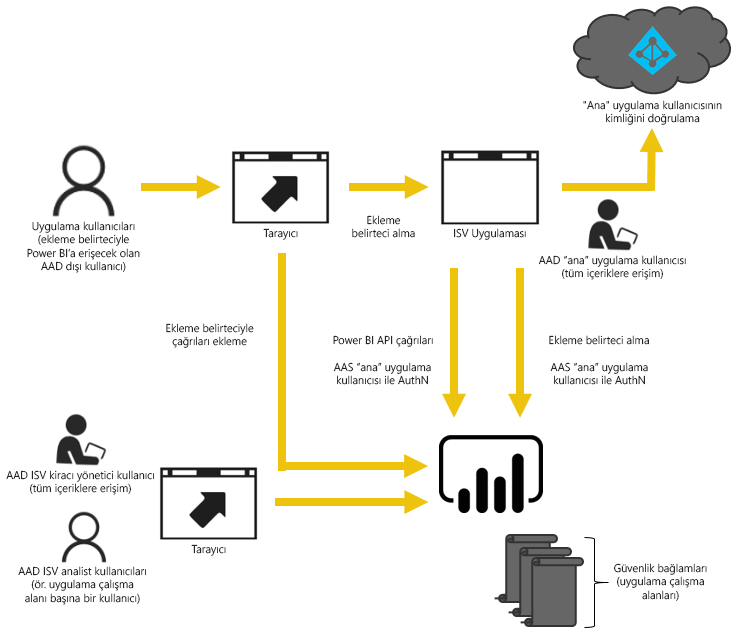

# Power BI ile ekleme
Power BI, panolarınızı ve raporlarınızı uygulamalara eklemek için kullanabileceğiniz API'ler sunar. Power BI API'leri, içerik eklerken kullanabileceğiniz bir dizi özelliğin yanı sıra en yeni Power BI özeliklerine (panolar, ağ geçitleri ve uygulama çalışma alanları gibi) erişim sunar.

## Tek bir API
Power BI içeriğini eklerken kullanılabilecek iki ana senaryo vardır.  İlk senaryo, kuruluşunuzdaki kullanıcılara (Power BI lisansı olan) yönelik ekleme işlemleri için geçerlidir. İkinci senaryoda ise ekleme işlemini, kullanıcı ve müşterilerinizin Power BI lisanslarının olmasına gerek kalmadan gerçekleştirirsiniz. Power BI REST API'si iki senaryo için de kullanılabilir. 

Power BI lisansı olmayan müşteriler ve kullanıcılar için panoları ve raporları özel uygulamanıza ekleyebilir, aynı API'yi kullanarak kuruluşunuza veya müşterilerinize sunabilirsiniz. Müşterileriniz, uygulama tarafından yönetilen verileri görür. Kuruluşunuzdaki Power BI kullanıcıları ise *kendi verilerini* doğrudan Power BI'da veya eklenen uygulamanın bağlamında görüntülemeye ilişkin ek seçeneklere sahip olur. İçerik eklerken JavaScript ve REST API'lerinin tüm özelliklerini kullanabilirsiniz.

İçerik eklemenin nasıl gerçekleştirildiğini gösteren bir örnek için bkz. [JavaScript ekleme örneği](https://microsoft.github.io/PowerBI-JavaScript/demo/).

## Kuruluşunuz için içerik ekleme
Kuruluşunuz için içerik ekleyerek Power BI hizmetinin kapsamını genişletebilirsiniz. Bunun için uygulamanızın kullanıcılarının, içeriklerini görüntülemek istediklerinde Power BI hizmetinde oturum açmaları gerekir. Kuruluşunuzdaki bir kullanıcı oturum açtığında yalnızca, sahip olduğu veya Power BI hizmetinde kendisiyle paylaşılmış olan panolara ve raporlara erişebilir. 

*Kuruluşunuz için içerik ekleme örnekleri arasında şirket içi web uygulaması, SharePoint Online web bölümü ve Microsoft Teams tümleştirmesi bulunur.*

Kuruluşunuz için içerik ekleme konusunda bilgiye aşağıdaki sayfalardan ulaşabilirsiniz:

* [Panoları uygulamalarla tümleştirme](integrate-dashboard.md)
* [Kutucukları uygulamalarla tümleştirme](integrate-tile.md)
* [Raporları uygulamalarla tümleştirme](integrate-report.md)

Düzenleme ve kaydetme gibi self servis özellikleri Power BI kullanıcıları için ekleme yaparken [JavaScript API](https://github.com/Microsoft/PowerBI-JavaScript)'si aracılığıyla kullanılabilir.

## Müşterileriniz için içerik ekleme
Müşterileriniz için ekleme seçeneği, Power BI hesabı olmayan kullanıcılar için panolar ve raporlar eklemenize olanak sağlar. Müşterilerinizin Power BI'dan haberdar olmalarına gerek yoktur. Katıştırılmış bir uygulama oluşturmak için en az bir Power BI Pro hesabı gereklidir. Power BI Pro hesabı, uygulamanız için ana hesap olarak kullanılır. Bunu bir yetkili hesap olarak düşünün. Power BI Pro hesabı ile Power BI hizmetindeki, uygulamanıza ait veya uygulamanız tarafından yönetilen pano ve raporlara erişim sağlayan ekleme belirteçleri de oluşturabilirsiniz. 

*Müşterileriniz için içerik ekleme örneklerinden biri, diğer şirketlere sunulan bir ISV uygulamasıdır.*

Panoları, raporları ve kutucukları eklemek için kuruluşunuz için içerik ekleme amacıyla kullandığınız API'leri kullanmanız gerekir.

> [!IMPORTANT]
> Ekleme işlemi Power BI hizmetine bağlı olsa da müşterileriniz için Power BI hizmeti bağımlılığı söz konusu değildir. Kullanıcıların uygulamanıza eklenmiş içeriği görüntülemek için Power BI'a kaydolması gerekmez.
> 
> 

Üretim aşamasına geçmeye hazır olduğunuzda uygulama çalışma alanınızın bir kapasiteye atanması gerekir. Microsoft Azure içindeki Power BI Embedded çözümü, uygulamalarınızla kullanılabilecek kapasiteyi sunar.

Ekleme hakkında ayrıntılı bilgi için bkz. [Power BI panolarınızı, raporlarınızı ve kutucuklarınızı ekleme](embedding-content.md).

Azure'daki Power BI Çalışma Alanı Koleksiyonları'nı kullanıyorsanız içeriğinizi geçirme hakkında bilgi almak için bkz. [Power BI Çalışma Alanı Koleksiyonları Azure hizmetindeki içeriği geçirme](migrate-from-powerbi-embedded.md).

## Sonraki adımlar
[Power BI panolarınızı, raporlarınızı ve kutucuklarınızı ekleme](embedding-content.md)  
[Power BI Embedded çalışma alanı koleksiyon içeriğini Power BI'a geçirme](migrate-from-powerbi-embedded.md)  
[Power BI Premium nedir?](../service-premium.md)  
[JavaScript API Git deposu](https://github.com/Microsoft/PowerBI-JavaScript)  
[Power BI C# Git deposu](https://github.com/Microsoft/PowerBI-CSharp)  
[JavaScript ekleme örneği](https://microsoft.github.io/PowerBI-JavaScript/demo/)  
[Embedded analytics capacity planning (Embedded Analytics kapasite planlama) teknik incelemesi](https://aka.ms/pbiewhitepaper)  
[Power BI Premium teknik incelemesi](https://aka.ms/pbipremiumwhitepaper)  

Başka bir sorunuz mu var? [Power BI Topluluğu'na sorun](http://community.powerbi.com/)

