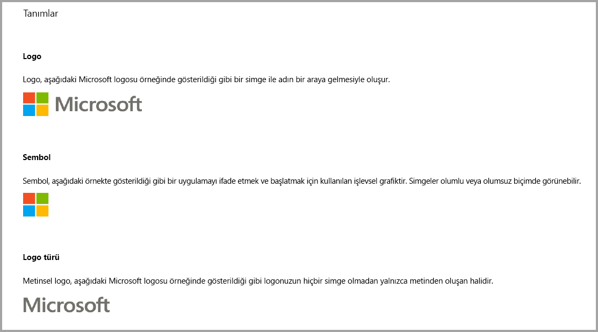
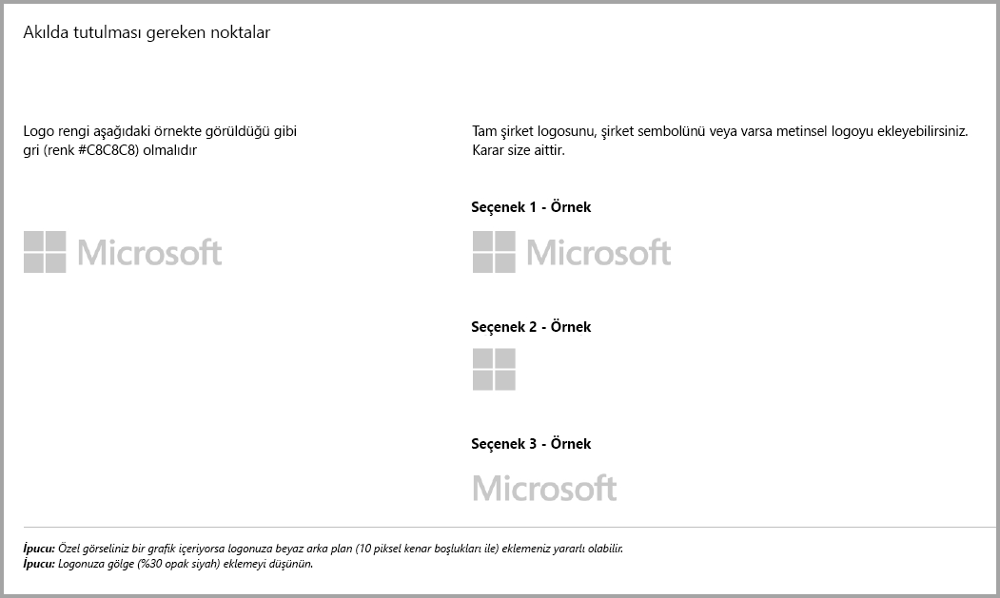
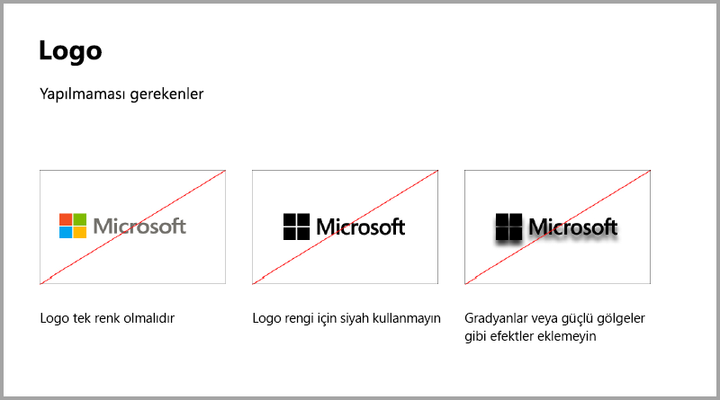
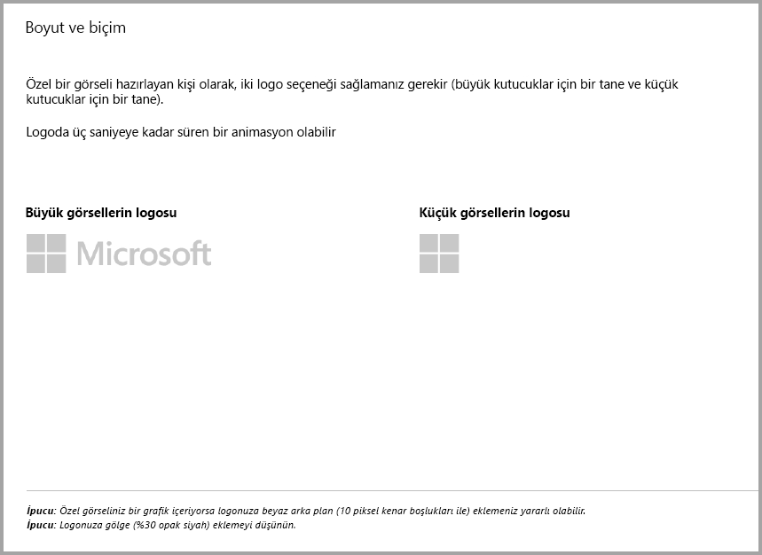
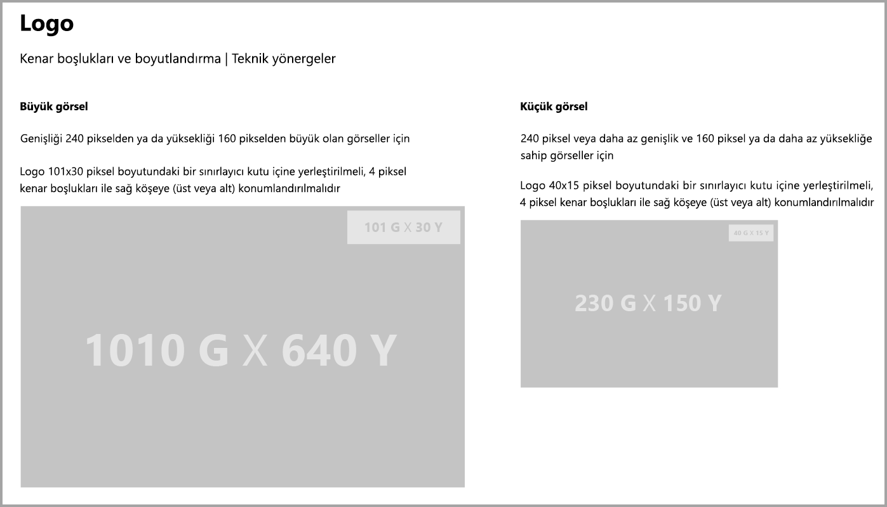
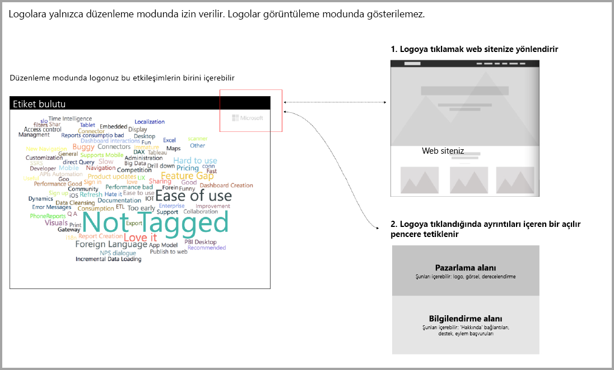

# Power BI görselleri için yönergeler
Görselinizi başkalarının bulması ve kullanması amacıyla AppSource’ta [yayımlamadan](https://docs.microsoft.com/power-bi/developer/office-store) önce kullanıcılarınıza yönelik harika bir deneyim oluşturmak için aşağıdaki yönergeleri izlediğinizden emin olun. 

## Bağlam menüsü
Bağlam menüsü, kullanıcı imlecini bir görselin üzerine getirdiğinde görüntülenen sağ tıklama menüsüdür.
Birleşik bir deneyim sunmak için tüm Power BI görsellerinde bağlam menüsü etkinleştirmelidir. Bağlam menüsü eklemeyi öğrenmek için lütfen [bu makaleye](https://github.com/Microsoft/PowerBI-visuals/blob/gh-pages/tutorials/building-bar-chart/adding-context-menu-to-the-bar.md) bakın.

## Logo yönergeleri

Bu bölümde, görsellere logolar ve logo türleri ekleme belirtimleri açıklanır. Amblemler zorunlu değildir. Eklendiyse, bu kurallara uymalıdır. 

> [!IMPORTANT]
> Logolara *yalnızca düzenleme modunda* izin verilir. Logolar görüntüleme modunda *gösterilemez*.

## Ek satın almalarla Power BI görsellerine ilişkin yönergeler

Yakın zamana kadar, Market (AppSource) yalnızca ücretsiz olan Power BI görsellerini kabul ediyordu. Bu ilke değiştirildi (18 Aralık) ve AppSource'a "ek satın alma işlemleri gerekebilir" fiyat etiketine sahip görseller de gönderebilmeniz mümkün hale getirildi. 

"Ek satın alma işlemleri gerekebilir" etiketine sahip görseller, Office Mağazası'ndaki uygulama için satın alma (IAP) eklentilerine benzer. Geliştiriciler bu görselleri, AppSource ekibi onayladıktan ve sertifika gereksinimlerine uyduğundan emin olduktan sonra da sertifikasyon için gönderebilir. Gereksinimler hakkında daha fazla bilgi için bkz. [Sertifikalı özel görseller](../power-bi-custom-visuals-certified.md).

> [!NOTE]
> Görselin sertifikalanması için, dış hizmetlere veya kaynaklara erişmemesi gerekir.

>[!IMPORTANT]  
> Görselinizi ücretsizden "Ek satın alma işlemleri gerekebilir" düzeyine güncelleştirmek için kullanıcıların güncelleştirme öncesiyle aynı ücretsiz işlevsellik düzeyini elde etmesi gerekir. Var olan ücretsiz özelliklerin üzerine isteğe bağlı olarak gelişmiş ücretli özellikler ekleyebilirsiniz. Var olan ücretsiz görselleri güncelleştirmek yerine, gelişmiş özellikler içeren IAP görsellerini yeni görseller olarak göndermenizi öneririz.

## Gönderim işleminde neler değişti?

Geliştiriciler, ücretsiz görseller için yaptıkları gibi Satıcı Panosu üzerinden IAP görsellerini AppSource'a yüklerler. Gönderilen görselin IAP özelliklerine sahip olduğunu belirtmek için, geliştiricilerin Satıcı Panosu'na "Uygulama içi satın alma özellikli görsel" yazması gerekir. Ayrıca, doğrulama ekibinin IAP özelliklerini doğrulayabilmesi için geliştiriciler bir lisans anahtarı veya belirteç sağlamalıdır. Görsel doğrulandıktan ve onaylandıktan sonra, IAP görseli için AppSource listesinde, fiyat seçeneklerinin altında "Ek satın alma işlemleri gerekebilir" belirtimi yer alır.

## IAP özelliklerine sahip Power BI görseli nedir?

IAP görseli, *ücretsiz özelliklere* sahip *ücretsiz* bir görseldir. Çalıştırmak için ek ücret gerektiren gelişmiş özelliklere de sahip olabilir. Geliştiricilerin, görselin açıklamasında çalıştırmak için ek satın almalar gereken özellikleri kullanıcılara bildirmesi gerekir. Şu anda Microsoft, uygulama içinde ve eklentilerde satın almayı desteklemek için yerel API'ler sağlamamaktadır.

Geliştiriciler söz konusu satın almalarda üçüncü taraf bir ödeme sistemi kullanabilir. Daha fazla bilgi için [mağaza ilkemize](https://docs.microsoft.com/office/dev/store/validation-policies#2-apps-or-add-ins-can-display-certain-ads) bakın.

> [!NOTE]
> Ücretsiz özelliklerde veya ücretsiz görsellerde filigranlara izin verilmez. Filigranlar yalnızca geçerli bir lisans olmadan kullanılan ücretli özelliklerde kullanılabilir. Gelişmiş ücretli özellikler geçerli bir lisans olmadan kullanılıyorsa, lisansla ilgili tüm bilgileri içeren bir açılır pencere görüntülenmesini öneririz.  

## En iyi yöntemler

### Görsel giriş sayfası

Görselinizi nasıl kullanabilecekleri ve lisansı nereden satın alabilecekleri konusunda kullanıcıları bilgilendirmek için giriş sayfasını kullanın. Otomatik olarak tetiklenen videolar eklemeyin. Lisans satın alma ayrıntılarıyla ilgili bilgiler veya bağlantılar ve IAP özelliklerinin kullanımı gibi, yalnızca kullanıcı deneyimini geliştirmeye yardımcı olacak malzemeleri ekleyin.

### Lisans anahtarı ve belirteci

Kullanıcıya kolaylık sağlamak için, biçim bölmesinin üst kısmına lisans anahtarı veya belirteciyle ilgili alanları ekleyin.

## SSS

Görseller hakkında daha fazla bilgi için bkz. [Ek satın almalar gerektiren görseller hakkında sık sorulan sorular](https://docs.microsoft.com/power-bi/power-bi-custom-visuals-faq#visuals-with-additional-purchases).

## Sonraki adımlar

Özel görselinizi diğer kullanıcıların keşfetmesi ve kullanması amacıyla [AppSource](office-store.md)'ta nasıl yayımlayabileceğinizi öğrenin.
