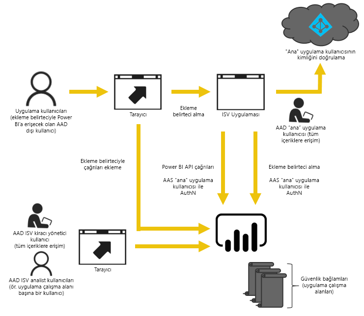

# Power BI Embedded çalışma alanı koleksiyon içeriğini Power BI'a geçirme
Power BI Embedded hizmetinden Power BI hizmetine geçiş yapmayı ve uygulamalara içerik eklemeyle ilgili avantajlardan faydalanmayı öğrenin.

Microsoft kısa süre önce kullanıcılara içerikle ilgili erişme, paylaşma ve dağıtma konularında daha fazla esneklik sunan yeni bir kapasite tabanlı lisanslama modeli olan [Power BI Premium'u duyurdu](https://powerbi.microsoft.com/blog/microsoft-accelerates-modern-bi-adoption-with-power-bi-premium/). Bu teklif ayrıca Power BI hizmeti için ek ölçeklenebilirlik ve performansı da beraberinde getirdi.

Power BI Premium tanıtıldıktan sonra Power BI Embedded ve Power BI hizmeti güçlerini birleştirerek Power BI içeriğinin uygulamalara eklenme olanaklarını geliştirmeye başladı. Başka bir deyişle tek bir API yüzeyi, içeriğinizi eklerken kullanabileceğiniz tutarlı özellik kümesi ve panolar, ağ geçitleri ve uygulama çalışma alanları gibi en yeni Power BI özeliklerine erişim sahibi olacaksınız. Artık süreci Power BI Desktop ile başlatıp dağıtımı 2017'nin ikinci çeyreğinin sonlarında genel kullanıma sunulacak olan Power BI Premium'a taşıyabilirsiniz.

Mevcut Power BI Embedded hizmeti birleşme teklifinin genel kullanıma alınmasının ardından sınırlı bir süre boyunca kullanıma açık olacak: Kurumsal Anlaşma kapsamındaki müşteriler mevcut anlaşmalarının sonuna kadar erişim sahibi olacak, Power BI Embedded çözümünü Doğrudan veya Bulut Çözümü Sağlayıcısı kanallarından satın almış olan müşteriler ise Power BI Premium'un genel kullanıma sunulmasından itibaren bir yıl boyunca erişim sağlayabilecek.  Bu makalede Azure hizmetinden Power BI hizmetine geçiş ve uygulamanızda oluşabilecek değişiklikler hakkında bilgilere yer verilmiştir.

> [!IMPORTANT]
> Geçiş Power BI hizmetine bağlı olsa da **ekleme belirteci** kullandığınız zaman uygulamanızın kullanıcıları açısından Power BI bağımlılığı söz konusu değildir. Kullanıcıların uygulamanıza eklenmiş içeriği görüntülemek için Power BI'a kaydolması gerekmez. Power BI harici kullanıcılara hizmet sunmak için bu ekleme yaklaşımını kullanabilirsiniz.
> 
> 

## Geçiş için hazırlama
Power BI Embedded Azure hizmetinden Power BI hizmetine geçişe hazırlanmak için yapmanız gereken birkaç işlem vardır. Bir kiracıya ve Power BI Pro lisansına sahip bir kullanıcıya ihtiyacınız vardır.

1. Azure Active Directory (Azure AD) kiracısına erişim sahibi olduğunuzdan emin olun.
   
    Hangi kiracı kurulumunun kullanılacağını belirlemeniz gerekir.
   
   * Var olan kurumsal Power BI kiracınızı mı kullanacaksınız?
   * Uygulamanız için ayrı bir kiracı mı kullanacaksınız?
   * Her müşteri için ayrı bir kiracı mı kullanacaksınız?
     
     Uygulamanız veya her müşteri için yeni bir kiracı oluşturmaya karar verirseniz [Azure Active Directory kiracısı oluşturma](create-an-azure-active-directory-tenant.md) veya [Azure Active Directory kiracısı edinme](https://docs.microsoft.com/azure/active-directory/develop/active-directory-howto-tenant) konularına bakın.
2. Bu yeni kiracıda oluşturduğunuz kullanıcı, uygulamanızın "ana" hesabı olur. Bu hesabın Power BI'a kaydolması ve kendisine atanmış bir Power BI Pro lisansı olması gerekir.

## Azure AD içindeki hesaplar
Aşağıdaki hesapların kiracınızda bulunması gerekir.

> [!NOTE]
> Bu hesapların Uygulama çalışma alanlarını kullanabilmesi için Power BI Pro lisansına sahip olması gerekir.
> 
> 

1. Kiracı yöneticisi rolüne sahip bir kullanıcı.
   
    Bu kullanıcının eklemek üzere oluşturulan tüm Uygulama çalışma alanlarına üye olması önerilir.
2. İçeriği oluşturacak analistlerin hesapları.
   
    Bu kullanıcıların gerektiğinde Uygulama çalışma alanlarına atanması gerekir.
3. Uygulama *ana* kullanıcı hesabı veya hizmet hesabı.
   
    Bu hesabın kimlik bilgileri uygulama arka ucunda depolanır ve Power BI REST API'leri ile kullanılacak Azure AD belirteçlerini almak için kullanılır. Bu hesap uygulamanın ekleme belirtecini oluşturmak için kullanılır. Bu hesabın aynı zamanda ekleme için oluşturulmuş olan Uygulama çalışma alanlarının da yöneticisi olması gerekir.
   
   > [!NOTE]
   > Bu, kuruluşunuzda bulunan normal bir kullanıcı hesabıdır ve ekleme amacıyla kullanılacaktır.
   > 
   > 

## Uygulama kaydı ve izinler
Uygulamayı Azure AD'ye kaydetmeniz ve belirli izinleri vermeniz gerekir.

### Uygulamaları kaydetme
REST API çağrılarını gerçekleştirmek için uygulamanızı Azure AD'ye kaydetmeniz gerekir. Buna Power BI kayıt sayfasına ek olarak Azure portalına giderek ek yapılandırma adımları gerçekleştirme dahildir. Daha fazla bilgi için bkz. [Bir Azure AD uygulamasını Power BI içeriği eklemek üzere kaydetme](register-app.md).

Uygulamayı kaydetmek için uygulamanın **ana** hesabını kullanmanız gerekir.

## Uygulama çalışma alanı oluşturma (Gerekli)
Uygulama çalışma alanlarından faydalanarak birden fazla müşteriye hizmet veren uygulamalarınız için daha iyi yalıtım sağlayabilirsiniz. Her müşterinin panoları ve raporları diğerlerinden ayrılır. Ardından her Uygulama çalışma alanında bir Power BI hesabı kullanarak müşterilerinizin uygulama deneyimlerini de birbirinden ayırabilirsiniz.

> [!IMPORTANT]
> Power BI kullanmayan kişiler için ekleme özelliğinden yararlanma amacıyla kişisel çalışma alanlarını kullanamazsınız.
> 
> 

Power BI'da bir uygulama çalışma alanı oluşturmak için Pro lisansa sahip bir kullanıcınız olması gerekir. Uygulama çalışma alanını oluşturan Power BI kullanıcısı, varsayılan olarak ilgili çalışma alanının yöneticisi olur.

> [!NOTE]
> Uygulama *ana* hesabının çalışma alanının yöneticisi olması gerekir.
> 
> 

## İçerik geçişi
Çalışma alanı koleksiyonlarınızdaki içeriği Power BI hizmetine mevcut çözümünüzle paralel bir şekilde ve kesinti yaşamadan geçirebilirsiniz.

Power BI Embedded içeriğinizi Power BI hizmetine kopyalama konusunda yardımcı olmak için bir **geçiş aracı** tasarlanmıştır. Bu araç özellikle çok fazla içeriğe sahip olan kullanıcılar için yararlıdır. Daha fazla bilgi için bkz. [Power BI Embedded geçiş aracı](migrate-tool.md).

İçerik geçişi temelde iki API kullanır.

1. Download PBIX: Bu API, Ekim 2016'dan sonra Power BI'a yüklenmiş olan PBIX dosyalarını indirebilir.
2. Import PBIX: Bu API, PBIX dosyalarını Power BI'a yükler.

İlgili kod parçacıkları için bkz. [Power BI Embedded'dan içerik geçişi için kod parçacıkları](migrate-code-snippets.md).

### Rapor türleri
Birden fazla rapor türü vardır ve her birinin geçiş akışı diğerlerinden farklıdır.

#### Önbelleğe alınmış veri kümesi ve rapor
Önbelleğe alınmış veri kümeleri, canlı bağlantı veya DirectQuery bağlantısının aksine içeri aktarılmış verilere sahip PBIX dosyalarıdır.

**Akış**

1. PaaS çalışma alanından PBIX API çağrısı yapın.
2. PBIX dosyasını kaydedin.
3. SaaS çalışma alanına Import PBIX çağrısı yapın.

#### DirectQuery veri kümesi ve rapor
**Akış**

1. GET https://api.powerbi.com/v1.0/collections/{collection_id}/workspaces/{wid}/datasets/{dataset_id}/Default.GetBoundGatewayDataSources çağrısı yapın ve alınan bağlantı dizesini kaydedin.
2. PaaS çalışma alanından Download PBIX API çağrısı yapın.
3. PBIX dosyasını kaydedin.
4. SaaS çalışma alanına Import PBIX çağrısı yapın.
5. POST https://api.powerbi.com/v1.0/myorg/datasets/{dataset_id}/Default.SetAllConnections çağrısı yaparak bağlantı dizesini güncelleştirin
6. GET https://api.powerbi.com/v1.0/myorg/datasets/{dataset_id}/Default.GetBoundGatewayDataSources çağrısı yaparak GW kimliğini ve veri kaynağı kimliğini alın
7. PATCH https://api.powerbi.com/v1.0/myorg/gateways/{gateway_id}/datasources/{datasource_id} çağrısı yaparak kullanıcı kimlik bilgilerini güncelleştirin

#### Eski veri kümeleri ve raporlar
Bunlar Ekim 2016 öncesinde oluşturulmuş veri kümeleri/raporlardır. Download PBIX, Ekim 2016'dan önce yüklenmiş olan PBIX dosyalarını desteklemez

**Akış**

1. Geliştirme ortamınızdan (iç kaynak denetiminizden) PBIX dosyasını alın.
2. SaaS çalışma alanına Import PBIX çağrısı yapın.

#### Gönderim veri kümesi ve rapor
Download PBIX, *Push API* veri kümelerini desteklemez. Push API veri kümesi PaaS ile SaaS arasında taşınamaz.

**Akış**

1. Json veri kümesi ile "Create dataset" API çağrısı yaparak veri kümesini SaaS çalışma alanında oluşturun.
2. Oluşturulan veri kümesinin raporunu yeniden oluşturun*.

Aşağıdaki geçici çözümleri kullanarak Push API raporunu PaaS'tan SaaS'a geçirebilirsiniz.

1. PaaS çalışma alanına işlevsiz PBIX dosyaları yükleyin.
2. Push API raporunu kopyalayın ve 1. adımda oluşturduğunuz işlevsiz PBIX dosyasına bağlayın.
3. Push API raporunu işlevsiz PBIX ile birlikte indirin.
4. İşlevsiz PBIX dosyasını SaaS çalışma alanınıza yükleyin.
5. Gönderim veri kümesini SaaS çalışma alanınızda oluşturun.
6. Raporu Push API veri kümesine tekrar bağlayın.

## Yeni rapor oluşturma ve yükleme
Power BI Embedded Azure hizmetinden geçirdiğiniz içeriğe ek olarak Power BI Desktop uygulamasını kullanarak rapor ve veri kümesi oluşturabilir, ardından bu raporları bir uygulama çalışma alanında yayımlayabilirsiniz. Raporları yayımlayan son kullanıcının uygulama çalışma alanında yayımlama yapabilmesi için bir Power BI Pro lisansına sahip olması gerekir.

## Uygulamanızı yeniden oluşturma
1. Uygulamanızı Power BI REST API'lerini ve powerbi.com içindeki rapor konumunu kullanacak şekilde değiştirmeniz gerekir.
2. Uygulamanızın *ana* hesabını kullanarak AuthN/AuthZ kimlik doğrulamanızı yeniden oluşturun. Bu kullanıcının diğer kullanıcıların adına hareket etmesine izin vermek için [ekleme belirteci](https://msdn.microsoft.com/library/mt784614.aspx) kullanabilirsiniz.
3. powerbi.com'daki raporlarınızı uygulamanıza ekleyin.

## Kullanıcılarınızı bir Power BI kullanıcısıyla eşleme
Uygulamanızın içinde yönettiğiniz kullanıcıları, uygulamanızın amaçları doğrultusunda bir *ana* Power BI kimlik bilgisiyle eşlemeniz gerekir. Bu Power BI *ana* hesabının kimlik bilgileri uygulamanızda depolanır ve ekleme belirteçleri oluşturmak için kullanılır.

## Üretim aşaması için hazır olduğunuzda yapmanız gerekenler
Üretim aşamasına geçmeye hazır olduğunuzda aşağıdaki işlemleri yapmanız gerekir.

* Geliştirme için ayrı bir kiracı kullanıyorsanız uygulama çalışma alanlarınızın, panolarınızın ve raporlarınızın üretim ortamınızda kullanılabilir durumda olduğundan emin olmanız gerekir. Ayrıca uygulamayı üretim kiracınızın Azure AD ortamında oluşturduğunuzdan ve 1. Adım ile belirtilen gerekli uygulama izinlerini atadığınızdan da emin olmanız gerekir.
* İhtiyaçlarınıza uygun bir kapasite satın alın. İhtiyacınızı belirlemek için [Embedded analytics capacity planning (Embedded Analytics kapasite planlama) teknik incelemesi)](https://aka.ms/pbiewhitepaper) sayfasından faydalanabilirsiniz. Satın almaya hazır olduğunuzda [Office 365 yönetim merkezini](https://portal.office.com/adminportal/home#/catalog) ziyaret edebilirsiniz.
  
  > [AZURE.INFORMATION] Power BI Premium'u satın alma hakkında bilgi için bkz. [Power BI Premium'u satın alma](../service-admin-premium-purchase.md).
  > 
  > 
* Uygulama çalışma alanını düzenleyin ve gelişmiş ayarlar bölümünden bir Premium kapasite atayın.
  
    
* Güncelleştirilen uygulamanızı üretim ortamında dağıtın ve Power BI hizmetindeki raporları eklemeye başlayın.

## Geçiş sonrasında
Azure'da biraz temizlik yapmanız gerekir.

* Dağıtılan çözümün tüm çalışma alanlarını Power BI Embedded Azure hizmetinden kaldırın.
* Azure'daki mevcut Çalışma Alanı Koleksiyonlarını silin.

## Sonraki adımlar
[Power BI ile ekleme](embedding.md)  
[Power BI Embedded geçiş aracı](migrate-tool.md)  
[Power BI Embedded'dan içerik geçişi için kod parçacıkları](migrate-code-snippets.md)  
[Power BI panolarınızı, raporlarınızı ve kutucuklarınızı ekleme](embedding-content.md)  
[Power BI Premium nedir?](../service-premium.md)  
[JavaScript API Git deposu](https://github.com/Microsoft/PowerBI-JavaScript)  
[Power BI C# Git deposu](https://github.com/Microsoft/PowerBI-CSharp)  
[JavaScript ekleme örneği](https://microsoft.github.io/PowerBI-JavaScript/demo/)  
[Embedded analytics capacity planning (Embedded Analytics kapasite planlama) teknik incelemesi](https://aka.ms/pbiewhitepaper)  
[Power BI Premium teknik incelemesi](https://aka.ms/pbipremiumwhitepaper)  

Başka bir sorunuz mu var? [Power BI Topluluğu'na sorun](http://community.powerbi.com/)

