# <a name="power-bi-embedded-migration-tool"></a>Power BI Embedded geçiş aracı

Power BI Embedded Azure hizmetindeki (PaaS) raporlarınızı Power BI hizmetine (SaaS) kopyalamak için bu geçiş aracından faydalanabilirsiniz.

Çalışma alanı koleksiyonlarınızdaki içeriği Power BI hizmetine mevcut çözümünüzle paralel bir şekilde ve kesinti yaşamadan geçirebilirsiniz.

## <a name="limitations"></a>Sınırlamalar

* Gönderilen veri kümeleri indirilemez ve Power BI hizmeti için Power BI REST API'leri kullanılarak yeniden oluşturulmaları gerekir.
* 26 Kasım 2016 tarihinden önce içeri aktarılmış olan PBIX dosyaları indirilemez.

## <a name="download"></a>İndirme

Geçiş aracı örneğini [GitHub](https://github.com/Microsoft/powerbi-migration-sample)'dan indirebilirsiniz. Deponun sıkıştırılmış bir kopyasını indirebilir veya yerel ortamda kopyalayabilirsiniz. Depoyu indirdikten sonra *powerbi-migration-sample.sln* dosyasını Visual Studio'da açarak geçiş aracını derleyebilir ve çalıştırabilirsiniz.

## <a name="migration-plans"></a>Geçiş Planları

Geçiş planınız, Power BI Embedded içindeki içerikten katalog oluşturan meta verilerin yanı sıra bunları Power BI hizmetinde nasıl yayımlamak istediğinize göre değişir.

### <a name="start-with-a-new-migration-plan"></a>Yeni bir geçiş planı başlatma

Geçiş planı, Power BI hizmetine taşımak istediğiniz Power BI Embedded öğelerinin meta verilerini kapsar. Geçiş planı XML dosyası olarak kaydedilir.

Yeni bir geçiş planı oluşturarak başlayabilirsiniz. Yeni bir geçiş planı oluşturmak için aşağıdakileri yapın.

1. **File** > **New Migration Plan** (Dosya - Yeni Geçiş Planı) seçimini yapın.

    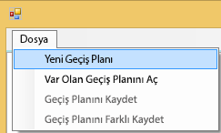

2. **Select Power BI Embedded Resource Group** (Power BI Embedded Kaynak Grubu Seç) iletişim kutusunda Environment (Ortam) açılan menüsünü seçip üretim ortamını seçin.

3. Oturum açmanız istenecek. Azure aboneliği bilgilerinizi kullanmanız gerekir.

   > [!IMPORTANT]
   > Bu Power BI oturumu açtığınız Office 365 kuruluş hesabınız **değildir**.

4. Power BI Embedded çalışma alanı koleksiyonlarınızın bulunduğu Azure aboneliğini seçin.

    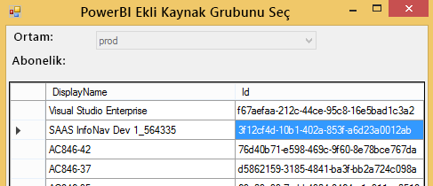
5. Abonelik listesinin altında çalışma alanı koleksiyonlarınızı içeren **Kaynak Grubunu** ve ardından **Select** (Seç) öğesini seçin.

    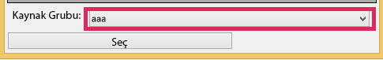

6. **Analyze** (Analiz Et) öğesini seçin. Planınızı oluşturmaya başlamanız için Azure aboneliğinizdeki öğelerin listesi alınır.

    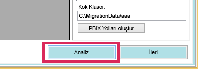

   > [!NOTE]
   > Analiz işleminin süresi Çalışma Alanı koleksiyonu sayısına ve çalışma alanı koleksiyonu içinde bulunan içeriğe göre değişebilir.

7. **Analyze** (Analiz) işlemi tamamlandığında geçiş planınızı kaydetmeniz istenir.

Bu noktada geçiş planınızı Azure aboneliğinize bağlamış olursunuz. Geçiş planınızla nasıl çalışacağınızı anlamak için aşağıdaki bölümü okuyun. Bu süreç Analiz Etme ve Geçişi Planlama, İndirme, Grupları Oluşturma ve Yükleme adımlarından oluşur.

### <a name="save-your-migration-plan"></a>Geçiş planınızı kaydetme

Geçiş planınızı daha sonra kullanmak için kaydedebilirsiniz. Bunu yaptığınızda geçiş planınızdaki tüm bilgileri içeren bir XML dosyası oluşturulur.

Geçiş planınızı kaydetmek için aşağıdakileri yapın.

1. **File** > **Save Migration Plan** (Dosya - Geçiş Planını Kaydet) yolunu izleyin.

    

2. Dosyanıza bir ad verin veya oluşturulan dosya adını kullanın ve **Save** (Kaydet) seçeneğini belirleyin.

### <a name="open-an-existing-migration-plan"></a>Var olan bir geçiş planını açma

Önceden kaydettiğiniz geçiş planını açarak üzerinde çalışmaya devam edebilirsiniz.

Var olan geçiş planınızı açmak için aşağıdaki işlemleri gerçekleştirin.

1. **File** > **Open Existing Migration Plan** (Dosya - Var Olan Geçiş Planını Aç) yolunu izleyin.

    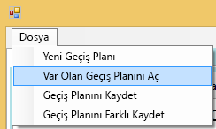

2. Geçiş dosyanızı seçip **Open** (Aç) seçeneğini belirleyin.

## <a name="step-1-analyze--plan-migration"></a>1\. Adım: Analiz Etme ve Geçişi Planlama

**Analyze & Plan Migration** (Analiz Etme ve Geçişi Planlama) sekmesi Azure aboneliğinizin kaynak grubunda bulunan öğeleri gösterir.

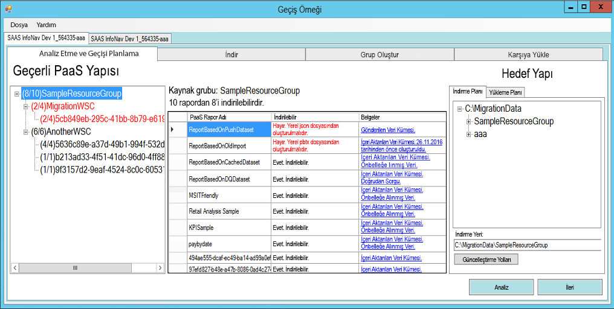

Örnek olarak *SampleResourceGroup* öğesine göz atacağız.

### <a name="paas-topology"></a>PaaS Topolojisi

Bu listede *Kaynak Grubu > Çalışma alanı koleksiyonları > Çalışma alanları* içeriğiniz bulunmaktadır. Kaynak grubu ve çalışma alanı koleksiyonları için kolay ad gösterilir. Çalışma alanları için GUID değeri gösterilir.

Listedeki öğeler renklidir ve hepsinde (#/#) biçiminde bir sayı bulunur. Bu sayı, indirilebilecek rapor sayısını gösterir.
Siyah girişler tüm raporların indirilebileceğini gösterir.

Kırmızı girişler bazı raporların indirilemeyeceğini gösterir. Soldaki sayı, indirilebilecek toplam rapor sayısını gösterir. Sağdaki sayı grup içindeki toplam rapor sayısını gösterir.

PaaS topolojisi içindeki öğelerden birini seçerek raporların raporlar bölümünde görüntülenmesini sağlayabilirsiniz.

### <a name="reports"></a>Raporlar

Raporlar bölümünde mevcut raporlar listelenir ve her birinin indirilip indirilemeyeceği belirtilir.

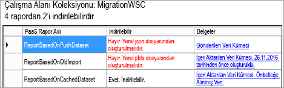

### <a name="target-structure"></a>Hedef yapı

**Target structure** (Hedef yapı) bölümü araca indirilecek öğelerin konumunu ve yükleme şeklini belirttiğiniz yerdir.

#### <a name="download-plan"></a>İndirme Planı

Otomatik olarak bir yol oluşturulur. Dilerseniz bu yolu değiştirebilirsiniz. Yolu değiştirirseniz **Update paths** (Yolları güncelleştir) seçeneğini belirlemeniz gerekir.

> [!NOTE]
> Bu işlem sonucunda indirme gerçekleştirilmez. Yalnızca raporların indirileceği yapı belirlenmiş olur.

#### <a name="upload-plan"></a>Yükleme Planı

Burada Power BI hizmetinde oluşturulacak Uygulama Çalışma Alanları için kullanılacak bir ön ek belirtebilirsiniz. Ön ek sonrasında Azure'daki çalışma alanı GUID değeri gelecektir.

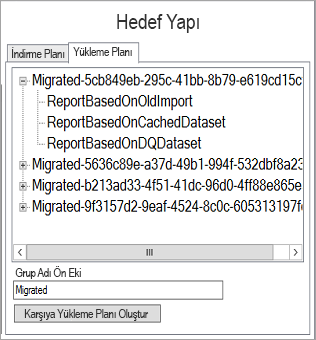

> [!NOTE]
> Bu işlem sonucunda Power BI hizmetinde gruplar oluşturulmaz. Yalnızca gruplar için adlandırma yapısı tanımlanmış olur.

Ön eki değiştirirseniz **Generate Upload Plan** (Yükleme Planı Oluştur) seçeneğini belirlemeniz gerekir.

İsterseniz yükleme planında bir gruba sağ tıklayıp adını değiştirebilirsiniz.

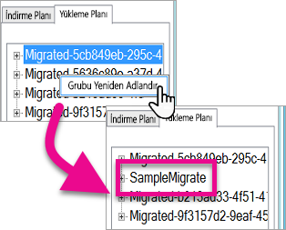

> [!NOTE]
> *Grup* adında boşluk veya geçersiz ad kullanılmamalıdır.

## <a name="step-2-download"></a>2\. Adım: İndir

**Download** (İndir) sekmesinde rapor listesini ve ilgili meta verileri göreceksiniz. Geçerli dışarı aktarma durumunu ve önceki dışarı aktarmanın sonucunu da görebilirsiniz.

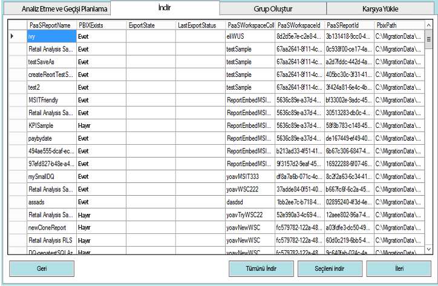

İki seçenek sunulur.

* Belirli raporları seçip **Download Selected** (Seçileni İndir) seçeneğini belirleyebilirsiniz.
* **Download All** (Tümünü İndir) seçeneğini belirleyebilirsiniz.

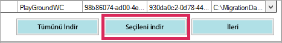

İndirme işlemi başarılı olduğunda dosyanın durumu *Done* (Bitti) olarak görüntülenir ve PBIX dosyasının mevcut olduğu belirtilir.

İndirme işlemi tamamlandıktan sonra **Create Groups** (Grup Oluştur) sekmesini seçin.

## <a name="step-3-create-groups"></a>3\. Adım: Grup Oluştur

Kullanılabilir raporları indirdikten sonra **Create Groups** (Grup Oluştur) sekmesine gidebilirsiniz. Bu sekme oluşturduğunuz geçiş planına bağlı olarak Power BI hizmetinde uygulama çalışma alanları oluşturur. Uygulama çalışma alanını **Analyze & Plan Migration** (Analiz Etme ve Geçişi Planlama) sekmesindeki **Upload** (Yükle) sekmesinde belirlediğiniz adla oluşturur.

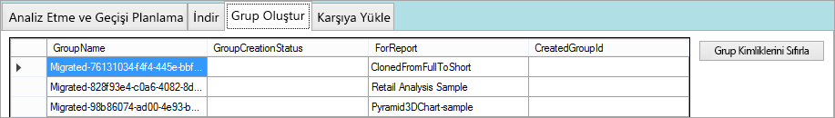

Uygulama çalışma alanlarını oluşturmak için **Create Selected Groups** (Seçilen Grupları Oluştur) veya **Create All Missing Groups** (Tüm Eksik Grupları Oluştur) seçeneğini belirleyebilirsiniz.

İki durumda da oturum açmanız istenir. *Uygulama çalışma alanlarını oluşturduğunuz Power BI hizmetine ait kimlik bilgilerini kullanmanız gerekir.*


Bu işlemin ardından uygulama çalışma alanı Power BI hizmetinde oluşturulur. Raporlar uygulama çalışma alanına yüklenmez.

Uygulama çalışma alanının oluşturulduğunu doğrulamak için Power BI oturumu açıp çalışma alanının mevcut olup olmadığını kontrol edebilirsiniz. Çalışma alanının boş olduğunu göreceksiniz.

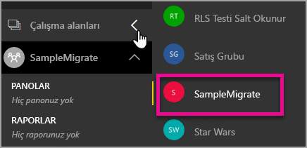

Çalışma alanı oluşturulduktan sonra **Upload** (Yükleme) sekmesine geçebilirsiniz.

## <a name="step-4-upload"></a>4\. Adım: Karşıya Yükle

**Upload** (Yükleme) sekmesi raporları Power BI hizmetine yükler. Download (İndirme) sekmesinde indirilen raporların yanı sıra geçiş planınıza göre hedef grup adlarını görürsünüz.

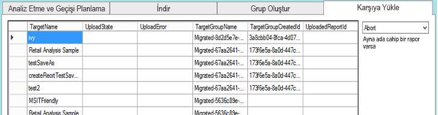

Yalnızca seçilen raporları veya raporların tümünü yükleyebilirsiniz. Ayrıca öğeleri tekrar yüklemek için yükleme durumunu sıfırlayabilirsiniz.

Dilerseniz aynı ada sahip bir raporun mevcut olması halinde yapılacak işlemi belirleyebilirsiniz. **Abort** (İptal et), **Ignore** (Yoksay) ve **Overwrite** (Üzerine yaz) seçenekleri arasından seçim yapabilirsiniz.

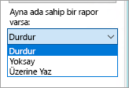

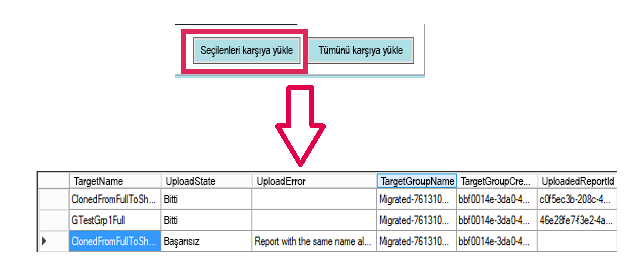

### <a name="duplicate-report-names"></a>Yinelenen rapor adları

Aynı ada sahip olan bir raporunuz varsa ancak bunun farklı bir rapor olduğunu biliyorsanız raporun **TargetName** değerini değiştirmeniz gerekir. Bunu yapmak için geçiş planı XML dosyasını el ile değiştirebilirsiniz.

Geçiş aracını kapatmanız, değişikliği yapmanız ve araçla geçiş planını yeniden açmanız gerekir.

Yukarıdaki örnekte kopyalanan raporlardan biri aynı ada sahip bir rapor mevcut olduğundan başarısız olmuştur. Geçiş planı XML dosyasına baktığımızda aşağıdaki bilgileri görebiliriz.

```xml
<ReportMigrationData>
    <PaaSWorkspaceCollectionName>SampleWorkspaceCollection</PaaSWorkspaceCollectionName>
    <PaaSWorkspaceId>4c04147b-d8fc-478b-8dcb-bcf687149823</PaaSWorkspaceId>
    <PaaSReportId>525a8328-b8cc-4f0d-b2cb-c3a9b4ba2efe</PaaSReportId>
    <PaaSReportLastImportTime>1/3/2017 2:10:19 PM</PaaSReportLastImportTime>
    <PaaSReportName>cloned</PaaSReportName>
    <IsPushDataset>false</IsPushDataset>
    <IsBoundToOldDataset>false</IsBoundToOldDataset>
    <PbixPath>C:\MigrationData\SampleResourceGroup\SampleWorkspaceCollection\4c04147b-d8fc-478b-8dcb-bcf687149823\cloned-525a8328-b8cc-4f0d-b2cb-c3a9b4ba2efe.pbix</PbixPath>
    <ExportState>Done</ExportState>
    <LastExportStatus>OK</LastExportStatus>
    <SaaSTargetGroupName>SampleMigrate</SaaSTargetGroupName>
    <SaaSTargetGroupId>6da6f072-0135-4e6c-bc92-0886d8aeb79d</SaaSTargetGroupId>
    <SaaSTargetReportName>cloned</SaaSTargetReportName>
    <SaaSImportState>Failed</SaaSImportState>
    <SaaSImportError>Report with the same name already exists</SaaSImportError>
</ReportMigrationData>
```

Başarısız olan öğenin SaaSTargetReportName değerini değiştirebiliriz.

```xml
<SaaSTargetReportName>cloned2</SaaSTargetReportName>
```

Ardından planı geçiş aracında tekrar açarak başarısız olan raporu yükleyebiliriz.

Power BI'a geri döndüğünüzde uygulama çalışma alanına yüklenen raporları ve veri kümelerini görebilirsiniz.

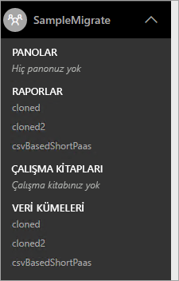

<a name="upload-local-file"></a>

### <a name="upload-a-local-pbix-file"></a>Yerel PBIX dosyası yükleme

Power BI Desktop dosyasının yerel sürümünü de yükleyebilirsiniz. Bunun için aracı kapatmanız, XML dosyasını düzenlemeniz ve **PbixPath** özelliğine yerel PBIX dosyasının tam yolunu girmeniz gerekir.

```xml
<PbixPath>[Full Path to PBIX file]</PbixPath>
```

XML dosyasını düzenledikten sonra planı geçiş aracı içinden tekrar açın ve raporu yükleyin.

<a name="directquery-reports"></a>

### <a name="directquery-reports"></a>DirectQuery raporları

DirectQuery raporları için bağlantı dizesini güncelleştirmeniz gerekir. Bu işlemi *powerbi.com* adresinden gerçekleştirebilir veya bağlantı dizesini Power BI Embedded’den (PaaS) programla sorgulayabilirsiniz. Örnek için bkz. [PaaS raporundan DirectQuery bağlantı dizesini ayıklama](migrate-code-snippets.md#extract-directquery-connection-string-from-paas-report).

Ardından veri kümesi bağlantı dizesini Power BI hizmetinden (SaaS) güncelleştirebilir ve veri kaynağı kimlik bilgilerini belirleyebilirsiniz. Bunun nasıl yapılacağını görmek için aşağıdaki örneklere bakabilirsiniz.

* [SaaS çalışma alanında DirectQuery bağlantı dizesini güncelleştirme](migrate-code-snippets.md#update-directquery-connection-string-is-saas-workspace)
* [SaaS çalışma alanında DirectQuery kimlik bilgilerini ayarlama](migrate-code-snippets.md#set-directquery-credentials-in-saas-workspace)

## <a name="embedding"></a>Ekleme

Power BI Embedded Azure hizmetindeki raporlarınızı Power BI hizmetine geçirdiğinize göre uygulamanızı güncelleştirebilir ve raporları bu uygulama çalışma alanına eklemeye başlayabilirsiniz.

Daha fazla bilgi için bkz. [Power BI Embedded çalışma alanı koleksiyon içeriğini Power BI'a geçirme](migrate-from-powerbi-embedded.md).

## <a name="next-steps"></a>Sonraki adımlar

[Power BI ile ekleme](embedding.md)  
[Power BI Embedded çalışma alanı koleksiyon içeriğini Power BI'a geçirme](migrate-from-powerbi-embedded.md)  
[Power BI Premium nedir?](../service-premium-what-is.md)  
[JavaScript API Git deposu](https://github.com/Microsoft/PowerBI-JavaScript)  
[Power BI C# Git deposu](https://github.com/Microsoft/PowerBI-CSharp)  
[JavaScript ekleme örneği](https://microsoft.github.io/PowerBI-JavaScript/demo/)  
[Power BI Premium teknik incelemesi](https://aka.ms/pbipremiumwhitepaper)  

Başka bir sorunuz mu var? [Power BI Topluluğu'na sorun](http://community.powerbi.com/)