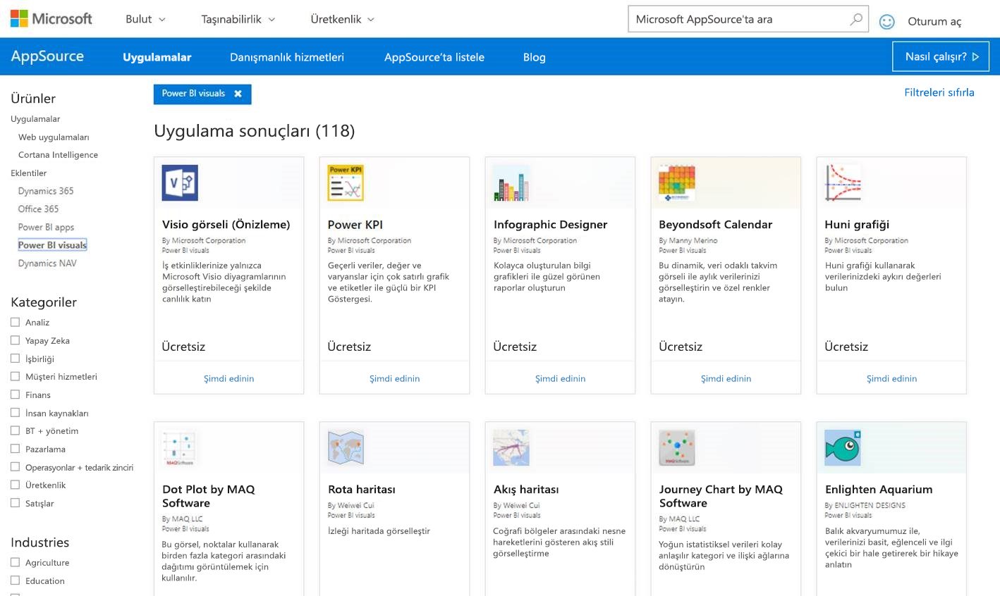
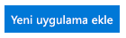
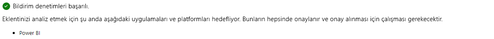
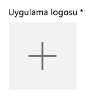
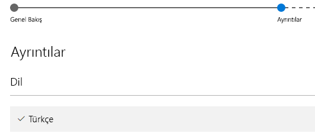

# AppSource'ta özel görsel yayımlama

Özel görselinizi diğer kullanıcıların keşfetmesi ve kullanması amacıyla AppSource'ta nasıl yayımlayabileceğinizi öğrenin.

Özel görselinizi oluşturduktan sonra diğer kullanıcıların keşfetmesi ve kullanması amacıyla AppSource'ta yayımlamak isteyebilirsiniz. Bu işlemi gerçekleştirmeden önce yapmanız gereken hazırlıklar vardır. Özel görsel oluşturma hakkında daha fazla bilgi için bkz. [Power BI Özel Görseli Geliştirme](custom-visual-develop-tutorial.md).

   

## AppSource nedir?

**AppSource**, Microsoft ürünleriniz ve hizmetleriniz için SaaS uygulamalarını ve eklentilerini bulabileceğiniz yerdir. [AppSource](https://appsource.microsoft.com/marketplace/apps?product=power-bi-visuals) Office 365, Dynamics 365 ve Cortana Intelligence gibi çok sayıda ürünün milyonlarca kullanıcısını; işlerini hiç olmadığı kadar verimli, bilinçli ve etkileyici bir şekilde gerçekleştirmelerine yardımcı olacak çözümlerle bir araya getirir.

## Özel görselinizi göndermek için hazırlanma

[Power BI görselleri yönergelerimizi](guidelines-powerbi-visuals.md) okumayı, [özel görselinizi kodlamayı ve test etmeyi](https://github.com/Microsoft/PowerBI-visuals/blob/master/Tutorial/SubmissionTesting.md) tamamlayıp pbiviz dosyası şeklinde paketledikten sonra gönderim için aşağıdaki bilgilere sahip de olmanız gerekir.

| Öğe | Gerekli | Açıklama |
| --- | --- | --- |
| Pbiviz paketi gerekli tüm meta verileri içeriyor |Evet |Görsel adı Görünen ad GUID Sürüm Açıklama Yazarın adı ve e-posta adresi |
| Örnek .pbix rapor dosyası |Evet |Görselinizi sergilemek için kullanıcıların görselle tanışmasına yardımcı olmanız gerekir. Görselin kullanıcıya kattığı değere odaklanmanız ve kullanım, biçimlendirme seçenekleri gibi alanlarda örnekler vermeniz gerekir. En sona ekleyeceğiniz *"ipuçları"* sayfasına püf noktalarını, dikkat edilmesi gerekenleri ve benzer bilgileri girebilirsiniz. Örnek .pbix rapor dosyası, herhangi bir dış bağlantı olmadan çevrimdışı çalıştırılmalıdır |
| Simge |Evet |Mağazada görünecek özel görsel logosunu eklemeniz gerekir. Bu logo .png, .jpg, .jpeg veya .gif biçiminde olabilir. Tam olarak 300 piksel (genişlik) x 300 piksel (yükseklik) boyutunda olmalıdır. **Önemli!** Lütfen Simgeyi göndermeden önce [kısa kılavuzu](https://docs.microsoft.com/office/dev/store/craft-effective-appsource-store-images) gözden geçirin. |
| Ekran görüntüleri |Evet |En az bir ekran görüntüsü eklemeniz gerekir. Bu logo .png, .jpg, .jpeg veya .gif biçiminde olabilir. Tam olarak 1366 piksel (genişlik) x 768 piksel (yükseklik) boyutunda olmalıdır. Dosya boyutu 1024 KB’tan büyük olamaz. *Kullanım kolaylığı sağlamak için ekran görüntülerinde gösterilen önemli özellikleri vurgulayan metin kutuları ekleyin.* |
| Destek indirme bağlantısı |Evet |Görselinizle sorun yaşayan müşterilerin destek için ulaşabileceği URL'yi girin. Bu bağlantı, SellerDashboard listenizin bir parçası olarak girilir ve AppSource’ta görsellerinizin listesine eriştiklerinde kullanıcılar tarafından görülebilir. URL'niz https:// veya http:// ile başlamalıdır. |
| Gizlilik belgesi bağlantısı |Evet |Görselinizi kullanmak isteyen müşterilerin inceleyebileceği gizlilik ilkesinin bağlantısını girin. Bu bağlantı, SellerDashboard listenizin bir parçası olarak girilir ve AppSource’ta görsellerinizin listesine eriştiklerinde kullanıcılar tarafından görülebilir. Bağlantınız http:// veya https:// ile başlamalıdır. |
| Son kullanıcı lisans sözleşmesi (EULA) |Evet |EULA dosyası yüklemeniz gerekir. Kendi EULA dosyanızı veya Office Mağazası'ndaki Power BI özel görsellerine yönelik varsayılan EULA dosyasını kullanabilirsiniz. Varsayılan EULA dosyasını kullanmak için aşağıdaki URL’yi satıcı panosunun "Son Kullanıcı Lisans Sözleşmesi" dosyasını karşıya yükleme iletişim kutusuna yapıştırın: [https://visuals.azureedge.net/app-store/Power BI - Default Custom Visual EULA.pdf](https://visuals.azureedge.net/app-store/Power%20BI%20-%20Default%20Custom%20Visual%20EULA.pdf). |
| Video bağlantısı |Hayır |Kullanıcıların dikkatini özel görselinize çekmek için görselinizle ilgili bir videonun bağlantısını eklemeniz önerilir. URL'niz https:// veya http:// ile başlamalıdır. |
| GitHub deposu |Hayır |Geliştiricilerin kodunuzla ilgili geri bildirim sağlamasını ve geliştirme önermesini sağlamak için görselinizin kaynağının ve örnek verilerin bulunduğu geçerli ve herkese açık [GitHub](https://www.github.com) deposu bağlantısına sahip olmanız önerilir. |

## Power BI'a gönderme

Gönderme süreci Power BI özel görseller gönderim ekibine gönderilen bir e-posta ile başlar. E-postayı [pbivizsubmit@microsoft.com](mailto:pbivizsubmit@microsoft.com) adresine gönderebilirsiniz.

> [!IMPORTANT]
> .pbiviz paketini oluşturmadan önce pbiviz.json dosyasında aşağıdaki alanları doldurmanız gerekir: “description”, “supportUrl”, “author“, “name” ve “email.

E-postanıza **.pbiviz dosyasını** ve **örnek rapor .pbix** dosyasını ekleyin. Power BI ekibi yanıt olarak talimatları ve yüklenecek uygulama paketi XML dosyasını gönderecektir. Görselinizi Office Geliştirici Merkezi'nden göndermek için bu XML uygulama paketini kullanmanız gerekir.

> [!NOTE]
> Kaliteyi yükseltmek ve var olan raporların çalışmaya devam etmesini sağlamak için, mevcut görsellerde yapılan güncelleştirmelerin mağaza onayından geçtikten sonra üretim ortamına ulaşması için ek olarak iki hafta geçmesi gerekir.

## AppSource'a gönderme

Power BI ekibinin gönderdiği uygulama paketi XML dosyasını aldıktan sonra [geliştirici merkezine](https://sellerdashboard.microsoft.com/Application/Summary) giderek görselinizi AppSource'a gönderebilirsiniz.

> [!NOTE]
> [Office Geliştirici Merkezi](https://dev.office.com/)'nde oturum açmak için geçerli bir Office geliştirici hesabına sahip olmanız gerekir. Office geliştirici hesabının Microsoft Hesabı (hotmail.com veya outlook.com gibi Live ID) olması gerekir.

> [!IMPORTANT]
> Görselinizi AppSource'a göndermeden önce .pbiviz ve .pbix dosyasını e-posta ile Power BI ekibine göndermeniz gerekir. Böylece Power BI ekibi, dosyaları herkese açık paylaşım sunucusuna yükleyebilir. Aksi halde mağaza, dosyaları alamaz. Yeni bir görsel gönderirken, mevcut görselleri güncelleştirirken veya reddedilen görselleri düzeltirken her seferinde dosyaları göndermeniz gerekir.

### Görsel gönderme işlemi

Gönderim işlemini tamamlamak için aşağıdaki adımları uygulayın.

1. **Add a new app** (Yeni uygulama ekle) seçeneğini belirleyin.

    

2. **Power BI custom visual** (Power BI özel görsel) ve ardından **Next** (İleri) seçeneklerini belirleyin.

3. **App package** (Uygulama paketi) bölümündeki **+** öğesini seçin ve dosya aç iletişim kutusunda Power BI ekibinden gelen uygulama paketi XML dosyasını seçin.

    

4. Geçerli bir Power BI uygulama paketi olduğunu belirten bir onay iletisi görmeniz gerekir.

    

5. **General info** (Genel bilgiler) bölümünü doldurun.

   * *Submission title* (Gönderim başlığı): Gönderdiğiniz dosyaya geliştirici merkezinde verilecek ad
   * *Version* (Sürüm): Sürüm numaranız, eklenti uygulama paketinden otomatik olarak alınır.
   * *Release Date (UTC)* (Sürüm Tarihi (UTC)): Uygulamanızın mağazada yayımlanacağı tarihi seçin. Gelecekteki bir tarihi seçerseniz bu tarihe kadar uygulamanız mağazada yer almaz.
   * *Category* (Kategori): İlk kategori otomatik olarak "Data Visualization + BI" şeklinde belirlenecektir. Tüm Power BI özel görselleri bu şekilde etiketlenir. Kullanıcılarınızın görselinizi kolayca bulmasına yardımcı olmak için 2 adede kadar ek kategori ekleyebilirsiniz
   * *Test notes* (Test notları): İsteğe bağlıdır, Microsoft'taki test uzmanlarına vermek istediğiniz talimatları buraya yazabilirsiniz
   * *My app calls, supports, contains, or uses cryptography or encryption* (Uygulamam şifreleme çağrısı yapıyor, şifrelemeyi destekliyor, içeriyor veya kullanıyor): İşaretlemeyin
   * *Make this add-in available in the Office add-in catalog on iPad* (Bu eklentiyi iPad üzerindeki Office eklenti kataloğuna ekle): İşaretlemeyin
6. **App logo** (Uygulama logosu) bölümündeki **+** öğesini seçerek görselinizin logosunu yükleyin. Ardından dosya aç iletişim kutusundan simge dosyasını seçin. Dosya .png, .jpg, .jpeg veya .gif biçiminde olmalıdır. Tam olarak 300 piksel (genişlik) x 300 piksel (yükseklik) olmalı ve 512 KB’tan büyük olmamalıdır.

    

7. **Support documents** (Destek belgeleri) ayrıntılarını girin.

   * Destek belgesi bağlantısı
   * Gizlilik belgesi bağlantısı
   * Video bağlantısı
   * Son Kullanıcı Lisans Sözleşmesi (EULA)

       EULA dosyası yüklemeniz gerekir. Kendi EULA dosyanızı veya Office Mağazası'ndaki Power BI özel görsellerine yönelik varsayılan EULA dosyasını kullanabilirsiniz. Varsayılan EULA dosyasını kullanmak için aşağıdaki URL’yi satıcı panosunun "Son Kullanıcı Lisans Sözleşmesi" dosyasını karşıya yükleme iletişim kutusuna yapıştırın: [https://visuals.azureedge.net/app-store/Power BI - Default Custom Visual EULA.pdf](https://visuals.azureedge.net/app-store/Power%20BI%20-%20Default%20Custom%20Visual%20EULA.pdf).

8. **Next**'i (İleri) seçerek **Details** (Ayrıntılar) sayfasına gidin.

9. **Language**'ı (Dil) seçip listeden bir dil belirleyin.

    

10. "Description" (Açıklama) ayrıntılarını girin.

    * *App name (for this language)* (Uygulama adı (bu dil için)): Uygulamanızın başlığını mağazada görünmesini istediğiniz şekilde girin.
    * *Short description* (Kısa açıklama): Mağazada görüntülenmek üzere en fazla 100 karakterlik uygulama açıklaması girin. Bu açıklama üst düzey sayfalarda logoyla birlikte gösterilir. Pbiviz paketindeki açıklamayı kullanabilirsiniz.
    * *Long description* (Uzun açıklama): Müşterilerin uygulama ayrıntıları sayfasında göreceği ayrıntılı uygulama açıklamasını girin. Görselinizi açık kaynak yaparak topluluğun geliştirmesine izin vermek için GitHub gibi herkese açık depo bağlantısını buraya girin.

11. En az bir ekran görüntüsü yükleyin. Bu logo .png, .jpg, .jpeg veya .gif biçiminde olabilir. Tam olarak 1366 piksel (genişlik) x 768 piksel (yükseklik) boyutunda olmalıdır. Dosya boyutu 1024 KB’tan büyük olamaz. *Kullanım kolaylığı sağlamak için ekran görüntülerinde gösterilen önemli özellikleri vurgulayan metin kutuları ekleyin.*

12. Daha fazla dil eklemek istiyorsanız **Add a language** (Dil ekle) seçeneğini belirleyin ve 10-11 arası adımları tekrarlayın. Daha fazla dil eklemek kullanıcılarınızın özel görsel ayrıntılarını kendi dillerinde görüntülemesine yardımcı olur. Listede bulunmayan diller için varsayılan olarak seçilen ilk dil kullanılacaktır.

13. Dil eklemeyi tamamladığınızda **Next**'i (İleri) seçerek **Block access** (Erişimi engelle) sayfasına geçin.

14. Belirli ülke veya bölgelerdeki müşterilerin uygulamanızı kullanmanızı veya satın almasını önlemek istiyorsanız kutuyu işaretleyip listeden seçim yapın.

15. **Next**'i (İleri) seçerek **Pricing** (Fiyatlandırma) sayfasına gidin.

16. Şu anda yalnızca *ücretsiz* görseller desteklenmektedir ve görsel içinde ek satın alma işlemlerine (Uygulama içi satın alma) izin verilmez. **This app is free** (Bu uygulama ücretsizdir) seçeneğini blirleyin.

    > [!NOTE]
    > Ücretsiz dışında bir seçenek belirlerseniz veya gönderilen görselde Uygulama içi satın alma varsa gönderim reddedilir.

17. Bu adımda **Save as draft** (Taslak olarak kaydet) seçeneğini belirleyip daha sonra gönderebilir veya **Submit for approval** (Onay için gönder) seçeneğini belirleyerek özel görselinizi Office Mağazası’na gönderebilirsiniz.

## Gönderme ve kullanma durumu takibi

[Doğrulama ilkelerini](https://dev.office.com/officestore/docs/validation-policies#13-power-bi-custom-visuals) inceleyebilirsiniz.

Uygulamayı gönderdikten sonra durumunu [uygulama panosu](https://sellerdashboard.microsoft.com/Application/Summary/) sayfasından görüntüleyebilirsiniz.

## Görselinizi onaylatma

Görselinizi oluşturduktan sonra isterseniz sertifikalatabilirsiniz. Sertifikalatmanız durumunda görseliniz Power BI hizmetinde çalışabilir ve PowerPoint'e aktarma gibi diğer özelliklerle birlikte kullanılabilir. Daha fazla bilgi için bkz. [Özel görselleri *sertifikalatma*](../power-bi-custom-visuals-certified.md).

## Sonraki adımlar

[Power BI özel görseli geliştirme](custom-visual-develop-tutorial.md)  
[Power BI'daki Görselleştirmeler](../visuals/power-bi-report-visualizations.md)  
[Power BI'daki Özel Görselleştirmeler](../power-bi-custom-visuals.md)  
[Özel görselleri *sertifikalatma*](../power-bi-custom-visuals-certified.md)

Başka bir sorunuz mu var? [Power BI Topluluğu'na sorun](http://community.powerbi.com/)
