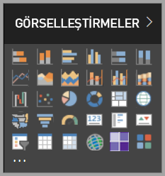

# Power BI’daki görseller

Power BI, kullanıma hazır birçok görselle birlikte gelir. [Power BI Desktop](https://powerbi.microsoft.com/desktop/) ve [Power BI hizmetinin](https://app.powerbi.com) görselleştirme bölmesinden ulaşabileceğiniz bu görselleri Power BI içeriği oluşturmak ve düzenlemek için kullanabilirsiniz.

Microsoft [AppSource](https://nam06.safelinks.protection.outlook.com/?url=https%3A%2F%2Fappsource.microsoft.com%2Fen-us%2Fmarketplace%2Fapps%3Fpage%3D1%26product%3Dpower-bi-visuals&data=02%7C01%7CKesem.Sharabi%40microsoft.com%7C6d9286afacb3468d4cde08d740b76694%7C72f988bf86f141af91ab2d7cd011db47%7C1%7C0%7C637049028749147718&sdata=igWm0e1vXdgGcbyvngQBrHQVAkahPnxPC1ZhUPntGI8%3D&reserved=0) veya Power BI üzerinden daha fazla Power BI görseline ulaşabilirsiniz. Microsoft ve Microsoft iş ortakları tarafından oluşturulan bu görseller, AppSource doğrulama ekibi tarafından test edilmekte ve doğrulanmaktadır.

Ayrıca kendi Power BI görselinizi geliştirebilir; kendi başınıza, kuruluşunuzla veya Power BI topluluğunun tamamıyla birlikte kullanabilirsiniz.

## Varsayılan Power BI görselleri

*Power BI Desktop* ve *Power BI hizmetindeki* görselleştirme bölmesinden ulaşabileceğiniz kullanıma hazır Power BI görselleri bunlardır.

Görselleştirme bölmesindeki bir Power BI görselini kaldırmak için sağ tıklayıp **kaldır**'ı seçin.

Varsayılan Power BI görsellerini görselleştirme bölmesine yeniden yüklemek için **Özel bir görseli içeri aktar**'a tıklayıp **Varsayılan görselleri geri yükle**'yi seçin. 

## AppSource Power BI görselleri

Hem Microsoft hem de topluluk üyeleri, genel kamu yararı için Power BI görseli katkısında bulunup bunları [AppSource](https://appsource.microsoft.com/marketplace/apps?product=power-bi-visuals) üzerinde yayımlamaktadır. Bu görselleri indirip Power BI raporlarınıza ekleyebilirsiniz. Microsoft bu Power BI görsellerini işlevsellik ve kalite bakımından test edip onaylamıştır.

### AppSource nedir?

[AppSource](office-store.md); Microsoft yazılımınıza yönelik uygulamaları, eklentileri ve uzantıları bulabileceğiniz yerdir. AppSource; Power BI, Office 365, Azure, Dynamics 365 ve Cortana gibi ürünlerin milyonlarca kullanıcısının, işlerini hiç olmadığı kadar verimli ve bilinçli bir şekilde gerçekleştirmelerine yardımcı olacak çözümlere bağlanmasını sağlar.

### Sertifikalı Power BI görselleri

Sertifikalı Power BI görselleri, [AppSource](https://nam06.safelinks.protection.outlook.com/?url=https%3A%2F%2Fappsource.microsoft.com%2Fen-us%2Fmarketplace%2Fapps%3Fpage%3D1%26product%3Dpower-bi-visuals&data=02%7C01%7CKesem.Sharabi%40microsoft.com%7C6d9286afacb3468d4cde08d740b76694%7C72f988bf86f141af91ab2d7cd011db47%7C1%7C0%7C637049028749147718&sdata=igWm0e1vXdgGcbyvngQBrHQVAkahPnxPC1ZhUPntGI8%3D&reserved=0) üzerinde bulunan ve Microsoft Power BI ekibinin test ettiği ve onayladığı belirli kod gereksinimlerini karşılayan görsellerdir. Testler görselin dış hizmetlere veya kaynaklara erişmediğini denetleyecek şekilde tasarlanmıştır.

Sertifikalı Power BI görsellerinin listesini görüntülemek veya kendi Power BI görselinizi göndermek için bkz. [Sertifikalı Power BI görselleri](power-bi-custom-visuals-certified.md).

### Örnek Power BI görselleri

AppSource'taki her Power BI görseli, görselin nasıl çalıştığını gösteren örnek veriler içerir. Örneği indirmek için [AppSource](https://nam06.safelinks.protection.outlook.com/?url=https%3A%2F%2Fappsource.microsoft.com%2Fen-us%2Fmarketplace%2Fapps%3Fpage%3D1%26product%3Dpower-bi-visuals&data=02%7C01%7CKesem.Sharabi%40microsoft.com%7C6d9286afacb3468d4cde08d740b76694%7C72f988bf86f141af91ab2d7cd011db47%7C1%7C0%7C637049028749147718&sdata=igWm0e1vXdgGcbyvngQBrHQVAkahPnxPC1ZhUPntGI8%3D&reserved=0)'ta Power BI görselini seçin ve *Örnek deneyin* bölümünde **örnek rapor** bağlantısına tıklayın.

## Kuruluş deposu

Power BI yöneticileri, kuruluşlarında kullanılmasını istedikleri Power BI görsellerini onaylayıp dağıtır. Bu sayede rapor yazarları bu Power BI görsellerini kolayca keşfedebilir, güncelleştirebilir ve kullanabilir. Yöneticiler, bu Power BI görsellerinde sürüm güncelleştirme, devre dışı bırakma ve etkinleştirme gibi eylemler gerçekleştirerek bunları kolayca yönetebilir.

Kuruluş deposuna erişmek için *Görselleştirme* bölmesinde **Özel bir görseli içeri aktar**'a tıklayın, **Marketten içeri aktar**'ı seçin ve *Power BI görselleri* penceresinin üst tarafından **Kuruluşum** sekmesini seçin.

[Kurumsal görseller hakkında daha fazla bilgi edinin](power-bi-custom-visuals-organization.md).

## Görsel dosyaları

Power BI görselleri, kendisine sunulan verileri işlemeye yönelik kod içeren paketlerdir. Herkes özel bir görsel oluşturup bunu bir Power BI raporunda içeri aktarılabilen tek bir `.pbiviz` dosyası olarak paketleyebilir.

Bir Power BI görselini içeri aktarmak için *Görselleştirme* bölmesinde **Özel bir görseli içeri aktar**'a tıklayıp **Dosyadan içeri aktar**'ı seçin.

Web geliştiricisiyseniz ve kendi görselinizi oluşturup AppSource'a eklemek istiyorsanız [Power BI görseli geliştirme](visuals/custom-visual-develop-tutorial.md) ve [AppSource'ta Power BI görseli yayımlama](office-store.md) sayfalarını inceleyin.

> [!WARNING]
> Bir Power BI görsel, güvenlik veya gizlilik riski taşıyan kod içerebilir. Power BI görselini raporunuza içeri aktarmadan önce özel görselin yazarına ve kaynağına güvendiğinizden emin olun.

## Sonraki adımlar

* Geliştiriciyseniz, [Power BI görseli geliştirme](./visuals/custom-visual-develop-tutorial.md) öğreticisiyle başlayın.

* [Power BI görsel projelerinin nasıl bir yapıya sahip olduğunu](./visuals/visual-project-structure.md) öğrenin.

* [Power BI görselleri için yönergeleri](guidelines-powerbi-visuals.md) keşfedin.

Başka bir sorunuz mu var? [Power BI Power BI görselleri hakkında sık sorulan sorular](power-bi-custom-visuals-faq.md) sayfasını veya [Power BI Topluluğu](http://community.powerbi.com/)'nu deneyin.