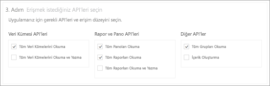
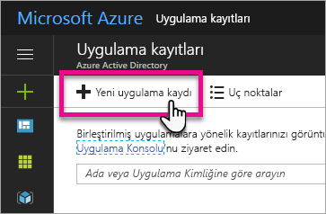
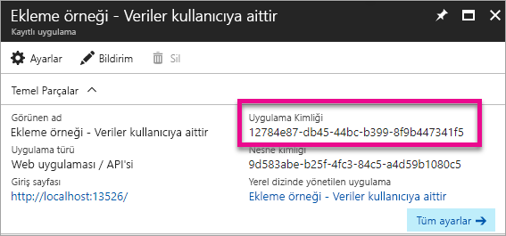
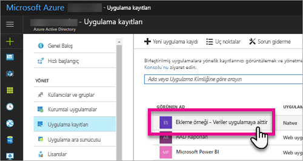
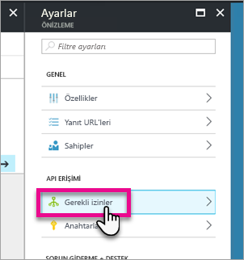
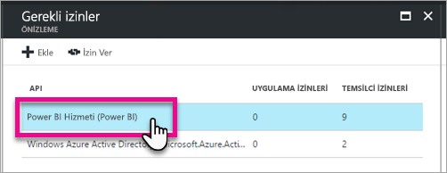
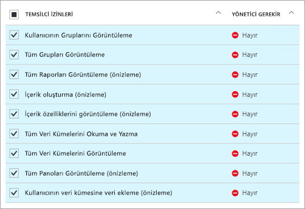
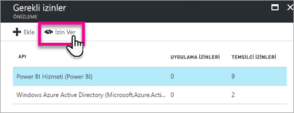

# <a name="register-an-azure-ad-app-to-embed-power-bi-content"></a>Bir Azure AD uygulamasını Power BI içeriği eklemek üzere kaydetme
Power BI içeriği eklemek üzere bir uygulamayı Azure Active Directory'ye (Azure AD) nasıl kaydedeceğinizi öğrenin.

Power BI REST API'lerine erişmesini sağlamak için uygulamanızı Azure AD'ye kaydetmeniz gerekir. Kayıt işlemi sayesinde uygulamanız için bir kimlik oluşturabilir ve Power BI REST kaynaklarıyla ilgili izinleri belirleyebilirsiniz.

> [!IMPORTANT]
> Bir Power BI uygulamasını kaydedebilmek için [Azure Active Directory kiracısına ve kuruluş kullanıcısına](create-an-azure-active-directory-tenant.md) sahip olmanız gerekir. Power BI'a kiracınızdaki bir kullanıcıyla kaydolmadıysanız uygulama kaydı başarıyla tamamlanmaz.

Uygulamanızı kaydetmek için kullanabileceğiniz iki yöntem vardır. Kayıt için [Power BI Uygulama Kayıt Aracı](https://dev.powerbi.com/apps/)'nı kullanabilir veya kaydı doğrudan Azure portalından gerçekleştirebilirsiniz. Doldurulacak yalnızca birkaç alan olduğu için Power BI Uygulama Kayıt Aracı en kolay seçenektir. Uygulamanızda değişiklik yapmak istiyorsanız Azure portalını kullanın.

## <a name="register-with-the-power-bi-app-registration-tool"></a>Power BI Uygulama Kayıt Aracı ile kaydetme
Uygulamanız için bir kimlik oluşturmak ve Power BI REST kaynaklarıyla ilgili izinleri belirlemek için uygulamanızı **Azure Active Directory**'ye kaydetmeniz gerekir. Konsol uygulaması veya web sitesi gibi bir uygulamayı kaydettiğinizde, uygulama tarafından kendisini izin istediği kullanıcılara tanıtmak için kullanılacak bir tanımlayıcı alırsınız.

Power BI Uygulama Kayıt Aracı'nı kullanarak uygulamanızı kaydetmek için aşağıdaki adımları uygulayın:

1. [dev.powerbi.com/apps](https://dev.powerbi.com/apps) adresine gidin.
2. **Mevcut hesabınızla oturum açın**'ı seçin.
3. **Uygulama Adı** girin.
4. Uygulama türü seçimi, kullanmakta olduğunuz uygulama türüne bağlıdır.
   
   * İstemci cihazlarda çalışan uygulamalar için **Yerel uygulama**'yı kullanın. Web uygulamaları bile dahil olmak üzere uygulamanın türünden bağımsız olarak müşterileriniz için içerik eklediğinizde de **Yerel uygulama**'yı seçmeniz gerekir.
   * Web uygulamaları veya web API'leri için **Sunucu tarafı Web uygulaması**'nı kullanın.

5. **Yeniden yönlendirme URL**'si ve **Giriş Sayfası URL**'si alanlarına giriş yapın. **Yeniden Yönlendirme URL’si** herhangi bir geçerli URL ile çalışır.
   
    **Giriş Sayfası URL**'si yalnızca uygulama türü olarak **Sunucu tarafı Web uygulaması**'nı seçerseniz kullanılabilir.
   
    *Müşterileriniz için içerik ekleme* ve *integrate-dashboard-web-app* örnekleri için **yeniden yönlendirme URL'si** şeklindedir`http://localhost:13526/Redirect`. Rapor ve kutucuk örneği için yeniden **yönlendirme URL'si** şeklindedir`http://localhost:13526/`.
6. Erişimi olan uygulamanın API'lerini seçin. Power BI erişim izinleri hakkında daha fazla bilgi için bkz. [Power BI İzinleri](power-bi-permissions.md).
   
    
7. **Uygulamayı Kaydet**'i seçin.
   
    Bundan sonra size bir **İstemci Kimliği** verilir ve **Sunucu tarafı Web uygulaması** seçerseniz bir **İstemci Gizli Dizisi** alırsınız. İleride ihtiyaç duymanız halinde **İstemci kimliğine** Azure portalından ulaşabilirsiniz. **İstemci Gizli Dizisi**'ni kaybederseniz Azure portalından yeni bir tane oluşturmanız gerekir.

8. **İzin ver**’i seçmek için Azure’a gitmeniz gerekir.
   > [!Note]
   > Bu işlemi tamamlaması için Azure kiracısında genel yönetici olması gerekir

* Azure'a gidin.
* **Uygulama kayıtları**’nı arayıp seçin.
* Uygulamanızı seçin.
* **Ayarlar** seçeneğini belirleyin.
* **Gerekli izinler**’i seçin.
* Uygulama kayıt sitesinden seçtiğiniz izinleri doğrulamak için **Power BI Hizmeti**’ni seçin.
* **İzin Ver**’i seçin.

Artık kaydettiğiniz uygulamayı özel uygulamanızla birlikte kullanarak Power BI hizmetiyle etkileşim kurabilirsiniz.

> [!IMPORTANT]
> Müşterileriniz için içerik ekliyorsanız Azure portalından ek izinleri yapılandırmanız gerekir. Daha fazla bilgi için bkz. [Uygulamanıza izinleri uygulama](#apply-permissions-to-your-application).
> 

## <a name="register-with-the-azure-portal"></a>Azure portalı ile kaydetme
Uygulamanızı kaydetmek için kullanabileceğiniz diğer seçenek Azure portalıdır. Uygulamanızı kaydetmek için aşağıdaki adımları uygulayın.

1. [Microsoft Power BI API Koşulları](https://powerbi.microsoft.com/api-terms)'nı kabul edin.
2. [Azure portalında](https://portal.azure.com) oturum açın.
3. Sayfanın sağ üst köşesinden hesabınızı seçerek Azure AD kiracınızı belirleyin.
4. Sol taraftaki gezinti bölmesinde **Diğer Hizmetler**'i ve ardından **Güvenlik + Kimlik** bölümünden **Uygulama Kayıtları**'nı ve **Yeni uygulama kaydı**'nı seçin.
   
    
5. Talimatları izleyerek yeni bir uygulama oluşturun.
   
   * Web Uygulamaları için kullanıcıların oturum açacağı uygulamanızın temel URL'si olan Oturum Açma URL'sini girin (örneğin, `http://localhost:13526`).
   * Yerel Uygulamalar için Azure AD'nin belirteç yanıtlarını döndürmek için kullanacağı **Yeniden Yönlendirme URI'sini** girin. Uygulamanıza özgü bir değer girdiğinizden emin olun (örneğin, `http://myapplication/Redirect`).

Uygulamalarınızı Azure Active Directory'ye kaydetme hakkında bilgi almak için bkz. [Integrating applications with Azure Active Directory (Uygulamaları Azure Active Directory ile tümleştirme)](https://docs.microsoft.com/azure/active-directory/develop/active-directory-integrating-applications)

## <a name="how-to-get-the-client-id"></a>İstemci kimliğini alma
Bir uygulamayı kaydettiğinizde **İstemci kimliği** oluşturulur.  **İstemci Kimliği**, kullanıcıların kendilerini tanıtması için uygulama izinleri ister.

İstemci kimliğini almak için şu adımları uygulayın:

1. [Azure portalında](https://portal.azure.com) oturum açın.
2. Sayfanın sağ üst köşesinden hesabınızı seçerek Azure AD kiracınızı belirleyin.
3. Sol gezinti bölmesinde **Diğer Hizmetler**'i ve **Uygulama Kayıtları**'nı seçin.
4. Kullanmanız gereken istemci kimliğini almak istediğiniz uygulamayı seçin.
5. GUID olarak listelenen **Uygulama Kimliği**'ni görürsünüz. Bu değer uygulamanın istemci kimliğidir.
   
    

## <a name="apply-permissions-to-your-application-within-azure-ad"></a>Azure AD'de uygulamanıza izin uygulama
> [!IMPORTANT]
> Bu bölüm yalnızca **kuruluşunuz için içerik ekleyen** uygulamalarda geçerlidir.
> 

Uygulama kayıt sayfasında verilen izinlere ek olarak uygulamanız için ek izinler etkinleştirmeniz gerekir. Bu işlemi Azure AD portalından veya programlama yoluyla gerçekleştirebilirsiniz.

Ekleme için kullanılan *ana* hesapla veya Genel yönetici hesabıyla oturum açmış olmanız gerekir.

### <a name="using-the-azure-ad-portal"></a>Azure AD portalını kullanma
1. Azure portalındaki [Uygulama kayıtları](https://portal.azure.com/#blade/Microsoft_AAD_IAM/ApplicationsListBlade) sayfasına gidip ekleme için kullandığınız uygulamayı seçin.
   
    
2. **API Erişimi** bölümünde **Gerekli izinler**'i seçin.
   
    

3. **Gerekli izinler** bölümünde **Power BI Hizmeti (Power BI)** seçeneğini belirleyin.
   
    
   
   > [!NOTE]
   > Uygulamayı doğrudan Azure AD portalından oluşturduysanız **Power BI Service (Power BI)** seçeneği mevcut olmayabilir. Değilse **+ Ekle**'yi ve ardından **Bir API seçin**'i belirleyin. API listesinden **Power BI Hizmeti**'ni ve **Seç**'i belirleyin.  **Power BI Hizmeti (Power BI)** **+ Ekle** menüsünde mevcut değilse en az bir kullanıcıyla Power BI'a kaydolun.
   > 
   > 
4. **Temsilci İzinleri** bölümündeki tüm izinleri seçin. Seçimlerin kaydedilmesi için teker teker seçmeniz gerekir. Tümünü seçtikten sonra **Kaydet**'i seçin.
   
    
5. **Gerekli izinler** bölümünde **İzin Ver**'i seçin.
   
    **İzin Ver** eylemi Azure AD tarafından onay istenmesini önlemek için *ana hesabı* gerektirir. Bu eylemi gerçekleştiren hesap Genel Yönetici ise kuruluşunuzdaki tüm kullanıcılara bu uygulama için izin vermiş olursunuz. Bu eylemi gerçekleştiren hesap *ana hesap* ise ve Genel Yönetici değilse bu uygulama için yalnızca *ana hesaba* izin vermiş olursunuz.
   
    

### <a name="applying-permissions-programmatically"></a>İzinleri programlama yoluyla uygulama
1. Kiracınız içindeki var olan hizmet sorumlularını (kullanıcıları) almanız gerekir. Bunu nasıl yapacağınız hakkında bilgi almak için bkz. [Get servicePrincipal](https://developer.microsoft.com/en-us/graph/docs/api-reference/beta/api/serviceprincipal_get).
   
    *Get servicePrincipal* API'sine {id} kullanmadan çağrı yaparak kiracı içindeki tüm hizmet sorumlularını alabilirsiniz.
2. Uygulamanızın istemci kimliği **appId** özelliği olan hizmet sorumlusunu bulun.
3. Yoksa uygulamanızdan yeni bir hizmet planı oluşturun.
   
    ```
    Post https://graph.microsoft.com/beta/servicePrincipals
    Authorization: Bearer ey..qw
    Content-Type: application/json
    {
    "accountEnabled" : true,
    "appId" : "{App_Client_ID}",
    "displayName" : "{App_DisplayName}"
    }
    ```
4. PowerBI API'ye Uygulama İzinleri Verme
   
   Var olan bir kiracıyı kullanıyorsanız ve tüm kiracı kullanıcıları adına izin vermek istemiyorsanız **contentType** değerini **Principal** olarak değiştirerek belirli bir kullanıcıya izin verebilirsiniz.

   **consentType** değeri, **AllPrincipals** veya **Principal** parametresini belirtebilir.

   * **AllPrincipals**, kiracıdaki tüm kullanıcılar adına izin vermek için yalnızca bir kiracı yöneticisi tarafından kullanılabilir.
   * **Principal** belirli bir kullanıcı adına izinler vermek için kullanılır. Bu örnekte, istek gövdesine ilave bir özellik eklenmelidir - *principalId={User_ObjectId}*.
    
     Etkileşimli olmayan oturum açma sırasında mümkün olmayan bir özellik olarak, Azure AD’nin ana hesaptan onay istemesini önlemek için *İzin ver* eylemi gereklidir.
   
     ```json
     Post https://graph.microsoft.com/beta/OAuth2PermissionGrants
     Authorization: Bearer ey..qw
     Content-Type: application/json
     { 
     "clientId":"{Service_Plan_ID}",
     "consentType":"AllPrincipals",
     "resourceId":"c78a3685-1ce7-52cd-95f7-dc5aea8ec98e",
     "scope":"Dataset.ReadWrite.All Dashboard.Read.All Report.Read.All Group.Read Group.Read.All Content.Create Metadata.View_Any Dataset.Read.All Data.Alter_Any",
     "expiryTime":"2018-03-29T14:35:32.4943409+03:00",
     "startTime":"2017-03-29T14:35:32.4933413+03:00"
     }
     ```
    **resourceId** *c78a3685-1ce7-52cd-95f7-dc5aea8ec98e* evrensel değildir; kiracıya bağımlıdır. Bu değer, AAD kiracısında “Power BI Service” uygulamasının objectId değeridir.

    Kullanıcı Azure Portalından bu değeri hemen alabilir:
    1. https://portal.azure.com/#blade/Microsoft_AAD_IAM/StartboardApplicationsMenuBlade/AllApps
    2. SearchBox'da “Power BI Service” araması yapma

5. Azure Active Directory’ye (AAD) Uygulama İzinleri Verme
   
   **consentType** değeri, **AllPrincipals** veya **Principal** parametresini belirtebilir.

   * **AllPrincipals**, kiracıdaki tüm kullanıcılar adına izin vermek için yalnızca bir kiracı yöneticisi tarafından kullanılabilir.
   * **Principal** belirli bir kullanıcı adına izinler vermek için kullanılır. Bu örnekte, istek gövdesine ilave bir özellik eklenmelidir - *principalId={User_ObjectId}*.
    
   Etkileşimli olmayan oturum açma sırasında mümkün olmayan bir özellik olarak, Azure AD’nin ana hesaptan onay istemesini önlemek için *İzin ver* eylemi gereklidir.

   ```json
   Post https://graph.microsoft.com/beta/OAuth2PermissionGrants
   Authorization: Bearer ey..qw
   Content-Type: application/json
   { 
   "clientId":"{Service_Plan_ID}",
   "consentType":"AllPrincipals",
   "resourceId":"61e57743-d5cf-41ba-bd1a-2b381390a3f1",
   "scope":"User.Read Directory.AccessAsUser.All",
   "expiryTime":"2018-03-29T14:35:32.4943409+03:00",
   "startTime":"2017-03-29T14:35:32.4933413+03:00"
   }
   ```

## <a name="next-steps"></a>Sonraki adımlar
Uygulamanızı Azure AD'ye kaydettikten sonra uygulamanızdaki kullanıcıların kimliğini doğrulamanız gerekir. Daha fazla bilgi için bkz. [Power BI uygulamanız için kullanıcıların kimliğini doğrulama ve Azure AD erişim belirteci alma](get-azuread-access-token.md).

Başka bir sorunuz mu var? [Power BI Topluluğu'na sorun](http://community.powerbi.com/)
