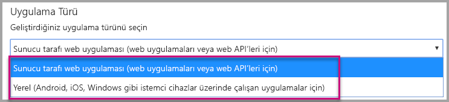
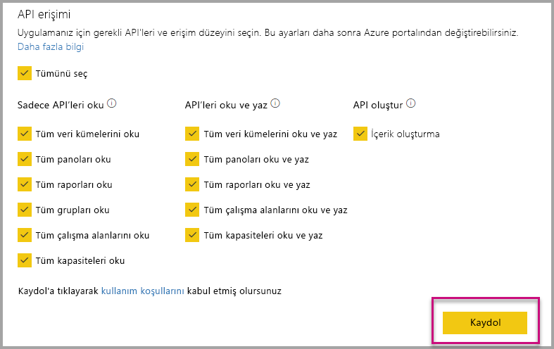
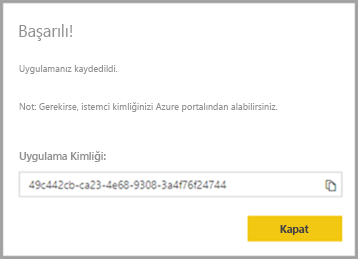
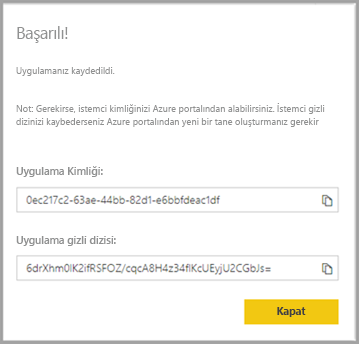

# <a name="register-an-azure-ad-application-to-use-with-power-bi"></a>Power BI ile kullanmak için Azure AD uygulamasını kaydetme

Power BI içeriği eklemek üzere bir uygulamayı Azure Active Directory'ye (Azure AD) nasıl kaydedeceğinizi öğrenin.

[Power BI REST API'lerine](https://docs.microsoft.com/rest/api/power-bi/) erişmesini sağlamak için uygulamanızı Azure AD'ye kaydetmeniz gerekir. Uygulamanızı kaydettikten sonra uygulamanız için bir kimlik oluşturabilir ve Power BI REST kaynaklarıyla ilgili izinleri belirleyebilirsiniz.

> [!IMPORTANT]
> Bir Power BI uygulamasını kaydedebilmek için [Azure Active Directory kiracısına ve kuruluş kullanıcısına](create-an-azure-active-directory-tenant.md) sahip olmanız gerekir. Power BI'a kiracınızdaki bir kullanıcıyla kaydolmadıysanız uygulama kaydı başarıyla tamamlanmaz.

Uygulamanızı kaydetmek için kullanabileceğiniz iki yöntem vardır. Kayıt için [Power BI Uygulama Kayıt Aracı](https://dev.powerbi.com/apps/)'nı kullanabilir veya kaydı doğrudan Azure portalından gerçekleştirebilirsiniz. Tamamlanması gereken yalnızca birkaç alan olduğu için Power BI Uygulama Kayıt Aracı daha kullanışlıdır. Uygulamanızda değişiklik yapmak istiyorsanız Azure portalını kullanın.

## <a name="register-with-the-power-bi-application-registration-tool"></a>Power BI Uygulama Kayıt Aracı ile kaydetme

Uygulamanız için bir kimlik oluşturmak ve Power BI REST kaynaklarıyla ilgili izinleri belirlemek için uygulamanızı **Azure Active Directory**'ye kaydedin. Konsol uygulaması veya web sitesi gibi bir uygulamayı kaydettiğinizde, uygulama tarafından kendisini izin istediği kullanıcılara tanıtmak için kullanılacak bir tanımlayıcı alırsınız.

Power BI Uygulama Kayıt Aracı'nı kullanarak uygulamanızı kaydetmek için aşağıdaki adımları uygulayın:

1. [dev.powerbi.com/apps](https://dev.powerbi.com/apps) adresine gidin.

2. Mevcut hesabınızla **oturum açın**'ı ve ardından **İleri**’yi seçin.

3. **Uygulama Adı** sağlayın.

4. **Uygulama Türü** sağlayın.

    Uygulama türü olarak **Yerel**'i ve **Sunucu tarafı web uygulamaları**'nı seçmenin farklarını aşağıda bulabilirsiniz.

    Yerel:
    * [Müşterileriniz için tasarlanmış](embed-sample-for-customers.md) ve kimliğini doğrulamak için ana kullanıcı hesabı (Power BI’da oturum açmak için kullanılan Power BI Pro lisansı) kullanan bir uygulama oluşturmayı planlıyorsunuz.

    Sunucu tarafı web uygulaması:
    * [Kuruluşunuz için tasarlanmış](embed-sample-for-your-organization.md) bir uygulama oluşturmayı planlıyorsunuz.
    * [Müşterileriniz için tasarlanmış](embed-sample-for-customers.md) ve kimliğini doğrulamak için hizmet sorumlusunu kullanan bir uygulama oluşturmayı planlıyorsunuz.
    * Web uygulamaları veya web API’leri oluşturmayı planlıyorsunuz.

    

5. Uygulama türü olarak **Sunucu tarafı web uygulamasını** seçtiyseniz **Giriş Sayfası URL'si** ve **Yeniden yönlendirme URL'si** için birer değer girerek devam edin. **Yeniden yönlendirme URL'si** geçerli herhangi bir URL’yle çalışır ve oluşturduğunuz uygulamaya karşılık gelmelidir. **Yerel**’i seçtiyseniz 6. adımdan devam edin.

6. Uygulamanıza gereken Power BI API’lerini seçin. Power BI erişim izinleri hakkında daha fazla bilgi için bkz. [Power BI İzinleri](power-bi-permissions.md). Ardından **Kaydet**’i seçin.

    

    > [!Important]
    > Hizmet sorumlularının Power BI ile kullanımını etkinleştirirseniz Azure Active Directory izinleri artık geçerli olmaz. İzinler Power BI yönetim portalı üzerinden yönetilir.

7. Uygulama türü olarak **Yerel**’i seçerseniz size bir **Uygulama Kimliği** sağlanır. Uygulama türü olarak **Sunucu tarafı web uygulaması**'nı seçerseniz bir **Uygulama kimliği** ve **Uygulama gizli dizisi** alırsınız.

    > [!Note]
    > İleride ihtiyaç duymanız halinde **Uygulama kimliği** Azure portalından alınabilir. **Uygulama gizli dizisi**'ni kaybederseniz Azure portalında yeni bir gizli dizi oluşturmanız gerekir.

| Yerel | Sunucu tarafı web uygulaması |
|--------|-----------------------------|
|  |  |

Artık kaydettiğiniz uygulamayı özel uygulamanızla birlikte kullanarak Power BI hizmeti ve Power BI Embedded uygulamasıyla etkileşim kurabilirsiniz.

## <a name="register-with-the-azure-portal"></a>Azure portalı ile kaydetme

Uygulamanızı kaydetmek için kullanabileceğiniz diğer seçenek Azure portalıdır. Uygulamanızı kaydetmek için aşağıdaki adımları uygulayın.

1. [Microsoft Power BI API Koşulları](https://powerbi.microsoft.com/api-terms)'nı kabul edin.

2. [Azure portalında](https://portal.azure.com) oturum açın.

3. Sayfanın sağ üst köşesinden hesabınızı seçerek Azure AD kiracınızı belirleyin.

4. Sol taraftaki gezinti bölmesinde **Tüm hizmetler**'e gidin, **Uygulama Kayıtları**'nı ve sonra **Yeni kayıt**'ı seçin.

5. Talimatları izleyerek yeni bir uygulama oluşturun.

   Uygulamalarınızı Azure Active Directory'ye kaydetme hakkında bilgi almak için bkz. [Azure Active Directory’ye uygulama kaydetme](https://docs.microsoft.com/azure/active-directory/develop/quickstart-v2-register-an-app)

## <a name="how-to-get-the-application-id"></a>Uygulama kimliğini alma

Uygulamayı kaydettiğinizde bir [Uygulama kimliği](embed-sample-for-customers.md#application-id) alırsınız.  **Uygulama kimliği**, kullanıcıların kendilerini tanıtması için uygulama izinleri ister.

## <a name="how-to-get-the-service-principal-object-id"></a>Hizmet sorumlusu nesne kimliğini alma

[Power BI API’lerini](https://docs.microsoft.com/rest/api/power-bi/) kullanırken hizmet sorumlusuna başvurmak için (örneğin, hizmet sorumlusunu çalışma alanına yönetici olarak uygulama) [hizmet sorumlusu nesne kimliğini](embed-service-principal.md#how-to-get-the-service-principal-object-id) kullanarak işlemleri tanımladığınızdan emin olun.

## <a name="apply-permissions-to-your-application-within-azure-ad"></a>Azure AD'de uygulamanıza izin uygulama

Uygulama kayıt sayfasında verilen izinlere ek olarak uygulamanız için ek izinleri etkinleştirin. Bu görevi Azure AD portalından veya programlama yoluyla gerçekleştirebilirsiniz.

Ekleme için kullanılan *ana* hesapla veya Genel yönetici hesabıyla oturum açmış olmanız gerekir.

### <a name="using-the-azure-ad-portal"></a>Azure AD portalını kullanma

1. Azure portalında [Uygulama kayıtları](https://portal.azure.com/#blade/Microsoft_AAD_IAM/ApplicationsListBlade)’na göz atın ve yerleştirmek için kullandığınız uygulamayı seçin.

2. **Yönet** altındaki **API izinleri**’ni seçin.

3. **API izinleri** menüsünden **İzin ekle**’yi ve sonra **Power BI Hizmeti**’ni seçin.

    

4. İstediğiniz izinleri **Temsilci İzinleri** altından seçin. Seçimleri kaydetmek için teker teker seçin. Tümünü seçtikten sonra **Kaydet**'i seçin.

5. **Onay Ver**’i seçin.

    **Onay Ver** eylemi Azure AD tarafından onay istenmesini önlemek için *ana hesabı* gerektirir. Bu eylemi gerçekleştiren hesap Genel Yönetici ise kuruluşunuzdaki tüm kullanıcılara bu uygulama için izin vermiş olursunuz. Bu eylemi gerçekleştiren hesap *ana hesap* ise ve Genel Yönetici değilse bu uygulama için yalnızca *ana hesaba* izin vermiş olursunuz.

### <a name="applying-permissions-programmatically"></a>İzinleri programlama yoluyla uygulama

1. Kiracınız içindeki var olan hizmet sorumlularını (kullanıcıları) almanız gerekir. Bunu nasıl yapacağınız hakkında bilgi almak için bkz. [servicePrincipal](https://docs.microsoft.com/graph/api/resources/serviceprincipal?view=graph-rest-beta).

    *Get servicePrincipal* API'sine {ID} kullanmadan çağrı yapabilirsiniz ve size kiracı içindeki tüm hizmet sorumlularını verir.

2. Uygulamanızın uygulama kimliği **appId** özelliği olan hizmet sorumlusunu bulun.

3. Yoksa uygulamanızdan yeni bir hizmet planı oluşturun.

    ```json
    Post https://graph.microsoft.com/beta/servicePrincipals
    Authorization: Bearer ey..qw
    Content-Type: application/json
    {
    "accountEnabled" : true,
    "appId" : "{App_Client_ID}",
    "displayName" : "{App_DisplayName}"
    }
    ```

4. PowerBI API'ye Uygulama İzinleri Verme

   Var olan bir kiracıyı kullanıyorsanız ve tüm kiracı kullanıcıları adına izin vermek istemiyorsanız **contentType** değerini **Principal** olarak değiştirerek belirli bir kullanıcıya izin verebilirsiniz.

   **consentType** değeri, **AllPrincipals** veya **Principal** parametresini belirtebilir.

   * **AllPrincipals**, kiracıdaki tüm kullanıcılar adına izin vermek için yalnızca bir kiracı yöneticisi tarafından kullanılabilir.
   * **Principal** belirli bir kullanıcı adına izinler vermek için kullanılır. Bu örnekte, istek gövdesine ilave bir özellik eklenmelidir - *principalId={User_ObjectId}* .

     Etkileşimli olmayan oturum açma sırasında mümkün olmayan bir özellik olarak, Azure AD’nin ana hesaptan onay istemesini önlemek için *İzin ver* eylemini gerçekleştirmeniz gerekir.

     ```json
     Post https://graph.microsoft.com/beta/OAuth2PermissionGrants
     Authorization: Bearer ey..qw
     Content-Type: application/json
     {
     "clientId":"{Service_Plan_ID}",
     "consentType":"AllPrincipals",
     "resourceId":"c78a3685-1ce7-52cd-95f7-dc5aea8ec98e",
     "scope":"Dataset.ReadWrite.All Dashboard.Read.All Report.Read.All Group.Read Group.Read.All Content.Create Metadata.View_Any Dataset.Read.All Data.Alter_Any",
     "expiryTime":"2018-03-29T14:35:32.4943409+03:00",
     "startTime":"2017-03-29T14:35:32.4933413+03:00"
     }
     ```

    **resourceId** *c78a3685-1ce7-52cd-95f7-dc5aea8ec98e* evrensel değildir; kiracıya bağımlıdır. Bu değer, Azure Active Directory (AAD) kiracısında “Power BI Service” uygulamasının objectId değeridir.

    Kullanıcı Azure portalından bu değeri hemen alabilir:
    1. https://portal.azure.com/#blade/Microsoft_AAD_IAM/StartboardApplicationsMenuBlade/AllApps

    2. SearchBox'da “Power BI Service” araması yapma

5. Azure Active Directory’ye (AAD) Uygulama İzinleri Verme

   **consentType** değeri, **AllPrincipals** veya **Principal** parametresini belirtebilir.

   * **AllPrincipals**, kiracıdaki tüm kullanıcılara izin vermek için yalnızca bir kiracı yöneticisi tarafından kullanılabilir.
   * **Principal** belirli bir kullanıcıya izin vermek için kullanılır. Bu örnekte, istek gövdesine ilave bir özellik eklenmelidir - *principalId={User_ObjectId}* .

   Etkileşimli olmayan oturum açma sırasında mümkün olmayan bir özellik olarak, Azure AD’nin ana hesaptan onay istemesini önlemek için *İzin ver* eylemini gerçekleştirmeniz gerekir.

   ```json
   Post https://graph.microsoft.com/beta/OAuth2PermissionGrants
   Authorization: Bearer ey..qw
   Content-Type: application/json
   { 
   "clientId":"{Service_Plan_ID}",
   "consentType":"AllPrincipals",
   "resourceId":"61e57743-d5cf-41ba-bd1a-2b381390a3f1",
   "scope":"User.Read Directory.AccessAsUser.All",
   "expiryTime":"2018-03-29T14:35:32.4943409+03:00",
   "startTime":"2017-03-29T14:35:32.4933413+03:00"
   }
   ```

## <a name="next-steps"></a>Sonraki adımlar

Uygulamanızı Azure AD'ye kaydettikten sonra uygulamanızdaki kullanıcıların kimliğini doğrulamanız gerekir. Daha fazla bilgi için bkz. [Power BI uygulamanız için kullanıcıların kimliğini doğrulama ve Azure AD erişim belirteci alma](get-azuread-access-token.md).

Başka bir sorunuz mu var? [Power BI Topluluğu'na sorun](http://community.powerbi.com/)