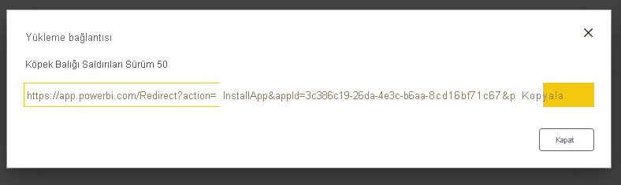
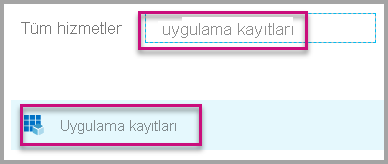
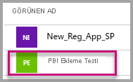
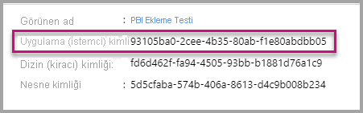
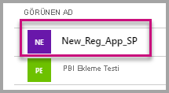
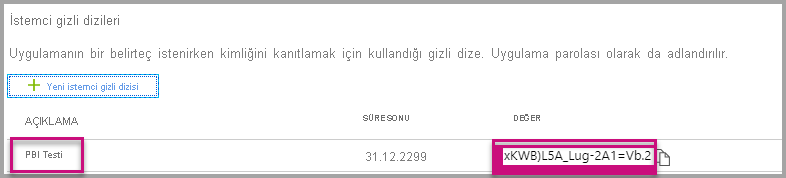

# <a name="tutorial-automate-configuration-of-template-app-installation-using-an-azure-function"></a>Öğretici: Azure işlevi kullanarak şablon uygulaması yükleme yapılandırmasını otomatikleştirme

Şablon uygulamaları, müşterilerin ellerindeki verilerden içgörü almaya başlamasını sağlayan harika bir yöntemdir. Şablon uygulamaları; müşterileri verilerine bağlayarak hızla çalışmaya başlamalarını sağlar. Şablon uygulamaları, müşterilere isterlerse özelleştirebilecekleri önceden hazırlanmış raporlar sağlar.

Müşteriler verilerine nasıl bağlanacaklarını her zaman bilemeyebilir. Bu ayrıntıların bir şablon uygulamasının yüklenmesi sırasında sağlanması müşteriler için zahmetli olabilir.

Veri hizmetleri sağlayıcısıysanız ve müşterilerinizin verilerini hizmetinizde kullanmaya başlamalarına yardımcı olmak amacıyla bir şablon uygulaması oluşturduysanız, şablon uygulamanızı daha kolay bir şekilde yüklemelerini sağlayabilirsiniz. Şablon uygulamanızın parametrelerinin yapılandırmasını otomatikleştirebilirsiniz.

Müşteri portalınızda oturum açtığında hazırladığınız özel bir bağlantıya tıklar. Bu bağlantı şunları yapar:

- Gereken bilgileri toplayan otomasyonu başlatır.
- Şablon uygulaması parametrelerini önceden yapılandırır.
- Müşteriyi, uygulamayı yükleyebileceği Power BI hesabına yönlendirir.

Müşterinin tek yapması gereken **Yükle**'yi seçip veri kaynağında kimliğini doğrulamaktır. Hepsi bu kadar!

Müşteri deneyimi burada gösterilmiştir.


Bu öğreticide şablon uygulamanızı önceden yapılandırmak ve yüklemek için oluşturduğumuz bir otomatik yükleme Azure İşlevleri örneğini kullanacaksınız. Bu örnek tanıtım amacıyla bilerek basit tutulmuştur. Şablon uygulamasını kullanıcılarınız için otomatik olarak yüklemek ve yapılandırmak amacıyla Power BI API'lerini kullanmaya yönelik bir Azure işlevinin kurulumunu içerir.

Otomasyon akışı ve uygulamanın kullandığı API'ler hakkında daha fazla bilgi için bkz. [Şablon uygulaması yüklemesinin yapılandırmasını otomatikleştirme](template-apps-auto-install.md).

Örnek uygulamada bir Azure işlevi kullanılmıştır. Azure İşlevleri hakkında daha fazla bilgi için bkz. [Azure İşlevleri belgeleri](/azure/azure-functions/).

## <a name="basic-flow"></a>Temel akış

Aşağıdaki temel akışta, müşteri, portalınızdaki bağlantıyı seçerek başlattığında uygulamanın yaptıklarını listelemektedir.

1. Kullanıcı, ISV'nin portalında oturum açar ve verilen bağlantıya tıklar. Bu işlem, akışı başlatır. ISV'nin portalı bu aşamada kullanıcıya özgü yapılandırmayı hazırlar.

1. ISV, kiracıya kayıtlı bir [hizmet sorumlusunu (yalnızca uygulama için belirteç)](../embedded/embed-service-principal.md) temel alan bir *bağımsız uygulama* belirtecini alır.

1. ISV, [Power BI REST API'lerini](/rest/api/power-bi/) kullanarak, ISV tarafından hazırlanan kullanıcıya özgü parametre yapılandırmasını içeren bir *yükleme bileti* oluşturur.

1. ISV, yükleme biletini içeren bir ```POST``` yeniden yönlendirme yöntemini kullanarak kullanıcıyı Power BI'ya yönlendirir.

1. Kullanıcı, yükleme biletiyle kendi Power BI hesabına yönlendirilir ve şablon uygulamasını yüklemesi istenir. Kullanıcı **Yükle**'ye tıkladığında şablon uygulaması yüklenir.

>[!Note]
>Parametre değerleri, ISV tarafından yükleme biletinin oluşturulma sürecinde yapılandırılır, ancak veri kaynağıyla ilgili kimlik bilgileri yalnızca kullanıcı tarafından yükleme işleminin son aşamalarında sağlanır. Bu düzenleme, bunların üçüncü taraflara kullanıma sunulmasını engelleyerek kullanıcı ile şablon uygulamasının veri kaynakları arasında güvenli bir bağlantı kurulmasını sağlar.

## <a name="prerequisites"></a>Önkoşullar

* Kendi Azure Active Directory (Azure AD) kiracınızın ayarlanması. Kurulum yönergeleri için bkz. [Azure AD kiracısı oluşturma](../embedded/create-an-azure-active-directory-tenant.md).
* Önceki kiracıya kayıtlı bir [hizmet sorumlusu (yalnızca uygulama için belirteç)](../embedded/embed-service-principal.md).
* Yüklenmeye hazır bir parametreli [şablon uygulaması](../../connect-data/service-template-apps-overview.md). Şablon uygulaması, uygulamanızı Azure AD'ye kaydettiğiniz kiracıda oluşturulmalıdır. Daha fazla bilgi için bkz. [Şablon uygulaması ipuçları](../../connect-data/service-template-apps-tips.md) veya [Power BI'da şablon uygulaması oluşturma](../../connect-data/service-template-apps-create.md).
* Otomasyon iş akışınızı test etmek için, hizmet sorumlusunu şablon uygulama çalışma alanına yönetici olarak ekleyin.
* Power BI Pro lisansı. Power BI Pro’ya kaydolmadıysanız, başlamadan önce [ücretsiz deneme için kaydolun](https://powerbi.microsoft.com/pricing/).

## <a name="set-up-your-template-apps-automation-development-environment"></a>Şablon uygulaması otomasyonu geliştirme ortamını ayarlama

Uygulamayı yüklemeye devam etmeden önce, bir Azure uygulama yapılandırmasının yanı sıra bir Azure işlevi geliştirmek için [Hızlı Başlangıç: Azure Uygulama Yapılandırması ile Azure İşlevleri oluşturma](/azure/azure-app-configuration/quickstart-azure-functions-csharp) bölümündeki yönergeleri izleyin. Makalede anlatıldığı gibi uygulama yapılandırmanızı oluşturun.

### <a name="register-an-application-in-azure-ad"></a>Azure AD'de uygulama kaydetme

[Hizmet sorumlusu ve uygulama gizli dizisiyle Power BI içeriği ekleme](../embedded/embed-service-principal.md) sayfasında açıklandığı gibi bir hizmet sorumlusu oluşturun.

Uygulamayı **sunucu tarafı web uygulaması** olarak kaydettiğinizden emin olun. Sunucu tarafı web uygulamasını kaydederek bir uygulama gizli dizisi oluşturursunuz.

Daha sonraki adımlar için *uygulama kimliği* (ClientID) ve *uygulama gizli dizisi* (ClientSecret) değerlerini saklayın.

Uygulama kaydı oluşturmaya hemen başlamak için [Ekleme kurulum aracını](https://aka.ms/embedsetup/AppOwnsData) inceleyebilirsiniz. [Power BI Uygulama Kayıt Aracı](https://app.powerbi.com/embedsetup)'nı kullanıyorsanız **Müşterileriniz için ekleme** seçeneğini belirleyin.

Otomasyon iş akışınızı sınayabilmeniz için hizmet sorumlusunu şablon uygulama çalışma alanına yönetici olarak ekleyin.

## <a name="template-app-preparation"></a>Şablon uygulamasını hazırlama

Şablon uygulamanızı oluşturduktan ve yükleme için hazır hale getirdikten sonra, aşağıdaki bilgileri bundan sonraki adımlar için kaydedin:

* Uygulama oluşturulurken [Şablon uygulamasının özelliklerini tanımlama](../../connect-data/service-template-apps-create.md#define-the-properties-of-the-template-app) sürecinin sonunda yükleme URL'sinde görünen *Uygulama Kimliği*, *Paket Anahtarı* ve *Sahip Kimliği*.

    Bu bağlantıya, şablon uygulamasının [Sürüm Yönetimi bölmesinden](../../connect-data/service-template-apps-create.md#manage-the-template-app-release) **Bağlantı al**'ı seçerek de ulaşabilirsiniz.

* Şablon uygulamasının veri kümesinde tanımlı *Parametre adları*. Parametre adları büyük/küçük harfe duyarlı dizelerdir. Bunları [Şablon uygulamasının özelliklerini tanımlarken](../../connect-data/service-template-apps-create.md#define-the-properties-of-the-template-app) **Parametre Ayarları** sekmesinden veya Power BI veri kümesi ayarlarından da alabilirsiniz.

>[!NOTE]
>AppSource üzerinde genel kullanıma sunulmuş olmasa dahi, yükleme için hazır olan şablon uygulamanızın önceden yapılandırılmış yükleme uygulamasını test edebilirsiniz. Kiracınızın dışındaki kullanıcıların şablon uygulamanızı yüklemek amacıyla otomatik yükleme uygulamasını kullanabilmesi için şablon uygulamanızın [Power BI uygulama marketinde](https://app.powerbi.com/getdata/services) genel kullanıma sunulmuş olması gerekir. Bu nedenle şablon uygulamanızı, oluşturmakta olduğunuz otomatik yükleme uygulamasını kullanarak dağıtmadan önce [İş Ortağı Merkezi](/azure/marketplace/partner-center-portal/create-power-bi-app-offer)'nde yayımlamayı unutmayın.


## <a name="install-and-configure-your-template-app"></a>Şablon uygulamanızı yükleyip yapılandırma

Bu bölümde şablon uygulamanızı önceden yapılandırmak ve yüklemek için oluşturduğumuz bir otomatik yükleme Azure İşlevleri örneğini kullanacaksınız. Bu örnek tanıtım amacıyla bilerek basit tutulmuştur. Şablon uygulamalarınız için otomatik yükleme API'sini bir [Azure işlevini](/azure/azure-functions/functions-overview) ve [Azure Uygulaması Yapılandırmasını](/azure/azure-app-configuration/overview) kullanarak kolayca dağıtmanızı ve kullanmanızı sağlar.

### <a name="download-visual-studio-version-2017-or-later"></a>[Visual Studio](https://www.visualstudio.com/)'yu (sürüm 2017 veya üzeri) indirme

[Visual Studio](https://www.visualstudio.com/)'yu (sürüm 2017 veya üzeri) indirin. En son [NuGet paketini](https://www.nuget.org/profiles/powerbi) indirdiğinizden emin olun.

### <a name="download-the-automated-installation-azure-functions-sample"></a>Otomatik yükleme Azure İşlevleri örneğini indirin

Başlamak için GitHub'dan [otomatik yükleme Azure İşlevleri örneğini](https://github.com/microsoft/Template-apps-examples/tree/master/Developer%20Samples/Automated%20Install%20Azure%20Function) indirin.


### <a name="set-up-your-azure-app-configuration"></a>Azure uygulama yapılandırmanızı ayarlama

Bu örneği çalıştırmak için Azure uygulama yapılandırmanızı burada verilen değerler ve anahtarlar ile ayarlamanız gerekir. Anahtarlar, **uygulama kimliği** ve **uygulama gizli dizisi** ile şablon uygulamanızın **AppId**, **PackageKey** ve **OwnerId** değerleridir. Bu değerleri alma hakkında bilgi için aşağıdaki bölümlere bakın.

Anahtarlar ayrıca **Constants.cs** dosyasında da tanımlanmıştır.

| Yapılandırma anahtarı | Anlamı           |
|---------------    |-------------------|
| TemplateAppInstall:Application:AppId | [Yükleme URL'sinden](#get-the-template-app-properties) **AppId** değeri |
| TemplateAppInstall:Application:PackageKey | [Yükleme URL'sinden](#get-the-template-app-properties) **PackageKey** değeri |
| TemplateAppInstall:Application:OwnerId | [Yükleme URL'sinden](#get-the-template-app-properties) **OwnerId** değeri |
| TemplateAppInstall:ServicePrincipal:ClientId | Hizmet sorumlusu [uygulama kimliği](#get-the-application-id) |
| TemplateAppInstall:ServicePrincipal:ClientSecret | Hizmet sorumlusu [uygulama gizli dizisi](#get-the-application-secret) |
|||


**Constants.cs** dosyası burada gösterilmiştir.


#### <a name="get-the-template-app-properties"></a>Şablon uygulamasının özelliklerini alma

Uygulama oluşturulurken tanımlanan ilgili tüm şablon uygulaması özelliklerini girin. Bu özellikler, şablon uygulamasının **AppId**, **PackageKey** ve **OwnerId** değerleridir.

Yukarıdaki değerleri almak için şu adımları izleyin:

1. [Power BI](https://app.powerbi.com)'da oturum açın.

1. Uygulamanın özgün çalışma alanına gidin.

1. **Sürüm Yönetimi** bölmesini açın.

    

1. Uygulama sürümünü seçin ve uygulamanın yükleme bağlantısını alın.

    

1. Bağlantıyı panoya kopyalayın.

    

1. Bu yükleme URL'sinde ihtiyacınız olan üç URL parametresi bulunur. Uygulamanın **appId**, **packageKey** ve **ownerId** değerlerini kullanın. Örnek URL, burada gösterilene benzer olacaktır.

    ```html
    https://app.powerbi.com/Redirect?action=InstallApp&appId=3c386...16bf71c67&packageKey=b2df4b...dLpHIUnum2pr6k&ownerId=72f9...1db47&buildVersion=5
    ```

#### <a name="get-the-application-id"></a>Uygulama kimliğini alma

**applicationId** bilgisini Azure'dan alınan uygulama kimliği ile doldurun. **applicationId** değeri uygulamayı izinlerini istediğiniz kullanıcılara tanıtmak için kullanılır.

Uygulama kimliğini almak için şu adımları izleyin:

1. [Azure Portal](https://portal.azure.com) oturum açın.

1. Sol bölmede **Tüm hizmetler** > **Uygulama kayıtları**'nı seçin.

    

1. **Uygulama kimliği** gereken uygulamayı seçin.

    

1. GUID olarak listelenen bir uygulama kimliği vardır. Bu uygulama kimliğini uygulama için **applicationId** değeri olarak kullanın.

    

#### <a name="get-the-application-secret"></a>Uygulama gizli anahtarını alma

**ApplicationSecret** bilgisini, Azure'un **Uygulama kayıtları** bölümünün **Anahtarlar** bölümünden aldığınız değerle doldurun. Bu öznitelik, [hizmet sorumlusunu](../embedded/embed-service-principal.md) kullandığınızda çalışır.

Uygulama gizli dizisi değerini almak için şu adımları izleyin:

 1. [Azure Portal](https://portal.azure.com) oturum açın.

 1. Sol bölmede **Tüm hizmetler** > **Uygulama kayıtları**'nı seçin.

    

1. **Uygulama gizli dizisini** kullanması gereken uygulamayı seçin.

    

1. **Yönet**’in altında **Sertifikalar ve gizli diziler**’i seçin.

1. **Yeni istemci gizli dizileri**’ni seçin.

1. **Açıklama** kutusuna bir ad girin ve bir süre seçin. Ardından, uygulamanız için değeri almak üzere **Kaydet**'i seçin. Anahtarı kaydettikten sonra **Anahtarlar** bölmesini kapattığınızda, **Değer** alanı yalnızca gizli olarak gösterilir. Bu aşamada anahtar değerini alamazsınız. Anahtar değerini kaybederseniz Azure portalında yeni bir anahtar değeri oluşturun.

    

## <a name="test-your-function-locally"></a>İşlevinizi yerel ortamda test etme

İşlevinizi çalıştırmak için [İşlevi yerel ortamda çalıştırma](/azure/azure-functions/functions-create-your-first-function-visual-studio#run-the-function-locally) sayfasındaki adımları izleyin.

Portalınızı işlevin URL'sine bir ```POST``` isteği gönderecek şekilde yapılandırın. ```POST http://localhost:7071/api/install``` bunun bir örneğidir. İstek gövdesi, anahtar-değer çiftlerini gösteren bir JSON nesnesi olmalıdır. Anahtarlar, Power BI Desktop'ta tanımlanmış *parametre adlarıdır*. Değerler, şablon uygulamasındaki parametrelerde ayarlanacak olan değerlerdir.

>[!Note]
> Üretim ortamında parametre değerleri, portalınızın hedeflenen mantığı doğrultusunda her bir kullanıcıya göre belirlenecektir.

İstenen akış şu şekilde olmalıdır:

1. Portal, kullanıcı ya da oturum temelinde isteği hazırlar.
1. ```POST /api/install``` isteği Azure işlevinize gönderilir. İstek gövdesi anahtar-değer çiftlerinden oluşur. Anahtar, parametre adıdır. Değer, ayarlanacak olan değerdir.
1. Her şey düzgün olarak yapılandırıldıysa, tarayıcı otomatik olarak müşterinin Power BI hesabına yönlenmeli ve otomatik yükleme akışını göstermelidir.
1. Yükleme sonrasında parametre değerleri 1. ve 2. adımlarda yapılandırıldıkları gibi ayarlanır.
 
## <a name="next-steps"></a>Sonraki adımlar

### <a name="publish-your-project-to-azure"></a>Projenizi Azure'da yayımlama

Projenizi Azure'da yayımlamak için [Azure İşlevleri belgelerindeki](/azure/azure-functions/functions-create-your-first-function-visual-studio#publish-the-project-to-azure) yönergeleri izleyin. Daha sonra şablon uygulaması otomatik yükleme API'lerini ürününüzle tümleştirip üretim ortamlarında test etmeye başlayabilirsiniz.