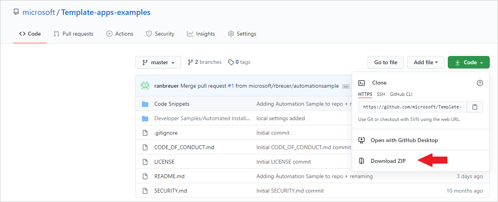

# <a name="tutorial-automate-configuration-of-template-app-installation-using-an-azure-function"></a>Öğretici: Azure işlevi kullanarak şablon uygulaması yükleme yapılandırmasını otomatikleştirme

Şablon uygulamaları, müşterilerin ellerindeki verilerden içgörü almaya başlamasını sağlayan harika bir yöntemdir. Şablon uygulamaları, müşterileri verilerine bağlayıp istedikleri gibi özelleştirebilecekleri önceden oluşturulmuş raporlar sunarak hızlı bir şekilde çalışmaya başlamalarını sağlar.

Müşteriler her zaman verilerine bağlanma konusunda ayrıntılı bilgi sahibi olmayabilir ve şablon uygulaması yükleme sırasında bu bilgileri sağlamak zorunda olmak işlerini zorlaştırabilir.

Veri hizmetleri sağlayıcısıysanız ve müşterilerinizin verilerini hizmetinize almalarına yardımcı olmak için bir şablon uygulaması oluşturduysanız, şablon uygulamanızın parametrelerini yapılandırma sürecini otomatikleştirerek müşterilerinizin şablon uygulamanızı daha kolay bir şekilde yüklemesini sağlayabilirsiniz. Müşteriler portalınızda oturum açtıktan sonra sizin hazırladığınız özel bir bağlantıya tıklar. Bu işlemi ardından başlatılan otomasyon süreci gerekli bilgileri toplar, şablon uygulaması parametrelerine ön yapılandırma uygular ve müşteriyi uygulamayı yükleyebileceği Power BI hesabına yönlendirir. Burada müşterinin tek yapması gereken Yükle'ye tıklayıp veri kaynağında kimlik doğrulaması yapmaktır. Hepsi bu kadar! 

Müşteri deneyimi aşağı gösterilmiştir.


Bu öğreticide şablon uygulamanızı önceden yapılandırmak ve yüklemek için oluşturduğumuz otomatik yüklenen Azure işlevi örneğini kullanacaksınız. Bu örnek tanıtım amacıyla bilerek basit tutulmuştur. Şablon uygulamasını kullanıcılarınız için otomatik olarak yükleme ve yapılandırma amacıyla Power BI API'lerinden faydalanmaya yönelik bir Azure işlev kurulumu içerir.

Genel otomasyon akışı ve kullanılan API'ler hakkında daha fazla bilgi için bkz. [Şablon uygulaması yükleme yapılandırmasını otomatikleştirme](template-apps-auto-install.md)

Örnek uygulamada bir Azure işlevi kullanılmıştır. Azure İşlevleri hakkında daha fazla bilgi için [Azure İşlevleri belgelerine](https://docs.microsoft.com/azure/azure-functions/) bakın.

## <a name="basic-flow"></a>Temel akış

Aşağıda müşterinin portalınızdaki bağlantıya tıklamasının ardından uygulamanın gerçekleştirdiği işlemlere dair temel akış gösterilmiştir.

1. Kullanıcı, ISV portalında oturum açar ve verilen bağlantıya tıklar. Bu eylem akışı başlatır. ISV'nin portalı bu aşamada kullanıcıya özgü yapılandırmayı hazırlar.

2. ISV, kiracıya kayıtlı [hizmet sorumlusunu (yalnızca uygulama belirteci)](../embedded/embed-service-principal.md) temel alan bir **yalnızca uygulama** belirteci alır.

3. ISV, [Power BI REST API'lerini](https://docs.microsoft.com/rest/api/power-bi/) kullanarak ISV tarafından hazırlanan kullanıcıya özgü parametre yapılandırmasını içeren bir **Yükleme Bileti** oluşturur.

4. ISV, yükleme biletini içeren bir ```POST``` yeniden yönlendirme yöntemini kullanarak kullanıcıyı Power BI'a yönlendirir.

5. Kullanıcı, yükleme biletiyle kendi Power BI hesabına yönlendirilir ve şablon uygulamasını yüklemesi istenir. Kullanıcı Yükle'ye tıkladığında şablon uygulaması yüklenir.

>[!Note]
>Parametre değerleri, ISV tarafından yükleme biletinin oluşturulması sırasında yapılandırılır ancak veri kaynağıyla ilgili kimlik bilgileri yalnızca kullanıcı tarafından yükleme sürecinin son aşamalarında sağlanır. Bu sayede üçüncü tarafların kullanımına sunulmaz ve kullanıcı ile şablon uygulaması veri kaynakları arasında güvenli bağlantı kurulmuş olur.

## <a name="prerequisites"></a>Önkoşullar

Başlamadan önce şunlara sahip olmanız gerekir:

* Kendi Azure Active Directory kiracısı kurulumunuz. Kurulum yönergeleri için bkz. [Azure Active Directory kiracısı oluşturma](https://docs.microsoft.com/power-bi/developer/embedded/create-an-azure-active-directory-tenant).

* Yukarıda belirtilen kiracıda kayıtlı bir [hizmet sorumlusu (yalnızca uygulama belirteci)](https://docs.microsoft.com/power-bi/developer/embedded/embed-service-principal).

* Yüklenmeye hazır parametreli [şablon uygulaması](https://docs.microsoft.com/power-bi/connect-data/service-template-apps-overview). Şablon uygulaması, uygulamanızı Azure Active Directory'ye (Azure AD) kaydettiğiniz kiracıda oluşturulmuş olmalıdır. Daha fazla bilgi için bkz. [şablon uygulaması ipuçları](https://docs.microsoft.com/power-bi/connect-data/service-template-apps-tips) veya [Power BI'da şablon uygulaması oluşturma](https://docs.microsoft.com/power-bi/connect-data/service-template-apps-create).

* **Power BI Pro lisansı**. Power BI Pro’ya kaydolmadıysanız, başlamadan önce [ücretsiz deneme için kaydolun](https://powerbi.microsoft.com/pricing/).

## <a name="set-up-your-template-apps-automation-development-environment"></a>Şablon uygulaması otomasyonu geliştirme ortamını ayarlama

Uygulama kurulumuna geçmeden önce [Hızlı başlangıç: Azure Uygulama Yapılandırması ile Azure İşlevleri uygulaması oluşturma](https://docs.microsoft.com/azure/azure-app-configuration/quickstart-azure-functions-csharp) sayfasındaki yönergeleri izleyerek Azure Uygulama Yapılandırması ile bir Azure İşlevi geliştirin. Makalede açıklandığı gibi uygulama yapılandırmanızı oluşturun.

### <a name="register-an-application-in-azure-active-directory-azure-ad"></a>Azure Active Directory'de (Azure AD) bir uygulamayı kaydetme

[Hizmet sorumlusu ve uygulama gizli dizisiyle Power BI içeriği ekleme](https://docs.microsoft.com/power-bi/developer/embedded/embed-service-principal) sayfasında açıklandığı gibi bir hizmet sorumlusu oluşturun.

Uygulamayı **sunucu tarafı web uygulaması** olarak kaydettiğinizden emin olun. Sunucu tarafı web uygulamasını kaydederek bir uygulama gizli dizisi oluşturursunuz.

*Uygulama Kimliği* (İstemci Kimliği) ve *Uygulama Gizli Dizisi* (İstemci Gizli Dizisi) bilgilerini sonraki adımlar için kaydedin.

Uygulama kaydı oluşturmaya hızlıca başlamak için [Ekleme kurulum aracını](https://aka.ms/embedsetup/AppOwnsData) inceleyebilirsiniz. [Power BI Uygulama Kayıt Aracı](https://app.powerbi.com/embedsetup)'nı kullanıyorsanız *Müşterileriniz için ekleme* seçeneğini belirleyin.

## <a name="template-app-preparation"></a>Şablon uygulamasını hazırlama

Şablon uygulamanızı oluşturduktan ve yükleme için hazır hale getirdikten sonra aşağıdaki bilgileri sonraki adımlar için kaydedin:

* Uygulama oluşturulurken [Şablon uygulamasının özelliklerini tanımlama](../../connect-data/service-template-apps-create.md#define-the-properties-of-the-template-app) işleminde yer alan yükleme URL'sinin sonunda görünen *Uygulama Kimliği*, *Paket Anahtarı* ve *Sahip Kimliği*.

    Bu bağlantıya ulaşmak için şablon uygulamasının [Sürüm Yönetimi](../../connect-data/service-template-apps-create.md#manage-the-template-app-release) alanından **Bağlantı al**'a da tıklayabilirsiniz.

* Şablon uygulamasının veri kümesinde tanımlanmış olan *Parametre Adları*. Büyük/küçük harfe duyarlı olan parametre adlarını [Şablon uygulamasının özelliklerin tanımlama](../../connect-data/service-template-apps-create.md#define-the-properties-of-the-template-app) adımının **Parametre Ayarları** sekmesinden veya Power BI veri kümesi ayarları sayfasından da alabilirsiniz.

>[!NOTE]
>AppSource üzerinde genel kullanıma açık olmasa dahi yükleme için hazır olan şablon uygulamanızın önceden yapılandırılmış yükleme sürecini test edebilirsiniz. Ancak kiracınızın dışındaki kullanıcıların şablon uygulamanızı yükleme amacıyla otomatik uygulama yükleme işlemini kullanabilmeleri için şablon uygulamasının [Power BI Uygulamaları marketinde](https://app.powerbi.com/getdata/services) genel kullanıma açık olması gerekir. Bu nedenle oluşturduğunuz otomatik yükleme uygulamasını kullanarak şablon uygulamanızı dağıtmadan önce [İş Ortağı Merkezi](https://docs.microsoft.com/azure/marketplace/partner-center-portal/create-power-bi-app-offer)'ne yayımlamayı unutmayın.


## <a name="install-and-configure-your-template-app-using-our-azure-function-sample"></a>Azure İşlevi örneğini kullanarak şablon uygulamasını yükleme ve yapılandırma

Bu bölümde şablon uygulamanızı önceden yapılandırmak ve yüklemek için oluşturduğumuz otomatik yüklenen Azure işlevi örneğini kullanacaksınız. Bu örnek tanıtım amacıyla bilerek basit tutulmuştur. Bir [Azure İşlevi](https://docs.microsoft.com/azure/azure-functions/functions-overview) ve [Azure Uygulama Yapılandırması](https://docs.microsoft.com/azure/azure-app-configuration/overview) ile şablon uygulamalarınız için otomatik yükleme API'sini kolayca dağıtmanızı ve kullanmanızı sağlar.

### <a name="download-visual-studio-version-2017-or-later"></a>[Visual Studio](https://www.visualstudio.com/)'yu (sürüm 2017 veya üzeri) indirme

[Visual Studio](https://www.visualstudio.com/)'yu (sürüm 2017 veya üzeri) indirin. En son [NuGet paketini](https://www.nuget.org/profiles/powerbi) indirdiğinizden emin olun.

### <a name="download-the-automated-install-azure-function-sample"></a>Otomatik Yükleme Azure İşlevi örneğini indirme

Başlamak için GitHub'dan [Otomatik Yükleme Azure İşlevi örneğini](https://github.com/microsoft/Template-apps-examples/tree/master/Developer%20Samples/Automated%20Install%20Azure%20Function) indirin.



### <a name="setup-your-azure-app-configuration"></a>Azure Uygulama Yapılandırmanızı ayarlama

Bu örneği çalıştırmak için Azure Uygulama Yapılandırmanızı aşağıdaki değerler ve anahtarlarla ayarlamanız gerekir. Anahtarlar **Uygulama Kimliği** ve **Uygulama gizli dizisi** ile şablon uygulamanızın **AppId**, **PackageKey** ve **OwnerId** değerleridir. Bu değerleri nasıl alacağınızı öğrenmek için aşağıdaki bölümleri inceleyin. 

Anahtarlar ayrıca **Constants.cs** dosyasında da tanımlanmıştır.

| Yapılandırma Anahtarı | Anlamı           |
|---------------    |-------------------|
| TemplateAppInstall:Application:AppId | [Yükleme URL'sinden](#getting-the-template-app-properties) *AppId* |
| TemplateAppInstall:Application:PackageKey | [Yükleme URL'sinden](#getting-the-template-app-properties) *PackageKey* |
| TemplateAppInstall:Application:OwnerId | [Yükleme URL'sinden](#getting-the-template-app-properties) *OwnerId* |
| TemplateAppInstall:ServicePrincipal:ClientId | Hizmet Sorumlusu [Uygulama Kimliği](#getting-the-application-id) |
| TemplateAppInstall:ServicePrincipal:ClientSecret | Hizmet Sorumlusu [Uygulama gizli dizisi](#getting-the-application-secret) |
|||


**Constants.cs** dosyası:


#### <a name="getting-the-template-app-properties"></a>Şablon uygulaması özelliklerini alma
Uygulama oluşturulurken tanımlanmış olan ilgili tüm şablon uygulaması özelliklerini girin. Bu özellikler, şablon uygulamasının **AppId**, **PakcageKey** ve **OwnerId** değerleridir.

Yukarı değerleri almak için şu adımları izleyin:

1. [Power BI](https://app.powerbi.com)'da oturum açın.

2. Uygulamanın özgün çalışma alanına gidin.

3. Sürüm yönetimi bölmesini açın.

    

4. Uygulama sürümünü seçin ve yükleme bağlantısını alın.

    

5. Bağlantıyı panoya kopyalayın.

    

6. Yükleme URL'sinin içinde ihtiyacınız olan 3 URL parametresi bulunur. Uygulamaya ait **appId**, **packageKey** ve **ownerId** değerlerini kullanın. URL aşağıdaki örneğe benzer olacaktır.

    ```html
    https://app.powerbi.com/Redirect?action=InstallApp&appId=3c386...16bf71c67&packageKey=b2df4b...dLpHIUnum2pr6k&ownerId=72f9...1db47&buildVersion=5
    ```

#### <a name="getting-the-application-id"></a>Uygulama kimliğini alma

**applicationId** bilgilerini **Azure**’daki **Uygulama Kimliği** ile doldurun. Uygulama, izin istediğiniz kullanıcılara kendini tanıtmak için **applicationId** değerini kullanır.

**applicationId** değerini almak için aşağıdaki adımları izleyin:

1. [Azure portalında](https://portal.azure.com) oturum açın.

2. Sol gezinti bölmesinde **Tüm Hizmetler**'i, sonra da **Uygulama Kayıtları**'nı seçin.

    

3. **applicationId** değerinin gerektiği uygulamayı seçin.

    

4. GUID olarak listelenen bir **Uygulama Kimliği** vardır. Bu **Uygulama Kimliği**’ni uygulamanın **applicationId** değeri olarak kullanın.

    

#### <a name="getting-the-application-secret"></a>Uygulama gizli dizisini alma

**ApplicationSecret** alanına **Azure**'daki **Uygulama kayıtları** bölümünden alacağınız **Anahtarlar** bilgilerini girin.  Bu öznitelik [hizmet sorumlusu](../embedded/embed-service-principal.md) kullanıldığında çalışır.

**ApplicationSecret** değerini almak için aşağıdaki adımları izleyin:

 1. [Azure portalında](https://portal.azure.com) oturum açın.

 2. Sol gezinti bölmesinde **Tüm hizmetler**'i, sonra da **Uygulama kayıtları**'nı seçin.

    

3. **ApplicationSecret** değerini kullanması gereken uygulamayı seçin.

    

4. **Yönet**’in altında **Sertifikalar ve gizli diziler**’i seçin.

5. **Yeni istemci gizli dizileri**’ni seçin.

6. **Açıklama** kutusuna bir ad girin ve bir süre seçin. Ardından **Kaydet**’i seçerek uygulamanız için **Değer**’i alın. Anahtar değerini kaydettikten sonra **Anahtarlar** bölmesini kapattığınızda değer alanı yalnızca gizlenmiş olarak gösterilir. Bu aşamada anahtar değerini alamazsınız. Anahtar değerini kaybederseniz Azure portalında yeni bir anahtar değeri oluşturun.

    

## <a name="test-your-function-locally"></a>İşlevinizi yerel ortamda test etme

İşlevinizi çalıştırmak için [İşlevi yerel ortamda çalıştırma](https://docs.microsoft.com/azure/azure-functions/functions-create-your-first-function-visual-studio#run-the-function-locally) sayfasındaki adımları izleyin.

Portalınızı işlevin URL'sine bir ```POST``` isteği gönderecek şekilde yapılandırın (örn. ```POST http://localhost:7071/api/install```). İstek gövdesi, anahtar-değer çiftlerini tanımlayan bir JSON nesnesi olmalıdır. Burada anahtarlar *parametre adları* (Power BI Desktop'ta tanımlanmış), değerler ise şablon uygulamasındaki parametreler için istenen değerler olmalıdır.

>[!Note]
> Üretim ortamında parametre değerleri, portalınızın hedeflenen mantığı doğrultusunda her bir kullanıcıya göre belirlenecektir.

İstenen akış şu şekilde olmalıdır:

1. Portal her bir kullanıcıya/oturuma göre isteği hazırlar.
2. ```POST /api/install``` isteği Azure işlevinize gönderilir. İstek gövdesinde anahtar-değer çiftleri bulunur ve burada anahtar parametre adıyken değer ayarlanması istenen değerdir. 
3. Her şey düzgün yapılandırmışsa tarayıcı otomatik olarak müşterinin Power BI hesabına yönlendirmeli ve otomatik yükleme akışını göstermelidir.
4. Yükleme sonrasında parametre değerleri 1 ve 2 numaralı adımlarda yapılandırılan şekilde ayarlanır.
 
## <a name="next-steps"></a>Sonraki adımlar

### <a name="publish-your-project-to-azure"></a>Projenizi Azure'da yayımlama

Projenizi Azure'da yayımlamaya yönelik yönergeler için [Azure işlevi belgelerini](https://docs.microsoft.com/azure/azure-functions/functions-create-your-first-function-visual-studio#publish-the-project-to-azure) inceleyin. Bu sayede şablon uygulaması otomatik yükleme API'lerini ürününüzle tümleştirebilir ve üretim ortamlarında test etmeye başlayabilirsiniz.
