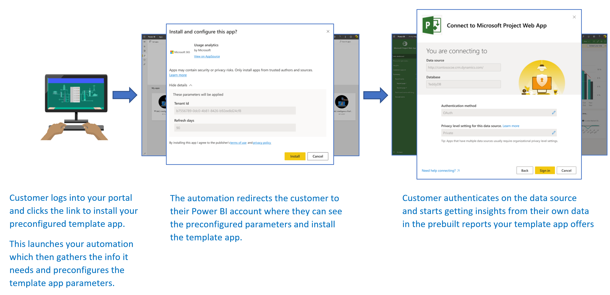

# <a name="automated-configuration-of-a-template-app-installation"></a>Şablon uygulaması yüklemesini otomatik yapılandırma

Şablon uygulamaları, müşterilerin ellerindeki verilerden içgörü almaya başlamasını sağlayan harika bir yöntemdir. Şablon uygulamaları; müşterileri verilerine bağlayarak hızla çalışmaya başlamalarını sağlar. Şablon uygulamaları, müşterilere isterlerse özelleştirebilecekleri önceden hazırlanmış raporlar sağlar.

Müşteriler verilerine nasıl bağlanacaklarını her zaman bilemeyebilir. Bu ayrıntıların bir şablon uygulamasının yüklenmesi sırasında sağlanması müşteriler için zahmetli olabilir.

Veri hizmetleri sağlayıcısıysanız ve müşterilerinizin verilerini hizmetinizde kullanmaya başlamalarına yardımcı olmak amacıyla bir şablon uygulaması oluşturduysanız, şablon uygulamanızı daha kolay bir şekilde yüklemelerini sağlayabilirsiniz. Şablon uygulamanızın parametrelerinin yapılandırmasını otomatikleştirebilirsiniz. Müşteri portalınızda oturum açtığında hazırladığınız özel bir bağlantıya tıklar. Bu bağlantı şunları yapar:

- Gereken bilgileri toplayan otomasyonu başlatır.
- Şablon uygulaması parametrelerini önceden yapılandırır.
- Müşteriyi, uygulamayı yükleyebileceği Power BI hesabına yönlendirir.

Müşterinin tek yapması gereken **Yükle**'yi seçip veri kaynağında kimliğini doğrulamaktır. Hepsi bu kadar!

Müşteri deneyimi burada gösterilmiştir.



Bu makalede şablon uygulaması yükleme yapılandırmasını otomatikleştirmeye yönelik temel akış, önkoşullar, başlıca adımlar ve ihtiyacınız olan API'ler anlatılmaktadır. Hemen uygulamaya geçmek isterseniz, bir Azure işlevini kullanan hazırladığımız basit bir örnek uygulamayla şablon uygulamasının yükleme yapılandırmasını otomatikleştireceğiniz [öğretici](template-apps-auto-install-tutorial.md) bölümüne atlayabilirsiniz.

## <a name="basic-flow"></a>Temel akış

Şablon uygulaması yükleme yapılandırmasını otomatikleştirmenin temel akışı şu şekildedir:

1. Kullanıcı, ISV'nin portalında oturum açar ve verilen bağlantıya tıklar. Bu işlem otomatik akışı başlatır. ISV'nin portalı bu aşamada kullanıcıya özgü yapılandırmayı hazırlar.

1. ISV, kiracıya kayıtlı bir [hizmet sorumlusunu (yalnızca uygulama için belirteç)](../embedded/embed-service-principal.md) temel alan bir *bağımsız uygulama* belirtecini alır.

1. ISV, [Power BI REST API'lerini](https://docs.microsoft.com/rest/api/power-bi/) kullanarak, ISV tarafından hazırlanan kullanıcıya özgü parametre yapılandırmasını içeren bir *yükleme bileti* oluşturur.

1. ISV, yükleme biletini içeren bir ```POST``` yeniden yönlendirme yöntemini kullanarak kullanıcıyı Power BI'ya yönlendirir.

1. Kullanıcı, yükleme biletiyle kendi Power BI hesabına yönlendirilir ve şablon uygulamasını yüklemesi istenir. Kullanıcı **Yükle**'ye tıkladığında şablon uygulaması yüklenir.

>[!Note]
>Parametre değerleri, ISV tarafından yükleme biletinin oluşturulma sürecinde yapılandırılır, ancak veri kaynağıyla ilgili kimlik bilgileri yalnızca kullanıcı tarafından yükleme işleminin son aşamalarında sağlanır. Bu düzenleme, bunların üçüncü taraflara kullanıma sunulmasını engelleyerek kullanıcı ile şablon uygulamasının veri kaynakları arasında güvenli bir bağlantı kurulmasını sağlar.

## <a name="prerequisites"></a>Önkoşullar

Şablon uygulamanızda önceden yapılandırılmış yükleme deneyimi sunmak için aşağıdaki önkoşullar gereklidir:

* Power BI Pro lisansı. Power BI Pro’ya kaydolmadıysanız, başlamadan önce [ücretsiz deneme için kaydolun](https://powerbi.microsoft.com/pricing/).
* Kendi Azure Active Directory (Azure AD) kiracınızın ayarlanması. Kurulum yönergeleri için bkz. [Azure AD kiracısı oluşturma](https://docs.microsoft.com/power-bi/developer/embedded/create-an-azure-active-directory-tenant).
* Önceki kiracıya kayıtlı bir **hizmet sorumlusu (yalnızca uygulama için belirteç)** . Daha fazla ayrıntı için bkz. [Hizmet sorumlusu ve uygulama gizli dizisiyle Power BI içeriği ekleme](https://docs.microsoft.com/power-bi/developer/embedded/embed-service-principal). Uygulamayı **sunucu tarafı web uygulaması** olarak kaydettiğinizden emin olun. Sunucu tarafı web uygulamasını kaydederek bir uygulama gizli dizisi oluşturursunuz. Bu işlemin *uygulama kimliği* (ClientID) ve *uygulama gizli dizisi* (ClientSecret) bilgilerini sonraki adımlar için kaydetmeniz gerekir.
* Yüklenmeye hazır bir **parametreli şablon uygulaması**. Şablon uygulaması, uygulamanızı Azure AD'ye kaydettiğiniz kiracıda oluşturulmalıdır. Daha fazla bilgi için bkz. [Şablon uygulaması ipuçları](https://docs.microsoft.com/power-bi/connect-data/service-template-apps-tips) veya [Power BI'da şablon uygulaması oluşturma](https://docs.microsoft.com/power-bi/connect-data/service-template-apps-create). Şablon uygulamasıyla ilgili aşağıdaki bilgileri sonraki adımlar için kaydetmeniz gerekir:
     * Uygulama oluşturulduğunda, [şablon uygulamasının özelliklerini tanımlama](../../connect-data/service-template-apps-create.md#define-the-properties-of-the-template-app) sürecinin sonunda yükleme URL'sinde görünen *Uygulama Kimliği*, *Paket Anahtarı* ve *Sahip Kimliği* bilgileri. Bu bağlantıya, şablon uygulamasının [Sürüm Yönetimi](../../connect-data/service-template-apps-create.md#manage-the-template-app-release) bölmesinden **Bağlantı al**'ı seçerek de ulaşabilirsiniz.
    * Şablon uygulamasının veri kümesinde tanımlı *Parametre adları*. Büyük/küçük harfe duyarlı olan parametre adlarını [şablon uygulamasının özelliklerini tanımlarken](../../connect-data/service-template-apps-create.md#define-the-properties-of-the-template-app) **Parametre Ayarları** sekmesinden veya Power BI veri kümesi ayarları sayfasından da alabilirsiniz.

    >[!NOTE]
    >AppSource üzerinde genel kullanıma sunulmuş olmasa dahi, yükleme için hazır olan şablon uygulamanızın önceden yapılandırılmış yükleme uygulamasını test edebilirsiniz. Kiracınızın dışındaki kullanıcıların şablon uygulamanızı yüklemek amacıyla otomatik yükleme uygulamasını kullanabilmesi için şablon uygulamanızın [Power BI uygulama marketinde](https://app.powerbi.com/getdata/services) genel kullanıma sunulmuş olması gerekir. Bu nedenle şablon uygulamanızı, oluşturmakta olduğunuz otomatik yükleme uygulamasını kullanarak dağıtmadan önce [İş Ortağı Merkezi](https://docs.microsoft.com/azure/marketplace/partner-center-portal/create-power-bi-app-offer)'nde yayımlamayı unutmayın.

## <a name="main-steps-and-apis"></a>Temel adımlar ve API'ler

Aşağıdaki bölümlerde şablon uygulaması yükleme yapılandırmasını otomatikleştirme sürecinin temel adımları ve ihtiyacınız olan API'ler anlatılmaktadır. Çoğu adım [Power BI REST API'leri](https://docs.microsoft.com/rest/api/power-bi/) ile uygulanmakla birlikte aşağıdaki kod örnekleri .NET SDK ile hazırlanmıştır.

## <a name="step-1-create-a-power-bi-client-object"></a>1\. Adım: Power BI istemci nesnesi oluşturma

Power BI REST API'lerini kullanabilmeniz için Azure AD'den [hizmet sorumlunuz](../embedded/embed-service-principal.md) için bir *erişim belirteci* almanız gerekir. [Power BI REST API’lerine](https://docs.microsoft.com/rest/api/power-bi/) çağrı yapmadan önce, Power BI uygulamanız için [Azure AD erişim belirteci](../embedded/get-azuread-access-token.md#access-token-for-non-power-bi-users-app-owns-data) almanız gerekir.
Power BI istemcisini erişim belirtecinizle oluşturmak için, [Power BI REST API'leri](https://docs.microsoft.com/rest/api/power-bi/) ile etkileşim kurmanızı sağlayan Power BI istemci nesnesini oluşturmanız gerekir. Power BI istemci nesnesini oluşturmak için **AccessToken** öğesini **Microsoft.Rest.TokenCredentials** nesnesine sarmanız gerekir.

```csharp
using Microsoft.IdentityModel.Clients.ActiveDirectory;
using Microsoft.Rest;
using Microsoft.PowerBI.Api.V2;

var tokenCredentials = new TokenCredentials(authenticationResult.AccessToken, "Bearer");

// Create a Power BI client object. It's used to call Power BI APIs.
using (var client = new PowerBIClient(new Uri(ApiUrl), tokenCredentials))
{
    // Your code goes here.
}
```

## <a name="step-2-create-an-install-ticket"></a>2\. Adım: Yükleme bileti oluşturma

Kullanıcılarınız Power BI'ya yönlendirilirken kullanılacak bir yükleme bileti oluşturun. Bu işlem için **CreateInstallTicket** API'si kullanılır.
* [Template Apps CreateInstallTicket](https://docs.microsoft.com/rest/api/power-bi/templateapps/createinstallticket)

[Örnek uygulamanın](https://github.com/microsoft/Template-apps-examples/tree/master/Developer%20Samples/Automated%20Install%20Azure%20Function/InstallTemplateAppSample) [InstallTemplateApp/InstallAppFunction.cs](https://github.com/microsoft/Template-apps-examples/blob/master/Developer%20Samples/Automated%20Install%20Azure%20Function/InstallTemplateAppSample/InstallTemplateApp/InstallAppFunction.cs) dosyasında şablon uygulaması yüklemesi ve yapılandırma adımları için bir yükleme bileti oluşturma örneği gösterilmiştir.


Aşağıdaki kod örneği, şablon uygulaması **CreateInstallTicket** REST API'sinin nasıl kullanılacağını göstermektedir.
```csharp
using Microsoft.PowerBI.Api.V2;
using Microsoft.PowerBI.Api.V2.Models;

// Create Install Ticket Request.
InstallTicket ticketResponse = null;
var request = new CreateInstallTicketRequest()
{
    InstallDetails = new List<TemplateAppInstallDetails>()
    {
        new TemplateAppInstallDetails()
        {
            AppId = Guid.Parse(AppId),
            PackageKey = PackageKey,
            OwnerTenantId = Guid.Parse(OwnerId),
            Config = new TemplateAppConfigurationRequest()
            {
                Configuration = Parameters
                                    .GroupBy(p => p.Name)
                                    .ToDictionary(k => k.Key, k => k.Select(p => p.Value).Single())
            }
        }
    }
};

// Issue the request to the REST API using .NET SDK.
InstallTicket ticketResponse = await client.TemplateApps.CreateInstallTicketAsync(request);
```

## <a name="step-3-redirect-users-to-power-bi-with-the-ticket"></a>3\. Adım: Biletle kullanıcıları Power BI'a yönlendirme

Bir yükleme bileti oluşturduktan sonra bununla kullanıcılarınızı, şablon uygulaması yükleme ve yapılandırma adımlarını sürdürmek üzere Power BI'a yönlendirirsiniz. Şablonun uygulama yükleme URL'sine yeniden yönlendirme için bir ```POST``` metodu kullanır, yükleme biletini istek gövdesine yerleştirirsiniz.

```POST``` isteklerini kullanarak yeniden yönlendirme işlemi yapmak için belgelenmiş çeşitli yöntemler vardır. Senaryoya ve kullanıcılarınızın portalla ya da hizmetle etkileşim kurma şekline göre bir seçim yapabilirsiniz.

Çoğunlukla test amacıyla kullanılan basit bir örnekte yükleme sonrasında kendisini otomatik olarak gönderen gizli bir alanı olan bir form kullanılır.

```javascript
<html>
    <body onload='document.forms["form"].submit()'>
        <!-- form method is POST and action is the app install URL -->
        <form name='form' action='https://app.powerbi.com/....' method='post' enctype='application/json'>
            <!-- value should be the new install ticket -->
            <input type='hidden' name='ticket' value='H4sI....AAA='>
        </form>
    </body>
</html>
```

Aşağıdaki [örnek uygulama](https://github.com/microsoft/Template-apps-examples/tree/master/Developer%20Samples/Automated%20Install%20Azure%20Function/InstallTemplateAppSample) yanıtı örneği, yükleme biletini barındırmakta ve kullanıcıları otomatik olarak Power BI'a yönlendirmektedir. Bu Azure işlevinin yanıtı, önceki HTML örneğinde gördüğümüz kendi kendini otomatik olarak gönderen form ile aynıdır.

```csharp
...
    return new ContentResult() { Content = RedirectWithData(redirectUrl, ticket.Ticket), ContentType = "text/html" };
}

...

public static string RedirectWithData(string url, string ticket)
{
    StringBuilder s = new StringBuilder();
    s.Append("<html>");
    s.AppendFormat("<body onload='document.forms[\"form\"].submit()'>");
    s.AppendFormat("<form name='form' action='{0}' method='post' enctype='application/json'>", url);
    s.AppendFormat("<input type='hidden' name='ticket' value='{0}' />", ticket);
    s.Append("</form></body></html>");
    return s.ToString();
}
```

>[!Note]
>```POST``` tarayıcı yeniden yönlendirmesi kullanmanın çeşitli yöntemleri vardır. Her zaman, hizmetinizin gereksinim ve kısıtlamalarına bağlı olarak değişen en güvenli yöntemi kullanmalısınız. Bazı güvenli olmayan yeniden yönlendirme yöntemlerinin, kullanıcılarınızın veya hizmetinizin güvenlik sorunlarıyla karşı karşıya kalmasına neden olabileceğini unutmayın.

## <a name="step-4-move-your-automation-to-production"></a>4\. Adım: Otomasyonunuzu üretim ortamına taşıma

Tasarladığınız otomasyon senaryosu hazırsa üretim ortamına taşımayı unutmayın.

## <a name="next-steps"></a>Sonraki adımlar

* Bir şablon uygulaması yüklemesinin yapılandırmasını otomatikleştirmek için basit bir Azure işlevi kullanan [öğreticiyi](template-apps-auto-install-tutorial.md) deneyin.
* Başka bir sorunuz mu var? [Power BI Topluluğu'na sorun](https://community.powerbi.com/).
