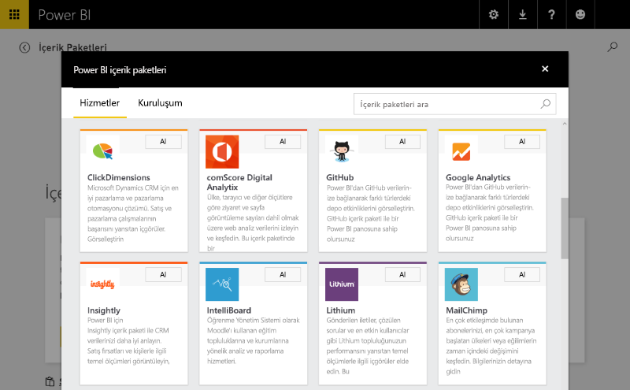
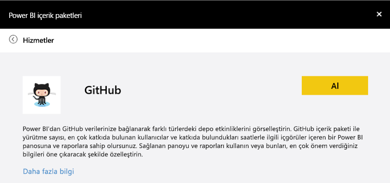
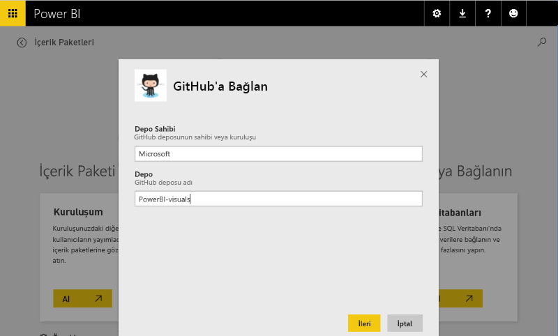
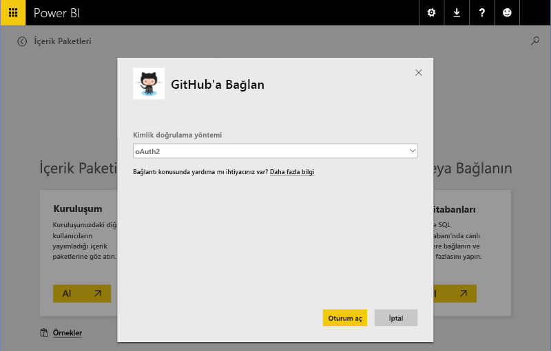
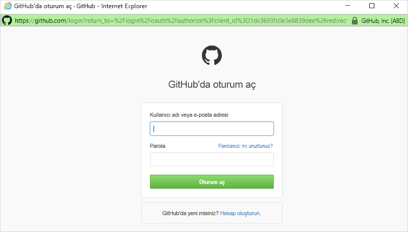
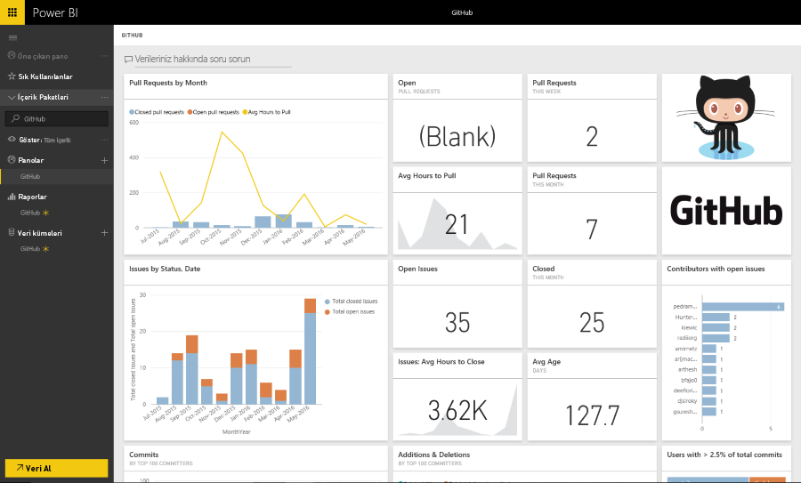

# Power BI'daki şablon içerik paketi deneyimleri
Bu bölümde, bir ISV [içerik paketine](../service-connect-to-services.md) bağlanan kullanıcıların edineceği genel deneyim açıklanmaktadır. 

https://app.powerbi.com/getdata/services (aşağıda açıklanan [GitHub içerik paketi](https://app.powerbi.com/getdata/services/github) gibi) adresindeki içerik paketine bağlanarak bağlantı deneyimini kendiniz de edinebilirsiniz.

## Bağlanma
Kullanıcı başlangıç olarak içerik paketi galerisine göz atar ve bağlanmak istediği içerik paketini seçer. İçerik paketi girişinde ad, simge ve kullanıcıyı bilgilendiren bir açıklama metni bulunur.

## Parametreler
Girişlerden birini seçen kullanıcıdan parametreleri girmesi (gerekiyorsa) istenir. Parametre iletişim kutusu, yazar tarafından içerik paketinin oluşturulması sırasında sağlanır.

Şu an için parametreler kullanıcı arabirimi oldukça basittir. Açılan listeler numaralandırılamaz ve veri girişi doğrulama işlemi normal ifadeler ile sınırlıdır.

## Kimlik bilgileri
Parametreler girildikten sonra kullanıcıdan oturum açması istenir.  Kaynak birden fazla kimlik doğrulaması türünü destekliyorsa kullanıcının uygun seçeneği belirlemesi gerekir. Kaynak OAuth gerektiriyorsa kullanıcı Oturum Aç'ı seçtiğinde hizmetin oturum açma kullanıcı arabirimi açılır.  Aksi halde, kullanıcı, kimlik bilgilerini açılan iletişim kutusuna girebilir.

## Örnek oluşturma
Oturum açma işlemi başarılı olduğunda model, raporlar ve pano olmak üzere içerik paketindeki öğeler gezinti çubuğunda görüntülenir.  Bu öğeler her bir kullanıcının hesabına eklenir.  Veriler, veri kümesini (modeli) doldurmak için zaman uyumsuz olarak yüklenir.  Bu işlemin ardından kullanıcı; panoyu, raporları ve modeli kullanmaya başlayabilir.

Varsayılan olarak, kullanıcı için günlük yenileme zamanlaması yapılandırılmıştır ve bu yenileme sonucunda modeldeki sorgular tekrar değerlendirilir.  Kullanıcıya sağlanan kimlik bilgilerinin verilerin otomatik olarak yenilenmesine izin veriyor olması gerekir.

## Araştırma ve İzleme
İçerik paketi kullanıcının hesabına aktarıldıktan sonra veriler/öngörüler üzerinde araştırma ve izleme yapılabilir.

Bunlar genellikle şu işlemleri kapsar:

* Panoyu görüntüleme ve özelleştirme.
* Raporu görüntüleme ve özelleştirme.
* Verilere soru sormak için doğal dil kullanma
* Veri modelindeki verileri araştırmak için araştırma tuvalini kullanma

Daha iyi araştırma deneyimleri sağlamak için doğal dil modellemesi (eş anlamlılar) ve anlaşılır model şeması sunmaya dikkat edilmelidir.

