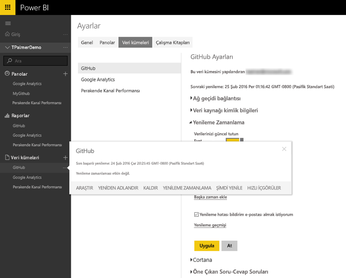
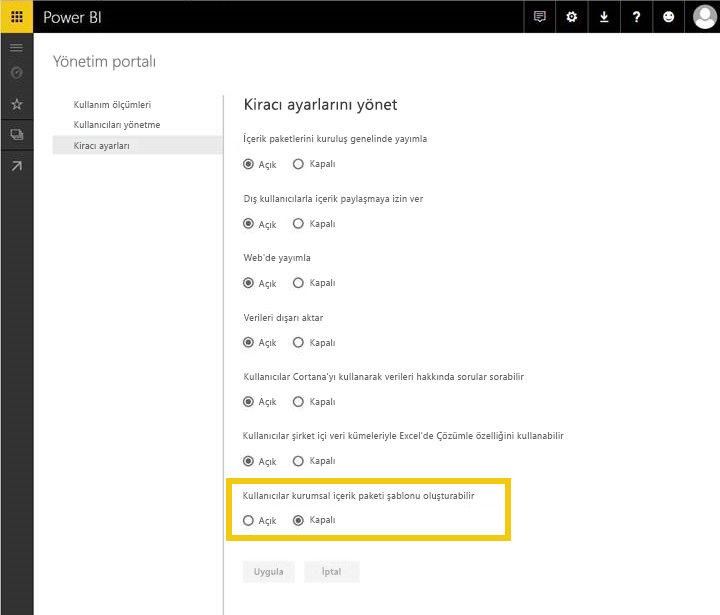
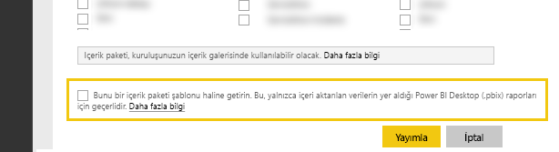

# Power BI şablon içerik paketlerini test etme
İçerik paketinizi yayımlanmak üzere göndermeden önce test edebileceğiniz birden fazla yöntem vardır.  

> [!NOTE]
> İçerik paketinizde kendi geliştirdiğiniz özel bir [Veri Bağlayıcı](https://aka.ms/DataConnectors) kullanılıyorsa veri yenileme özelliklerini veya şablon içerik paketini aşağıdaki şekilde test edemezsiniz. Bu durumda lütfen içerik paketinizi [gönderin](#submission). Power BI ekibi içerik paketinizin test edilmesi konusunda sizinle birlikte çalışacaktır.
> 
> 

## Zamanlanmış Veri Yenileme Testi
Şablon içerik paketleri bağlantı kurulduğunda müşteri verileriyle içerik paketinin örneğini oluşturmak için PowerBI.com'daki Yenileme özelliğini kullanır. İçerik paketi genel kullanıma sunulmadan önce bu akışı, oluşturduğunuz Desktop dosyasıyla test edebilirsiniz.

Dosyayı karşıya yükledikten sonra veri kümesinin yanındaki "…" simgesini ve Yenilemeyi Zamanla'yı seçin. Kaynağın kimlik bilgilerini yapılandırın. Veri kümesinin başarıyla yenilendiğinden emin olmak için "Şimdi Yenile" ve "Zamanlanmış Yenile" seçeneklerini kullanın. Yenileme işleminde hata olursa hata iletisini kontrol edip sorgularınızı ve uç sisteminizi doğrulayın.

### Yenilemeye ilişkin ek ipuçları
* Yenilemeyi zamanlama sırasında yalnızca bir veri kaynağı algılanmalıdır  
* Test bağlantısı, kullanıcınızın içerik paketini yükleyebildiğini belirtmelidir. Aksi durumda sorgularınızın ek hata durumlarını işleyebildiğinden emin olun.  
* Yenilemenin yaklaşık 5 dakika gibi makul bir süre içinde tamamlanması gerekir  

## Şablonları test etme
Şablon içerik paketi, veri kümesinde gerçek veriler içermemesi durumu haricinde mevcut çözümlere benzerdir. Bunun yerine kullanıcılar bir şablonu kullandığında veya bir şablon örneği oluşturduğunda bağlantı kurmak için parametreler ve kimlik bilgileri istenir. Bağlantı kurulduktan sonra kullanıcılar panoda, raporda ve veri kümelerinde kendi verilerini görür. 

Kullanıcının erişimi olan içerik paketini zamanlanmış yenileme dahil olmak üzere veri kümesi ayarlarına uygulaması halinde veri kümesindeki RLS ayarları içerik paketiyle birlikte **yayımlanmaz**.  

> [!NOTE]
> Şablon içerik paketlerinde yalnızca 1 pano, 1 rapor ve 1 veri kümesi bulunabilir. Lütfen [yazma](template-content-pack-authoring.md#restrictions) sayfasındaki kısıtlama listesine bakın. 
> 
> 

Kiracınız için şablon oluşturmayı etkinleştirmek üzere lütfen Power BI yöneticinizle birlikte çalışarak aşağıdaki özellik anahtarını etkinleştirin. 

Bu özellik anahtarı etkinleştirildikten sonra ["İçerik paketi oluştur"](https://app.powerbi.com/groups/me/publish-content/) bölümünün en altında kuruluşunuz için şablon içerik paketi yayımlama seçeneğini göreceksiniz. 

### Adlandırma
Panonuzu, raporunuzu ve veri kümenizi içerik paketinin tamamında tutarlı bir şekilde adlandırmanızı öneriyoruz. Adlar sabittir ve tüm kullanıcılar için aynı olacaktır. Bu sayede ürün/senaryo adınızı kullanarak müşterilerinizin daha kolay bulmasını sağlayabilirsiniz.

### Ek şablon ipuçları
* Sorgularda belirttiğiniz parametrelerin son kullanıcılarınız açısından anlamlı olduğundan emin olun
* Son kullanıcınızın zamanlanmış yenilemenin tamamlanması için bekleyeceği süreye dikkat edin

## Gönderme
[Microsoft AppSource](https://appsource.microsoft.com/en-us/partners/list-an-app) üzerinden gerçekleştirilen gönderme işlemi, şablon içerik paketinizin PowerBI.com üzerindeki hizmet içerik paketleri galerisinde yayımlanmasının yanı sıra içerik paketinizin [Microsoft AppSource](http://appsource.microsoft.com)'ta listelenmesini sağlayacaktır.

### Göndermeden önce
* İçerik paketi içindeki tüm öğelerle ilgili içerik oluşturma ipuçlarını gözden geçirin
* Çeşitli hesaplar ve veri koşullarıyla test ve bağlantı gerçekleştirin. (Kendi özel [Veri Bağlayıcınızı](https://aka.ms/DataConnectors) geliştirdiyseniz bu adımı atlayın)
* Tüm görselleri gözden geçirin, yazım hatalarına dikkat edin ve bulduklarınızı düzeltin
* İçerik paketinin Soru-Cevap özelliğine düzgün cevaplar verdiğinden emin olun. Veri modelinde en az 30 farklı soruyu test etmenizi öneririz. (Kendi özel [Veri Bağlayıcınızı](https://aka.ms/DataConnectors) geliştirdiyseniz bu adımı atlayın)

### Gönderme
Göndermeye hazır olduğunuzda AppSource'taki [Uygulama gönderme sayfasını](https://appsource.microsoft.com/en-us/partners/list-an-app) ziyaret edin ve bilgilerinizi gönderin. Kullanılabilir ürün listesinden Power BI'ı seçtiğinizden emin olun

Power BI ekibi gönderinizi inceleyecek ve tüm öğelerin gereksinimlere uygun olduğundan emin olmak için sizinle iletişime geçecektir. Paketin eksiksiz olmasının yanı sıra sağlanan panonun ve raporların kalite düzeyini de doğrulayarak uygulamada anlatılan iş senaryosuna uygun olduğundan emin olacağız.

### Güncelleştirmeler
İçerik paketinizin güncelleştirilme işlemi, ilk gönderme sürecine benzerdir. 

