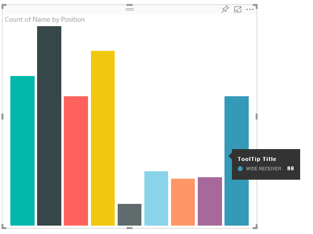
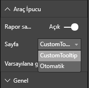

# <a name="power-bi-visuals-tooltips"></a>Power BI Görselleri Araç İpuçları

Görseller artık Power BI araç ipucu desteğini kullanabilir. Power BI araç ipuçları aşağıdaki etkileşimleri işler:

Araç ipucunu gösterme.
Araç ipucunu gizleme.
Araç ipucunu taşıma.

Araç ipuçları, belirli bir koordinat kümesinde verilen bir renk ve opaklık için bir başlık içeren bir metinsel öğe görüntüleyebilir. Bu veriler API’ye sağlanır. Power BI ana bilgisayarı, bunu yerel görseller için araç ipuçlarını işlediği şekilde işler.

Örneğin, örnek BarChart araç ipuçları.



Yukarıdaki araç ipucu tek bir çubuk kategorisini ve değerini gösterir. Tek bir araç ipucunda birden çok değer görüntüleyecek şekilde genişletilebilir.

## <a name="handling-tooltips"></a>Araç İpuçlarını İşleme

Araç ipuçlarını yönettiğiniz arabirim 'ITooltipService' olarak adlandırılır. Bu arabirim, bir araç ipucunun gösterilmesi, kaldırılması veya taşınması gerektiğini ana bilgisayara bildirmek için kullanılır.

```typescript
    interface ITooltipService {
        enabled(): boolean;
        show(options: TooltipShowOptions): void;
        move(options: TooltipMoveOptions): void;
        hide(options: TooltipHideOptions): void;
    }
```

Görselinizin, görselin içindeki fare olaylarını dinlemesi ve sonra `Tooltip****Options` nesneleri içinde uygun içerikle doldurulmuş olarak gereken şekilde `show()`, `move()` ve `hide()` temsilcilerini çağırması gerekir.
`TooltipShowOptions` ve `TooltipHideOptions`, bu olaylarda nelerin görüntüleneceğini ve nasıl davranılması gerektiğini tanımlar.
Bu yöntemlerin çağrılması fare hareketi veya dokunma olayları gibi kullanıcı olaylarını içereceğinden, bu olaylar için `TooltipService` üyelerini çağıran dinleyiciler oluşturmak iyi bir fikir olabilir.
Örneğimiz bunları `TooltipServiceWrapper` adlı bir sınıfta toplar.

### <a name="tooltipservicewrapper-class"></a>TooltipServiceWrapper sınıfı

Bu sınıfın arkasındaki temel düşünce, `TooltipService` öğesinin örneğini tutmak, ilgili öğelerin üzerinde D3 fare olaylarını dinlemek ve sonra `show()`, ve gerektiğinde `hide()` çağrıları yapmaktır.
Sınıf, bu olaylar için ilgili durumu ve mantığı barındırır ve yönetir, genellikle temel alınan D3 kodu ile arabirim kullanımı için geçerlidir. D3 arabirimi oluşturma ve dönüştürme, bu belgenin kapsamı dışındadır.

[SampleBarChart görsel deposunda](https://github.com/Microsoft/PowerBI-visuals-sampleBarChart/commit/981b021612d7b333adffe9f723ab27783c76fb14) tam örnek kodu bulabilirsiniz

### <a name="creating-tooltipservicewrapper"></a>TooltipServiceWrapper oluşturma

BarChart oluşturucusunun artık ana bilgisayar `tooltipService` örneğiyle birlikte oluşturucuda örneği oluşturulan bir `tooltipServiceWrapper` üyesi vardır.

```typescript
        private tooltipServiceWrapper: ITooltipServiceWrapper;

        this.tooltipServiceWrapper = createTooltipServiceWrapper(this.host.tooltipService, options.element);
```

`TooltipServiceWrapper` sınıfı, `tooltipService` örneğini ve görsel ve dokunma parametrelerinin kök D3 öğesini barındırır.

```typescript
    class TooltipServiceWrapper implements ITooltipServiceWrapper {
        private handleTouchTimeoutId: number;
        private visualHostTooltipService: ITooltipService;
        private rootElement: Element;
        private handleTouchDelay: number;

        constructor(tooltipService: ITooltipService, rootElement: Element, handleTouchDelay: number) {
            this.visualHostTooltipService = tooltipService;
            this.handleTouchDelay = handleTouchDelay;
            this.rootElement = rootElement;
        }
        .
        .
        .
    }
```

Bu sınıfın olay dinleyicilerini kaydetmesi için tek giriş noktası `addTooltip` yöntemidir.

### <a name="addtooltip-method"></a>addTooltip yöntemi

```typescript
        public addTooltip<T>(
            selection: d3.Selection<Element>,
            getTooltipInfoDelegate: (args: TooltipEventArgs<T>) => VisualTooltipDataItem[],
            getDataPointIdentity: (args: TooltipEventArgs<T>) => ISelectionId,
            reloadTooltipDataOnMouseMove?: boolean): void {

            if (!selection || !this.visualHostTooltipService.enabled()) {
                return;
            }
        ...
        ...
        }
```

* **seçim: d3.Selection<Element>**
* Araç ipuçlarının işlendiği d3 öğeleri
* **getTooltipInfoDelegate: (args: TooltipEventArgs<T>) => VisualTooltipDataItem[]**
* Bağlam başına araç ipucu içeriğini (görüntülenen öğeler) doldurmak için temsilci
* **getDataPointIdentity: (args: TooltipEventArgs<T>) => ISelectionId**
* Veri noktası kimliğini alma temsilcisi - bu örnekte kullanılmıyor 
* **reloadTooltipDataOnMouseMove?: boolean**
* bir mouseMove olayı sırasında araç ipucu verisinin yenilenip yenilenmeyeceğini belirten boolean - bu örnekte kullanılmıyor

görebileceğiniz gibi, `tooltipService` devre dışı bırakıldığında veya gerçek seçim olmadığında `addTooltip` eylem olmadan çıkış yapar.

### <a name="call-of-show-method-to-display-a-tooltip"></a>Bir araç ipucunu görüntülemek için gösterme yönteminin çağrısı

`addTooltip` daha sonra D3 `mouseover` olayını dinler.

```typescript
        ...
        ...
        selection.on("mouseover.tooltip", () => {
            // Ignore mouseover while handling touch events
            if (!this.canDisplayTooltip(d3.event))
                return;

            let tooltipEventArgs = this.makeTooltipEventArgs<T>(rootNode, true, false);
            if (!tooltipEventArgs)
                return;

            let tooltipInfo = getTooltipInfoDelegate(tooltipEventArgs);
            if (tooltipInfo == null)
                return;

            let selectionId = getDataPointIdentity(tooltipEventArgs);

            this.visualHostTooltipService.show({
                coordinates: tooltipEventArgs.coordinates,
                isTouchEvent: false,
                dataItems: tooltipInfo,
                identities: selectionId ? [selectionId] : [],
            });
        });
```

* **makeTooltipEventArgs**
* Seçili D3 öğelerinden bir tooltipEventArgs içine bağlamı ayıklar. Koordinatları da hesaplar.
* **getTooltipInfoDelegate**
* Ardından araç ipucu içeriğini tooltipEventArgs’tan oluşturur. Bu, görselin mantığı olduğundan BarChart sınıfına bir geri aramadır. Bu, araç ipucunda görüntülenecek olan gerçek metin içeriğidir.
* **getDataPointIdentity**
* Bu örnekte kullanılmıyor
* **this.visualHostTooltipService.show**
* Araç ipucunu görüntüleme çağrısı  

Ek işleme `mouseout` ve `mousemove` olayları için örnekte bulunabilir.

Daha fazla bilgi için bkz. [SampleBarChart görsel deposu](https://github.com/Microsoft/PowerBI-visuals-sampleBarChart/commit/981b021612d7b333adffe9f723ab27783c76fb14).

### <a name="populating-the-tooltip-content-by-gettooltipdata-method"></a>getTooltipData yönteminin araç ipucu içeriğini doldurma

`BarChart` veri noktasının kategorisini, değerini ve rengini bir VisualTooltipDataItem[] öğesi olarak ayıklayan üye bir `getTooltipData` ile eklendi.

```typescript
        private static getTooltipData(value: any): VisualTooltipDataItem[] {
            return [{
                displayName: value.category,
                value: value.value.toString(),
                color: value.color,
                header: 'ToolTip Title'
            }];
        }
```

Yukarıdaki uygulamada, `header` üyesi sabittir ancak dinamik değerler gerektiren daha karmaşık uygulamalar için kullanılabilir. `VisualTooltipDataItem[]` öğesinin birden fazla öğe ile doldurabilirsiniz; bu, araç ipucuna birden çok satır ekler. Araç ipucunun tek bir veri noktasından fazla veri görüntüleyebildiği yığılmış çubuk grafikleri gibi görsellerde faydalı olabilir.

### <a name="calling-addtooltip-method"></a>addTooltip yöntemini çağırma

Son adım, gerçek veriler değişebileceği zaman `addTooltip` çağırmaktır. Bu çağrı `BarChart.update()` yönteminde gerçekleşir. Bu nedenle, tüm 'bar' öğelerinin seçimini izlemek için bir çağrı yapılır ve yalnızca yukarıda bahsedildiği gibi `BarChart.getTooltipData()` geçirilir.

```typescript
        this.tooltipServiceWrapper.addTooltip(this.barContainer.selectAll('.bar'),
            (tooltipEvent: TooltipEventArgs<number>) => BarChart.getTooltipData(tooltipEvent.data),
            (tooltipEvent: TooltipEventArgs<number>) => null);
```

## <a name="adding-report-page-tooltips"></a>Rapor Sayfası Araç İpuçlarını Ekleme

Rapor sayfası araç ipuçları desteği eklemek için çoğu değişiklik, capabilities.json’de bulunur.

Örnek bir şema

```json
{
    "tooltips": {
        "supportedTypes": {
            "default": true,
            "canvas": true
        },
        "roles": [
            "tooltips"
        ]
    }
}
```

Rapor sayfası araç ipuçları tanımı Biçim bölmesinde yapılabilir.



`supportedTypes`, görsel tarafından desteklenen araç ipuçları yapılandırmasıdır ve alan üzerinde yansıtılmıştır. `default`, veri alanı aracılığıyla "otomatik" araç ipuçları bağlamasının desteklenip desteklenmediğini belirtir. tuval, rapor sayfası araç ipuçlarının desteklenip desteklenmediğini belirtir.

`roles` isteğe bağlıdır. Tanımlandıktan sonra, alanlarda seçili araç ipucu seçeneğine hangi veri rollerinin bağlanacağını bildirir.

Daha fazla bilgi için [Rapor Sayfası Araç İpuçları](https://powerbi.microsoft.com/blog/power-bi-desktop-march-2018-feature-summary/#tooltips) Rapor Sayfası Araç İpuçları kullanım yönergelerine bakın

`ITooltipService.Show(options: TooltipShowOptions)` veya `ITooltipService.Move(options: TooltipMoveOptions)`çağırma sırasında rapor sayfası araç ipucunu görüntülemek için Power BI ana bilgisayarı, selectionId’yi (yukarıdaki `options` bağımsız değişkeninin `identities` özelliği) kullanır. SelectionId, araç ipucu tarafından alınması için üzerine geldiğiniz öğenin seçili verilerini (kategori, seri vb.) temsil etmelidir.

Araç ipucu görüntüleme çağrılarına selectionId gönderme örneği:

```typescript
    this.tooltipServiceWrapper.addTooltip(this.barContainer.selectAll('.bar'),
        (tooltipEvent: TooltipEventArgs<number>) => BarChart.getTooltipData(tooltipEvent.data),
        (tooltipEvent: TooltipEventArgs<number>) => tooltipEvent.data.selectionID);
```
