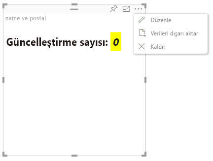

# Power BI görsellerinde gelişmiş düzenleme modu

Power BI görselinizde gelişmiş kullanıcı arabirimi denetimlerine ihtiyacınız varsa, gelişmiş düzenleme modundan yararlanabilirsiniz. Rapor düzenleme modundayken **Düzenle** düğmesini seçerek düzenleme modunu **Gelişmiş** olarak ayarlayabilirsiniz. Görsel bu kullanıcı arabirimi düğmesini görüntüleyip görüntülemeyeceğini belirlemek için `EditMode` bayrağını kullanabilir.

Varsayılan olarak, görseller gelişmiş düzenleme modunu desteklemez. Farklı bir davranış gerekirse, `advancedEditModeSupport` özelliği ayarlanarak görselin *capabilities.json* dosyasında bunu açıkça belirtmelisiniz.

Olası değerler şunlardır:

- `0` - NotSupported

- `1` - SupportedNoAction

- `2` - SupportedInFocus

## Gelişmiş düzenleme moduna girme

Aşağıdaki durumlarda **Düzenle** düğmesi görüntülenir:

* *Capabilities.json* dosyasında `advancedEditModeSupport` özelliği `SupportedNoAction` veya `SupportedInFocus` olarak ayarlanmıştır.

* Görsel rapor düzenlemesi modunda görüntüleniyordur.

*Capabilities.json* dosyasında `advancedEditModeSupport` özelliği yoksa veya `NotSupported` olarak ayarlanmışsa, **Düzenle** düğmesi görüntülenmez.

**Düzenle**’yi seçtiğinizde görsel EditMode öğesinin `Advanced` olarak ayarlandığı bir update() çağrısı alır. *Capabilities.json* dosyasında ayarlanan değere bağlı olarak aşağıdaki eylemler gerçekleşir:

* `SupportedNoAction` Konak için başka eylem gerekmez.
* `SupportedInFocus` Konak görseli odak moduna geçirir.

## Gelişmiş düzenleme modundan çıkma

Aşağıdaki durumlarda **Rapora geri dön** düğmesi görüntülenir:

* *Capabilities.json* dosyasında `advancedEditModeSupport` özelliği `SupportedInFocus` olarak ayarlanmıştır.
