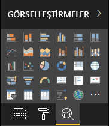

# <a name="the-analytics-pane-in-power-bi-visuals"></a>Power BI görsellerinde Analiz bölmesi

**Analiz**  bölmesi Kasım 2018’de [yerel görseller](../../transform-model/desktop-analytics-pane.md) için kullanıma sunuldu.
Bu makalede Power BI görsellerinin API v2.5.0 ile özelliklerini **Analiz** bölmesinde nasıl gösterebildiği ve yönetebildiği açıklanır.



## <a name="manage-the-analytics-pane"></a>Analiz bölmesini yönetme

Aynı [**Biçim** bölmesindeki özellikleri yönettiğiniz gibi](./custom-visual-develop-tutorial-format-options.md), görselin *capabilities.json* dosyasında bir nesne tanımlayarak **Analiz** bölmesini de yönetebilirsiniz.

**Analiz** bölmesinin farklılıkları şunlardır:

* Nesnenin tanımının altına değeri 2 olan bir **objectCategory** alanı eklersiniz.

    > [!NOTE]
    > İsteğe bağlı `objectCategory` alanı API 2.5.0’da eklenmiştir. Nesnenin denetlediği görselin görünüşünü tanımlar (1 = Biçimlendirme, 2 = Analiz). `Formatting` genel görünüm, renkler, eksenler ve etiketler gibi öğeler için kullanılır. `Analytics` tahminler, eğilim çizgileri, başvuru çizgileri ve şekiller gibi öğeler için kullanılır.
    >
    > Değer belirtilmezse `objectCategory` için varsayılan olarak "Formatting" kullanılır.

* Nesnenin aşağıdaki iki özelliği olmalıdır:
    * `show`, `bool` türündedir ve `false` varsayılan değerine sahiptir.
    * `displayName`, `text` türündedir. Seçtiğiniz varsayılan değer, örneğin ilk görünen adı olur.

```json
{
  "objects": {
    "YourAnalyticsPropertiesCard": {
      "displayName": "Your analytics properties card's name",
      "objectCategory": 2,
      "properties": {
        "show": {
          "type": {
            "bool": true
          }
        },
        "displayName": {
          "type": {
            "text": true
          }
        },
      ... //any other properties for your Analytics card
      }
    }
  ...
  }
}
```

Diğer özellikleri aynı **Format** nesnelerinde yaptığınız gibi tanımlayabilirsiniz. Ayrıca nesneleri **Biçim** bölmesinde yaptığınız gibi numaralandırabilirsiniz.

## <a name="known-limitations-and-issues-of-the-analytics-pane"></a>Analiz bölmesinin bilinen sınırlamaları ve sorunları

* **Analiz** bölmesinde henüz birden çok örnek desteği yoktur. Nesnelerin statik dışında farklı bir [seçicisi](https://microsoft.github.io/PowerBI-visuals/docs/concepts/objects-and-properties/#selector) olamaz (bu da “selector”: null olur) ve Power BI görsellerinde bir kartın kullanıcı tanımlı birden fazla örneği bulunamaz.
* `integer` türündeki özellikler doğru şekilde görüntülenmiyor. Bunun yerine, geçici bir çözüm olarak `numeric` türünü kullanın.

> [!NOTE]
> * **Analiz** bölmesini yalnızca yeni bilgiler ekleyen veya sunulan bilgilere farklı bir bakış açısı getiren nesneler için kullanın (örneğin önemli eğilimlere ışık tutan dinamik başvuru satırları).
> * Görselin görünüm ve kullanımını denetleyen tüm seçenekler (biçimlendirme) **Biçimlendirme** bölmesiyle sınırlandırılmalıdır.