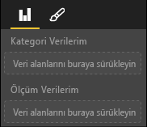

# <a name="capabilities-and-properties-of-power-bi-visuals"></a>Power BI görsellerinin yetenekleri ve özellikleri 

Konağa görseliniz hakkında bilgi sağlamak için yetenekleri kullanırsınız. Yetenekler modelindeki tüm özellikler `optional` özelliktir.

Görselin yeteneklerinin kök nesneleri `dataRoles` ve `dataViewMappings` gibi nesnelerdir.

```json
{
    "dataRoles": [ ... ],
    "dataViewMappings": [ ... ],
    "objects":  { ... },
    "supportsHighlight": true|false,
    "advancedEditModeSupport": 0|1|2,
    "sorting": { ... }
}

```

## <a name="define-the-data-fields-that-your-visual-expects-dataroles"></a>Görselinizin beklediği veri alanlarını tanımlama: dataRoles

Verilere bağlı olabilecek alanları tanımlamak için `dataRoles` nesnesini kullanırsınız. `dataRoles`, gerekli özellikleri tanımlayan bir dizi `DataViewRole` nesnesini alır.

### <a name="properties"></a>Özellikler

* **name**: Bu veri alanının iç adı (benzersiz olmalıdır).
* **kind**: Alanın türü:
    * `Grouping` Ölçü alanlarını gruplandırmak için kullanılan farklı değerler.
    * `Measure` Sayısal veri değerleri.
    * `GroupingOrMeasure` Gruplandırma veya ölçü olarak kullanılabilecek değerler.
* **displayName**: **Özellikler** bölmesinde kullanıcıya görüntülenen ad.
* **description**: Alanın kısa açıklaması (isteğe bağlı).
* **requiredTypes**: Bu veri rolü için gerekli veri türü. Eşleşmeyen değerler null olarak ayarlanır (isteğe bağlı).
* **preferredTypes**: Bu veri türü için tercih edilen veri türü (isteğe bağlı).

### <a name="valid-data-types-in-requiredtypes-and-preferredtypes"></a>requiredTypes ve preferredTypes özelliklerinde geçerli veri türleri

* **bool**: Boole değeri
* **integer**: Tamsayı değeri
* **numeric**: Sayısal değer
* **text**: Metin değeri
* **geography**: Coğrafi veri

### <a name="example"></a>Örnek

```json
"dataRoles": [
    {
        "displayName": "My Category Data",
        "name": "myCategory",
        "kind": "Grouping",
        "requiredTypes": [
            {
                "text": true
            },
            {
                "numeric": true
            },
            {
                "integer": true
            }
        ],
        "preferredTypes": [
            {
                "text": true
            }
        ]
    },
    {
        "displayName": "My Measure Data",
        "name": "myMeasure",
        "kind": "Measure",
        "requiredTypes": [
            {
                "integer": true
            },
            {
                "numeric": true
            }
        ],
        "preferredTypes": [
            {
                "integer": true
            }
        ]
    },
    {
        "displayNameKey": "Visual_Location",
        "name": "Locations",
        "kind": "Measure",
        "displayName": "Locations",
        "requiredTypes": [
            {
                "geography": {
                    "address": true
                }
            },
            {
                "geography": {
                    "city": true
                }
            },
            {
                "geography": {
                    "continent": true
                }
            },
            {
                "geography": {
                    "country": true
                }
            },
            {
                "geography": {
                    "county": true
                }
            },
            {
                "geography": {
                    "place": true
                }
            },
            {
                "geography": {
                    "postalCode": true
                }
            },
            {
                "geography": {
                    "region": true
                }
            },
            {
                "geography": {
                    "stateOrProvince": true
                }
            }
        ]
    }
]
```

Önceki veri rolleri aşağıdaki resimde görüntülenen alanları oluşturabilir:



## <a name="define-how-you-want-the-data-mapped-dataviewmappings"></a>Verilerin nasıl eşlenmesini istediğinizi tanımlama: dataViewMappings

DataViewMappings özelliği veri rollerinin birbirleriyle ilişkisini açıklar ve bunlar için koşullu gereksinimleri belirtmenize olanak tanır.

Çoğu görselde tek bir eşleme sağlanır, ancak birden çok dataViewMappings sağlayabilirsiniz. Her geçerli eşleme bir veri görünümü oluşturur. 

```json
"dataViewMappings": [
    {
        "conditions": [ ... ],
        "categorical": { ... },
        "table": { ... },
        "single": { ... },
        "matrix": { ... }
    }
]
```

Daha fazla bilgi için bkz. [Power BI görsellerinde veri görünümü eşlemesini anlama](dataview-mappings.md).

## <a name="define-property-pane-options-objects"></a>Özellik bölmesi seçeneklerini tanımlama: objects

Nesneler, görselle ilişkilendirilmiş olan özelleştirilebilir özellikleri tanımlar. Her nesnenin birden çok özelliği olabilir ve her özelliğin kendisiyle ilişkilendirilmiş bir türü vardır. Türler, özelliğin ne olacağını ifade eder. 

```json
"objects": {
    "myCustomObject": {
        "displayName": "My Object Name",
        "properties": { ... }
    }
}
```

Daha fazla bilgi için bkz. [Power BI görsellerinin nesneleri ve özellikleri](objects-properties.md).

## <a name="handle-partial-highlighting-supportshighlight"></a>Kısmi vurgulamayı işleme: supportsHighlight

Varsayılan olarak bu değer `false` değerine ayarlanmıştır. Bu ayar sayfada herhangi bir şey seçildiğinde değerlerinizin otomatik olarak filtreleneceği anlamına gelir. Bu otomatik filtreleme de görselinizi yalnızca seçili değeri görüntüleyecek şekilde güncelleştirir. Tüm verileri görüntülemek ama yalnızca seçili öğeleri vurgulamak istiyorsanız, *capabilities.json* dosyanızda `supportsHighlight` öğesini `true` olarak ayarlamanız gerekir.

Daha fazla bilgi için bkz. [Power BI görsellerinde veri noktalarını vurgulama](highlight.md).

## <a name="handle-advanced-edit-mode-advancededitmodesupport"></a>Gelişmiş düzenleme modunu işleme: advancedEditModeSupport

Bir görsel gelişmiş düzenleme modunu desteklediğini bildirebilir. Varsayılan olarak, *capabilities.json* dosyasında aksi belirtilmediği sürece görseller gelişmiş düzenleme modunu desteklemez.

Daha fazla bilgi için bkz. [Power BI görsellerinde gelişmiş düzenleme modu](advanced-edit-mode.md).

## <a name="data-sorting-options-for-visual-sorting"></a>Görsel için veri sıralama seçenekleri: sorting

Görsel, kendi özelliklerini kullanarak sıralama davranışını tanımlayabilir. Varsayılan olarak, *capabilities.json* dosyasında aksi belirtilmediği sürece görseller sıralama düzeninin değiştirilmesini desteklemez.

Daha fazla bilgi için bkz. [Power BI görselleri için sıralama seçenekleri](sort-options.md).
