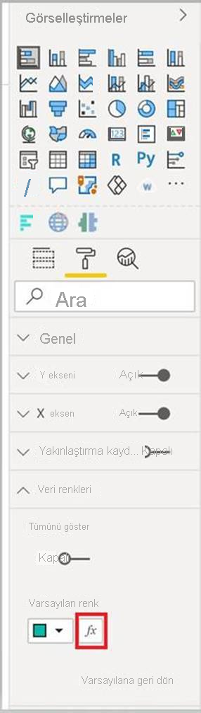

# <a name="add-conditional-formatting"></a>Koşullu biçimlendirme ekleme

[Koşullu biçimlendirme](../../visuals/service-tips-and-tricks-for-color-formatting.md#conditional-formatting-for-visualizations), rapor oluşturucunun bir sayısal değere göre raporda hangi renklerin görüntüleneceğini belirtmesine olanak sağlar.

Bu makalede Power BI görselinize koşullu biçimlendirme işlevinin nasıl ekleneceği açıklanır.

Koşullu biçimlendirme yalnızca aşağıdaki özellik türlerine uygulanabilir:
* Renk
* Metin
* Simge
* Web URL'si

## <a name="add-conditional-formatting-to-your-project"></a>Projenize koşullu biçimlendirme ekleme

Bu bölümde mevcut Power BI görseline koşullu biçimlendirmenin nasıl ekleneceği gösterilir. Bu makaledeki örnek kod, [SampleBarChart](https://github.com/microsoft/PowerBI-visuals-sampleBarChart) görselini temel alır. [barChart.ts](https://github.com/microsoft/PowerBI-visuals-sampleBarChart/blob/master/src/barChart.ts) dosyasında kaynak kodu inceleyebilirsiniz.

### <a name="add-a-conditional-color-formatting-entry-in-the-format-pane"></a>Biçim bölmesinde koşullu renk biçimlendirmesi girdisi ekleme

Bu bölümde, biçim bölmesinde bir veri noktasına koşullu renk biçimlendirme girdisi eklemeyi öğreneceksiniz.

1. `powerbi-visuals-api` tarafından kullanıma sunulan `VisualObjectInstance` içindeki `propertyInstanceKind` dizisini kullanacaksınız. İlk adımınız dosyanızın şu içeri aktarmayı içerdiğini doğrulamaktır:

    ```typescript
    import powerbiVisualsApi from "powerbi-visuals-api";
    ```

2. Uygun biçimlendirme türünü (*Constant*, *ConstantOrRule* veya *Rule*) belirtmek için `VisualEnumerationInstanceKinds` sabit listesini kullanacaksınız. Aşağıdaki içeri aktarmayı dosyanıza ekleyin:

    ```typescript
    import VisualEnumerationInstanceKinds = powerbiVisualsApi.VisualEnumerationInstanceKinds;
    ```

3. `propertyInstanceKind` dizisinin altında, koşullu biçimlendirmenin desteklenmesini istediğiniz tüm özellikleri listeleyin. Bu özellikleri `enumerateObjectInstances` yönteminde tanımlayın.

    ```typescript
    public enumerateObjectInstances(options: EnumerateVisualObjectInstancesOptions): VisualObjectInstanceEnumeration {
            …
            case 'colorSelector':
                …
                    objectEnumeration.push({
                        objectName: objectName,
                        displayName: barDataPoint.category,
                        properties: {
                            fill: {
                                solid: {
                                    color: barDataPoint.color
                                }
                            }
                        },
                        selector: dataViewWildcard.createDataViewWildcardSelector(dataViewWildcard.DataViewWildcardMatchingOption.InstancesAndTotals),
                        altConstantValueSelector: barDataPoint.selectionId.getSelector(),

                        // List your conditional formatting properties
                        propertyInstanceKind: {
                            fill: VisualEnumerationInstanceKinds.ConstantOrRule
                        }
                    });
                }
            …
    }

    ```

    `VisualEnumerationInstanceKinds.ConstantOrRule` koşullu biçimlendirme UI girdisini, sabit biçimlendirme UI öğesiyle birlikte oluşturur.

    >[!div class="mx-imgBorder"]
    >

### <a name="define-how-conditional-formatting-behaves"></a>Koşullu biçimlendirmenin davranışını tanımlama

Biçimlendirmenin veri noktalarınıza nasıl uygulanacağını tanımlayın.

`powerbi-visuals-utils-dataviewutils` altında bildirilen `createDataViewWildcardSelector` öğesini kullanarak koşullu biçimlendirmenin örneklere, toplamlara veya her ikisine nasıl uygulanacağını belirtin. Daha fazla bilgi için bkz. [DataViewWildcard](utils-dataview.md#).

`enumerateObjectInstances` öğesinde, koşullu biçimlendirmeyi uygulamak istediğiniz nesnelerde aşağıdaki değişiklikleri yapın:

 * `selector` değerini `dataViewWildcard.createDataViewWildcardSelector(dataViewWildcardMatchingOption)` çağrısıyla değiştirin. `DataViewWildcardMatchingOption`, koşullu biçimlendirmenin örneklere mi, toplamlara mı yoksa her ikisine de mi uygulanacağını tanımlar.

* Daha önce `selector` özelliği için tanımlanmış olan değerle `altConstantValueSelector` özelliğini ekleyin.

```typescript
case 'colorSelector':
         …
            objectEnumeration.push({
                objectName: objectName,
                displayName: barDataPoint.category,
                properties: {
                    fill: {
                        solid: {
                            color: barDataPoint.color
                        }
                    }
                },

                // Define whether the conditional formatting will apply to instances, totals, or both
                selector: dataViewWildcard.createDataViewWildcardSelector(dataViewWildcard.DataViewWildcardMatchingOption.InstancesAndTotals),

                // Add this property with the value previously defined for the selector property
                altConstantValueSelector: barDataPoint.selectionId.getSelector(),

                propertyInstanceKind: { 
                    fill: VisualEnumerationInstanceKinds.ConstantOrRule
                }
            });
        }

```

## <a name="next-steps"></a>Sonraki adımlar

[DataViewUtils](utils-dataview.md) makalesini inceleyin.