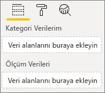
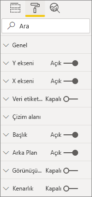
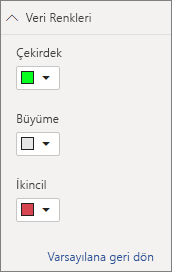

# <a name="build-a-bar-chart"></a>Çubuk grafik oluşturma

Bu makale, kod içeren bir örnek Power BI çubuk grafiği görseli oluşturmaya yönelik adım adım kılavuzdur. Kod örneğinin tamamını [https://github.com/Microsoft/PowerBI-visuals-sampleBarChart](https://github.com/Microsoft/PowerBI-visuals-sampleBarChart) adresinden alabilirsiniz.

## <a name="view-model"></a>Modeli görüntüleme
Öncelikle çubuk grafiği görünümü modelini tanımlamak ve siz oluşturdukça görselinizde kullanıma açılanlar üzerinde gezinmek önemlidir.

```typescript
/**
 * Interface for BarCharts viewmodel.
 *
 * @interface
 * @property {BarChartDataPoint[]} dataPoints - Set of data points the visual will render.
 * @property {number} dataMax                 - Maximum data value in the set of data points.
 */
interface BarChartViewModel {
    dataPoints: BarChartDataPoint[];
    dataMax: number;
};

/**
 * Interface for BarChart data points.
 *
 * @interface
 * @property {number} value    - Data value for the point.
 * @property {string} category - Corresponding category of the data value.
 */
interface BarChartDataPoint {
    value: number;
    category: string;
};
```

### <a name="use-static-data"></a>Statik verileri kullanma

Statik verilerin kullanılması, veri bağlama olmaksızın görselinizi test etmenin harika bir yoludur. Daha sonraki aşamada veri bağlama ekleseniz bile görünüm modeliniz değişmez.

```typescript
let testData: BarChartDataPoint[] = [
    {
        value: 10,
        category: 'a'
    },
    {
        value: 20,
        category: 'b'
    },
    {
        value: 1,
        category: 'c'
    },
    {
        value: 100,
        category: 'd'
    },
    {
        value: 500,
        category: 'e'
    }];

let viewModel: BarChartViewModel = {
    dataPoints: testData,
    dataMax: d3.max(testData.map((dataPoint) => dataPoint.value))
};
```

## <a name="data-binding"></a>Veri bağlama 
*Capabilities.json* dosyasındaki görsel özelliklerinizi tanımlayarak veri bağlama ekleyebilirsiniz. Örnek kodda zaten kullanabileceğiniz bir şema vardır.

Veri bağlama, Power BI’da **Alan** yuvasında çalışır.



### <a name="add-data-roles"></a>Veri rolleri ekleme
Örnek kodda zaten veri rolleri vardır, ancak bunları özelleştirebilirsiniz.

- `displayName`, **Alan** yuvasında görüntülenen addır.
- `name`, veri rolüne başvurmak için kullanılan iç addır.
- `kind`, alan türüdür. *Gruplandırma* alanlarında (0) ayrık değer yer alır. *Ölçüm* alanlarında (1) sayısal veri değeri yer alır.

```json
"dataRoles": [
    {
        "displayName": "Category Data",
        "name": "category",
        "kind": 0
    },
    {
        "displayName": "Measure Data",
        "name": "measure",
        "kind": 1
    }
],
```

Daha fazla bilgi için bkz. [Veri rolleri](./capabilities.md#define-the-data-fields-that-your-visual-expects-dataroles).

### <a name="add-conditions-to-dataviewmapping"></a>DataViewMapping’e koşullar ekleme
Her alanın kaç alan bağlayabileceğini ayarlamak için `dataViewMappings` içinde koşullar tanımlayın. Her alana başvurmak için veri rolünün iç `name` öğesini kullanın.

```json
    "dataViewMappings": [
        {
            "conditions": [
                {
                    "category": {
                        "max": 1
                    },
                    "measure": {
                        "max": 1
                    }
                }
            ],
        }
    ]
```

Daha fazla bilgi için bkz. [Veri görünümü eşlemesi](./dataview-mappings.md).

### <a name="define-and-use-visualtransform"></a>VisualTransform tanımlama ve kullanma
`DataView`, görselleştirilecek olan sorgulanmış verileri içeren, Power BI’ın görselinize sağladığı yapıdır. Ancak `DataView`, verileri kategorik ve tablosal gibi farklı biçimlerde sağlayabilir. Çubuk grafiği gibi kategorik bir görsel oluşturmak için yalnızca kategorik özelliğini `DataView` üzerinde kullanmanız gerekir. `visualTransform` öğesini tanımlamak, `DataView` öğesini görselinizin kullanacağı bir görünüm modeline dönüştürmenize olanak verir.

Renkler atayıp bunları tek veri noktaları tanımlarken seçmek için `IVisualHost` kullanırsınız. 

```typescript
/**
 * Function that converts queried data into a view model that will be used by the visual
 *
 * @function
 * @param {VisualUpdateOptions} options - Contains references to the size of the container
 *                                        and the dataView which contains all the data
 *                                        the visual had queried.
 * @param {IVisualHost} host            - Contains references to the host which contains services
 */
function visualTransform(options: VisualUpdateOptions, host: IVisualHost): BarChartViewModel {
    /*Convert dataView to your viewModel*/
}

```

## <a name="color"></a>Renk 
Renk, `IVisualHost` üzerinde kullanılabilen hizmetlerden biri olarak sunulur.

### <a name="add-color-to-data-points"></a>Veri noktalarına renk ekleme
Her veri noktası farklı bir renkle gösterilir. Renkleri `BarChartDataPoint` arabirimine eklersiniz.

```typescript
/**
 * Interface for BarChart data points.
 *
 * @interface
 * @property {number} value    - Data value for the point.
 * @property {string} category - Corresponding category of the data value.
 * @property {string} color    - Color corresponding to the data point.
 */
interface BarChartDataPoint {
    value: number;
    category: string;
    color: string;
};
```

### <a name="the-colorpalette-service"></a>ColorPalette hizmeti
`colorPalette` hizmeti, görselinizde kullanılan renkleri yönetir. Bu hizmetin örneği `IVisualHost` üzerinde sunulur.

### <a name="assign-color-to-data-points"></a>Veri noktalarına renk atama
`dataView` öğesini çubuk grafiğinin kullanabileceği bir görünüm modeline dönüştürmek için `visualTransform` öğesini yapı olarak tanımladınız. `visualTransform` veri noktalarında gezindiğinizden, burası renkleri atamak için ideal bir yerdir.

```typescript
let colorPalette: IColorPalette = host.colorPalette; // host: IVisualHost
for (let i = 0, len = Math.max(category.values.length, dataValue.values.length); i < len; i++) {
    barChartDataPoints.push({
        category: category.values[i],
        value: dataValue.values[i],
        color: colorPalette.getColor(category.values[i]).value,
    });
}
```

## <a name="selection-and-interactions"></a>Seçim ve etkileşimler
Seçim, kullanıcıların hem sizin görselinizle hem de diğer görsellerle etkileşim kurmasına olanak verir. 

### <a name="add-selection-to-each-data-point"></a>Her veri noktasına seçim ekleme
Her veri noktası benzersiz olduğundan, bunların her birine seçim ekleyin. Seçim özelliğini `BarChartDataPoint` arabiriminden eklersiniz.

```typescript
/**
 * Interface for BarChart data points.
 *
 * @interface
 * @property {number} value             - Data value for the point.
 * @property {string} category          - Corresponding category of data value.
 * @property {string} color             - Color corresponding to data point.
 * @property {ISelectionId} selectionId - Id assigned to data point for cross filtering
 *                                        and visual interaction.
 */
interface BarChartDataPoint {
    value: number;
    category: string;
    color: string;
    selectionId: ISelectionId;
};
```

### <a name="assign-selection-ids-to-each-data-point"></a>Her veri noktasına seçim kimlikleri ekleme
`visualTransform` veri noktalarında gezindiğinizden, burası seçim kimliklerini oluşturmak için ideal bir yerdir. Ana bilgisayar değişkeni renk ve seçim oluşturucusu gibi görselin kullanabileceği hizmetleri içeren `IVisualHost` öğesidir. 

Yeni seçim kimliği oluşturmak için `IVisualHost` üzerinde `createSelectionIdBuilder` üreteç kimliğini kullanın. Her veri noktası için yeni bir seçim oluşturucusu oluşturun.

Yalnızca kategoriye göre seçimler yaptığınızdan, yalnızca `withCategory` seçimleri tanımlamanız gerekir.

```typescript
for (let i = 0, len = Math.max(category.values.length, dataValue.values.length); i < len; i++) {
    barChartDataPoints.push({
        category: category.values[i],
        value: dataValue.values[i],
        color: colorPalette.getColor(category.values[i]).value,
        selectionId: host.createSelectionIdBuilder()
            .withCategory(category, i)
            .createSelectionId()
    });
}
```

Daha fazla bilgi için bkz. [Seçim oluşturucusunun örneğini oluşturma](./selection-api.md#create-an-instance-of-the-selection-builder).

### <a name="interact-with-data-points"></a>Veri noktalarıyla etkileşim kurma
Veri noktasına bir seçim kimliği atandıktan sonra çubuk grafiğinin her çubuğuyla etkileşim kurabilirsiniz. Çubuk grafiği `click` olaylarını dinler.

Çapraz filtrelemeye ve seçimleri temizlemeye yönelik bir seçim yöneticisi oluşturmak için `IVisualHost` üzerinde `selectionManager` üreteç yöntemini kullanın.

```typescript
let selectionManager = this.selectionManager;

//This must be an anonymous function instead of a lambda because
//d3 uses 'this' as the reference to the element that was clicked.
bars.on('click', function(d) {
    selectionManager.select(d.selectionId).then((ids: ISelectionId[]) => {
        bars.attr({
            'fill-opacity': ids.length > 0 ? BarChart.Config.transparentOpacity : BarChart.Config.solidOpacity
        });

        d3.select(this).attr({
            'fill-opacity': BarChart.Config.solidOpacity
        });
    });

    (<Event>d3.event).stopPropagation();
});
```

Daha fazla bilgi için bkz. [SelectionManager’ı kullanma](./selection-api.md#how-to-use-selectionmanager-to-select-data-points).

## <a name="static-objects"></a>Statik nesneler

Görseli daha fazla özelleştirmek için **Özellik** sekmesine nesneler ekleyebilirsiniz. Bu özelleştirmeler kullanıcı arabirimi değişiklikleri veya sorgulanan verilerle ilgili değişiklikler olabilir. Örnek, çubuk grafiğinde X eksenini işlemek için statik nesneler kullanır.

**Özellik** bölmesinde nesneleri açıp kapatabilir veya devre dışı bırakabilirsiniz.



### <a name="define-objects-in-capabilities"></a>Özelliklerdeki nesneleri tanımlama
**Özellik** bölmesinde görüntülenecek nesneler için *capabilities.json* dosyanızda bir `objects` özelliği tanımlayın.
- `enableAxis`, `dataView` öğesinin başvurduğu iç addır. 
- `displayName`, **Özellik** bölmesinde gösterilen addır.
- `bool`, genellikle metin kutuları veya anahtarlar gibi statik nesnelerle kullanılan temel bir değerdir.
- `show`, `show` öğesinin nesneye geçiş yapmasını sağlayan `properties` üzerindeki özel bir özelliktir. `show` bir anahtar olduğundan, `bool` şeklinde yazılır.


```typescript
"objects": {
    "enableAxis": {
        "displayName": "Enable Axis",
        "properties": {
            "show": {
                "displayName": "Enable Axis",
                "type": { "bool": true }
            }
        }
    }
}
```

Daha fazla bilgi için bkz. [Nesneler](./objects-properties.md).

### <a name="define-property-settings"></a>Özellik ayarlarını tanımlama

Aşağıdaki bölümlerde, özellik ayarlarını tanımlamanın temel ilkeleri açıklanır. Özellik ayarlarını tanımlamak için `powerbi-visuals-utils-dataviewutils` paketinde tanımlanan yardımcı program sınıflarını da kullanabilirsiniz. Daha fazla bilgi için [DataViewObjectsParser](https://github.com/Microsoft/powerbi-visuals-utils-dataviewutils/blob/master/docs/api/data-view-objects-parser.md) sınıfının belgelerine ve örneklerine bakın.


İsteğe bağlı olsa da, kolayca başvurabilmek için çoğu ayarı tek bir nesne üzerinde yerelleştirmek en iyisidir.

```typescript
/**
 * Interface for BarCharts viewmodel.
 *
 * @interface
 * @property {BarChartDataPoint[]} dataPoints - Set of data points the visual will render.
 * @property {number} dataMax                 - Maximum data value in the set of data points.
 * @property {BarChartSettings} settings      - Object property settings
 */
interface BarChartViewModel {
    dataPoints: BarChartDataPoint[];
    dataMax: number;
    settings: BarChartSettings;
};

/**
 * Interface for BarChart settings.
 *
 * @interface
 * @property "show" enableAxis - Object property that allows axis to be enabled.
 */
interface BarChartSettings {
    enableAxis: {
        show: boolean;
    };
}
```

### <a name="define-and-use-objectenumerationutility"></a>ObjectEnumerationUtility öğesini tanımlama ve kullanma
Nesne özelliği değerleri, `dataView` üzerinde meta veriler olarak kullanılabilir ancak bu özellikleri almaya yardımcı olan bir hizmet yoktur. `ObjectEnumerationUtility`, `dataView` öğesinden ve diğer görsel projelerden nesne değerlerini almak için kullanabileceğiniz bir statik işlevler kümesidir. `ObjectEnumerationUtility` isteğe bağlıdır, ancak nesne özelliklerini almak amacıyla `dataView` öğesinde gezinmek için harika bir yoldur.

```typescript
/**
 * Gets property value for a particular object.
 *
 * @function
 * @param {DataViewObjects} objects - Map of defined objects.
 * @param {string} objectName       - Name of desired object.
 * @param {string} propertyName     - Name of desired property.
 * @param {T} defaultValue          - Default value of desired property.
 */
export function getValue<T>(objects: DataViewObjects, objectName: string, propertyName: string, defaultValue: T ): T {
    if(objects) {
        let object = objects[objectName];
        if(object) {
            let property: T = object[propertyName];
            if(property !== undefined) {
                return property;
            }
        }
    }
    return defaultValue;
}
```

Kaynak kodu için bkz. [objectEnumerationUtility.ts](https://github.com/Microsoft/PowerBI-visuals-sampleBarChart/blob/master/src/objectEnumerationUtility.ts).

### <a name="retrieve-property-values-from-dataview"></a>DataView’dan özellik değerlerini alma
`visualTransform`, görselin görünüm modelini işlemek için ideal bir yerdir. Bu desene devam etmek için `dataView` öğesinden nesne özelliklerini alın.

Özelliğin varsayılan durumunu tanımlayın ve `dataView` öğesinden özelliği almak için `getValue` kullanın.

```typescript
let defaultSettings: BarChartSettings = {
    enableAxis: {
        show: false,
    }
};

let barChartSettings: BarChartSettings = {
    enableAxis: {
        show: getValue<boolean>(objects, 'enableAxis', 'show', defaultSettings.enableAxis.show),
    }
}
```

### <a name="populate-property-pane-with-enumerateobjectinstances"></a>Özellik bölmesini enumerateObjectInstances ile doldurma
`IVisual` üzerindeki `enumerateObjectInstances` isteğe bağlı yöntemi tüm nesneleri numaralandırır ve **Özellik** bölmesine yerleştirir. Her nesne `enumerateObjectInstances` ile çağırılır. Nesnenin adı `EnumerateVisualObjectInstancesOptions` üzerinde kullanılabilir.

Her nesne için, özelliği geçerli durumuyla tanımlayın.

```typescript
/**
 * Enumerates through the objects defined in the capabilities and adds the properties to the format pane
 *
 * @function
 * @param {EnumerateVisualObjectInstancesOptions} options - Map of defined objects
 */
public enumerateObjectInstances(options: EnumerateVisualObjectInstancesOptions): VisualObjectInstanceEnumeration {
    let objectName = options.objectName;
    let objectEnumeration: VisualObjectInstance[] = [];

    switch(objectName) {
        case 'enableAxis':
            objectEnumeration.push({
                objectName: objectName,
                properties: {
                    show: this.barChartSettings.enableAxis.show,
                },
                selector: null
            });
    };

    return objectEnumeration;
}
```

### <a name="control-property-update-logic"></a>Denetim özelliği güncelleştirme mantığı
**Özellik** bölmesine bir nesne eklendikten sonra, her geçiş bir güncelleştirmeyi tetikler. `if` bloklarına belirli nesne mantığı ekleyin:

```typescript
if(settings.enableAxis.show) {
    let margins = BarChart.Config.margins;
    height -= margins.bottom;
}
```

## <a name="databound-objects"></a>Veriye bağlı nesneler
Veriye bağlı nesneler statik nesnelere benzer, ancak genellikle veri seçimiyle ilgilenir. Örneğin, veri noktasıyla ilişkili rengi değiştirebilirsiniz.



### <a name="define-object-in-capabilities"></a>Özelliklerde nesne tanımlama
Statik nesnelere benzer şekilde, *capabilities.json* dosyasında başka bir nesne tanımlayın. 
- `colorSelector`, `dataView` öğesinin başvurduğu iç addır.
- `displayName`, **Özellik** bölmesinde gösterilen addır.
- `fill`, temel tür ile ilişkilendirilmemiş bir yapısal nesne değeridir.

```typescript
"colorSelector": {
    "displayName": "Data Colors",
    "properties": {
        "fill": {
            "displayName": "Color",
            "type": {
                "fill": {
                    "solid": {
                        "color": true
                    }
                }
            }
        }
    }
}
```

Daha fazla bilgi için bkz. [Nesneler](./objects-properties.md).

### <a name="use-objectenumerationutility"></a>ObjectEnumerationUtility öğesini kullanma
Statik nesnelerde olduğu gibi, `dataView` öğesinden nesne ayrıntılarını almanız gerekir. Ancak meta verilerdeki nesne değerleri yerine, nesne değerleri her kategoriyle ilişkilendirilir.

```typescript
/**
 * Gets property value for a particular object in a category.
 *
 * @function
 * @param {DataViewCategoryColumn} category - List of category objects.
 * @param {number} index                    - Index of category object.
 * @param {string} objectName               - Name of desired object.
 * @param {string} propertyName             - Name of desired property.
 * @param {T} defaultValue                  - Default value of desired property.
 */
export function getCategoricalObjectValue<T>(category: DataViewCategoryColumn, index: number, objectName: string, propertyName: string, defaultValue: T): T {
    let categoryObjects = category.objects;

    if(categoryObjects) {
        let categoryObject: DataViewObject = categoryObjects[index];
        if(categoryObject) {
            let object = categoryObject[objectName];
            if(object) {
                let property: T = object[propertyName];
                if(property !== undefined) {
                    return property;
                }
            }
        }
    }
    return defaultValue;
}
```

Kaynak kodu için bkz. [objectEnumerationUtility.ts](https://github.com/Microsoft/PowerBI-visuals-sampleBarChart/blob/master/src/objectEnumerationUtility.ts).

### <a name="define-default-color-and-retrieve-categorical-object-from-dataview"></a>Varsayılan rengi tanımlama ve dataView’dan kategorik nesneyi alma
Her renk artık `dataView` içindeki her kategori ile ilişkilendirilir. Her bir veri noktasını, bu veri noktasına karşılık gelen renge ayarlayabilirsiniz.

```typescript
for (let i = 0, len = Math.max(category.values.length, dataValue.values.length); i < len; i++) {
    let defaultColor: Fill = {
        solid: {
            color: colorPalette.getColor(category.values[i]).value
        }
    }

    barChartDataPoints.push({
        category: category.values[i],
        value: dataValue.values[i],
        color: getCategoricalObjectValue<Fill>(category, i, 'colorSelector', 'fill', defaultColor).solid.color,
        selectionId: host.createSelectionIdBuilder()
            .withCategory(category, i)
            .createSelectionId()
    });
}
```

### <a name="populate-property-pane-with-enumerateobjectinstances"></a>Özellik bölmesini enumerateObjectInstances ile doldurma
**Özellik** bölmesini nesnelerle doldurmak için `enumerateObjectInstances` kullanın. 

Bu örnekte, **Özellik** bölmesindeki her kategoriyi işlemek için bir renk seçicisi ekleyin. Bunu yapmak için `switch` deyimine `colorSelector` öğesine yönelik ek bir olay seti ekleyin ve karşılık gelen renk ile her veri noktasında gezinin. 

Rengi veri noktasıyla ilişkilendirmek için seçim gereklidir.

```typescript
/**
 * Enumerates through the objects defined in the capabilities and adds the properties to the format pane
 *
 * @function
 * @param {EnumerateVisualObjectInstancesOptions} options - Map of defined objects
 */
public enumerateObjectInstances(options: EnumerateVisualObjectInstancesOptions): VisualObjectInstanceEnumeration {
    let objectName = options.objectName;
    let objectEnumeration: VisualObjectInstance[] = [];

    switch(objectName) {
        case 'enableAxis':
            objectEnumeration.push({
                objectName: objectName,
                properties: {
                    show: this.barChartSettings.enableAxis.show,
                },
                selector: null
            });
            break;
        case 'colorSelector':
            for(let barDataPoint of this.barDataPoints) {
                objectEnumeration.push({
                    objectName: objectName,
                    displayName: barDataPoint.category,
                    properties: {
                        fill: {
                            solid: {
                                color: barDataPoint.color
                            }
                        }
                    },
                    selector: barDataPoint.selectionId.getSelector()
                });
            }
            break;
    };

    return objectEnumeration;
}
```

Her özellik için bir seçici sağladıktan sonra aşağıdaki `dataView` nesne dizisini alırsınız:


`dataViews[0].categorical.categories[0].objects` dizisindeki her öğe, veri kümesinin somut kategorisine karşılık gelir.

`getCategoricalObjectValue` işlevi yalnızca, kategori dizinine göre özelliklere erişmeye yönelik uygun bir yol sağlar. *Capabilities.json* dosyasındaki nesne ve özellikle eşleşen bir `objectName` ve `propertyName` sağlamanız gerekir.

## <a name="other-features"></a>Diğer özellikler 
Çubuk grafiğine kaydırıcı denetimi veya araç ipuçları ekleyebilirsiniz. Kodun eklenmesi için [Denetim opaklığına özellik bölmesi kaydırıcısı ekleme](https://github.com/Microsoft/PowerBI-visuals-sampleBarChart/commit/e2e0bc5888d9a3ca305a7a7af5046068645c8b30) ve [Araç ipuçlarına yönelik destek ekleme](https://github.com/Microsoft/PowerBI-visuals-sampleBarChart/commit/981b021612d7b333adffe9f723ab27783c76fb14) sayfalarındaki yürütmelere bakabilirsiniz. Araç ipuçları hakkında daha fazla bilgi için bkz. [Power BI görsellerinde araç ipuçları](./add-tooltips.md).

## <a name="packaging"></a>Paketleme

Görselinizi [Power BI Desktop](https://powerbi.microsoft.com/desktop/)’a yükleyebilmek veya [Power BI görsel galerisinde](https://visuals.powerbi.com/) toplulukla paylaşabilmek için paketlemeniz gerekir. Görsel projenizin *pbiviz.json* dosyasını içeren kök klasörüne gidin ve *pbiviz* dosyası oluşturmak için aşağıdaki komutu kullanın:

```bash
pbiviz package
```
Bu komut, görsel projenizin *dist/* dizininde bir *pbiviz* dosyası oluşturur ve önceki paket işlemlerinden kalan herhangi bir *pbiviz* dosyasının üzerine yazar.

## <a name="next-steps"></a>Sonraki adımlar
Görselinizin aşağıdaki özellikleri ekleyebilirsiniz:
* [Görsele bağlam menüsü ekleme](./context-menu.md)
* [Giriş sayfası](./landing-page.md)
* [URL’yi başlatma](./launch-url.md)
* [Yerel ayar desteği](./localization.md)