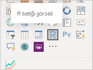

# <a name="tutorial-create-an-r-powered-power-bi-visual"></a>Öğretici: R destekli Power BI görselleri oluşturma

Bu öğreticide Power BI için R destekli bir görselin nasıl oluşturulacağı açıklanır.

Bu öğreticide şunların nasıl yapıldığını öğreneceksiniz:

> [!div class="checklist"]
>
> * R destekli görsel oluşturma
> * Power BI Desktop'ta R betiğini düzenleme
> * Görsele kitaplıklar ekleme
> * Statik bir özellik ekleme

## <a name="prerequisites"></a>Ön koşullar

* **Power BI Pro hesabı**. Başlamadan önce [ücretsiz deneme sürümüne kaydolun](https://powerbi.microsoft.com/pricing/).
* R altyapısı. R'yi [Revolution Open indirme sayfası](https://mran.revolutionanalytics.com/download/) ve [CRAN Repository](https://cran.r-project.org/bin/windows/base/) de dahil olmak üzere pek çok konumdan ücretsiz olarak indirebilirsiniz. Daha fazla bilgi için bkz. [R kullanarak Power BI görselleri oluşturma ](../../desktop-r-visuals.md).
* [Power BI Desktop](../../fundamentals/desktop-get-the-desktop.md).
* Windows kullanıcıları için [Windows PowerShell](https://docs.microsoft.com/powershell/scripting/install/installing-windows-powershell?view=powershell-6) sürüm 4 veya üstü YA DA OSX kullanıcıları için [Terminal](https://macpaw.com/how-to/use-terminal-on-mac).

## <a name="getting-started"></a>Başlarken

1. Görsel için örnek verileri hazırlayın. Bu değerleri Excel veritabanına veya *.csv* dosyasına kaydedebilir ve Power BI Desktop’a içeri aktarabilirsiniz.

    | MonthNo | Toplam Birimler |
    |-----|-----|
    | 1 | 2303 |
    | 2 | 2319 |
    | 3 | 1732 |
    | 4 | 1615 |
    | 5 | 1427 |
    | 6 | 2253 |
    | 7 | 1147 |
    | 8 | 1515 |
    | 9 | 2516 |
    | 10 | 3131 |
    | 11 | 3170 |
    | 12 | 2762 |

1. Görsel oluşturmak için PowerShell veya Terminal’i açın ve aşağıdaki komutu çalıştırın:

   ```cmd
   pbiviz new rVisualSample -t rvisual
   ```

   Bu komut `rvisual` şablonunu temel alan yeni bir dosya yapısı oluşturur. Bu şablon aşağıdaki R betiğini çalıştıran temel, çalıştırılmaya hazır R destekli bir görsel içerir:

   ```r
   plot(Values)
   ```

   `Values` veri çerçevesi `Values` veri rolündeki sütunları içerir.

1. Görsele ilişkin **Değerler** alanına **MonthNo** ve **Total units** ekleyerek geliştirici görseline verileri atayın.

   

## <a name="editing-the-r-script"></a>R Betiğini Düzenleme

`rvisual` şablonunu temel alan R destekli görseli oluşturmak için `pbiviz` kullandığınızda, görselin kök klasöründe *script.r* adlı bir dosya oluşturulur. Bu dosya kullanıcının görüntüsünü oluşturmak için çalıştırılan R betiğini barındırır. R betiğinizi Power BI Desktop'ta oluşturabilirsiniz.

1. Power BI Desktop’ta **R betik görseli**’ni seçin:

   

1. Bu R kodunu **R betik düzenleyicisi**’ne yapıştırın:

    ```r
    x <- dataset[,1] # get the first column from dataset
    y <- dataset[,2] # get the second column from dataset

    columnNames = colnames(dataset) # get column names

    plot(x, y, type="n", xlab=columnNames[1], ylab=columnNames[2]) # draw empty plot with axis and labels only
    lines(x, y, col="green") # draw line plot
    ```

1. Sonucu görmek için **Betiği çalıştır** simgesini seçin.

    

1. R betiğiniz hazır olduğunda, bu betiği önceki adımlardan birinde oluşturulan görsel projenizin `script.r` dosyasına kopyalayın.

1. *capabilities.json* dosyasının `dataRoles` öğesindeki `name` değerini `dataRoles` olarak değiştirin. Power BI R betiği görseli için verileri `dataset` veri çerçevesi nesnesi olarak geçirir ama R görseli `dataRoles` adlarına göre veri çerçevesi adını alır.

    ```json
    {
      "dataRoles": [
        {
          "displayName": "Values",
          "kind": "GroupingOrMeasure",
          "name": "dataRoles"
        }
      ],
      "dataViewMappings": [
        {
          "scriptResult": {
            "dataInput": {
              "table": {
                "rows": {
                  "select": [
                    {
                      "for": {
                        "in": "dataset"
                      }
                    }
                  ],
                  "dataReductionAlgorithm": {
                    "top": {}
                  }
                }
              }
            },
            ...
          }
        }
      ],
    }
    ```

1. Resmin yeniden boyutlandırılmasını desteklemek için aşağıdaki kodu *src/visual.ts* dosyasına ekleyin.

    ```typescript
      public onResizing(finalViewport: IViewport): void {
          this.imageDiv.style.height = finalViewport.height + "px";
          this.imageDiv.style.width = finalViewport.width + "px";
          this.imageElement.style.height = finalViewport.height + "px";
          this.imageElement.style.width = finalViewport.width + "px";
      }
    ```

## <a name="add-libraries-to-visual-package"></a>Görsel paketine kitaplıkları ekleme

Bu yordam görselinizin `corrplot` paketini kullanmasına olanak tanır.

1. Görseliniz için `dependencies.json` dosyasına kitaplık bağımlılığını ekleyin. Burada örnek bir dosya içeriği verilmiştir:

    ```json
    {
      "cranPackages": [
        {
          "name": "corrplot",
          "displayName": "corrplot",
          "url": "https://cran.r-project.org/web/packages/corrplot/"
        }
      ]
    }
    ```

    `corrplot` paketi, bağıntı matrisinin bir grafik görüntüsüdür. `corrplot` hakkında daha fazla bilgi için bkz. [corrplot Paketine Giriş](https://cran.r-project.org/web/packages/corrplot/vignettes/corrplot-intro.html).

1. Bu değişiklikleri yaptıktan sonra paketi `script.r` dosyanızda kullanmaya başlayın.

    ```r
    library(corrplot)
    corr <- cor(dataset)
    corrplot(corr, method="circle", order = "hclust")
    ```

`corrplot` paketini kullanmanın sonucu şu örneğe benzer:


## <a name="adding-a-static-property-to-the-property-pane"></a>Özellik bölmesine statik bir özellik ekleme

Kullanıcıların kullanıcı arabirimi ayarlarını değiştirmesine olanak tanıyın. Bunu yapmak için özellik bölmesine R betiğinin kullanıcı girişi tabanlı davranışını değiştiren özellikleri ekleyin.

`corrplot` işlevinin `method` bağımsız değişkenini kullanarak `corrplot` öğesini yapılandırabilirsiniz. Varsayılan betik bir daire kullanır. Görselinizi değiştirerek kullanıcının çeşitli seçenekler arasından seçim yapmasını sağlayın.

1. Nesneyi ve özelliği *capabilities.json* dosyasında tanımlayın. Ardından özellik bölmesinden bu değerleri almak için Enumeration yönteminde bu nesne adını kullanın.

    ```json
    {
      "settings": {
      "displayName": "Visual Settings",
      "description": "Settings to control the look and feel of the visual",
      "properties": {
        "method": {
          "displayName": "Data Look",
          "description": "Control the look and feel of the data points in the visual",
          "type": {
            "enumeration": [
              {
                "displayName": "Circle",
                "value": "circle"
              },
              {
                "displayName": "Square",
                "value": "square"
              },
              {
                "displayName": "Ellipse",
                "value": "ellipse"
              },
              {
                "displayName": "Number",
                "value": "number"
              },
              {
                "displayName": "Shade",
                "value": "shade"
              },
              {
                "displayName": "Color",
                "value": "color"
              },
              {
                "displayName": "Pie",
                "value": "pie"
              }
            ]
          }
        }
      }
    }
    ```

1. *src/settings.ts* dosyasını açın. `method` genel özelliğiyle bir `CorrPlotSettings` sınıfı oluşturun. Tür `string` ve varsayılan değer de `circle` değeridir. `settings` özelliğini varsayılan değerle `VisualSettings` sınıfına ekleyin:

    ```typescript
    "use strict";

    import { dataViewObjectsParser } from "powerbi-visuals-utils-dataviewutils";
    import DataViewObjectsParser = dataViewObjectsParser.DataViewObjectsParser;

    export class VisualSettings extends DataViewObjectsParser {
      public rcv_script: rcv_scriptSettings = new rcv_scriptSettings();
      public settings: CorrPlotSettings = new CorrPlotSettings();
    }

    export class CorrPlotSettings {
      public method: string = "circle";
    }

    export class rcv_scriptSettings {
      public provider;
      public source;
    }
    ```

    Bu adımlardan sonra görselin özelliğini değiştirebilirsiniz.

   

    Son olarak, R betiği bir özellikle başlamalıdır. Kullanıcı özelliği değiştirmezse görsel bu özellik için hiçbir değer almaz.

    Özelliklerin R çalışma zamanı değişkenleri için adlandırma kuralı `<objectname>_<propertyname>`, bu örnekte `settings_method` şeklindedir.

1. Görselinizdeki R betiğini aşağıdaki kodla eşleşecek şekilde değiştirin:

    ```r
    library(corrplot)
    corr <- cor(dataset)

    if (!exists("settings_method"))
    {
        settings_method = "circle";
    }

    corrplot(corr, method=settings_method, order = "hclust")
    ```

Görselinizin son hali aşağıdaki örneğe benzer görünür:


## <a name="next-steps"></a>Sonraki adımlar

R destekli görseller hakkında daha fazla bilgi edinmek için bkz. [Power BI’da R destekli Power BI görsellerini kullanma](../../desktop-r-powered-custom-visuals.md).

Power BI Desktop’ta R destekli görseller hakkında daha fazla bilgi edinmek için bkz. [R kullanarak Power BI görselleri oluşturma](../../desktop-r-visuals.md).
