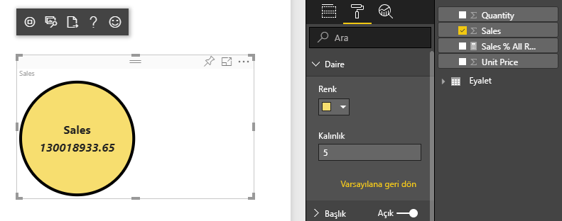
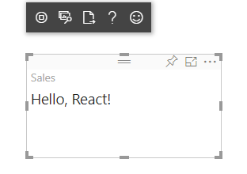
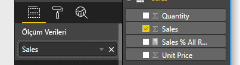

# <a name="tutorial-create-a-react-based-visual"></a>Öğretici: React tabanlı görsel oluşturma

Bu öğreticide, [React](https://reactjs.org/) kullanarak bir Power BI görseli oluşturma süreci açıklanır. Görsel, daire içinde bir değer görüntüler. Görsel, özelleştirebilmeniz için uyarlamalı boyuta ve ayarlara sahiptir. Bu makaledeki bilgiler sayesinde, React kullanarak kendi Power BI görsellerinizi oluşturabilirsiniz.



Bu öğreticide aşağıdakilerin nasıl yapılacağını öğreneceksiniz:

> [!div class="checklist"]
>
> * Geliştirme ortamınızı kurma
> * React görseli oluşturma
> * Görselin özelliklerini yapılandırma
> * Power BI’dan verileri işleme
> * Görseli yeniden boyutlandırma
> * Görseli özelleştirilebilir hale getirme

## <a name="prerequisites"></a>Önkoşullar

* **Power BI Pro hesabı**. Başlamadan önce [ücretsiz deneme sürümüne kaydolun](https://powerbi.microsoft.com/pricing/).
* [Visual Studio Code](https://www.visualstudio.com/).
* Windows kullanıcıları için [Windows PowerShell](https://docs.microsoft.com/powershell/scripting/install/installing-windows-powershell?view=powershell-6) sürüm 4 veya üstü YA DA OSX kullanıcıları için [Terminal](https://macpaw.com/how-to/use-terminal-on-mac).
* [Geliştirici ortamı ayarlama](custom-visual-develop-tutorial.md#setting-up-the-developer-environment) bölümünde açıklandığı gibi bir ortam.

## <a name="getting-started"></a>Kullanmaya başlama

Başlamak için, `pbiviz` kullanarak küçük boyutlu bir Power BI görseli oluşturun. Projeler ve proje yapısı hakkında daha fazla bilgi için bkz. [Power BI görseli proje yapısı](visual-project-structure.md). Bu görselin tam kaynak kodu için bkz. [Circle Card React Görseli](https://github.com/Microsoft/powerbi-visuals-circlecard-react).

Görselin tam kaynak kodunu [GitHub](https://github.com/Microsoft/powerbi-visuals-circlecard-react)’dan kopyalayabilir veya indirebilirsiniz.

1. PowerShell’i açın ve aşağıdaki komutu çalıştırın:

   ```powershell
   pbiviz new ReactCircleCard
   ```

   Komut, *ReactCircleCard* adlı bir klasör oluşturur.

1. Dizinleri bu klasöre değiştirip Visual Studio Code’u açın.

   ```powershell
   cd ./ReactCircleCard
   code .
   ```

1. Görseliniz için geliştirici sunucusunu başlatın.

   ```powershell
   pbiviz start
   ```

   

Bu temel görselde, güncelleştirme sayımı gösterilir. Bunu sonraki adımda bir daire kartına dönüştürelim.

## <a name="change-the-visual-to-a-circle-card"></a>Görseli bir daire kartıyla değiştirme

Bu temel görselde, güncelleştirme sayımı gösterilir. Daha sonra bunu, bir ölçüm ve başlığını gösteren bir daire kartına dönüştürün.

1. Gerekli bağımlılıkları yüklemek için şu komutu çalıştırın:

   ```powershell
   npm i react react-dom
   ```

1. React 16’yı ve `react-dom` uygulamasına karşılık gelen sürümleri ve türleri yüklemek için aşağıdaki komutu çalıştırın:

   ```powershell
   npm i @types/react @types/react-dom
   ```

1. Bir React bileşen sınıfı oluşturun. Visual Studio Code’da **Dosya** > **Yeni Dosya**’yı seçin. Aşağıdaki kodu dosyaya kopyalayın.

    ```typescript
    import * as React from "react";

    export class ReactCircleCard extends React.Component<{}>{
        render(){
            return (
                <div className="circleCard">
                    Hello, React!
                </div>
            )
        }
    }

    export default ReactCircleCard;
    ```

1. **Farklı Kaydet**’i seçin. *src* dizinine gidin. *Component* adını girin. **Tür olarak kaydet** adımında **TypeScript React**’i seçin.

1. *src/visual.ts*’yi açın. Geçerli kodu aşağıdaki kodla değiştirin:

    ```typescript
    "use strict";
    import powerbi from "powerbi-visuals-api";

    import DataView = powerbi.DataView;
    import VisualConstructorOptions = powerbi.extensibility.visual.VisualConstructorOptions;
    import VisualUpdateOptions = powerbi.extensibility.visual.VisualUpdateOptions;
    import IVisual = powerbi.extensibility.visual.IVisual;

    import "./../style/visual.less";

    export class Visual implements IVisual {

        constructor(options: VisualConstructorOptions) {

        }

        public update(options: VisualUpdateOptions) {

        }
    }
    ```

1. React bağımlılıklarını ve az önce eklediğiniz bileşeni içeri aktarın.

    ```typescript
    import * as React from "react";
    import * as ReactDOM from "react-dom";
    ...
    import ReactCircleCard from "./component";
    ```

   Varsayılan Power BI TypeScript ayarları React *tsx* dosyalarını almaz. Visual Studio Code, `component` öğesini hata olarak vurgular.

1. *tsconfig.json* dosyasını açıp `compilerOptions` öğesinin başına iki satır ekleyin.

    ```json
    {
      "compilerOptions": {
        "jsx": "react",
        "types": ["react", "react-dom"],
        //...
      }
    }
    ```

   `component` üzerinde oluşan hatanın gitmiş olması gerekir.

   Bileşeni işlemek için, hedef HTML öğesini ekleyin. `VisualConstructorOptions` içindeki bu öğe, oluşturucuya geçirilen `HTMLElement` öğesidir.

1. `Visual` sınıfını aşağıdaki koddaki gibi değiştirin:

    ```typescript
      private target: HTMLElement;
      private reactRoot: React.ComponentElement<any, any>;

      constructor(options: VisualConstructorOptions) {
          this.reactRoot = React.createElement(ReactCircleCard, {});
          this.target = options.element;

          ReactDOM.render(this.reactRoot, this.target);
      }
    ```

1. Değişiklikleri kaydedin ve bu komutu kullanarak mevcut kodu çalıştırın:

    ```bash
    pbiviz start
    ```

   > [!NOTE]
   > `pbiviz` öğesini daha önce çalıştırdıysanız *tsconfig.json* dosyasındaki değişikliklerin uygulanması için yeniden başlatmanız gerekir.

  

## <a name="configure-capabilities"></a>Özellikleri yapılandırma

Görselin özelliklerini yapılandırabilirsiniz.

1. `capabilities.json` dosyasını açın. `Category Data` nesnesini `dataRoles` öğesinden kaldırın. `ReactCircleCard` tek bir değer görüntülediğinden, yalnızca `Measure Data` öğesine ihtiyacımız var. `dataRoles` anahtarı şimdi şu şekilde görünür:

    ```json
    "dataRoles": [
        {
            "displayName": "Measure Data",
            "name": "measure",
            "kind": "Measure"
        }
    ],
    ```

1. `objects` anahtarının tüm içeriğini kaldırın. Bu anahtarı daha sonra dolduracaksınız.

    ```json
        "objects": {},
    ```

1. `dataViewMappings` özelliğinin aşağıdaki kodunu kopyalayın. `max: 1` değer, tek bir ölçü sütununun gönderilebileceği anlamına gelir.

    ```json
        "dataViewMappings": [
            {
                "conditions": [
                    {
                        "measure": {
                            "max": 1
                        }
                    }
                ],
                "single": {
                    "role": "measure"
                }
            }
        ]
    ```

Artık `Fields` bölmesindeki verileri görsel ayarlarına getirebilirsiniz.



## <a name="receive-properties-from-power-bi"></a>Power BI’dan özellikleri alma

React kullanarak verileri işleyebilirsiniz. Bileşen, verileri kendi durumundan görüntüleyebilir.

1. *src/component.tsx*’i değiştirin.

    ```javascript
    export interface State {
        textLabel: string,
        textValue: string
    }

    export const initialState: State = {
        textLabel: "",
        textValue: ""
    }

    export class ReactCircleCard extends React.Component<{}, State>{
        constructor(props: any){
            super(props);
            this.state = initialState;
        }

        render(){
            const { textLabel, textValue } = this.state;

            return (
                <div className="circleCard">
                    <p>
                        {textLabel}
                        <br/>
                        <em>{textValue}</em>
                    </p>
                </div>
            )
        }
    }
    ```

1. *styles/visual.less* öğesini düzenleyerek yeni işaretleme için stiller ekleyin.

    ```css
    .circleCard {
        position: relative;
        box-sizing: border-box;
        border: 1px solid #000;
        border-radius: 50%;
        width: 200px;
        height: 200px;
    }

    p {
        text-align: center;
        line-height: 30px;
        font-size: 20px;
        font-weight: bold;

        position: relative;
        top: -30px;
        margin: 50% 0 0 0;
    }
    ```

1. Görseller, mevcut verileri `update` yönteminin bağımsız değişkeni olarak alır. *src/visual.ts*’i açın ve `ReactCircleCard.update` öğesine kod ekleyin.

    ```typescript
    //...
    import { ReactCircleCard, initialState } from "./component";
    //...

    export class Visual implements IVisual {
        //...
        public update(options: VisualUpdateOptions) {

            if(options.dataViews && options.dataViews[0]){
                const dataView: DataView = options.dataViews[0];

                ReactCircleCard.update({
                    textLabel: dataView.metadata.columns[0].displayName,
                    textValue: dataView.single.value.toString()
                });
            }
            } else {
                this.clear();
            }
        }

        private clear() {
            ReactCircleCard.update(initialState);
        }
    }
    ```

    Kod, `DataView` öğesinden `textLabel` ile `textValue` öğelerini seçer ve veriler varsa bileşen durumunu güncelleştirir.

1. Bileşen örneğine güncelleştirmeler göndermek için aşağıdaki kodu `ReactCircleCard` sınıfına girin:

    ```typescript
        private static updateCallback: (data: object) => void = null;

        public static update(newState: State) {
            if(typeof ReactCircleCard.updateCallback === 'function'){
                ReactCircleCard.updateCallback(newState);
            }
        }

        public state: State = initialState;

        public componentWillMount() {
            ReactCircleCard.updateCallback = (newState: State): void => { this.setState(newState); };
        }

        public componentWillUnmount() {
            ReactCircleCard.updateCallback = null;
        }
    ```

1. Görseli test edin. `pbiviz start` öğesini çalıştırdığınızdan emin olun ve tüm dosyaları kaydedin. Görseli yenileyin.

   

## <a name="make-component-resizable"></a>Bileşeni yeniden boyutlandırılabilir hale getirme

Bu bölümde, bileşeni yeniden boyutlandırılabilir hale getirebilirsiniz. Bileşen şu anda sabit genişliğe ve yüksekliğe sahiptir.

`options` nesnesinden, görselin görünüm penceresinin geçerli boyutunu alın.

1. *src/visual.ts*’yi açın. `IViewport` arabirimini içeri aktarın ve `viewport` özelliğini `visual` sınıfına ekleyin.

    ```typescript
    import IViewport = powerbi.IViewport;

    //...

    export class Visual implements IVisual {
        private viewport: IViewport;
        //...
    }
    ```

1. `visual` öğesinin `update` yöntemine aşağıdaki kodu ekleyin.

    ```typescript
      if (options.dataViews && options.dataViews[0]) {
          const dataView: DataView = options.dataViews[0];

          this.viewport = options.viewport;
          const { width, height } = this.viewport;
          const size = Math.min(width, height);

          ReactCircleCard.update({
              size,
              //...
          });
      }
    ```

1. *src/component.tsx*’deki `State` arabirimine özellikler ekleyin.

    ```typescript
    export interface State {
        //...
        size: number
    }

    const initialState: State = {
        //...
        size: 200
    }
    ```

1. *src/component.tsx*’deki `render` yöntemine aşağıdaki değişiklikleri uygulayın:

    ```typescript
        render() {
            const { textLabel, textValue, size } = this.state;

            const style: React.CSSProperties = { width: size, height: size };

            return (
                <div className="circleCard" style={style}>
                    {/* ... */}
                </div>
            )
        }
    ```

1. *style/visual.less* öğesindeki `min-width` ve `min-height` kurallarını `width` ve `height` kurallarıyla değiştirin.

    ```css
        min-width: 200px;
        min-height: 200px;
    ```

Artık görünüm penceresini yeniden boyutlandırabilirsiniz. Daire çapı, genişlik veya uzunluk olarak en düşük boyuta karşılık gelir.

## <a name="make-your-power-bi-visual-customizable"></a>Power BI görselinizi özelleştirilebilir hale getirme

Bu bölümde, görseli özelleştirilebilir hale getireceksiniz.

1. *capabilities.json*’u açın. `objects` özelliğine aşağıdaki ayarları ekleyin.

    ```json
    //...
        "objects": {
            "circle": {
                "displayName": "Circle",
                "properties": {
                    "circleColor": {
                        "displayName": "Color",
                        "description": "The fill color of the circle.",
                        "type": {
                            "fill": {
                                "solid": {
                                    "color": true
                                }
                            }
                        }
                    },
                    "circleThickness": {
                        "displayName": "Thickness",
                        "description": "The circle thickness.",
                        "type": {
                            "numeric": true
                        }
                    }
                }
            }
        },
    //...
    ```

1. *src/settings.ts*’deki mevcut kodu bu kodla değiştirin:

    ```typescript
    "use strict";

    import { dataViewObjectsParser } from "powerbi-visuals-utils-dataviewutils";
    import DataViewObjectsParser = dataViewObjectsParser.DataViewObjectsParser;

    export class CircleSettings {
        public circleColor: string = "white";
        public circleThickness: number = 2;
    }

    export class VisualSettings extends DataViewObjectsParser {
        public circle: CircleSettings = new CircleSettings();
    }
    ```

1. Bu `import` deyimlerini *src/visual.ts*’nin üst kısmına ekleyin:

    ```typescript
    import VisualObjectInstance = powerbi.VisualObjectInstance;
    import EnumerateVisualObjectInstancesOptions = powerbi.EnumerateVisualObjectInstancesOptions;
    import VisualObjectInstanceEnumerationObject = powerbi.VisualObjectInstanceEnumerationObject;

    import { VisualSettings } from "./settings";

    ```

1. `enumerateObjectInstances` yöntemini *src/visual.ts*’ye ekleyin. Bu yöntem, görsel ayarlarını uygulamak için kullanılır.

    ```typescript
    export class Visual implements IVisual {
        private settings: VisualSettings;

        //...

        public enumerateObjectInstances(
            options: EnumerateVisualObjectInstancesOptions
        ): VisualObjectInstance[] | VisualObjectInstanceEnumerationObject {

            return VisualSettings.enumerateObjectInstances(this.settings || VisualSettings.getDefault(), options);
        }
    }
    ```

1. `dataView` nesnesinin ayarları alabilmesi için kodu ekleyin.

    ```typescript
        public update(options: VisualUpdateOptions) {

            if(options.dataViews && options.dataViews[0]){
                //...
                this.settings = VisualSettings.parse(dataView) as VisualSettings;
                const object = this.settings.circle;

                ReactCircleCard.update({
                    borderWidth: object && object.circleThickness ? object.circleThickness : undefined,
                    background: object && object.circleColor ? object.circleColor : undefined,
                    //...
                });
            }
        }
    }
    ```

1. Karşılık gelen değişiklikleri, öncelikle bu değerleri `State` öğesine ekleyerek *src/component.tsx*’e uygulayın:

    ```typescript
    export interface State {
        //...
        background?: string,
        borderWidth?: number
    }
    ```

1. Daha sonra `render` yöntemine aşağıdaki kodu ekleyin:

    ```typescript
        const { /*...*/ background, borderWidth } = this.state;

        const style: React.CSSProperties = { /*...*/ background, borderWidth };
    ```

    

## <a name="next-steps"></a>Sonraki adımlar

Power BI geliştirmesi hakkında daha fazla bilgi için [Power BI görsellerine yönelik kılavuzlara](guidelines-powerbi-visuals.md) ve [Power BI’daki Görseller](power-bi-visuals-concept.md)’e göz atın.