# <a name="tutorial-developing-a-power-bi-visual"></a>Öğretici: Power BI görseli geliştirme

Geliştiricilerin pano ve raporlarda kullanmak üzere Power BI’a Power BI görselleri eklemesini sağlayan kolay bir yöntem sunuyoruz. Başlamanıza yardımcı olmak için görselleştirmelerimize ait kodların tamamını GitHub’da yayımladık.

Görselleştirme çerçevesine ek olarak topluluğun Power BI için yüksek kaliteli Power BI görselleri oluşturmasına yardımcı olmak üzere test paketimizi ve araçlarımızı da sağladık.

Bu öğreticide Power BI’da daire içinde biçimlendirilmiş bir ölçüyü görüntülemek için kullanılacak Daire Kartı adlı özel bir Power BI görselini geliştirme adımları gösterilmektedir. Daire Kartı görseli, dolgu rengi ve ana hat kalınlığını özelleştirme desteği sunar.

Power BI Desktop raporunda kartlar, Daire Kartları olacak şekilde değiştirilir.

  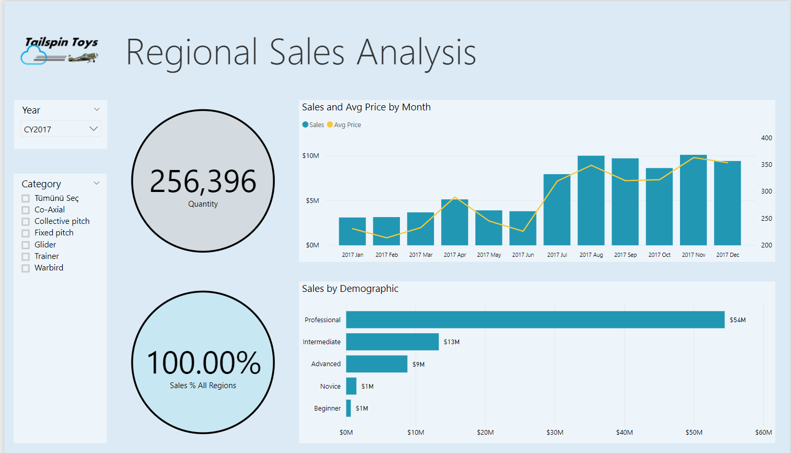

Bu öğreticide aşağıdakilerin nasıl yapılacağını öğreneceksiniz:
> [!div class="checklist"]
> * Power BI özel görseli oluşturma.
> * Özel görsel D3 görsel öğelerini geliştirme.
> * Görsel öğelerle veri bağlama yapılandırmasını tamamlama.
> * Veri değerlerini biçimlendirme.

## <a name="prerequisites"></a>Önkoşullar

* **Power BI Pro**’ya kaydolmadıysanız başlamadan önce [ücretsiz deneme için kaydolun](https://powerbi.microsoft.com/pricing/).
* [Visual Studio Code](https://www.visualstudio.com/) uygulamasını yüklemiş olmanız gerekir.
* Windows kullanıcıları için [Windows PowerShell](https://docs.microsoft.com/powershell/scripting/install/installing-windows-powershell?view=powershell-6) sürüm 4 veya üstü YA DA OSX kullanıcıları için [Terminal](https://macpaw.com/how-to/use-terminal-on-mac) gerekir.

## <a name="setting-up-the-developer-environment"></a>Geliştirici ortamını ayarlama

Önkoşullarının yanı sıra yüklemeniz gereken birkaç araç daha vardır.

### <a name="installing-nodejs"></a>node.js bileşenini yükleme

1. Node.js bileşenini yüklemek için bir web tarayıcısında [Node.js](https://nodejs.org) sayfasına gidin.

2. En son özellik MSI yükleyicisini indirin.

3. Yükleyiciyi çalıştırın ve ardından yükleme adımlarını izleyin. Lisans sözleşmesini ve tüm varsayılan ayarları kabul edin.

   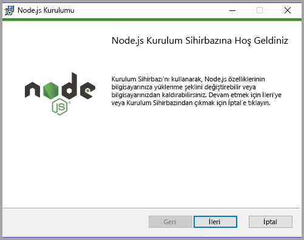

4. Bilgisayarı yeniden başlatın.

### <a name="installing-packages"></a>Paketleri yükleme

Şimdi **pbiviz** paketini yüklemeniz gerekir.

1. Bilgisayar yeniden başlatıldıktan sonra Windows PowerShell’i açın.

2. pbiviz paketini yüklemek için aşağıdaki komutu girin.

    ```powershell
    npm i -g powerbi-visuals-tools
    ```

### <a name="creating-and-installing-a-certificate"></a>Sertifika oluşturma ve yükleme

#### <a name="windows"></a>Windows

1. Sertifika oluşturmak ve yüklemek için aşağıdaki komutu girin.

    ```powershell
    pbiviz --install-cert
    ```

    Komut, *parola* oluşturan bir sonuç döndürür. Bu durumda *parola*, **_15105661266553327_** şeklindedir. Sertifika İçeri Aktarma Sihirbazı’nı da Başlatır.

    

2. Sertifika İçeri Aktarma Sihirbazı’nda depo konumunun Geçerli Kullanıcı olduğundan emin olun. Ardından *İleri*’yi seçin.

      

3. **İçeri Aktarılacak Dosya** adımında *İleri*’yi seçin.

4. **Özel Anahtar Koruması** adımındaki Parola kutusuna sertifika oluşturduğunuzda döndürülen parolayı yapıştırın.  Bu örnekte kullanılan parola **_15105661266553327_** şeklindedir.

      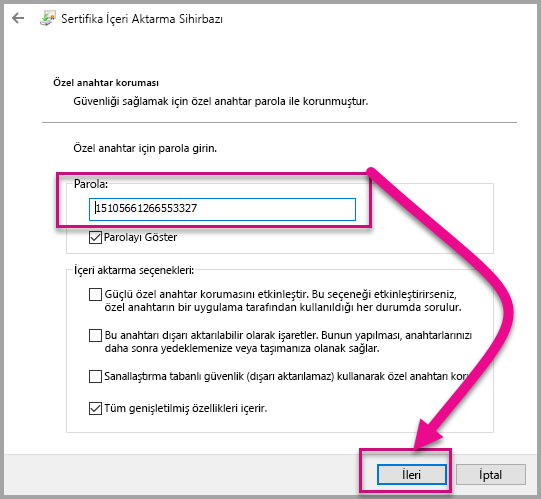

5. **Sertifika Deposu** adımında **Tüm sertifikaları aşağıdaki depoya yerleştir** seçeneğini belirtin. Ardından *Gözat*’ı seçin.

      

6. **Sertifika Deposu Seçin** penceresinde **Güvenilen Kök Sertifika Yetkilileri**’ni ve ardından *Tamam*’ı seçin. Daha sonra **Sertifika Deposu** ekranında *İleri*’yi seçin.

      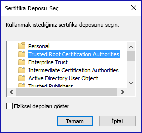

7. İçeri aktarma işlemini tamamlamak için **Son**’u seçin.

8. Güvenlik uyarısı alırsanız **Evet**’i seçin.

    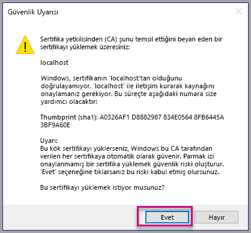

9. İçeri aktarma işleminin başarılı olduğu bildirildiğinde **Tamam**’ı seçin.

    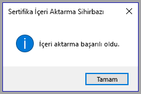

> [!Important]
> Windows PowerShell oturumunu kapatmayın.

#### <a name="osx"></a>OSX

1. Sol üstteki kilit kapalıysa açmak için kilidi seçin. *localhost*’u arayın ve sertifikaya çift tıklayın.

    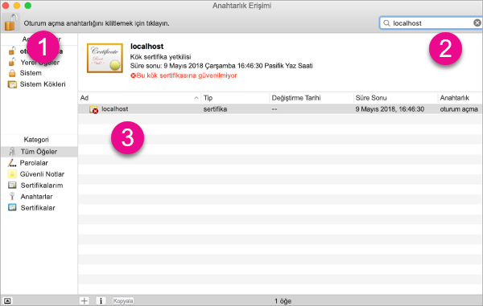

2. **Her Zaman Güven** seçeneğini belirleyip pencereyi kapatın.

    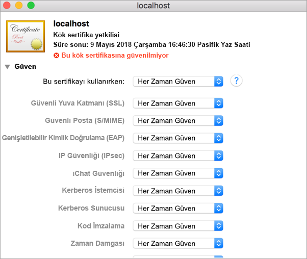

3. Kullanıcı adınızı ve parolanızı girin. **Ayarları Güncelle**'yi seçin.

    

4. Açık tüm tarayıcıları kapatın.

> [!NOTE]
> Sertifika tanınmıyorsa bilgisayarınızı yeniden başlatmanız gerekebilir.

## <a name="creating-a-custom-visual"></a>Özel görsel oluşturma

Ortamınızı ayarladığınıza göre özel görselinizi oluşturmaya başlayabilirsiniz.

Bu öğreticinin kaynak kodun tamamını [indirebilirsiniz](https://github.com/Microsoft/PowerBI-visuals-circlecard).

1. Power BI Görsel Araçlar paketinin yüklü olduğunu doğrulayın.

    ```powershell
    pbiviz
    ```
    Yardım çıktısını görmeniz gerekir.

    <pre><code>
        +syyso+/
    oms/+osyhdhyso/
    ym/       /+oshddhys+/
    ym/              /+oyhddhyo+/
    ym/                     /osyhdho
    ym/                           sm+
    ym/               yddy        om+
    ym/         shho /mmmm/       om+
        /    oys/ +mmmm /mmmm/       om+
    oso  ommmh +mmmm /mmmm/       om+
    ymmmy smmmh +mmmm /mmmm/       om+
    ymmmy smmmh +mmmm /mmmm/       om+
    ymmmy smmmh +mmmm /mmmm/       om+
    +dmd+ smmmh +mmmm /mmmm/       om+
            /hmdo +mmmm /mmmm/ /so+//ym/
                /dmmh /mmmm/ /osyhhy/
                    //   dmmd
                        ++

        PowerBI Custom Visual Tool

    Usage: pbiviz [options] [command]

    Commands:

    new [name]        Create a new visual
    info              Display info about the current visual
    start             Start the current visual
    package           Package the current visual into a pbiviz file
    update [version]  Updates the api definitions and schemas in the current visual. Changes the version if specified
    help [cmd]        display help for [cmd]

    Options:

    -h, --help      output usage information
    -V, --version   output the version number
    --install-cert  Install localhost certificate
    </code></pre>

    <a name="ssl-setup"></a>

2. Desteklenen komutların listesi de dahil olmak üzere çıktıyı gözden geçirin.

    

3. Özel görsel projesi oluşturmak için aşağıdaki komutu girin. **CircleCard**, projenin adıdır.

    ```PowerShell
    pbiviz new CircleCard
    ```
    

    > [!Note]
    > Yeni projeyi istemin geçerli konumunda oluşturursunuz.

4. Proje klasörüne gidin.

    ```powershell
    cd CircleCard
    ```
5. Özel görseli başlatın. CircleCard görseliniz artık çalışıyor ve bilgisayarınızda barındırılıyor.

    ```powershell
    pbiviz start
    ```

    

> [!Important]
> Windows PowerShell oturumunu kapatmayın.

### <a name="testing-the-custom-visual"></a>Özel görseli test etme

Bu bölümde bir Power BI Desktop raporunu karşıya yükleyip özel görseli görüntüleyecek şekilde düzenleyerek CircleCard özel görselini test edeceğiz.

1. [PowerBI.com](https://powerbi.microsoft.com/) oturumu açın, **Dişli simgesine** gidin ve **Ayarlar**’ı seçin.

      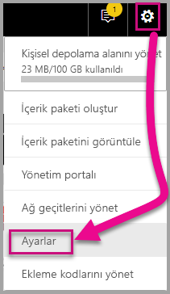

2. **Geliştirici**’yi seçip **Geliştirici görselini test amacıyla etkinleştir** onay kutusunu işaretleyin.

    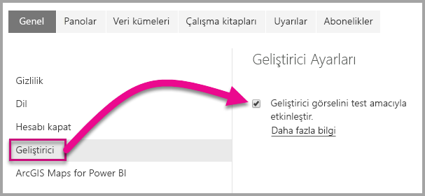

3. Power BI Desktop raporunu karşıya yükleyin.  

    Veri Al > Dosyalar > Yerel Dosya.

    Bir Power BI Desktop oluşturmadıysanız örnek bir rapor [indirebilirsiniz](https://microsoft.github.io/PowerBI-visuals/docs/step-by-step-lab/images/US_Sales_Analysis.pbix).

    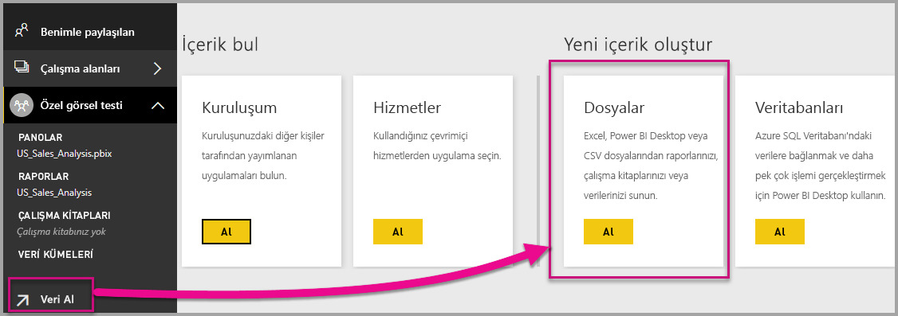 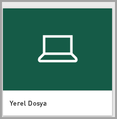

    Raporu görüntülemek için sol taraftaki gezinti bölmesinin **Rapor** bölümünden **US_Sales_Analysis** girişini seçin.

    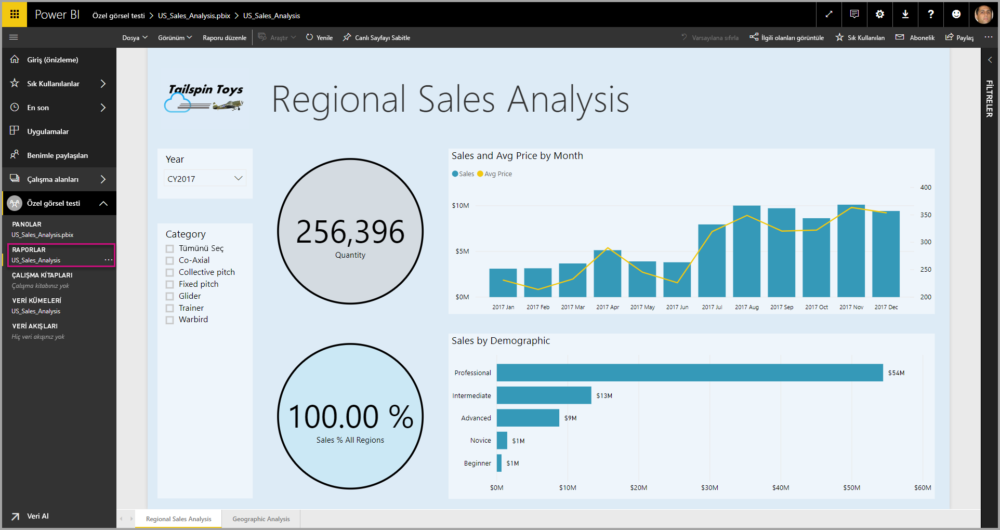

4. Şimdi raporu Power BI hizmetinde düzenlemeniz gerekiyor.

    **Raporu düzenle**’ye gidin.

    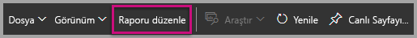

5. **Görsel Öğeler** bölmesinde **Geliştirici Görseli**’ni seçin.

    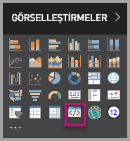

    > [!Note]
    > Bu görselleştirme, bilgisayarınızda başlattığınız özel görseli temsil eder. Yalnızca geliştirici ayarları etkinleştirildiğinde kullanılabilir.

6. Rapor tuvaline bir görselleştirme eklendiğini göreceksiniz.

    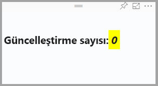

    > [!Note]
    > Bu öğe, Güncelleştirme yönteminin çağrıldığı sayıyı gösteren çok basit bir görseldir. Görsel bu aşamada herhangi bir veri almaz.

7. Raporda yeni görseli seçerken Alanlar bölmesine gidin > Sales bölümünü genişletin > Quantity değerini seçin.

    

8. Ardından test etmek için yeni görseli yeniden boyutlandırın. Değer artışlarının güncelleştirildiğini göreceksiniz.

    

Özel görselin PowerShell’de çalışmasını durdurmak için Ctrl+C tuşlarına basın. Toplu işi sonlandırmak isteyip istemediğiniz sorulduğunda Y tuşuna ve ardından Enter tuşuna basın.

## <a name="adding-visual-elements"></a>Görsel öğe ekleme

Şimdi **D3 JavaScript kitaplığını** yüklemeniz gerekiyor. D3, web tarayıcılarında dinamik ve etkileşimli veri görselleştirmeleri oluşturmanızı sağlayan bir JavaScript kitaplığıdır. Yaygın olarak uygulanan SVG HTML5 ve CSS standartlarını kullanır.

Artık özel görseli daire ve metin görüntüleyecek şekilde geliştirebilirsiniz.

> [!Note]
> Bu öğreticideki birçok metin girişini [buradan](https://github.com/Microsoft/powerbi-visuals-circlecard) kopyalayabilirsiniz.

1. **D3 kitaplığını** PowerShell’de yüklemek için aşağıdaki komutu girin.

    ```powershell
    npm i d3@^5.0.0 --save
    ```

    ```powershell
    PS C:\circlecard>npm i d3@^5.0.0 --save
    + d3@5.11.0
    added 179 packages from 169 contributors and audited 306 packages in 33.25s
    found 0 vulnerabilities

    PS C:\circlecard>
    ```

2. **D3 kitaplığı** tür tanımlarını yüklemek için aşağıdaki komutu girin.

    ```powershell
    npm i @types/d3@^5.0.0 --save
    ```

    ```powershell
    PS C:\circlecard>npm i @types/d3@^5.0.0 --save
    + @types/d3@5.7.2
    updated 1 package and audited 306 packages in 2.217s
    found 0 vulnerabilities

    PS C:\circlecard>
    ```

    Bu komut JavaScript dosyalarını temel alan TypeScript tanımlarını yükleyerek özel görseli TypeScript (JavaScript’in üst kümesi) kullanarak geliştirmenizi sağlar. Visual Studio Code, TypeScript uygulamalarını geliştirmek için ideal IDE ortamlarından biridir.

3. PowerShell’de **core-js** yüklemek için aşağıdaki komutu girin.

    ```powershell
    npm i core-js@3.2.1 --save
    ```

    ```powershell
    PS C:\circlecard> npm i core-js@3.2.1 --save

    > core-js@3.2.1 postinstall F:\circlecard\node_modules\core-js
    > node scripts/postinstall || echo "ignore"

    Thank you for using core-js ( https://github.com/zloirock/core-js ) for polyfilling JavaScript standard library!

    The project needs your help! Please consider supporting of core-js on Open Collective or Patreon:
    > https://opencollective.com/core-js
    > https://www.patreon.com/zloirock

    + core-js@3.2.1
    updated 1 package and audited 306 packages in 6.051s
    found 0 vulnerabilities

    PS C:\circlecard>
    ```

    Bu komut, JavaScript için modüler standart kitaplığı yükler. Bu, 2019’a kadarki ECMAScript için polyfill’leri içerir. [`core-js`](https://www.npmjs.com/package/core-js) hakkında daha fazla bilgi edinin

4. PowerShell’de **powerbi-visual-api** yüklemek için aşağıdaki komutu girin.

    ```powershell
    npm i powerbi-visuals-api --save-dev
    ```

    ```powershell
    PS C:\circlecard>npm i powerbi-visuals-api --save-dev

    + powerbi-visuals-api@2.6.1
    updated 1 package and audited 306 packages in 2.139s
    found 0 vulnerabilities

    PS C:\circlecard>
    ```

    Bu komut, Power BI Görselleri API tanımlarını yükler.

5. [Visual Studio Code](https://code.visualstudio.com/)’u başlatın.

    Aşağıdaki komutu kullanarak **Visual Studio Code**’u PowerShell’den başlatabilirsiniz.

    ```powershell
    code .
    ```

6. **Gezgin bölmesinde** **node_modules** klasörünü genişleterek **d3 library** bileşeninin yüklendiğini doğrulayın.

    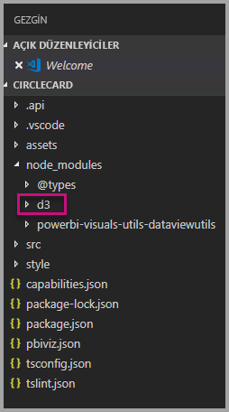

7. **Gezgin bölmesinde** node_modules > @types > d3 bölümünü genişleterek **index.d.ts** dosyasının eklendiğinden emin olun.

    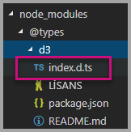

### <a name="developing-the-visual-elements"></a>Görsel öğeleri geliştirme

Artık daire ve örnek metin gösteren bir özel görseli geliştirme adımlarına geçebiliriz.

1. **Gezgin bölmesinde** **src** klasörünü genişletip **visual.ts** dosyasını seçin.

    > [!Note]
    > **visual.ts** dosyasının en üst bölümündeki açıklamaları inceleyin. Power BI özel görsel paketlerini kullanma izni, MIT Lisansı koşulları kapsamında ücretsiz olarak sunulur. Anlaşmanın bir parçası olarak dosyanın en üstünde bulunan açıklamaları tutmanız gerekir.

2. Visual sınıfından aşağıdaki varsayılan özel görsel mantığını kaldırın.
    * Dört sınıf düzeyi özel değişken bildirimi.
    * Oluşturucunun tüm kod satırları.
    * update yönteminin tüm kod satırları.
    * parseSettings ve enumerateObjectInstances yöntemleri dahil olmak üzere modülde kalan tüm satırlar.

    Modül kodunun aşağıdaki gibi göründüğünü doğrulayın.

    ```typescript
    "use strict";
    import "core-js/stable";
    import "../style/visual.less";
    import powerbi from "powerbi-visuals-api";
    import IVisual = powerbi.extensibility.IVisual;
    import VisualConstructorOptions = powerbi.extensibility.visual.VisualConstructorOptions;
    import VisualUpdateOptions = powerbi.extensibility.visual.VisualUpdateOptions;
    import EnumerateVisualObjectInstancesOptions = powerbi.EnumerateVisualObjectInstancesOptions;
    import VisualObjectInstanceEnumeration = powerbi.VisualObjectInstanceEnumeration;
    import IVisualHost = powerbi.extensibility.visual.IVisualHost;

    import * as d3 from "d3";
    type Selection<T extends d3.BaseType> = d3.Selection<T, any,any, any>;

    export class Visual implements IVisual {

        constructor(options: VisualConstructorOptions) {

        }

        public update(options: VisualUpdateOptions) {

        }
    }
    ```

3. *Visual* sınıfı bildiriminin altına aşağıdaki sınıf düzeyi özellikleri ekleyin.

    ```typescript
    export class Visual implements IVisual {
        // ...
        private host: IVisualHost;
        private svg: Selection<SVGElement>;
        private container: Selection<SVGElement>;
        private circle: Selection<SVGElement>;
        private textValue: Selection<SVGElement>;
        private textLabel: Selection<SVGElement>;
        // ...
    }
    ```

    

4. *Oluşturucu* bölümüne aşağıdaki kodu ekleyin.

    ```typescript
    this.svg = d3.select(options.element)
        .append('svg')
        .classed('circleCard', true);
    this.container = this.svg.append("g")
        .classed('container', true);
    this.circle = this.container.append("circle")
        .classed('circle', true);
    this.textValue = this.container.append("text")
        .classed("textValue", true);
    this.textLabel = this.container.append("text")
        .classed("textLabel", true);
    ```

    Bu kod görselin içine bir SVG grubuna ek olarak bir daire ile iki metin öğesi olmak üzere üç şekil ekler.

    Belgedeki kodu biçimlendirmek için **Visual Studio Code belgesinde** herhangi bir yere sağ tıklayıp **Belgeyi Biçimlendir**’i seçin.

      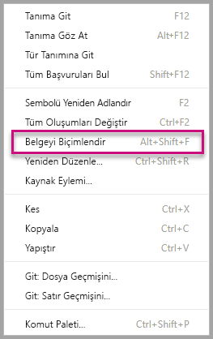

    Okunabilirliği artırmak için her bir kod parçacığını yapıştırdıktan sonra belgeyi biçimlendirmeniz önerilir.

5. Aşağıdaki kodu *update* yöntemine ekleyin.

    ```typescript
    let width: number = options.viewport.width;
    let height: number = options.viewport.height;
    this.svg.attr("width", width);
    this.svg.attr("height", height);
    let radius: number = Math.min(width, height) / 2.2;
    this.circle
        .style("fill", "white")
        .style("fill-opacity", 0.5)
        .style("stroke", "black")
        .style("stroke-width", 2)
        .attr("r", radius)
        .attr("cx", width / 2)
        .attr("cy", height / 2);
    let fontSizeValue: number = Math.min(width, height) / 5;
    this.textValue
        .text("Value")
        .attr("x", "50%")
        .attr("y", "50%")
        .attr("dy", "0.35em")
        .attr("text-anchor", "middle")
        .style("font-size", fontSizeValue + "px");
    let fontSizeLabel: number = fontSizeValue / 4;
    this.textLabel
        .text("Label")
        .attr("x", "50%")
        .attr("y", height / 2)
        .attr("dy", fontSizeValue / 1.2)
        .attr("text-anchor", "middle")
        .style("font-size", fontSizeLabel + "px");
    ```

    *Bu kod, görselin genişliğini ve yüksekliğini ayarladıktan sonra görsel öğelerin özniteliklerini ve stillerini başlatır.*

6. **visual.ts** dosyasını kaydedin.

7. **capabilities.json** dosyasını seçin.

    14. satırdan başlayan nesne öğesinin tamamını kaldırın (satır 14-60).

8. **capabilities.json** dosyasını kaydedin.

9. PowerShell’de özel görseli başlatın.

    ```powershell
    pbiviz start
    ```

### <a name="toggle-auto-reload"></a>Otomatik yeniden yüklemeyi aç/kapat

1. Power BI raporuna dönün.
2. Geliştirici görselinin üzerindeki kayan araç çubuğunda **Otomatik Yeniden Yüklemeyi Aç/Kapat**’ı seçin.

    

    Bu seçenek, projede yapılan değişiklikler kaydedildiğinde görselin otomatik olarak yeniden yüklenmesini sağlar.

3. **Alanlar bölmesinden** **Quantity** alanını geliştirici görseline sürükleyin.

4. Görselin aşağıdaki gibi göründüğünü doğrulayın.

    

5. Görseli yeniden boyutlandırın.

    Dairenin ve metin değerinin görselin kullanılabilir boyutuna uygun şekilde ölçeklendirildiğini göreceksiniz.

    Görsel yeniden boyutlandırılırken güncelleştirme yöntemi sürekli çağrılır ve bu sayede görsel öğeleri akıcı bir şekilde yeniden boyutlandırılır.

    Görsel öğeleri geliştirdiniz.

6. Şimdi görseli çalıştırma adımlarına geçebilirsiniz.

## <a name="process-data-in-the-visual-code"></a>Görsel koddaki verileri işleme

Veri rollerini ve veri görünümü eşlemelerini tanımlayıp özel görsel mantığını bir ölçünün değerini ve görünen adını görüntüleyecek şekilde düzenleyin.

### <a name="configuring-the-capabilities"></a>Özellikleri yapılandırma

**capabilities.json** dosyasını düzenleyerek veri rolünü ve veri görünümü eşlemelerini tanımlayın.

1. Visual Studio Code’da **capabilities.json** dosyasının **dataRoles** dizisinde bulunan tüm içeriği (satır 3-12) kaldırın.

2. **dataRoles** dizisine aşağıdaki kodu ekleyin.

    ```json
    {
        "displayName": "Measure",
        "name": "measure",
        "kind": "Measure"
    }
    ```

    **dataRoles** dizisi artık **measure** adında **measure** türüne sahip tek bir veri rolü tanımlar ve bunu **Ölçü** olarak görüntüler. Bu veri rolü, bir ölçü alanının veya özetlenmiş bir alanın geçirilmesini destekler.

3. **dataViewMappings** dizisindeki içeriğin tamamını (satır 10-31) kaldırın.

4. **dataViewMappings** dizisine aşağıdaki içeriği ekleyin.

    ```json
    {
        "conditions": [
            { "measure": { "max": 1 } }
        ],
        "single": {
            "role": "measure"
        }
    }
    ```

    **dataViewMappings** dizisi artık **measure** adlı veri rolüne geçirilebilecek tek bir alan tanımlar.

5. **capabilities.json** dosyasını kaydedin.

6. Power BI’da görselin artık **Ölçü** ile yapılandırabileceğini göreceksiniz.

    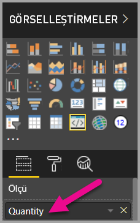

    > [!Note]
    > Görsel projesi henüz veri bağlama mantığını içermiyor.

### <a name="exploring-the-dataview"></a>Veri görünümünü keşfetme

1. Görselin üzerindeki kayan araç çubuğunda **Veri Görünümünü Göster**’i seçin.

    

2. **single** bölümünü genişletip değeri inceleyin.

    

3. **metadata** ve ardından **columns** dizisini genişletip **format** ve **displayName** değerlerini inceleyin.

    

4. Görsele geri dönmek için görselin üzerindeki kayan araç çubuğunda **Veri Görünümünü Göster**’i seçin.

    

### <a name="consume-data-in-the-visual-code"></a>Görsel koddaki verileri kullanma

1. **Visual Studio Code**’da **visual.ts** dosyasında,

    `powerbi` modülünden `DataView` arabirimini içeri aktarın

    ```typescript
    import DataView = powerbi.DataView;
    ```

    ve update yönteminin ilk deyimi olarak aşağıdaki deyimi ekleyin.

    ```typescript
    let dataView: DataView = options.dataViews[0];
    ```

    

    Bu deyim *dataView* nesnesini kolay erişim için bir değişkene atar ve değişkeni *dataView* nesnesine başvuracak şekilde düzenler.

2. **update** yönteminin **.text("Value")** bölümünü aşağıdaki değerle değiştirin.

    ```typescript
    .text(<string>dataView.single.value)
    ```

    

3. **update** yönteminin **.text("Label")** bölümünü aşağıdaki değerle değiştirin.

    ```typescript
    .text(dataView.metadata.columns[0].displayName)
    ```

    

4. **visual.ts** dosyasını kaydedin.

5. **Power BI**’da değeri ve görünen adı gösteren görseli gözden geçirin.

Veri rollerini yapılandırdınız ve görseli veri görünümüne bağladınız.

Bir sonraki öğreticide özel görsele biçimlendirme seçenekleri eklemeyi öğreneceksiniz.

## <a name="debugging"></a>Hata ayıklama

Özel görseliniz için hata ayıklamaya yönelik ipuçlarına, [hata ayıklama kılavuzuna](./visuals-how-to-debug.md#how-to-debug-power-bi-visuals) giderek göz atabilirsiniz.

## <a name="next-steps"></a>Sonraki adımlar

> [!div class="nextstepaction"]
> [Biçimlendirme seçenekleri ekleme](custom-visual-develop-tutorial-format-options.md)
