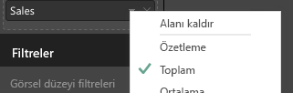
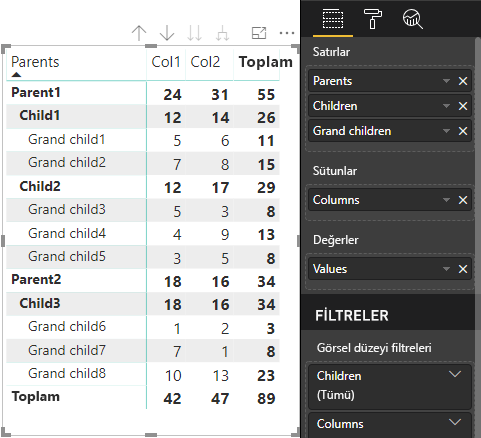

# <a name="understand-data-view-mapping-in-power-bi-visuals"></a>Power BI görsellerinde veri görünümü eşlemesini anlama

Bu makalede veri görünümü eşlemesi anlatılır ve veri rollerinin birbirleriyle ilişkisi, bunlar için koşullu gereksinimleri belirlemenize nasıl olanak tanıdığı açıklanır. Makalede `dataMappings` türleri de açıklanır.

Her geçerli eşleme bir veri görünümü oluşturur ama şu anda görsel başına tek bir sorgu gerçekleştirmeyi destekliyoruz. Normalde tek bir veri görünümü alırsınız. Bununla birlikte bazı durumlarda birden çok veri eşlemesi sağlayabilirsiniz ve bu da şunlara olanak tanır:

```json
"dataViewMappings": [
    {
        "conditions": [ ... ],
        "categorical": { ... },
        "single": { ... },
        "table": { ... },
        "matrix": { ... }
    }
]
```

Power BI ancak geçerli eşleme `dataViewMappings` içine doldurulduysa veri görünümüne bir eşleme oluşturur.

Başka bir deyişle `dataViewMappings` içinde `categorical` tanımlanabilir ama `table` veya `single` gibi diğer eşlemeler tanımlanmayabilir. Örnek:

```json
"dataViewMappings": [
    {
        "categorical": { ... }
    }
]
```

Power BI tek bir `categorical` eşlemesiyle bir veri görünümü oluşturur ve `table` ile diğer eşlemeler tanımlanmaz:

```javascript
{
    "categorical": {
        "categories": [ ... ],
        "values": [ ... ]
    },
    "metadata": { ... }
}
```

## <a name="conditions"></a>Koşullar

Bu bölümde belirli bir veri eşlemesinin koşulları açıklanır. Birden çok koşul kümesi sağlayabilirsiniz ve veriler tanımlanan koşul kümelerinden biriyle eşleşirse görsel verileri geçerli olarak kabul eder.

Şu anda her alan için en düşük ve en yüksek değeri belirtebilirsiniz. Bu değer söz konusu veri rolüne bağlanabilecek alan sayısını temsil eder. 

> [!NOTE]
> Koşulda bir veri rolü atlanırsa, herhangi bir sayıda alan olabilir.

### <a name="example-1"></a>Örnek 1

Birden çok alanı her bir veri rolüne sürükleyebilirsiniz. Bu örnekte kategoriyi tek bir veri alanına ve ölçüyü iki veri alanına sınırlıyorsunuz.

```json
"conditions": [
    { "category": { "max": 1 }, "y": { "max": 2 } },
]
```

### <a name="example-2"></a>Örnek 2

Bu örnekte iki koşuldan herhangi biri gereklidir:
* Tam olarak bir kategori veri alanı ve tam olarak iki ölçü
* Tam olarak iki kategori ve tam olarak bir ölçü.

```json
"conditions": [
    { "category": { "min": 1, "max": 1 }, "measure": { "min": 2, "max": 2 } },
    { "category": { "min": 2, "max": 2 }, "measure": { "min": 1, "max": 1 } }
]
```

## <a name="single-data-mapping"></a>Tek veri eşlemesi

Tek veri eşlemesi, veri eşlemesinin en basit biçimidir. Tek bir ölçü alanını kabul eder ve size toplamı verir. Alan sayısalsa size toplamı verir. Aksi takdirde benzersiz değerlerin sayısını verir.

Tek veri eşlemesini kullanmak için, eşlemek istediğiniz veri rolünün adını tanımlamalısınız. Bu eşleme tek bir ölçü alanıyla kullanılabilir. İkinci bir alan atandıysa hiçbir veri görünümü oluşturulmaz; bu nedenle verileri tek alanla sınırlayan bir koşul eklemek iyi bir yaklaşım olacaktır.

> [!NOTE]
> Bu veri eşlemesi diğer hiçbir veri eşlemesiyle birlikte kullanılamaz. Verileri tek bir sayısal değere düşürmek için tasarlanmıştır.

### <a name="example-3"></a>Örnek 3

```json
{
    "dataRoles": [
        {
            "displayName": "Y",
            "name": "Y",
            "kind": "Measure"
        }
    ],
    "dataViewMappings": [
        {
            "conditions": [
                {
                    "Y": {
                        "max": 1
                    }
                }
            ],
            "single": {
                "role": "Y"
            }
        }
    ]
}
```

Yine de sonuçta elde edilen veri eşlemesi diğer türleri (tablo, kategorik vb.) içerir ama her eşlemede tek bir değer bulunur. En iyi yöntem değere tek bir öğe olarak erişmektir.

```JSON
{
    "dataView": [
        {
            "metadata": null,
            "categorical": null,
            "matrix": null,
            "table": null,
            "tree": null,
            "single": {
                "value": 94163140.3560001
            }
        }
    ]
}
```

Basit veri görünümü eşlemeyi işlemek için kod örneği

```typescript
"use strict";
import powerbi from "powerbi-visuals-api";
import DataView = powerbi.DataView;
import DataViewSingle = powerbi.DataViewSingle;
// standart imports
// ...

export class Visual implements IVisual {
    private target: HTMLElement;
    private host: IVisualHost;
    private valueText: HTMLParagraphElement;

    constructor(options: VisualConstructorOptions) {
        // constructor body
        this.target = options.element;
        this.host = options.host;
        this.valueText = document.createElement("p");
        this.target.appendChild(this.valueText);
        // ...
    }

    public update(options: VisualUpdateOptions) {
        const dataView: DataView = options.dataViews[0];
        const singleDataView: DataViewSingle = dataView.single;

        if (!singleDataView ||
            !singleDataView.value ) {
            return
        }

        this.valueText.innerText = singleDataView.value.toString();
    }
}
```

Sonuç olarak görsel Power BI'dan tek bir değer görüntüler:


## <a name="categorical-data-mapping"></a>Kategorik veri eşlemesi

Kategorik veri eşlemesi, bir veya iki bağımsız veri grubunu almak için kullanılır.

### <a name="example-4"></a>Örnek 4

Aşağıda veri rolleri için önceki örnekteki tanım verilmiştir:

```json
"dataRole":[
    {
        "displayName": "Category",
        "name": "category",
        "kind": "Grouping"
    },
    {
        "displayName": "Y Axis",
        "name": "measure",
        "kind": "Measure"
    }
]
```

Eşleme şöyledir:

```json
"dataViewMappings": {
    "categorical": {
        "categories": {
            "for": { "in": "category" }
        },
        "values": {
            "select": [
                { "bind": { "to": "measure" } }
            ]
        }
    }
}
```

Bu basit bir örnektir. "`category` veri rolümü, `category` içine sürüklediğim her alanın verileri `categorical.categories` ile eşlenecek şekilde eşleyin. Ayrıca `measure` veri rolümü de `categorical.values` ile eşleyin" anlamına gelir.

* **for...in**: Bu veri rolündeki tüm öğeleri veri sorgusuna ekleyin.
* **bind...to**: *for...in* ile aynı sonucu verir ama veri rolünün tek alan kısıtlaması getiren bir koşulu olmasını bekler.

### <a name="example-5"></a>Örnek 5

Bu örnekte önceki örneğin ilk iki veri rolü kullanılır ve bunlara ek olarak `grouping` ve `measure2` tanımlanır.

```json
"dataRole":[
    {
        "displayName": "Category",
        "name": "category",
        "kind": "Grouping"
    },
    {
        "displayName": "Y Axis",
        "name": "measure",
        "kind": "Measure"
    },
    {
        "displayName": "Grouping with",
        "name": "grouping",
        "kind": "Grouping"
    },
    {
        "displayName": "X Axis",
        "name": "measure2",
        "kind": "Grouping"
    }
]
```

Eşleme şöyledir:

```json
"dataViewMappings":{
    "categorical": {
        "categories": {
            "for": { "in": "category" }
        },
        "values": {
            "group": {
                "by": "grouping",
                "select":[
                    { "bind": { "to": "measure" } },
                    { "bind": { "to": "measure2" } }
                ]
            }
        }
    }
}
```

Kategorik değerlerini eşlemeye yönelik fark aşağıdaki gibidir. Burada şunu söylüyoruz: "`measure` ve `measure2` veri rollerimi, `grouping` veri rolüne göre gruplandırılacak şekilde eşleyin."

### <a name="example-6"></a>Örnek 6

Veri rolleri şöyledir:

```json
"dataRoles": [
    {
        "displayName": "Categories",
        "name": "category",
        "kind": "Grouping"
    },
    {
        "displayName": "Measures",
        "name": "measure",
        "kind": "Measure"
    },
    {
        "displayName": "Series",
        "name": "series",
        "kind": "Measure"
    }
]
```

Veri görünümü eşlemesi şöyledir:

```json
"dataViewMappings": [
    {
        "categorical": {
            "categories": {
                "for": {
                    "in": "category"
                }
            },
            "values": {
                "group": {
                    "by": "series",
                    "select": [{
                            "for": {
                                "in": "measure"
                            }
                        }
                    ]
                }
            }
        }
    }
]
```

Kategorik veri görünümü şu şekilde görselleştirilebilir:

| Kategorik |  |  | | | |
|-----|-----|------|------|------|------|
| | Yıl | 2013 | 2014 | 2015 | 2016 |
| Ülke | | |
| Amerika Birleşik Devletleri | | x | x | 650 | 350 |
| Kanada | | x | 630 | 490 | x |
| Meksika | | 645 | x | x | x |
| Birleşik Krallık | | x | x | 831 | x |

Power BI bunu kategorik veri görünümü olarak oluşturur. Kategori kümesidir.

```JSON
{
    "categorical": {
        "categories": [
            {
                "source": {...},
                "values": [
                    "Canada",
                    "USA",
                    "UK",
                    "Mexico"
                ],
                "identity": [...],
                "identityFields": [...],
            }
        ]
    }
}
```

Her kategori bir değerler kümesiyle de eşlenir. Bu değerlerin her biri, yıl olan gösterilen bir seriye göre gruplandırılır.

Örneğin her `values` dizisi tek tek yılların verilerini temsil eder.
Ayrıca `values` dizisinin sırasıyla Kanada, ABD, Birleşik Krallık ve Meksika için 4 değeri vardır:

```JSON
{
    "values": [
        // Values for 2013 year
        {
            "source": {...},
            "values": [
                null, // Value for `Canada` category
                null, // Value for `USA` category
                null, // Value for `UK` category
                645 // Value for `Mexico` category
            ],
            "identity": [...],
        },
        // Values for 2014 year
        {
            "source": {...},
            "values": [
                630, // Value for `Canada` category
                null, // Value for `USA` category
                null, // Value for `UK` category
                null // Value for `Mexico` category
            ],
            "identity": [...],
        },
        // Values for 2015 year
        {
            "source": {...},
            "values": [
                490, // Value for `Canada` category
                650, // Value for `USA` category
                831, // Value for `UK` category
                null // Value for `Mexico` category
            ],
            "identity": [...],
        },
        // Values for 2016 year
        {
            "source": {...},
            "values": [
                null, // Value for `Canada` category
                350, // Value for `USA` category
                null, // Value for `UK` category
                null // Value for `Mexico` category
            ],
            "identity": [...],
        }
    ]
}
```

Kategorik veri görünümü eşlemesini işlemeye yönelik kod örneği aşağıda açıklanmıştır. Örnek Hiyerarşik `Country => Year => Value` yapısını oluşturur

```typescript
"use strict";
import powerbi from "powerbi-visuals-api";
import DataView = powerbi.DataView;
import DataViewDataViewCategoricalSingle = powerbi.DataViewCategorical;
import DataViewValueColumnGroup = powerbi.DataViewValueColumnGroup;
import PrimitiveValue = powerbi.PrimitiveValue;
// standart imports
// ...

export class Visual implements IVisual {
    private target: HTMLElement;
    private host: IVisualHost;
    private categories: HTMLElement;

    constructor(options: VisualConstructorOptions) {
        // constructor body
        this.target = options.element;
        this.host = options.host;
        this.categories = document.createElement("pre");
        this.target.appendChild(this.categories);
        // ...
    }

    public update(options: VisualUpdateOptions) {
        const dataView: DataView = options.dataViews[0];
        const categoricalDataView: DataViewCategorical = dataView.categorical;

        if (!categoricalDataView ||
            !categoricalDataView.categories ||
            !categoricalDataView.categories[0] ||
            !categoricalDataView.values) {
            return;
        }

        // Categories have only one column in data buckets
        // If you want to support several columns of categories data bucket, you should iterate categoricalDataView.categories array.
        const categoryFieldIndex = 0;
        // Measure has only one column in data buckets.
        // If you want to support several columns on data bucket, you should iterate years.values array in map function
        const measureFieldIndex = 0;
        let categories: PrimitiveValue[] = categoricalDataView.categories[categoryFieldIndex].values;
        let values: DataViewValueColumnGroup[] = categoricalDataView.values.grouped();

        let data = {};
        // iterate categories/countries
        categories.map((category: PrimitiveValue, categoryIndex: number) => {
            data[category.toString()] = {};
            // iterate series/years
            values.map((years: DataViewValueColumnGroup) => {
                if (!data[category.toString()][years.name] && years.values[measureFieldIndex].values[categoryIndex]) {
                    data[category.toString()][years.name] = []
                }
                if (years.values[0].values[categoryIndex]) {
                    data[category.toString()][years.name].push(years.values[measureFieldIndex].values[categoryIndex]);
                }
            });
        });

        this.categories.innerText = JSON.stringify(data, null, 6);
        console.log(data);
    }
}
```

Görselin sonucu:


## <a name="table-data-mapping"></a>Tablo veri eşlemesi

Tablo veri görünümü basit bir veri eşlemedir. Temelde, bu, sayısal veri noktalarının toplanabileceği veri noktalarının bir listesidir.

### <a name="example-7"></a>Örnek 7

Verilen yetenekler ile:

```json
"dataRoles": [
    {
        "displayName": "Column",
        "name": "column",
        "kind": "Measure"
    },
    {
        "displayName": "Value",
        "name": "value",
        "kind": "Measure"
    }
]
```

```json
"dataViewMappings": [
    {
        "table": {
            "rows": {
                "select": [
                    {
                        "for": {
                            "in": "column"
                        }
                    },
                    {
                        "for": {
                            "in": "value"
                        }
                    }
                ]
            }
        }
    }
]
```

Tablo veri görünümünü aşağıdaki gibi görselleştirebilirsiniz:  

Veri örneği:

| Ülke| Yıl | Satışlar |
|-----|-----|------|
| Amerika Birleşik Devletleri | 2016 | 100 |
| Amerika Birleşik Devletleri | 2015 | 50 |
| Kanada | 2015 | 200 |
| Kanada | 2015 | 50 |
| Meksika | 2013 | 300 |
| Birleşik Krallık | 2014 | 150 |
| Amerika Birleşik Devletleri | 2015 | 75 |

Veri bağlama:


Power BI verilerinizi tablo veri görünümü olarak gösterir. Verilerin sıralı olduğunu varsaymamalısınız.

```JSON
{
    "table" : {
        "columns": [...],
        "rows": [
            [
                "Canada",
                2014,
                630
            ],
            [
                "Canada",
                2015,
                490
            ],
            [
                "Mexico",
                2013,
                645
            ],
            [
                "UK",
                2014,
                831
            ],
            [
                "USA",
                2015,
                650
            ],
            [
                "USA",
                2016,
                350
            ]
        ]
    }
}
```

İstenen alanı ve sonra da toplamı seçerek verileri toplayabilirsiniz.  



Tablo veri görünümü eşlemeyi işlemek için kod örneği.

```typescript
"use strict";
import "./../style/visual.less";
import powerbi from "powerbi-visuals-api";
// ...
import DataViewMetadataColumn = powerbi.DataViewMetadataColumn;
import DataViewTable = powerbi.DataViewTable;
import DataViewTableRow = powerbi.DataViewTableRow;
import PrimitiveValue = powerbi.PrimitiveValue;
// other imports
// ...

export class Visual implements IVisual {
    private target: HTMLElement;
    private host: IVisualHost;
    private table: HTMLParagraphElement;

    constructor(options: VisualConstructorOptions) {
        // constructor body
        this.target = options.element;
        this.host = options.host;
        this.table = document.createElement("table");
        this.target.appendChild(this.table);
        // ...
    }

    public update(options: VisualUpdateOptions) {
        const dataView: DataView = options.dataViews[0];
        const tableDataView: DataViewTable = dataView.table;

        if (!tableDataView) {
            return
        }
        while(this.table.firstChild) {
            this.table.removeChild(this.table.firstChild);
        }

        //draw header
        const tableHeader = document.createElement("th");
        tableDataView.columns.forEach((column: DataViewMetadataColumn) => {
            const tableHeaderColumn = document.createElement("td");
            tableHeaderColumn.innerText = column.displayName
            tableHeader.appendChild(tableHeaderColumn);
        });
        this.table.appendChild(tableHeader);

        //draw rows
        tableDataView.rows.forEach((row: DataViewTableRow) => {
            const tableRow = document.createElement("tr");
            row.forEach((columnValue: PrimitiveValue) => {
                const cell = document.createElement("td");
                cell.innerText = columnValue.toString();
                tableRow.appendChild(cell);
            })
            this.table.appendChild(tableRow);
        });
    }
}
```

Görsel stiller dosyası `style/visual.less` tablonun düzenini içerir:

```less
table {
    display: flex;
    flex-direction: column;
}

tr, th {
    display: flex;
    flex: 1;
}

td {
    flex: 1;
    border: 1px solid black;
}
```


## <a name="matrix-data-mapping"></a>Matris veri eşlemesi

Matris veri eşlemesi, tablo veri eşlemesine benzer ancak satırlar hiyerarşik olarak sunulur. Veri rolü değerlerden herhangi biri sütun üst bilgisi değeri olarak kullanılabilir.

```json
{
    "dataRoles": [
        {
            "name": "Category",
            "displayName": "Category",
            "displayNameKey": "Visual_Category",
            "kind": "Grouping"
        },
        {
            "name": "Column",
            "displayName": "Column",
            "displayNameKey": "Visual_Column",
            "kind": "Grouping"
        },
        {
            "name": "Measure",
            "displayName": "Measure",
            "displayNameKey": "Visual_Values",
            "kind": "Measure"
        }
    ],
    "dataViewMappings": [
        {
            "matrix": {
                "rows": {
                    "for": {
                        "in": "Category"
                    }
                },
                "columns": {
                    "for": {
                        "in": "Column"
                    }
                },
                "values": {
                    "select": [
                        {
                            "for": {
                                "in": "Measure"
                            }
                        }
                    ]
                }
            }
        }
    ]
}
```

Power BI hiyerarşik bir veri yapısı oluşturur. Ağaç hiyerarşisinin kökünde `Category` veri rolünün **Parents** sütunundaki veriler ve veri rolü tablosunun **Children** sütunundaki alt öğeler yer alır.

Veri kümesi:

| Üst öğeler | Alt öğeler | Alt öğenin alt öğeleri | Sütunlar | Değerler |
|-----|-----|------|-------|-------|
| Üst öğe1 | Alt öğe1 | Alt öğenin alt öğesi1 | Süt1 | 5 |
| Üst öğe1 | Alt öğe1 | Alt öğenin alt öğesi1 | Süt2 | 6 |
| Üst öğe1 | Alt öğe1 | Alt öğenin alt öğesi2 | Süt1 | 7 |
| Üst öğe1 | Alt öğe1 | Alt öğenin alt öğesi2 | Süt2 | 8 |
| Üst öğe1 | Alt öğe2 | Alt öğenin alt öğesi3 | Süt1 | 5 |
| Üst öğe1 | Alt öğe2 | Alt öğenin alt öğesi3 | Süt2 | 3 |
| Üst öğe1 | Alt öğe2 | Alt öğenin alt öğesi4 | Süt1 | 4 |
| Üst öğe1 | Alt öğe2 | Alt öğenin alt öğesi4 | Süt2 | 9 |
| Üst öğe1 | Alt öğe2 | Alt öğenin alt öğesi5 | Süt1 | 3 |
| Üst öğe1 | Alt öğe2 | Alt öğenin alt öğesi5 | Süt2 | 5 |
| Üst öğe2 | Alt öğe3 | Alt öğenin alt öğesi6 | Süt1 | 1 |
| Üst öğe2 | Alt öğe3 | Alt öğenin alt öğesi6 | Süt2 | 2 |
| Üst öğe2 | Alt öğe3 | Alt öğenin alt öğesi7 | Süt1 | 7 |
| Üst öğe2 | Alt öğe3 | Alt öğenin alt öğesi7 | Süt2 | 1 |
| Üst öğe2 | Alt öğe3 | Alt öğenin alt öğesi8 | Süt1 | 10 |
| Üst öğe2 | Alt öğe3 | Alt öğenin alt öğesi8 | Süt2 | 13 |

Power BI’ın temel matris görseli verileri tablo olarak işler.



Görsel veri yapısını aşağıdaki kodda açıklandığı gibi alır (burada yalnızca ilk iki tablo satırı gösterilmiştir):

```json
{
    "metadata": {...},
    "matrix": {
        "rows": {
            "levels": [...],
            "root": {
                "childIdentityFields": [...],
                "children": [
                    {
                        "level": 0,
                        "levelValues": [...],
                        "value": "Parent1",
                        "identity": {...},
                        "childIdentityFields": [...],
                        "children": [
                            {
                                "level": 1,
                                "levelValues": [...],
                                "value": "Child1",
                                "identity": {...},
                                "childIdentityFields": [...],
                                "children": [
                                    {
                                        "level": 2,
                                        "levelValues": [...],
                                        "value": "Grand child1",
                                        "identity": {...},
                                        "values": {
                                            "0": {
                                                "value": 5 // value for Col1
                                            },
                                            "1": {
                                                "value": 6 // value for Col2
                                            }
                                        }
                                    },
                                    ...
                                ]
                            },
                            ...
                        ]
                    },
                    ...
                ]
            }
        },
        "columns": {
            "levels": [...],
            "root": {
                "childIdentityFields": [...],
                "children": [
                    {
                        "level": 0,
                        "levelValues": [...],
                        "value": "Col1",
                        "identity": {...}
                    },
                    {
                        "level": 0,
                        "levelValues": [...],
                        "value": "Col2",
                        "identity": {...}
                    },
                    ...
                ]
            }
        },
        "valueSources": [...]
    }
}
```

## <a name="data-reduction-algorithm"></a>Veri azaltma algoritması

Veri görünümünde alınacak verilerin miktarını belirlemek için bir veri azaltma algoritması uygulayabilirsiniz.

Varsayılan olarak tüm Power BI görsellerinde *count* değerinin 1000 veri noktasına ayarlandığı üst veri azaltma algoritması vardır. Bu ayar, *capabilities.json* dosyasında aşağıdaki özellikleri ayarlamakla aynı sonucu verir:

```json
"dataReductionAlgorithm": {
    "top": {
        "count": 1000
    }
}
```

*count* değerini 30000’e kadar herhangi bir tamsayı değeriyle değiştirebilirsiniz. R tabanlı Power BI görselleri en fazla 150000 satırı destekleyebilir.

## <a name="data-reduction-algorithm-types"></a>Veri azaltma algoritması türleri

Dört tür veri azaltma algoritması ayarı vardır:

* `top` Verileri veri kümesinin en üstünden alınan değerlerle sınırlamak istiyorsanız. İlk *count* değerleri veri kümesinden alınacaktır.
* `bottom` Verileri veri kümesinin en altından alınan değerlerle sınırlamak istiyorsanız. Son "count" değerleri veri kümesinden alınacaktır.
* `sample` Veri kümesini, *count* öğe sayısıyla sınırlı bir basit örnekleme algoritması ile azaltabilirsiniz. Bu, ilk ve son öğelerin dahil olduğu ve aralarında eşit aralıklar olan bir *count* öğe sayısı olduğu anlamına gelir.
Örneğin veri kümeniz [0, 1, 2, ... 100] ve *count* değeri 9 olduğunda, [0, 10, 20 ... 100] değerlerini alırsınız.
* `window` Bir kerede *count* öğelerini içeren bir *window* kadar veri öğesi yükler. Şu anda `top` ve `window` eşdeğerdir. Pencereleme ayarına tam destek sağlamak için çalışıyoruz.

## <a name="data-reduction-algorithm-usage"></a>Veri azaltma algoritmasının kullanımı

Veri azaltma algoritması kategorik, tablo veya matris veri görünümü eşlemesinde kullanılabilir.

Algoritmayı `categories` içinde ve/veya kategorik veri eşlemesi için `values` altındaki group bölümünde ayarlayabilirsiniz.

### <a name="example-8"></a>Örnek 8

```json
"dataViewMappings": {
    "categorical": {
        "categories": {
            "for": { "in": "category" },
            "dataReductionAlgorithm": {
                "window": {
                    "count": 300
                }
            }  
        },
        "values": {
            "group": {
                "by": "series",
                "select": [{
                        "for": {
                            "in": "measure"
                        }
                    }
                ],
                "dataReductionAlgorithm": {
                    "top": {
                        "count": 100
                    }
                }  
            }
        }
    }
}
```

Veri azaltma algoritmasını Veri Görünümü eşleme tablosunun `rows` bölümüne uygulayabilirsiniz.

### <a name="example-9"></a>Örnek 9

```json
"dataViewMappings": [
    {
        "table": {
            "rows": {
                "for": {
                    "in": "values"
                },
                "dataReductionAlgorithm": {
                    "top": {
                        "count": 2000
                    }
                }
            }
        }
    }
]
```

Veri azaltma algoritmasını Veri Görünümü eşleme matrisinin `rows` ve `columns` bölümlerine uygulayabilirsiniz.

## <a name="next-steps"></a>Sonraki adımlar

[Power BI görsellerinde veri görünümü eşlemeleri için Detaya Gitme desteği ekleme](drill-down-support.md) konusunu okuyun.
