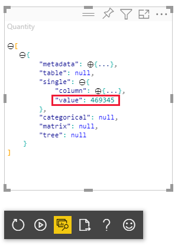

# <a name="tutorial-develop-a-power-bi-circle-card-visual"></a>Öğretici: Power BI daire kartı görseli geliştirme

Geliştirici olarak kendi Power BI görsellerinizi oluşturabilirsiniz. Bu görselleri kendiniz kullanabilir veya kuruluşunuzun ve üçüncü tarafların kullanımına sunabilirsiniz.

Bu öğreticide Power BI’da daire içinde biçimlendirilmiş bir ölçüyü görüntüleyen daire kartı adlı özel bir Power BI görselini geliştireceksiniz. Daire kartı görseli, dolgu rengini ve ana hat kalınlığını özelleştirme desteği sunar.

Bu öğreticide şunların nasıl yapıldığını öğreneceksiniz:
> [!div class="checklist"]
> * Görseliniz için bir geliştirme projesi oluşturma.
> * D3 görsel öğeleriyle görselinizi geliştirme.
> * Görselinizi verileri işleyecek şekilde yapılandırma.

## <a name="prerequisites"></a>Ön koşullar

Power BI görselinizi geliştirmeye başlamadan önce bu bölümde listelenen tüm koşulları karşıladığınızdan emin olun.

* Bir **Power BI Pro** hesabına ihtiyacınız vardır. Bir aboneliğiniz yoksa [ücretsiz deneme sürümüne kaydolun](https://powerbi.microsoft.com/pricing/).

* [Visual Studio Code (VS Code)](https://www.visualstudio.com/). VS Code, JavaScript ve TypeScript uygulaması geliştirmek için ideal tümleşik geliştirme ortamıdır (IDE).

* [Windows PowerShell](/powershell/scripting/install/installing-windows-powershell) sürüm 4 veya üzeri (Windows için). Ya da [Terminal](https://macpaw.com/how-to/use-terminal-on-mac) (OSX için).

* Power BI görseli geliştirmeye hazır bir ortam. [Power BI görseli geliştirmek için ortamınızı ayarlama](environment-setup.md).

* Bu öğreticide **US Sales Analysis** adlı rapor kullanılmıştır. Bu raporu [indirip](https://microsoft.github.io/PowerBI-visuals/docs/step-by-step-lab/images/US_Sales_Analysis.pbix) Power BI hizmetine yükleyebilir veya kendi raporlarınızdan birini kullanabilirsiniz. Power BI hizmeti ve dosya yükleme adımları hakkında daha fazla bilgiye ihtiyacınız varsa [Power BI hizmetinde içerik oluşturmaya başlama](../../fundamentals/service-get-started.md) öğreticisine bakın.

## <a name="create-a-development-project"></a>Geliştirme projesi oluşturma

Bu bölümde daire kartı görseli için bir proje oluşturacaksınız.

1. PowerShell'i açın ve projenizi oluşturmak istediğiniz klasöre gidin.

2. Aşağıdaki komutu girin:

    ```PowerShell
    pbiviz new CircleCard
    ```

3. Proje klasörüne gidin.

    ```powershell
    cd CircleCard
    ```

4. Daire kartı görselini başlatın. Görseliniz artık çalışıyor ve bilgisayarınızda barındırılıyor.

    ```powershell
    pbiviz start
    ```
    >[!IMPORTANT]
    >Öğreticinin sonuna kadar PowerShell penceresini kapatmayın. Görselin çalışmasını durdurmak için Ctrl+C tuşlarına basın ve toplu işi sonlandırmak isteyip istemediğiniz sorulduğunda Y tuşuna ve ardından *Enter* tuşuna basın.

## <a name="view-the-circle-card-in-power-bi-service"></a>Daire kartını Power BI hizmetinde görüntüleme

Daire kartı görselini Power BI hizmetinde test etmek için **US Sales Analysis** adlı rapor kullanacağız. Bu raporu [indirip](https://microsoft.github.io/PowerBI-visuals/docs/step-by-step-lab/images/US_Sales_Analysis.pbix) Power BI hizmetine yükleyebilirsiniz.

Daire kartı görsellerini test etmek için kendi raporlarınızdan birini de kullanabilirsiniz.

>[!NOTE]
>Devam etmeden önce [görsellerin geliştirici ayarlarını etkinleştirdiğinizi](environment-setup.md#set-up-power-bi-service-for-developing-a-visual) doğrulayın.

1. [PowerBI.com](https://powerbi.microsoft.com/) adresinde oturum açıp **US Sales Analysis** adlı raporu açın.

2. **Diğer seçenekler** > **Düzenle** 'yi seçin.

    >[!div class="mx-imgBorder"]
    >

3. Power BI hizmeti arabiriminin alt tarafında bulunan **Yeni sayfa** düğmesine tıklayarak test için yeni bir sayfa oluşturun.

    >[!div class="mx-imgBorder"]
    >

4. **Görselleştirmeler** bölmesinde **Geliştirici Görseli** 'ni seçin.

    >[!div class="mx-imgBorder"]
    >

    Bu görsel, bilgisayarınızda çalışan özel görseli temsil eder. Yalnızca [özel görsel hata ayıklama](environment-setup.md#set-up-power-bi-service-for-developing-a-visual) ayarı etkinleştirildiğinde kullanılabilir.

5. Rapor tuvaline bir görsel eklendiğini doğrulayın.

    >[!div class="mx-imgBorder"]
    >

    Bu öğe, güncelleştirme yönteminin çağrıldığı sayıyı gösteren basit bir görseldir. Görsel bu aşamada herhangi bir veri almaz.

    >[!NOTE]
    >Görsel yerine bağlantı hatası iletisi görünüyorsa tarayıcınızda yeni bir sekme açın, `https://localhost:8080/assets/status` adresine gidin ve tarayıcınızın bu adresi kullanmasına yetki verin.
    >
    >

6. Yeni görsel seçili durumdayken **Alanlar** bölmesine gidin, **Sales** bölümünü genişletin ve **Quantity** değerini seçin.

    >[!div class="mx-imgBorder"]
    >

7. Görselin nasıl yanıt verdiğini test etmek için yeniden boyutlandırın. *Güncelleştirme sayısı* değerinin görseli yeniden boyutlandırdığınızda arttığını göreceksiniz.

    >[!div class="mx-imgBorder"]
    >

## <a name="add-visual-elements-and-text"></a>Görsel öğe ve metin ekleme

Bu bölümde görselinizi daireye dönüştürmeyi ve metin eklemeyi öğreneceksiniz.

>[!NOTE]
>Bu öğreticide Power BI görselini geliştirmek için [Visual Studio Code](https://code.visualstudio.com/) (VS Code) kullanılmıştır.

### <a name="modify-the-visuals-file"></a>visuals.ts dosyasını değiştirme

Kod silerek ve ekleyerek **visual.ts** dosyasını oluşturun.

1. Projenizi VS Code ( **Dosya** > **Klasör Aç** ) ile açın.

2. **Gezgin bölmesinde** **src** klasörünü genişletip **visual.ts** dosyasını seçin.

    >[!div class="mx-imgBorder"]
    >

    > [!IMPORTANT]
    > **visual.ts** dosyasının en üst bölümündeki açıklamaları inceleyin. Power BI görsel paketlerini kullanma izni, Massachusetts Institute of Technology (MIT) Lisansı koşulları kapsamında ücretsiz olarak sunulur. Anlaşmanın bir parçası olarak dosyanın en üstünde bulunan açıklamaları tutmanız gerekir.

3. *visual.ts* dosyasından aşağıdaki kod satırlarını kaldırın.

    * *VisualSettings* import:
        ```typescript
        import { VisualSettings } from "./settings";
        ```

    * Dört sınıf düzeyi özel değişken bildirimi.

    * *constructor* içindeki tüm kod satırları.

    * *update* yönteminin içindeki tüm kod satırları.

    * *parseSettings* ve *enumerateObjectInstances* yöntemleri dahil olmak üzere *update* yönteminin altındaki tüm kod satırları.

4. import bölümünün sonuna aşağıdaki kod satırlarını ekleyin:

    * *IVisualHost* : Görsel ana bilgisayarıyla (Power BI) etkileşim kurmak için kullanılabilen özelliklerden ve hizmetlerden oluşan bir koleksiyondur.

         ```typescript
        import IVisualHost = powerbi.extensibility.IVisualHost;
        ```

    * *D3 kitaplığı*

        ```typescript
        import * as d3 from "d3";
        type Selection<T extends d3.BaseType> = d3.Selection<T, any,any, any>;
        ```
    
        >[!NOTE]
        >Ortamınızı ayarlarken bu kitaplığı yüklemediyseniz [D3 JavaScript kitaplığını yükleyin](environment-setup.md#d3-javascript-library).

5. *Visual* sınıfı bildiriminin altına aşağıdaki sınıf düzeyi özellikleri ekleyin. Yalnızca `private` ile başlayan kod satırlarını eklemeniz gerekir.

    ```typescript
    export class Visual implements IVisual {
        // ...
        private host: IVisualHost;
        private svg: Selection<SVGElement>;
        private container: Selection<SVGElement>;
        private circle: Selection<SVGElement>;
        private textValue: Selection<SVGElement>;
        private textLabel: Selection<SVGElement>;
        // ...
    }
    ```

6. **visual.ts** dosyasını kaydedin.

### <a name="add-a-circle-and-text-elements"></a>Daire ve metin öğeleri ekleme

D3 Ölçeklenebilir Vektör Grafiği (SVG) ekleyin. Bu öğe, üç şekil oluşturma imkanı sunar: daire ve iki metin öğesi.

1. **visual.ts** dosyasını VS Code ile açın.

2. *Oluşturucu* bölümüne aşağıdaki kodu ekleyin.

    ```typescript
    this.svg = d3.select(options.element)
        .append('svg')
        .classed('circleCard', true);
    this.container = this.svg.append("g")
        .classed('container', true);
    this.circle = this.container.append("circle")
        .classed('circle', true);
    this.textValue = this.container.append("text")
        .classed("textValue", true);
    this.textLabel = this.container.append("text")
        .classed("textLabel", true);
    ```

    >[!TIP]
    >Okunabilirliği artırmak için her bir kod parçacığını projenize kopyaladıktan sonra belgeyi biçimlendirmeniz önerilir. VS Code'da herhangi bir yere sağ tıklayıp *Belgeyi Biçimlendir* 'i (Alt+Shift+F) seçin.

3. **visual.ts** dosyasını kaydedin.

### <a name="set-the-width-and-height"></a>Genişliği ve yüksekliği ayarlama

Görselin genişliğini ve yüksekliğini ayarladıktan sonra görsel öğelerin özniteliklerini ve stillerini başlatın.

1. **visual.ts** dosyasını VS Code ile açın.

2. Aşağıdaki kodu *update* yöntemine ekleyin.

    ```typescript
    let width: number = options.viewport.width;
    let height: number = options.viewport.height;
    this.svg.attr("width", width);
    this.svg.attr("height", height);
    let radius: number = Math.min(width, height) / 2.2;
    this.circle
        .style("fill", "white")
        .style("fill-opacity", 0.5)
        .style("stroke", "black")
        .style("stroke-width", 2)
        .attr("r", radius)
        .attr("cx", width / 2)
        .attr("cy", height / 2);
    let fontSizeValue: number = Math.min(width, height) / 5;
    this.textValue
        .text("Value")
        .attr("x", "50%")
        .attr("y", "50%")
        .attr("dy", "0.35em")
        .attr("text-anchor", "middle")
        .style("font-size", fontSizeValue + "px");
    let fontSizeLabel: number = fontSizeValue / 4;
    this.textLabel
        .text("Label")
        .attr("x", "50%")
        .attr("y", height / 2)
        .attr("dy", fontSizeValue / 1.2)
        .attr("text-anchor", "middle")
        .style("font-size", fontSizeLabel + "px");
    ```

3. **visual.ts** dosyasını kaydedin.

### <a name="optional-review-the-code-in-the-visuals-file"></a>(İsteğe bağlı) visuals.ts dosyasındaki kodu gözden geçirme

*visuals.ts* dosyasındaki kodun aşağıdaki gibi göründüğünü doğrulayın:

```typescript
/*
*  Power BI Visual CLI
*
*  Copyright (c) Microsoft Corporation
*  All rights reserved.
*  MIT License
*
*  Permission is hereby granted, free of charge, to any person obtaining a copy
*  of this software and associated documentation files (the ""Software""), to deal
*  in the Software without restriction, including without limitation the rights
*  to use, copy, modify, merge, publish, distribute, sublicense, and/or sell
*  copies of the Software, and to permit persons to whom the Software is
*  furnished to do so, subject to the following conditions:
*
*  The above copyright notice and this permission notice shall be included in
*  all copies or substantial portions of the Software.
*
*  THE SOFTWARE IS PROVIDED *AS IS*, WITHOUT WARRANTY OF ANY KIND, EXPRESS OR
*  IMPLIED, INCLUDING BUT NOT LIMITED TO THE WARRANTIES OF MERCHANTABILITY,
*  FITNESS FOR A PARTICULAR PURPOSE AND NONINFRINGEMENT. IN NO EVENT SHALL THE
*  AUTHORS OR COPYRIGHT HOLDERS BE LIABLE FOR ANY CLAIM, DAMAGES OR OTHER
*  LIABILITY, WHETHER IN AN ACTION OF CONTRACT, TORT OR OTHERWISE, ARISING FROM,
*  OUT OF OR IN CONNECTION WITH THE SOFTWARE OR THE USE OR OTHER DEALINGS IN
*  THE SOFTWARE.
*/
"use strict";

import "core-js/stable";
import "./../style/visual.less";
import powerbi from "powerbi-visuals-api";
import VisualConstructorOptions = powerbi.extensibility.visual.VisualConstructorOptions;
import VisualUpdateOptions = powerbi.extensibility.visual.VisualUpdateOptions;
import IVisual = powerbi.extensibility.visual.IVisual;
import EnumerateVisualObjectInstancesOptions = powerbi.EnumerateVisualObjectInstancesOptions;
import VisualObjectInstance = powerbi.VisualObjectInstance;
import DataView = powerbi.DataView;
import VisualObjectInstanceEnumerationObject = powerbi.VisualObjectInstanceEnumerationObject;
import IVisualHost = powerbi.extensibility.IVisualHost;
import * as d3 from "d3";
type Selection<T extends d3.BaseType> = d3.Selection<T, any, any, any>;

export class Visual implements IVisual {
    private host: IVisualHost;
    private svg: Selection<SVGElement>;
    private container: Selection<SVGElement>;
    private circle: Selection<SVGElement>;
    private textValue: Selection<SVGElement>;
    private textLabel: Selection<SVGElement>;

    constructor(options: VisualConstructorOptions) {
        this.svg = d3.select(options.element)
            .append('svg')
            .classed('circleCard', true);
        this.container = this.svg.append("g")
            .classed('container', true);
        this.circle = this.container.append("circle")
            .classed('circle', true);
        this.textValue = this.container.append("text")
            .classed("textValue", true);
        this.textLabel = this.container.append("text")
            .classed("textLabel", true);
    }

    public update(options: VisualUpdateOptions) {
        let width: number = options.viewport.width;
        let height: number = options.viewport.height;
        this.svg.attr("width", width);
        this.svg.attr("height", height);
        let radius: number = Math.min(width, height) / 2.2;
        this.circle
            .style("fill", "white")
            .style("fill-opacity", 0.5)
            .style("stroke", "black")
            .style("stroke-width", 2)
            .attr("r", radius)
            .attr("cx", width / 2)
            .attr("cy", height / 2);
        let fontSizeValue: number = Math.min(width, height) / 5;
        this.textValue
            .text("Value")
            .attr("x", "50%")
            .attr("y", "50%")
            .attr("dy", "0.35em")
            .attr("text-anchor", "middle")
            .style("font-size", fontSizeValue + "px");
        let fontSizeLabel: number = fontSizeValue / 4;
        this.textLabel
            .text("Label")
            .attr("x", "50%")
            .attr("y", height / 2)
            .attr("dy", fontSizeValue / 1.2)
            .attr("text-anchor", "middle")
            .style("font-size", fontSizeLabel + "px");
    }
}
```

### <a name="modify-the-capabilities-file"></a>capabilities.json dosyasını değiştirme

capabilities.json dosyasındaki gereksiz kod satırlarını silin.

1. Projenizi VS Code ( **Dosya** > **Klasör Aç** ) ile açın.

2. **capabilities.json** dosyasını seçin.

    >[!div class="mx-imgBorder"]
    >

3. Tüm nesne öğelerini kaldırın (satır 14-60).

4. **capabilities.json** dosyasını kaydedin.

### <a name="restart-the-circle-card-visual"></a>Daire kartı görselini yeniden başlatma

Görselin çalışmasını durdurun ve yeniden başlatın.

1. Görselin çalıştığı PowerShell penceresinde Ctrl+C tuşlarına basın ve toplu işi sonlandırmak isteyip istemediğiniz sorulduğunda Y tuşuna ve ardından *Enter* tuşuna basın.

2. PowerShell’de görseli başlatın.

    ```powershell
    pbiviz start
    ```

### <a name="test-the-visual-with-the-added-elements"></a>Görseli eklenen öğelerle birlikte test etme

Görselin yeni eklenen öğeleri görüntülediğini doğrulayın.

1. Power BI hizmetinde *Power BI US Sales Analysis* adlı raporu açın. Daire kartı görselini geliştirmek için farklı bir rapor kullanıyorsanız o rapora gidin.

2. Görselin daire olarak şekillendirilmiş olduğundan emin olun.

    >[!div class="mx-imgBorder"]
    >

    >[!NOTE]
    >Görselde herhangi bir şey görüntülenmiyorsa **Alanlar bölmesinden** **Quantity** alanını geliştirici görseline sürükleyin.

3. Görseli yeniden boyutlandırın.

    Dairenin ve metnin, görselin boyutlarına uygun şekilde ölçeklendirildiğini göreceksiniz. Görseli yeniden boyutlandırdığınızda update yöntemi çağrılır ve sonuç olarak görsel öğeleri yeniden ölçeklendirilir.

### <a name="enable-auto-reload"></a>Otomatik yeniden yüklemeyi etkinleştirme

Projede yapılan değişiklikler kaydedildiğinde görselin otomatik olarak yeniden yüklenmesini sağlamak için bu ayarı kullanın.

1. *Power BI US Sales Analysis* adlı rapora (veya daire kartı görselinizin bulunduğu projeye) gidin.

2. Daire kartı görselini seçin.

3. Kayan araç çubuğunda **Otomatik yeniden yüklemeyi aç/kapat** 'ı seçin.

    >[!div class="mx-imgBorder"]
    >

## <a name="get-the-visual-to-process-data"></a>Görselin veri işlemesini sağlama

Bu bölümde veri rollerini ve veri görünümü eşlemelerini tanımlayacaksınız. Ayrıca görseli değiştirerek görüntülediği değerini adını göstermesini sağlayacaksınız.

### <a name="configure-the-capabilities-file"></a>capabilities.json dosyasını yapılandırma

**capabilities.json** dosyasını düzenleyerek veri rolünü ve veri görünümü eşlemelerini tanımlayın.

* **Veri rolünü tanımlama**

    *dataRoles* dizisini *measure* türünde tek bir veri rolüyle tanımlayın. Bu veri rolü *measure* olarak adlandırılır ve *Ölçü* olarak görüntülenir. Bir ölçü alanının veya özetlenmiş bir alanın geçirilmesini destekler.

    1. **capabilities.json** dosyasını VS Code ile açın.

    2. **dataRoles** dizisinin (satır 3-12) içindeki tüm içeriği kaldırın.

    3. **dataRoles** dizisine aşağıdaki kodu ekleyin.

        ```json
        {
            "displayName": "Measure",
            "name": "measure",
            "kind": "Measure"
        }
        ```

    4. **capabilities.json** dosyasını kaydedin.

* **Veri görünümü eşlemesini tanımlama**

    *dataViewMappings* dizisinde *measure* adlı bir alan tanımlayın. Bu alan veri rolüne geçirilebilir.

    1. **capabilities.json** dosyasını VS Code ile açın.

    2. **dataViewMappings** dizisindeki (satır 10-30) içeriğin tamamını kaldırın.

    3. **dataViewMappings** dizisine aşağıdaki kodu ekleyin.

        ```json
        {
            "conditions": [
                { "measure": { "max": 1 } }
            ],
            "single": {
                "role": "measure"
            }
        }
        ```

    4. **capabilities.json** dosyasını kaydedin.

### <a name="optional-review-the-capabilities-file-code-changes"></a>(İsteğe bağlı) capabilities.json dosyasında yapılan kod değişikliklerini gözden geçirme

Daire kartı görselinde *measure* alanının görüntülendiğini doğrulayın ve *Veri Görünümünü Göster* seçeneğini kullanarak yaptığınız değişiklikleri gözden geçirin. 

1. Power BI hizmetinde *Power BI US Sales Analysis* adlı raporu açın. Daire kartı görselini geliştirmek için farklı bir rapor kullanıyorsanız o rapora gidin.

2. Daire kartı görselinin artık *Ölçü* adlı yeni bir alanla yapılandırılabileceğine dikkat edin. **Alanlar** bölmesindeki öğeleri sürükleyip *Ölçü* alanına bırakabilirsiniz.

    >[!div class="mx-imgBorder"]
    >

    > [!Note]
    > Görsel projesi henüz veri bağlama mantığını içermiyor.

3. Kayan araç çubuğunda **Veri Görünümünü Göster** 'i seçin. 

    >[!div class="mx-imgBorder"]
    >

4. Üç noktayı seçerek ekranı genişletin ve **single** öğesini seçerek değeri görüntüleyin.

    >[!div class="mx-imgBorder"]
    >

5. **metadata** ve ardından **columns** dizisini genişletip **format** ve **displayName** değerlerini gözden geçirin.

    >[!div class="mx-imgBorder"]
    >

6. Görsele geri dönmek için görselin üzerindeki kayan araç çubuğunda **Veri Görünümünü Göster** ’i seçin.

### <a name="configure-the-visual-to-consume-data"></a>Görseli veri kullanacak şekilde yapılandırma

**visual.ts** dosyasında değişiklik yaparak daire kartı görselinin verileri kullanabilmesini sağlayın.

1. **visual.ts** dosyasını VS Code ile açın.

2. `powerbi` modülünden `DataView` arabirimini içeri aktarmak için aşağıdaki satırı ekleyin.

    ```typescript
    import DataView = powerbi.DataView;
    ```

3. *update* yönteminde şunları yapın:

    * İlk deyim olarak aşağıdaki deyimi ekleyin. Bu deyim *dataView* nesnesini kolay erişim için bir değişkene atar ve değişkeni *dataView* nesnesine başvuracak şekilde düzenler.

        ```typescript
        let dataView: DataView = options.dataViews[0];
        ```

    * **.text("Value")** değerini şu kod satırıyla değiştirin:

        ```typescript
        .text(<string>dataView.single.value)
        ```

    * **.text("Label")** değerini şu kod satırıyla değiştirin:

        ```typescript
        .text(dataView.metadata.columns[0].displayName)
        ```

4. **visual.ts** dosyasını kaydedin.

5. Power BI hizmetinde görseli gözden geçirin. Görsel artık değeri ve görünen adı gösterir.

## <a name="next-steps"></a>Sonraki adımlar

> [!div class="nextstepaction"]
> [Daire kartı görseline biçimlendirme seçeneği ekleme](custom-visual-develop-tutorial-format-options.md)

> [!div class="nextstepaction"]
> [Power BI çubuk grafik görseli oluşturma](create-bar-chart.md)

> [!div class="nextstepaction"]
> [Oluşturduğunuz Power BI görselindeki hataları ayıklamayı öğrenme](visuals-how-to-debug.md)

> [!div class="nextstepaction"]
> [Power BI görselleri proje yapısı](visual-project-structure.md)
