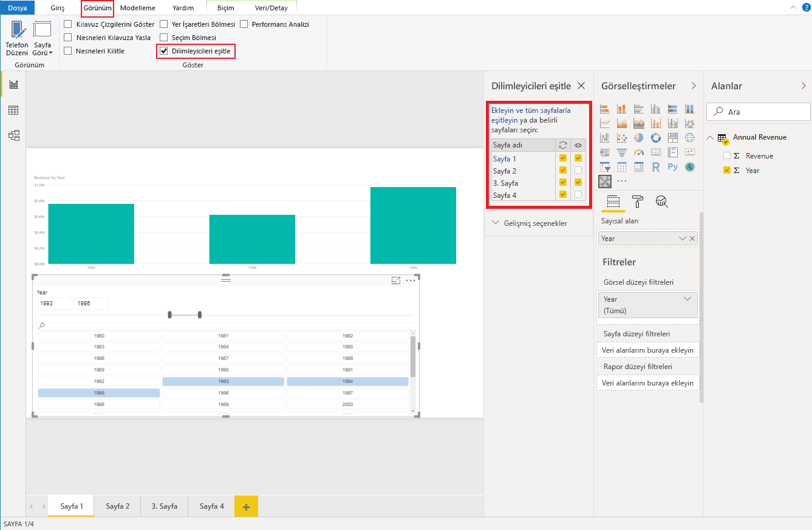

# <a name="sync-slicers-in-power-bi-visuals"></a>Power BI görsellerinde dilimleyicileri eşitleme

[Dilimleyicileri Eşitleme](https://docs.microsoft.com/power-bi/desktop-slicers) özelliğini desteklemek için özel dilimleyici görselinizin API sürüm 1.13 veya üstünü kullanıyor olması gerekir.

Bunun yanı sıra, aşağıdaki kodda gösterildiği gibi bu seçeneği *capabilities.json* dosyasında da etkinleştirmelisiniz:

```json
{
    ...
    "supportsHighlight": true,
    "suppressDefaultTitle": true,
    "supportsSynchronizingFilterState": true,
    "sorting": {
        "default": {}
    }
}
```

*Capabilities.json* dosyasını güncelleştirdikten sonra, özel dilimleyici görselinizi seçtiğinizde **Dilimleyicileri eşitle** seçeneklerini görebilirsiniz.

> [!NOTE]
> Dilimleyicileri Eşitleme özelliği birden fazla alanı desteklemez. Dilimleyicinizin birden fazla alanı varsa (**Kategori** veya **Ölçü**) özellik devre dışı bırakılır.



**Dilimleyicileri eşitle** bölmesinde dilimleyici görünürlüğünüzün ve filtrelemesinin çeşitli rapor sayfalarına uygulanabildiğini görebilirsiniz.
