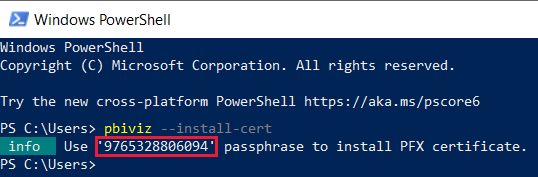
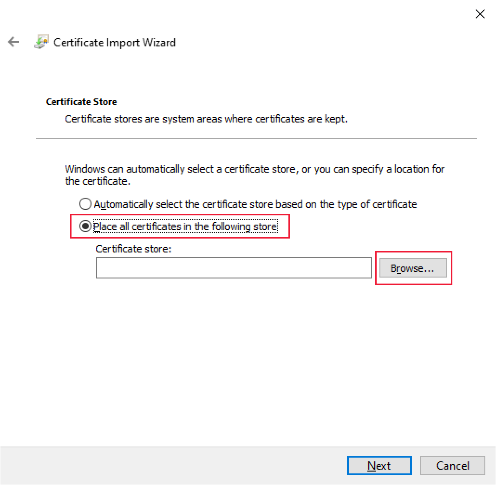
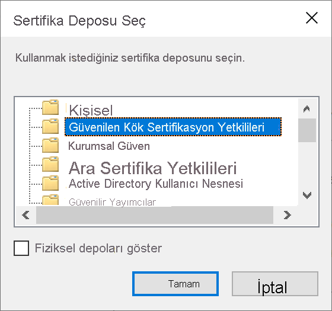
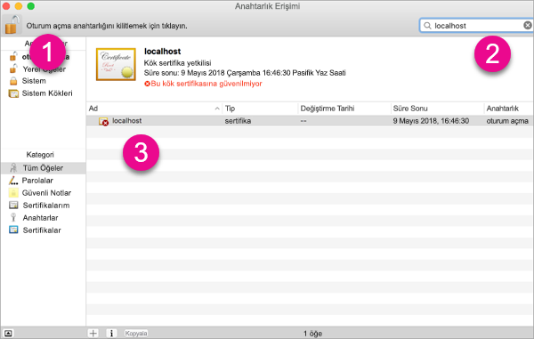
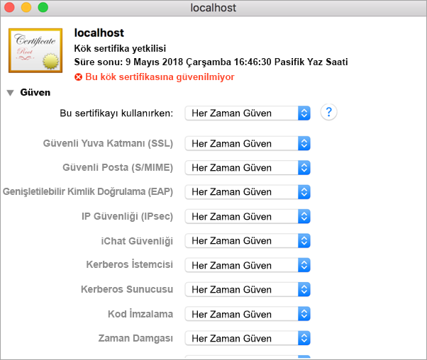
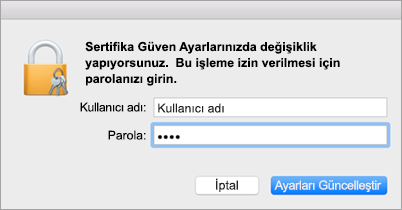
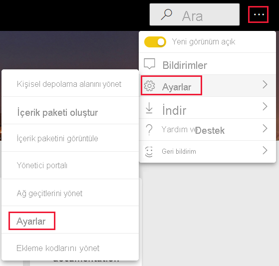
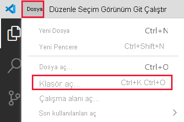
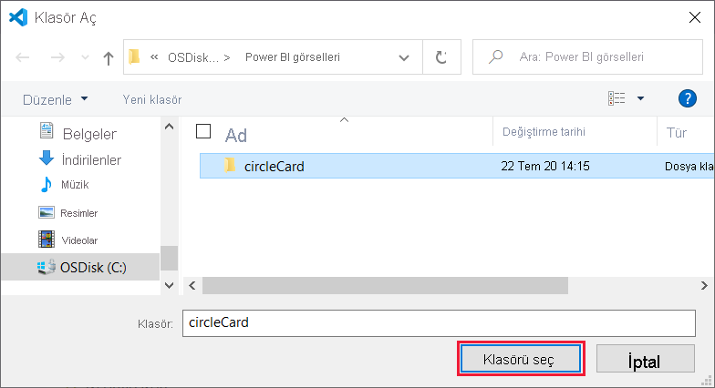
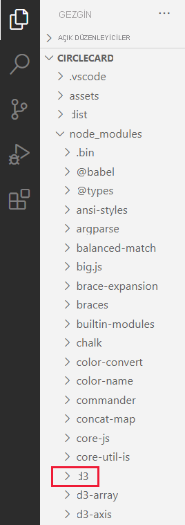

# <a name="set-up-your-environment-for-developing-a-power-bi-visual"></a>Power BI görseli geliştirmek için ortamınızı ayarlama

Bu makalede Power BI görseli geliştirmek için ortamınızı ayarlamayı öğreneceksiniz.

Geliştirmeye başlamadan önce **node.js** ve **pbiviz** paketini yüklemeniz gerekir. Ayrıca bir sertifika oluşturmanız ve yüklemeniz de gerekir. Yerel ortamınızı ayarladıktan sonra Power BI görseli geliştirmek için Power BI hizmetinde de gerekli yapılandırmayı gerçekleştirmeniz gerekecektir.

Bu makalede şunları yapmayı öğreneceksiniz:
> [!div class="checklist"]
> * *node.js*'yi yükleme.
> * *pbiviz*'i yükleme.
> * Sertifika oluşturma ve yükleme.
> * Görsel geliştirme için Power BI hizmeti ayarlama.
> * Ek kitaplıkları yükleme (görsel geliştirmek için gereklidir).

## <a name="install-nodejs"></a>node.js'yi yükleme

*Node.js*, Chrome’un V8 JavaScript altyapısında derlenen bir JavaScript çalışma zamanıdır. Geliştiricilerin JavaScript ile oluşturulan uygulamaları çalıştırmasını sağlar.

1. *node.js*'yi yüklemek için web tarayıcısında [node.js](https://nodejs.org) sayfasına gidin.

2. En son MSI yükleyicisini indirin.

3. Yükleyiciyi çalıştırın ve ardından yükleme adımlarını izleyin. Lisans sözleşmesini ve tüm varsayılan ayarları kabul edin.

4. Bilgisayarınızı yeniden başlatın.

## <a name="install-pbiviz"></a>pbiviz'i yükleme

JavaScript kullanılarak yazılmış olan *pbiviz* aracı, *pbiviz* paketinin görsel kaynak kodunu derler.

*pbiviz* paketi, sıkıştırılmış bir Power BI görseli projesidir ve gerekli tüm betiklerle varlıkları içerir.

1. Windows PowerShell’i açın ve aşağıdaki komutu girin.

    ```powershell
    npm i -g powerbi-visuals-tools
    ```

## <a name="create-and-install-a-certificate"></a>Sertifika oluşturma ve yükleme

İstemcinin (bilgisayarınız) ve sunucunun (Power BI hizmeti) güvenli bir şekilde etkileşim kurması için [Güvenli Yuva Katmanı (SSL) sertifikası](create-ssl-certificate.md) gerekir. Etkileşim güvenliğini sağlayan bir sertifika olmaması durumunda etkileşimler tarayıcı tarafından engellenir.

# <a name="windows"></a>[Windows](#tab/windows)

Bu adım, **Sertifika İçeri Aktarma Sihirbazı**'nı başlatan bir PowerShell komutunu çalıştırmayı anlatmaktadır. Sihirbazda sertifikayı yapılandırmak için aşağıdaki adımları izleyin.

>[!IMPORTANT]
>Bu yordam sırasında PowerShell penceresini kapatmayın.

1. Windows PowerShell’i açın ve aşağıdaki komutu girin.

    ```powershell
    pbiviz --install-cert
    ```

    Bu komut iki işlem gerçekleştirir:
    * Bir *parola* döndürür. Bu örnekte *parola*: 9765328806094.
    * Sertifika İçeri Aktarma Sihirbazı’nı da Başlatır.
    
    >[!div class="mx-imgBorder"]
    >

2. Sertifika İçeri Aktarma Sihirbazı’nda depolama konumunun *Geçerli Kullanıcı* olduğundan emin olun ve **İleri**'yi seçin.

    >[!div class="mx-imgBorder"]
    >

3. **İçeri Aktarılacak Dosya** penceresinde **İleri**’yi seçin.

4. **Özel Anahtar Koruması** penceresindeki *Parola* metin kutusunda PowerShell komutunu yürüttüğünüzde (1. adımda) elde ettiğiniz parolayı yazıp **İleri**'yi seçin. Bu örnekte parola: 9765328806094.

    >[!div class="mx-imgBorder"]
    >

5. **Sertifika Deposu** adımında **Tüm sertifikaları aşağıdaki depoya yerleştir**'i ve ardından **Göz at**'ı seçin.

    >[!div class="mx-imgBorder"]
    >

6. **Sertifika Deposu Seçin** penceresinde **Güvenilen Kök Sertifika Yetkilileri**’ni ve ardından **Tamam**’ı seçin.

    >[!div class="mx-imgBorder"]
    >

7. **Sertifika Deposu** penceresinde *İleri*’yi seçin.

    >[!div class="mx-imgBorder"]
    >

8. **Sertifika İçeri Aktarma Sihirbazı Tamamlanıyor** penceresinde ayarlarınızı doğrulayıp **Son**'u seçin.

    >[!NOTE]
    >Güvenlik uyarısı alırsanız **Evet**’i seçin.


# <a name="osx"></a>[OSX](#tab/sdk2osx)

1. Sol üstteki kilit kapalıysa açmak için kilidi seçin. *localhost*’u bulun ve sertifikaya çift tıklayın.

    

2. **Her Zaman Güven** seçeneğini belirleyip pencereyi kapatın.

    

3. Kullanıcı adınızı ve parolanızı girip **Ayarları Güncelleştir**'i seçin.

    

4. Açık tüm tarayıcıları kapatın.

> [!NOTE]
> Sertifika tanınmıyorsa bilgisayarınızı yeniden başlatın.

---

## <a name="optional-verify-that-your-environment-is-set-up"></a>(İsteğe bağlı) Ortamın ayarlandığını doğrulama

Power BI görsel araçlar paketinin yüklendiğini doğrulayın. PowerShell'de `pbiviz` komutunu çalıştırın ve desteklenen komutların listesi de dahil olmak üzere çıkışı gözden geçirin.

>[!div class="mx-imgBorder"]
>

## <a name="set-up-power-bi-service-for-developing-a-visual"></a>Görsel geliştirme için Power BI hizmeti ayarlama

Power BI görseli geliştirmek için Power BI hizmetinde özel görsel hata ayıklama özelliğini etkinleştirmeniz gerekir. Bu seçeneği etkinleştirmek için bu bölümdeki yönergeleri izleyin.

1. [PowerBI.com](https://powerbi.microsoft.com/) adresinde oturum açın.

2. **Ayarlar** > **Ayarlar** > **Ayarlar** yolunu izleyin.

    >[!div class="mx-imgBorder"]
    >

3. **Genel** sekmesinde **Geliştirici**'yi seçin. **Geliştirici Ayarları** bölümünde **Geliştirici görselini kullanarak özel görsel hata ayıklamayı etkinleştirme** onay kutusunu ve ardından **Uygula**'yı seçin.

    >[!div class="mx-imgBorder"]
    >

## <a name="install-development-libraries"></a>Geliştirme kitaplıklarını yükleme

Kendi Power BI görselinizi geliştirmek için ek kitaplıklar yüklemeniz gerekir. Bu bölümde bu kitaplıkları yükleme ve yüklemenin başarılı olduğunu doğrulama adımları anlatılmaktadır.

Bu makalede listelenen kitaplıkları yüklemek için PowerShell'i açıp her bir bileşene özgü yükleme komutunu girin.

>[!NOTE]
>Bu kitaplıkları bilgisayarınıza yükledikten sonra Power BI görsel projeleri için kullanabilirsiniz. Bu yükleme yordamlarını her makinede bir kez tamamlamanız yeterlidir.


### <a name="d3-javascript-library"></a>D3 JavaScript kitaplığı

[D3](https://d3js.org/), web tarayıcılarında dinamik ve etkileşimli veri görselleştirmeleri oluşturmanızı sağlayan bir JavaScript kitaplığıdır. Yaygın olarak uygulanan Ölçeklenebilir Vektör Grafiği (SVG), HTML5 ve CSS standartlarını kullanır.

```powershell
npm i d3@^5.0.0 --save
```

### <a name="typescript-definitions"></a>TypeScript tanımları

JavaScript'in üst kümesi olan [TypeScript](https://www.typescriptlang.org/) ile kendi Power BI görselinizi geliştirmek için TypeScript tanımlarını yükleyin.

```powershell
npm i @types/d3@^5.0.0 --save
```

### <a name="core-js"></a>core-js

[core-js](https://www.npmjs.com/package/core-js), ECMAScript için gerekli polyfill öğelerini içeren modüler ve standart bir JavaScript kitaplığıdır.

```powershell
npm i core-js@3.2.1 --save
```

### <a name="powerbi-visual-api"></a>powerbi-visual-api

Power BI Görselleri API'si tanımlarını yükler.

```powershell
npm i powerbi-visuals-api --save-dev
```

### <a name="optional-verify-that-the-d3-library-is-installed"></a>(İsteğe bağlı) D3 kitaplığının yüklendiğini doğrulama

[Visual Studio Code](https://code.visualstudio.com/) (VS Code), TypeScript uygulaması geliştirmek için ideal tümleşik geliştirme ortamıdır (IDE). Bu bölümde VS Code'u kullanarak Power BI görseli geliştirmek için gerekli olan D3 kitaplığının doğru şekilde yüklenip yüklenmediğini doğrulayacaksınız.

>[!NOTE]
>Bu bölümde anlatılan doğrulama sürecinde bir Power BI görseli projesine sahip olduğunuz kabul edilmektedir. Power BI görseli projeniz yoksa [daire kartı projesi oluşturma](develop-circle-card.md#create-a-development-project) yönergelerini izleyerek bir proje oluşturabilirsiniz.

1. VS Code’u açın.

    >[!TIP]
    >VS Code'u açmak için PowerShell'de aşağıdaki komutu yürütebilirsiniz:
    >
    >```powershell
    >code .
    >```
2. VS Code'da **Dosya** menüsünü açıp **Klasör Aç**'ı seçin.

    >[!div class="mx-imgBorder"]
    >

3. **Klasör Aç** penceresinde Power BI görsel projenizin bulunduğu klasöre gidip **Klasörü Seç**'i belirleyin.

    >[!div class="mx-imgBorder"]
    >

4. **Gezgin** bölmesinde **node_modules** klasörünü genişletip **d3** kitaplığının yüklendiğini doğrulayın.

    >[!div class="mx-imgBorder"]
    >

5. **Gezgin** bölmesinde **node_modules > @types > d3** yolunu izleyip **index.t.ds** dosyasının yüklendiğini doğrulayın.

    >[!div class="mx-imgBorder"]
    >

## <a name="next-steps"></a>Sonraki adımlar

> [!div class="nextstepaction"]
> [Power BI daire kartı görseli oluşturma](develop-circle-card.md)

> [!div class="nextstepaction"]
> [Power BI çubuk grafik görseli oluşturma](create-bar-chart.md)