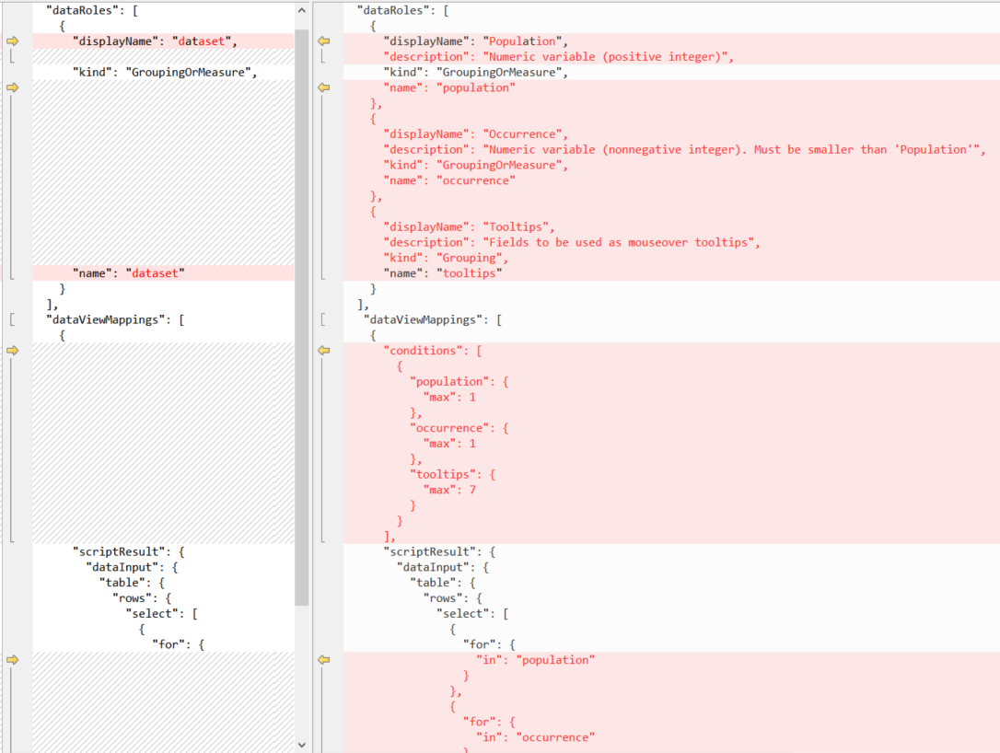
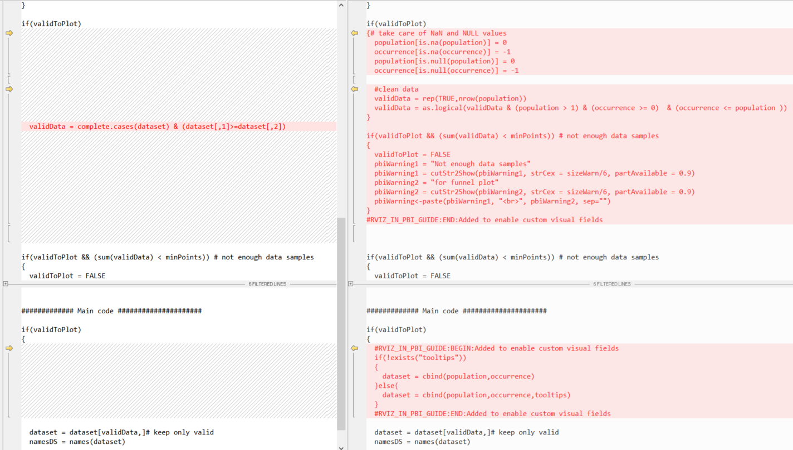

# <a name="tutorial-build-a-funnel-plot-from-r-script-to-r-visual"></a>Öğretici: R betiğinden R görseline bir huni çizimi derleme
Bu makalede, R görselindeki R betiğini kullanarak huni çiziminin nasıl oluşturulacağı adım adım açıklanmaktadır.

Bu makalede şunları oluşturmayı öğreneceksiniz:

> [!div class="checklist"]
>
> * RStudio için R betiği
> * Power BI’da R görseli
> * Power BI’da *PNG tabanlı* R destekli Görsel
> * Power BI’da *HTML tabanlı* R destekli Görsel

Huni çizimi, beklenen varyasyonu tüketip yorumlama ve bu varyasyonun miktarını göstermeye ilişkin kolay bir yöntem sağlar. **Huni**, güven sınırları ve aykırı değerler kullanılarak biçimlendirilir. Bunlar, huninin dışında nokta olarak gösterilir.

Bu örnekte huni çizimi, çeşitli küme verilerini karşılaştırıp analiz etmek için kullanılıyor.  

> [!NOTE]
> Kaynak dosyalar, her adım kümesinin altından indirilebilir.

## <a name="build-an-r-script-with-dataset"></a>Veri kümesi ile R betiği oluşturma

1. [Minimal R betiği](https://github.com/microsoft/PowerBI-visuals/raw/master/RVisualTutorial/TutorialFunnelPlot/chapter1_R/script_R_v1_00.r) ve bu betiğe ait veri tablosu olan [dataset.csv](https://github.com/microsoft/PowerBI-visuals/raw/master/RVisualTutorial/TutorialFunnelPlot/chapter1_R/dataset.csv)’yi indirin.

1. Daha sonra betiği, [bu betiği](https://github.com/microsoft/PowerBI-visuals/raw/master/RVisualTutorial/TutorialFunnelPlot/chapter1_R/script_R_v1_01.r) yansıtacak şekilde düzenleyin. Bu işlem, çizimin görüntüsünü denetlemek için hata işleme ve kullanıcı parametreleri ekler.

## <a name="build-a-report"></a>Rapor oluşturma

Daha sonra betiği, [bu betiği](https://github.com/microsoft/PowerBI-visuals/raw/master/RVisualTutorial/TutorialFunnelPlot/chapter2_Rvisual/script_RV_v2_00.r) yansıtacak şekilde düzenleyin. Bu, Power BI Desktop çalışma alanına *read.csv* yerine *dataset.csv* dosyasını yükler ve bir **Kanserden Ölüm Oranı** tablosu oluşturur. Sonuçları aşağıdaki [PBIX dosyasından](https://github.com/microsoft/PowerBI-visuals/raw/master/RVisualTutorial/TutorialFunnelPlot/chapter2_Rvisual/funnelPlot_Rvisual.pbix) görebilirsiniz.

> [!NOTE]
> `dataset`, herhangi bir R görselinin `data.frame` girişine yönelik sabit kodlanmış bir addır. 

## <a name="create-an-r-powered-visual-and-package-in-r-code"></a>R kodunda R destekli görsel ve paket oluşturma

1. Başlamadan önce [PBIVIZ araçlarını yüklediğinizden](./custom-visual-develop-tutorial.md#installing-packages) emin olun.

1. Yeni bir R destekli görsel oluşturmak için şu komutu çalıştırın:

   ```bash
   pbiviz new funnel-visual -t rvisual
   cd funnel-visual
   npm install 
   pbiviz package
   ```

   Bu komut, ilk şablon görselini (**şablon** için `-t`) içeren *funnel-visual* klasörünü oluşturur. PBIVIZ *dist* klasöründe, R kodu ise *script.r* dosyasında bulunabilir. Bunu Power BI’a içeri aktarmayı deneyin ve ne olduğunu görün.

1. *script.r* dosyasını düzenleyin ve içeriği önceki betiğinizle değiştirin.

1. *capabilities.json* dosyasını düzenleyin ve `Values` dizesini `dataset` ile değiştirin. Bu, şablondaki “Rol” adını R kodundakine benzeyecek şekilde değiştirir.

   

1. *(isteğe bağlı)* *dependencies.json* dosyasını düzenleyin ve R betiği için gereken her R pakete yönelik bir bölüm ekleyin. Bu işlem Power BI’a, görsel ilk kez yüklendiğinde bu paketleri otomatik olarak içeri aktarmasını söyler.

   

1. `pbiviz package` komutunu kullanarak görseli yeniden paketleyin ve Power BI’a içeri aktarmayı deneyin.

> [!NOTE]
> İndirme için [PBIX](https://github.com/microsoft/PowerBI-visuals/blob/master/RVisualTutorial/TutorialFunnelPlot/chapter3_RCustomVisual/funnelPlot_RCustomVisual.pbix) ve [kaynak koduna](https://github.com/Microsoft/PowerBI-visuals/tree/master/RVisualTutorial/TutorialFunnelPlot/chapter3_RCustomVisual/funnelRvisual_v01/) bakın.

## <a name="make-r-based-visual-improvements"></a>R tabanlı görsel iyileştirmeler yapma

Kullanıcının giriş tablosundaki sütun sırasını bilmesi gerektiğinden, görsel henüz kullanıcı dostu değildir.

1. `dataset` giriş alanını üç alana (role) bölün: `Population`, `Number` ve `Tooltips`

   

1. *capabilities.json* dosyasını düzenleyin ve `dataset` rolünü üç yeni rolle değiştirin veya [capabilities.json](https://github.com/microsoft/PowerBI-visuals/raw/master/RVisualTutorial/TutorialFunnelPlot/chapter3_RCustomVisual/funnelRvisual_v02/capabilities.json) dosyasını indirin.

   Bölümleri güncelleştirmeniz gerekir: Ad, tür, araç ipucu ve her giriş alanına yönelik en fazla sütun sayısını tanımlayan `dataRoles` ve `dataViewMappings`.

   
   
   Daha fazla bilgi için bkz. [capabilities](./capabilities.md).

1. *script.r* dosyasını, giriş veri çerçeveleri olarak `dataset` yerine `Population`, `Number` ve `Tooltips` değerlerini destekleyecek şekilde düzenleyin veya [script.r](https://github.com/microsoft/PowerBI-visuals/raw/master/RVisualTutorial/TutorialFunnelPlot/chapter3_RCustomVisual/funnelRvisual_v02/script.r) dosyasını indirin.

   

   > [!TIP]
   > R betiğindeki değişiklikleri izlemek için açıklama bloklarını arayın: 
   > 
   > ```r
   > #RVIZ_IN_PBI_GUIDE:BEGIN: Added to enable visual fields
   > ...
   > #RVIZ_IN_PBI_GUIDE:END: Added to enable visual fields
   > 
   > #RVIZ_IN_PBI_GUIDE:BEGIN: Removed to enable visual fields 
   > ...
   > #RVIZ_IN_PBI_GUIDE:BEGIN: Removed to enable visual fields
   > ```

1. `pbiviz package` komutunu kullanarak görseli yeniden paketleyin ve Power BI’a içeri aktarmayı deneyin.

> [!NOTE]
> İndirme için [PBIX](https://github.com/microsoft/PowerBI-visuals/raw/master/RVisualTutorial/TutorialFunnelPlot/chapter3_RCustomVisual/funnelPlot_RCustomVisual.pbix) ve [kaynak koduna](https://github.com/Microsoft/PowerBI-visuals/tree/master/RVisualTutorial/TutorialFunnelPlot/chapter3_RCustomVisual/funnelRvisual_v02) bakın.

## <a name="add-user-parameters"></a>Kullanıcı parametreleri ekleme

1. Kullanıcı arabirimindeki iç parametreler de dahil olmak üzere, görsel öğelerdeki renk ve boyutları denetlemek amacıyla kullanıcı için özellikler ekleyin.

   

1. *capabilities.json* dosyasını düzenleyip `objects` bölümünü güncelleştirin. Burada her parametrenin adını, araç ipuçlarını ve türlerini tanımlayıp parametrelerin gruplara ayrılmasına (bu örnekte üç grup) karar veririz.

   [capabilities.json](https://github.com/Microsoft/PowerBI-visuals/tree/master/RVisualTutorial/TutorialFunnelPlot/chapter3_RCustomVisual/funnelRvisual_v03/capabilities.json) dosyasını indirin, daha fazla bilgi için bkz. [nesne özellikleri](./objects-properties.md)

   

1. *src/settings.ts* dosyasını [bu settings.ts](https://github.com/Microsoft/PowerBI-visuals/tree/master/RVisualTutorial/TutorialFunnelPlot/chapter3_RCustomVisual/funnelRvisual_v03/src/settings.ts) dosyasını yansıtacak şekilde düzenleyin. Bu dosya TypeScript dilinde yazılmıştır.  

   Burada, şuna eklenen iki kod bloğu bulacaksınız:
   - Özellik değerini tutmak için yeni arabirimi bildirme
   - Üye özelliğini ve varsayılan değerleri tanımlama

   

1. *script.r* dosyasını [bu script.r](https://github.com/Microsoft/PowerBI-visuals/tree/master/RVisualTutorial/TutorialFunnelPlot/chapter3_RCustomVisual/funnelRvisual_v03/script.r) dosyasını yansıtacak şekilde düzenleyin. Bu, kullanıcı parametresi başına `if.exists` çağrı ekleyerek kullanıcı arabirimindeki parametrelere yönelik destek ekler.

   > [!TIP]
   > R betiğindeki değişiklikleri izlemek için açıklamaları arayın:
   >
   > ```r
   > #RVIZ_IN_PBI_GUIDE:BEGIN:Added to enable user parameters
   >  ...
   > #RVIZ_IN_PBI_GUIDE:END:Added to enable user parameters
   >
   > #RVIZ_IN_PBI_GUIDE:BEGIN:Removed to enable user parameters 
   >  ...
   > #RVIZ_IN_PBI_GUIDE:END:Removed to enable user parameters
   > ```

   

   Bizim yaptığımız gibi, parametreleri kullanıcı arabiriminde kullanıma sunmamaya karar verebilirsiniz.  

1. `pbiviz package` komutunu kullanarak görseli yeniden paketleyin ve Power BI’a içeri aktarmayı deneyin.

> [!NOTE]
> İndirme için [PBIX](https://github.com/Microsoft/PowerBI-visuals/tree/master/RVisualTutorial/TutorialFunnelPlot/chapter3_RCustomVisual/funnelPlot_RCustomVisual.pbix) ve [kaynak koduna](https://github.com/Microsoft/PowerBI-visuals/tree/master/RVisualTutorial/TutorialFunnelPlot/chapter3_RCustomVisual/funnelRvisual_v03/) bakın.

> [!TIP]
> Burada birkaç türden parametrenin (boole, sayısal, dize ve renk) hepsini aynı anda ekledik. Basit bir örnek olması açısından, tek bir parametrenin nasıl ekleneceğini gösteren [bu örneğe](https://github.com/Microsoft/PowerBI-visuals/blob/master/RVisualTutorial/PropertiesPane.md) göz atın. 

## <a name="convert-visual-to-rhtml-based-visual"></a>Görseli RHTML tabanlı görsele dönüştürme

Elde edilen görsel PNG tabanlı olduğundan, fare ile üzerine gelmeye karşı duyarlı değildir, yakınlaştırılamaz; dolayısıyla bunu HTML tabanlı bir görsele dönüştürmemiz gerekir. Boş bir R destekli HTML tabanlı Görsel şablonu oluşturup PNG tabanlı nesneden bazı betikleri kopyalayacağız.

1. Şu komutu çalıştırın:

   ```bash
   pbiviz new funnel-visual-HTML -t rhtml
   cd funnel-visual-HTML
   npm install 
   pbiviz package
   ```

1. *capabilities.json* dosyasını açın ve `"scriptOutputType":"html"` satırını not alın.

1. *dependencies.json* dosyasını açın ve listelenen R paketlerinin adlarını not alın.

1. *script.r* dosyasını açın ve yapıyı not alın. Dış giriş kullanmadığından, bunu RStudio’da açıp çalıştırabilirsiniz. 

   Bu işlem *out.html* dosyasını oluşturup kaydeder. Bu dosya bağımsızdır (dış bağımlılığı yoktur) ve HTML arabirim öğesindeki grafikleri tanımlar. 

   > [!IMPORTANT]
   > `htmlWidgets` kullanıcıları için, `plotly` veya `widget` nesnelerini bağımsız içeriğe sahip HTML’ye dönüştürmeye yardımcı olması için R yardımcı programları [r_files klasöründe](https://github.com/Microsoft/PowerBI-visuals/tree/master/RVisualTutorial/TutorialFunnelPlot/chapter4_RHTMLCustomVisual/funnelRHTMLvisual_v01/r_files) sağlanır. 
   > 
   > R destekli görselin bu sürümü, kodunuzu daha okunur hale getirmek için `source` komutunu da destekler (önceki görsel türlerinin aksine).   
 
1. *capabilities.json* dosyasını önceki adımdaki *capabilities.json* dosyasıyla değiştirin veya [capabilities.json](https://github.com/Microsoft/PowerBI-visuals/tree/master/RVisualTutorial/TutorialFunnelPlot/chapter4_RHTMLCustomVisual/funnelRHTMLvisual_v01/capabilities.json) dosyasını indirin.

   Şunları sürdürdüğünüzden emin olun:

   `"scriptOutputType": "html"`

1. *script.r* dosyasının en son sürümünü şablondaki *script.r* ile birleştirin veya [script.r](https://github.com/Microsoft/PowerBI-visuals/tree/master/RVisualTutorial/TutorialFunnelPlot/chapter4_RHTMLCustomVisual/funnelRHTMLvisual_v01/script.r) dosyasını indirin.

   Yeni betik, **ggplot** nesnesini **plotly** nesnesine dönüştürmek için `plotly` paketini ve sonra bunu bir HTML dosyasına kaydetmek için `htmlWidgets` paketini kullanır. 

   Pek çok yardımcı işlev [_r_files/utils.r_](https://github.com/Microsoft/PowerBI-visuals/tree/master/RVisualTutorial/TutorialFunnelPlot/chapter4_RHTMLCustomVisual/funnelRHTMLvisual_v01/r_files/utils.r) dizinine taşınır ve **plotly** nesnesinin görünümü için `generateNiceTooltips` işlevi eklenir.

   
   
   

   > [!TIP]
   > R betiğindeki değişiklikleri izlemek için açıklamaları arayın:
   > 
   > ```r
   > #RVIZ_IN_PBI_GUIDE:BEGIN:Added to create HTML-based 
   >  ...
   > #RVIZ_IN_PBI_GUIDE:BEGIN:Added to create HTML-based
   >
   > #RVIZ_IN_PBI_GUIDE:BEGIN:Removed to create HTML-based  
   > ...
   > #RVIZ_IN_PBI_GUIDE:BEGIN:Removed to create HTML-based
   > ```

1. Yeni R paketi bağımlılıklarını dahil etmek için *dependencies.json* dosyasının en son sürümünü şablondaki *dependencies.json* ile birleştirin veya [dependencies.json](https://github.com/Microsoft/PowerBI-visuals/tree/master/RVisualTutorial/TutorialFunnelPlot/chapter4_RHTMLCustomVisual/funnelRHTMLvisual_v01/dependencies.json) dosyasını indirin.

1. *src/settings.ts* dosyasını önceki adımlarda olduğu şekilde düzenleyin.

1. `pbiviz package` komutunu kullanarak görseli yeniden paketleyin ve Power BI’a içeri aktarmayı deneyin.

> [!NOTE]
> İndirme için [PBIX ve kaynak koduna](https://github.com/Microsoft/PowerBI-visuals/tree/master/RVisualTutorial/TutorialFunnelPlot/chapter4_RHTMLCustomVisual/funnelRHTMLvisual_v01) bakın.

## <a name="build-additional-examples"></a>Ek örnekler oluşturma

1. Boş bir proje oluşturmak için aşağıdaki komutu çalıştırın: 

   ```bash
   pbiviz new example -t rhtml
   cd example
   npm install 
   pbiviz package
   ```

1. Bu [gösterimdeki](http://www.htmlwidgets.org/showcase_networkD3.html) kodu alın ve vurgulanan değişiklikleri yapın:

   

1. Şablonunuzun *script.r* dosyasını değiştirin ve `pbiviz package` komutunu yeniden çalıştırın. Böylece görsel, Power BI raporunuza dahil edildi!

## <a name="tips-and-tricks"></a>İpuçları ve püf noktaları

* Geliştiricilerin **sürüm**, **e-posta**, **ad**, **lisans türü** vb. gibi doğru meta verileri depolaması için geliştiricilerin *pbiviz.json* dosyasını düzenlemesini öneririz.

   > [!IMPORTANT]
   > **GUID** alanı, bir görsel için benzersiz tanımlayıcıdır. Her görsel için yeni bir proje oluşturursanız GUID de farklı olacaktır. GUID yalnızca yeni görsele kopyalanan eski bir projeyi kullanırken aynı olur, bunu yapmanız önerilmez.

* Görseliniz için benzersiz simgeler oluşturmak üzere [*assets/icon.png*](https://github.com/Microsoft/PowerBI-visuals/tree/master/RVisualTutorial/TutorialFunnelPlot/chapter4_RHTMLCustomVisual/funnelRHTMLvisual_v01/assets/icon.png) dosyasını düzenleyin. 

* Power BI raporunuzdaki verilerle RStudio’daki R kodunda hata ayıklamak için R betiğinin başına aşağıdakileri ekleyin (`fileRda` değişkenini düzenleyin):

   ```r
   #DEBUG in RStudio
   fileRda = "C:/Users/yourUserName/Temp/tempData.Rda"
   if(file.exists(dirname(fileRda)))
   {
     if(Sys.getenv("RSTUDIO")!="")
       load(file= fileRda)
     else
       save(list = ls(all.names = TRUE), file=fileRda)
   }
   ```

   Bu, Power BI raporundaki ortamı kaydedip RStudio’ya yükler. 

* [GitHub](https://github.com/Microsoft?utf8=%E2%9C%93&q=PowerBI&type=&language=R)’daki kullanılabilir kodlar sayesinde R destekli Görselleri en baştan geliştirmeniz gerekmez. Görseli şablon olarak kullanmak üzere seçebilir ve kodu yeni bir projeye kopyalayabilirsiniz.

   Örneğin, [eğri cetveli özel görselini](https://github.com/Microsoft/PowerBI-visuals-spline) kullanmayı deneyin.

* Her R Görseli, giriş tablosuna `unique` işlecini uygular. Özdeş satırların kaldırılmasını önlemek için benzersiz kimliğe sahip ek bir giriş alanı ekleyip bunu R kodunda yoksaymak yararlı olabilir.   

* Power BI hesabınız varsa görseli `pbiviz package` komutuyla yeniden paketlemek yerine [çalışma sırasında](./custom-visual-develop-tutorial.md) geliştirmek için Power BI hizmetini kullanın.

### <a name="html-widgets-gallery"></a>HTML pencere öğeleri galerisi
Sonraki görselde kullanılmak üzere [HTML pencere öğeleri galerisindeki](http://gallery.htmlwidgets.org/) görselleri keşfedin. İşlemlerinizi kolaylaştırmak adına, aralarından seçim yapabileceğiniz 20’den fazla etkileşimli HTML görseli içeren bir [görsel proje deposu](https://github.com/Microsoft/PowerBI-visuals/tree/master/RVisualTutorial/TutorialFunnelPlot/chapter4_RHTMLCustomVisual/multipleRHTML) oluşturduk!

> [!TIP]
> HTML pencere öğeleri arasında geçiş yapmak için **Biçim** > **Ayarlar** > **Tür**’ü kullanın. [Bu PBIX dosyasıyla](https://github.com/Microsoft/PowerBI-visuals/tree/master/RVisualTutorial/TutorialFunnelPlot/chapter4_RHTMLCustomVisual/multipleRHTML/assets/sample.pbix) deneyin. 

#### <a name="to-use-a-sample-for-your-visual"></a>Görselinizde bir örnek kullanmak için:

1. Klasörün tamamını indirin.
1. Yalnızca bir pencere öğesi tutmak için *script.r* ve *dependencies.json* dosyalarını düzenleyin.
1. `Type` seçicisini kaldırmak için *capabilities.json* ve *settings.ts* dosyalarını düzenleyin.
1. *visual.ts* dosyasındaki `const updateHTMLHead: boolean = true;` değerini `false` olarak değiştirin. *(daha iyi performans için)*
1. *pbiviz.json* dosyasındaki meta verileri, özellikle `guid` alanını değiştirin.
1. Yeniden paketleyin ve görseli dilediğiniz gibi özelleştirmeye devam edin. 


> [!NOTE]
> Bu projedeki arabirim öğelerinin tamamı hizmet tarafından desteklenmez.

## <a name="next-steps"></a>Sonraki adımlar

Daha fazla bilgi için [Power BI görselleri](./custom-visual-develop-tutorial.md) ve [R görsellerindeki](../../visuals/service-r-visuals.md) ek öğreticilere başvurun.

[Görselleri geliştirip](https://powerbi.microsoft.com/documentation/powerbi-developer-office-store/) [Office Mağazasına (galeri)](https://store.office.com/appshome.aspx?ui=en-US&rs=en-US&ad=US&clickedfilter=OfficeProductFilter%3aPowerBI&productgroup=PowerBI) göndermeyi öğrenin veya daha fazla örnek için [R betiği gösterimine](https://community.powerbi.com/t5/R-Script-Showcase/bd-p/RVisuals) göz atın