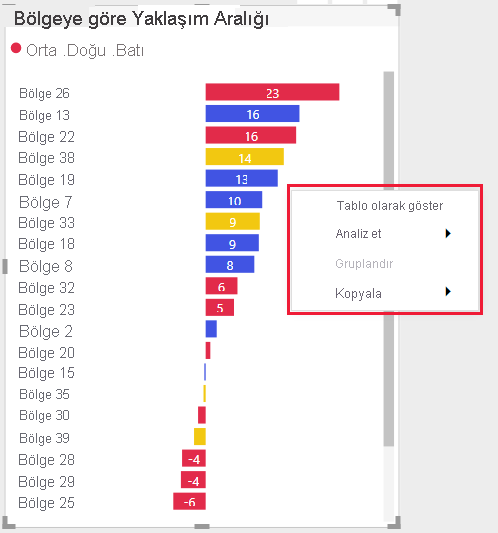

# Power BI görselleri için yönergeler
Power BI görselinizi başkalarının bulması ve kullanması amacıyla Microsoft AppSource’ta [yayımlamadan](office-store.md) önce kullanıcılarınıza yönelik harika bir deneyim oluşturmak için aşağıdaki yönergeleri izlediğinizden emin olun.

## Ek satın almaları olan Power BI görselleri

Market’te ücretsiz olan Power BI görselleri gönderebilirsiniz (Microsoft AppSource). "Ek satın alma işlemleri gerekebilir" fiyat etiketine sahip Microsoft AppSource Power BI görselleri de gönderebilirsiniz. "Ek satın alma işlemleri gerekebilir" etiketine sahip Power BI görselleri, Office Mağazası'ndaki uygulama için satın alma (IAP) eklentilerine benzer. 

Ücretsiz bir Power BI görseline benzer şekilde, bir IAP Power BI görseli de sertifikalı olabilir. Sertifika için IAP Power BI görselinizi göndermeden önce [sertifika gereksinimleriyle](power-bi-custom-visuals-certified.md)uyumlu olduğundan emin olun.

### IAP özelliklerine sahip Power BI görseli nedir?

IAP Power BI görseli, *ücretsiz özelliklere* sahip *ücretsiz* bir görseldir. Ek ücret gerektiren gelişmiş özelliklere de sahip olabilir. Geliştiricilerin, Power BI görselinin açıklamasında çalıştırmak için ek satın almalar gereken özellikleri kullanıcılara bildirmesi gerekir. Şu anda Microsoft, uygulama içinde ve eklentilerde satın almayı desteklemek için yerel API'ler sağlamamaktadır.

Geliştiriciler söz konusu satın almalarda üçüncü taraf bir ödeme sistemi kullanabilir. Daha fazla bilgi için [mağaza ilkemize](/legal/marketplace/certification-policies#11002-displaying-ads) bakın.

>[!IMPORTANT]  
> Power BI görselinizi ücretsizden "Ek satın alma işlemleri gerekebilir" düzeyine güncelleştirmek için kullanıcıların güncelleştirme öncesiyle aynı ücretsiz işlevsellik düzeyini elde etmesi gerekir. Var olan ücretsiz özelliklerin üzerine isteğe bağlı olarak gelişmiş ücretli özellikler ekleyebilirsiniz.

### Filigranlar

Filigranları, müşterilerin ödeme yapmadan IAP gelişmiş özelliklerini kullanmaya devam etmesini sağlamak için kullanabilirsiniz. 

Filigranlar, satın alma yapılmadan önce Power BI görselindeki tüm işlevselliği göstermek için kullanılabilir. 

* Filigranlar yalnızca geçerli bir lisans olmadan kullanılan ücretli özelliklerde kullanılabilir.
* *Ücretsiz* fiyat etiketine sahip Power BI görsellerinde filigranlara izin verilmez.
* Kullanıcının ücretsiz özellikleri kullandığı IAP görsellerinde filigranlara izin verilmez. 

### Açılır pencere

Power BI IAP görselinizle geçersiz (veya süresi dolmuş) bir lisans kullanıldığında, bir lisansın nasıl satın alınacağını açıklamak için bir açılır pencere kullanabilirsiniz.

### Gönderme işlemi

[Gönderme işlemini](office-store.md#submitting-to-appsource) uygulayın, ardından *Ürün kurulumu* sekmesine gidin ve *Ürünüm için hizmet satın alınması gerekiyor* onay kutusunu işaretleyin.

Power BI görseli doğrulandıktan ve onaylandıktan sonra, IAP Power BI görseli için Microsoft AppSource listesinde, fiyat seçeneklerinin altında "Ek satın alma işlemleri gerekebilir" belirtimi yer alır.

## Bağlam menüsü
Bağlam menüsü, kullanıcı imlecini bir görselin üzerine getirdiğinde görüntülenen sağ tıklama menüsüdür.
Birleşik bir deneyim sunmak için tüm Power BI görsellerinde bağlam menüsü etkinleştirmelidir.
Bağlam menüsü eklemeyi öğrenmek için lütfen [bu makaleye](https://github.com/Microsoft/PowerBI-visuals/blob/gh-pages/tutorials/building-bar-chart/adding-context-menu-to-the-bar.md) bakın.

>[!div class="mx-imgBorder"]
>

## Ticari logo
Bu bölümde, Power BI görsellerine ticari logo ekleme belirtimleri açıklanır. Ticari logolar zorunlu değildir. Eklendiyse, bu kurallara uymalıdır.

> [!NOTE]
> * Bu makalede 'ticari logo' ifadesi aşağıdaki resimlerde açıklandığı gibi herhangi bir ticari şirket logosu için kullanılır.
> * Microsoft ticari logosu, bu makalede yalnızca örnek olarak kullanılır. Power BI görseliniz ile kendi ticari logonuzu kullanın.

> [!IMPORTANT]
> Ticari logolara *yalnızca düzenleme modunda* izin verilir. Ticari logolar görüntüleme modunda *gösterilemez*.

### Ticari logo türü

Üç tür ticari logo vardır:
* **Logo** - Logo, birlikte kullanılan bir simge ve bir addan oluşur.

    

* **Sembol** - Metin içermeyen bir grafik.

    

* **Logo türü** - Yalnızca metinden oluşan, simgesi olmayan bir logo.

    

### Ticari logo rengi

Ticari bir logo kullanılırken, logo rengi gri (onaltılı renk #C8C8C8) olmalıdır. Ticari logoya gradyanlar gibi efektler eklemeyin.

* **Logo**

    

* **Sembol** - Metin içermeyen bir grafik.

    

* **Logo türü** - Yalnızca metinden oluşan, simgesi olmayan bir logo.

    

> [!TIP]
> * Power BI görseliniz bir grafik içeriyorsa logonuza beyaz arka plan (10 piksel kenar boşlukları ile) eklemeniz yararlı olabilir.
> * Logonuza gölge (%30 opak siyah) eklemeyi düşünün.

### Ticari logo boyutu

Bir Power BI görseli, biri büyük kutucuklar ve diğeri küçük kutucuklar için olmak üzere iki ticari logo gerektirir. Logoyu, 4 piksel kenar boşluğu ile üst veya sağ alt köşeye yerleştirilmiş bir sınırlayıcı kutunun içine yerleştirin.

Aşağıdaki tabloda Power BI görselleri için boyut hakkında dikkat edilmesi gereken noktalar açıklanmaktadır.

|Ayarlar  |Küçük Power BI görseli  |Büyük Power BI görseli  |
|---------|---------|---------|
|*Logo genişliği*    |En fazla 240 piksel         |240 pikselden büyük         |
|*Logo yüksekliği*     |En fazla 160 piksel         |160 pikselden büyük         |
|*Sınırlayıcı kutu boyutu*     |40 x 15 piksel         |101 x 30 piksel         |
|*Ticari logo örneği*     |         |         |
|*Sınırlayıcı kutu örneği*    |         |         |
|    |         |         |

### Ticari logo davranışı

Ticari logolara yalnızca düzenleme modunda izin verilir. Tıklandığında, ticari logo yalnızca aşağıdaki işlevleri içerebilir:

* Ticari logoya tıklamak web sitenize yönlendirir.

* Ticari logoya tıklamak ek bilgiler içeren bir açılan pencere görüntüler. Açılan pencere, iki bölüme ayrılmalıdır:
    * Ticari logoyu, bir görseli ve market derecelendirmelerini içerebilen bir pazarlama alanı.
    * Bilgiler ve bağlantılar içerebilen bir bilgi alanı.    

### Yapılmaması gerekenler

* Ticari logolar görüntüleme modunda gösterilemez.

* Animasyonlu bir ticari logo, en fazla beş saniyeye kadar animasyon görüntüleyebilir.

* Power BI görseliniz okuma modunda bilgilendirici simgeler (i) içeriyorsa, yukarıda açıklandığı gibi ticari logo rengine, boyutuna ve konumuna uymalıdır.

* Renkli veya siyah bir ticari logo kullanmaktan kaçının. Ticari logo gri olmalıdır (onaltılı renk #C8C8C8).

     

* Gradyan veya güçlü gölgeler gibi efektler içeren bir ticari logo.

    

## En iyi uygulamalar

Power BI görseli yayımlarken, kullanıcılara harika bir deneyim sunmak için aşağıdaki önerileri göz önünde bulundurun.

### Görsel giriş sayfası

Power BI görselinizi nasıl kullanabilecekleri ve lisansı nereden satın alabilecekleri konusunda kullanıcıları bilgilendirmek için giriş sayfasını kullanın. Otomatik olarak tetiklenen videolar eklemeyin. Lisans satın alma ayrıntılarıyla ilgili bilgiler veya bağlantılar ve IAP özelliklerinin kullanımı gibi, yalnızca kullanıcı deneyimini geliştirmeye yardımcı olacak malzemeleri ekleyin.

### Lisans anahtarı ve belirteci

Kullanıcıya kolaylık sağlamak için, biçim bölmesinin üst kısmına lisans anahtarı veya belirteciyle ilgili alanları ekleyin.

## SSS

Power BI görselleri hakkında daha fazla bilgi için bkz. [Ek satın almalar gerektiren Power BI görselleri hakkında sık sorulan sorular](power-bi-custom-visuals-faq.md#visuals-with-additional-purchases).

## Sonraki adımlar

Power BI görselinizi diğer kullanıcıların keşfetmesi ve kullanması amacıyla Microsoft AppSource’ta nasıl yayımlayabileceğinizi öğrenin.

>[!div class="nextstepaction"]
>[Power BI görsellerini yayımlama](office-store.md)