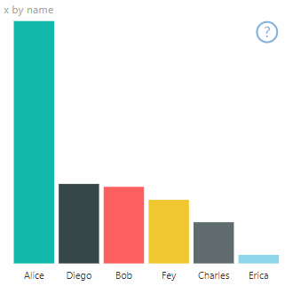
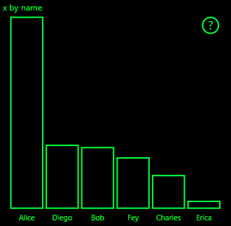
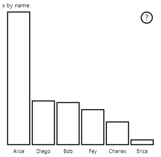

# <a name="high-contrast-mode-support-in-power-bi-visuals"></a>Power BI görsellerinde yüksek karşıtlık modu desteği

Windows *yüksek karşıtlık* ayarı daha belirgin renkler görüntüleyerek metin ve uygulamaları daha kolay görünür hale getirir. Bu makalede Power BI görsellerine yüksek karşıtlık modu desteği ekleme işlemi ele alınmıştır. Daha fazla bilgi için bkz. [Power BI’da yüksek karşıtlık desteği](https://powerbi.microsoft.com/blog/power-bi-desktop-june-2018-feature-summary/#highContrast).

Yüksek karşıtlık desteğinin nasıl uygulandığını görüntülemek için [PowerBI-visuals-sampleBarChart görsel deposuna](https://github.com/Microsoft/PowerBI-visuals-sampleBarChart/commit/61011c82b66ca0d3321868f1d089c65101ca42e6) gidin.

## <a name="on-initialization"></a>Başlatmada

`options.host` colorPalette üyesinin, yüksek karşıtlık modu için birkaç özelliği vardır. Yüksek karşıtlık modunun etkin olup olmadığını ve etkinse hangi renklerin kullanılacağını belirlemek için bu özellikleri kullanın.

### <a name="detect-that-power-bi-is-in-high-contrast-mode"></a>Power BI’ın yüksek karşıtlıklı modda olduğunu algılama

`host.colorPalette.isHighContrast` `true` ise, yüksek karşıtlık modu etkindir ve görselin kendisini buna uygun şekilde çizmesi gerekir.

### <a name="get-high-contrast-colors"></a>Yüksek karşıtlıklı renkler alın

Yüksek karşıtlık modunda, görseliniz kendisini aşağıdaki ayarlarla sınırlandırmalıdır:

* **Ön plan** rengi, tüm çizgileri, simgeleri, metinleri ve şekillerin ana hatları veya dolgusunu çizmek için kullanılır.
* **Arka plan** rengi, arka plan ve ana hatları belirlenmiş şekillerin dolgu rengi olarak kullanılır.
* **Ön plan - seçili** rengi seçili veya etkin bir öğeyi göstermek için kullanılır.
* **Köprü** rengi yalnızca köprü metni için kullanılır.

> [!NOTE]
> İkincil bir renk gerekliyse, ön plan rengi biraz opak olarak kullanılabilir (Power BI yerel görselleri % 40 opaklık kullanır). Görsel ayrıntıların kolayca görülmesini sağlamak için bunu seyrek bir şekilde kullanın.

Başlatma sırasında aşağıdaki değerleri depolayabilirsiniz:

```typescript
private isHighContrast: boolean;

private foregroundColor: string;
private backgroundColor: string;
private foregroundSelectedColor: string;
private hyperlinkColor: string;
//...

constructor(options: VisualConstructorOptions) {
    this.host = options.host;
    let colorPalette: ISandboxExtendedColorPalette = host.colorPalette;
    //...
    this.isHighContrast = colorPalette.isHighContrast;
    if (this.isHighContrast) {
        this.foregroundColor = colorPalette.foreground.value;
        this.backgroundColor = colorPalette.background.value;
        this.foregroundSelectedColor = colorPalette.foregroundSelected.value;
        this.hyperlinkColor = colorPalette.hyperlink.value;
    }
```

Öte yandan başlatma sırasında `host` nesnesini de depolayabilir ve güncelleştirme sırasında ilgili `colorPalette` özelliklerine erişebilirsiniz.

## <a name="on-update"></a>Güncelleştirme sırasında

Yüksek karşıtlık desteğinin belirli uygulamaları görselden görsele farklılık gösterir ve grafik tasarımının ayrıntılarına bağlıdır. Önemli ayrıntıların sınırlı renklerle ayırt edilmesini kolaylaştırmak için, yüksek karşıtlık modu normal olarak varsayılan moddan biraz farklı bir tasarım gerektirir.

Power BI yerel görselleri şu yönergelere uyar:

* Tüm veri noktaları aynı rengi (ön plan) kullanır.
* Tüm metinler, eksenler, oklar, çizgiler ve benzeri öğeler ön plan rengini kullanır.
* Kalın şekiller, kalın çizgiler (en az iki piksel) ve arka plan rengi dolgusu ile ana hatlar olarak çizilir.
* Veri noktaları ilgili olduğunda farklı işaret şekilleriyle ayırt edilir ve veri satırları farklı çizgilerle ayırt edilir.
* Bir veri öğesi vurgulandığında, diğer tüm öğelerin opaklığı %40 olarak değiştirilir.
* Dilimleyiciler için etkin filtre öğeleri ön plan seçili rengini kullanır.

Aşağıdaki örnek çubuk grafikte, tüm çubuklar iki piksel kalın ön plan ana hattı ve arka plan dolgusu ile çizilir. Varsayılan renklerle ve birkaç yüksek karşıtlık teması ile görünme şeklini karşılaştırın:





Sonraki bölümde `visualTransform` işlevinde yüksek karşıtlığı desteklemek için değiştirilen bir konum gösterilir. Güncelleştirme sırasında işleme kapsamında çağrılır.

### <a name="before"></a>Önce

```typescript
for (let i = 0, len = Math.max(category.values.length, dataValue.values.length); i < len; i++) {
    let defaultColor: Fill = {
        solid: {
            color: colorPalette.getColor(category.values[i] + '').value
        }
    };

    barChartDataPoints.push({
        category: category.values[i] + '',
        value: dataValue.values[i],
        color: getCategoricalObjectValue<Fill>(category, i, 'colorSelector', 'fill', defaultColor).solid.color,
        selectionId: host.createSelectionIdBuilder()
            .withCategory(category, i)
            .createSelectionId()
    });
}
```

### <a name="after"></a>Sonra

```typescript
for (let i = 0, len = Math.max(category.values.length, dataValue.values.length); i < len; i++) {
    const color: string = getColumnColorByIndex(category, i, colorPalette);

    const selectionId: ISelectionId = host.createSelectionIdBuilder()
        .withCategory(category, i)
        .createSelectionId();

    barChartDataPoints.push({
        color,
        strokeColor,
        strokeWidth,
        selectionId,
        value: dataValue.values[i],
        category: `${category.values[i]}`,
    });
}

//...

function getColumnColorByIndex(
    category: DataViewCategoryColumn,
    index: number,
    colorPalette: ISandboxExtendedColorPalette,
): string {
    if (colorPalette.isHighContrast) {
        return colorPalette.background.value;
    }

    const defaultColor: Fill = {
        solid: {
            color: colorPalette.getColor(`${category.values[index]}`).value,
        }
    };

    return getCategoricalObjectValue<Fill>(category, index, 'colorSelector', 'fill', defaultColor).solid.color;
}
```
