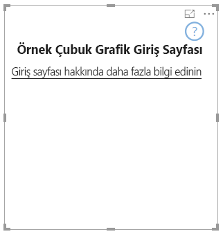

# <a name="add-a-landing-page-to-your-power-bi-visuals"></a>Power BI görsellerinize giriş sayfası ekleme

API 2.3.0 ile Power BI görsellerinize giriş sayfası ekleyebilirsiniz. Bunu yapmak için özelliklere `supportsLandingPage` ekleyin ve True olarak ayarlayın. Bu eylem görselinize veri eklemeden önce görseli başlatır ve güncelleştirir. Görsel artık filigran göstermediğinden, veri içermediği sürece görselde görüntülemek üzere kendi giriş sayfanızı tasarlayabilirsiniz.

```typescript
export class BarChart implements IVisual {
    //...
    private element: HTMLElement;
    private isLandingPageOn: boolean;
    private LandingPageRemoved: boolean;
    private LandingPage: d3.Selection<any>;

    constructor(options: VisualConstructorOptions) {
            //...
            this.element = options.element;
            //...
    }

    public update(options: VisualUpdateOptions) {
    //...
        this.HandleLandingPage(options);
    }

    private HandleLandingPage(options: VisualUpdateOptions) {
        if(!options.dataViews || !options.dataViews.length) {
            if(!this.isLandingPageOn) {
                this.isLandingPageOn = true;
                const SampleLandingPage: Element = this.createSampleLandingPage(); //create a landing page
                this.element.appendChild(SampleLandingPage);
                this.LandingPage = d3.select(SampleLandingPage);
            }

        } else {
                if(this.isLandingPageOn && !this.LandingPageRemoved){
                    this.LandingPageRemoved = true;
                    this.LandingPage.remove();
                }
        }
    }
```

Aşağıdaki resimde örnek bir giriş sayfası gösterilir:


