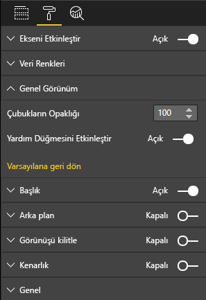

# <a name="create-a-launch-url"></a>Başlatma URL’si oluşturma

Başlatma URL’si oluşturduğunuzda asıl çalışmayı yapması için Power BI’ı temsilci olarak atayarak yeni bir tarayıcı sekmesi (veya penceresi) açabilirsiniz.

## <a name="sample"></a>Örnek

```typescript
   this.host.launchUrl('https://powerbi.microsoft.com');
```

## <a name="usage"></a>Kullanım

`host.launchUrl()` API çağrısını kullanarak hedef URL’nizi bir dize bağımsız değişkeni olarak geçirin:

```typescript
this.host.launchUrl('https://some.link.net');
```

## <a name="restrictions"></a>Kısıtlamalar

* Göreli yolları değil yalnızca mutlak yolları kullanın. Örneğin `https://some.link.net/subfolder/page.html` gibi bir mutlak yol kullanın. `/page.html` göreli yolu açılmaz.

* Şu anda yalnızca *HTTP* ve *HTTPS* protokolleri desteklenir. *FTP* ve *MAILTO* gibi protokolleri kullanmaktan kaçının.

## <a name="best-practices"></a>En iyi yöntemler

* Çoğunlukla bağlantıyı yalnızca bir kullanıcının açık eylemine yanıt olarak açmak en iyisidir. Kullanıcının, bağlantıya veya düğmeye tıklandığında yeni bir sekme açılacağını anlamasını kolaylaştırın. Kullanıcının eylemi olmadan bir `launchUrl()` çağrısını tetikleme veya farklı bir eylemin yan etkisi olarak kullanıcının kafasını karıştırabilir veya sinir bozucu olabilir.

* Bağlantı, görselin düzgün çalışması için temel önem taşımıyorsa, raporun yazarına bağlantıyı devre dışı bırakmak ve gizlemek için bir yol sağlamanızı öneririz. Bu öneri özellikle üçüncü taraf bir uygulamaya rapor ekleme veya bunu Web’de yayımlama gibi özel Power BI kullanım durumları için geçerlidir.

* Bir döngünün içinden `launchUrl()` çağrısını, görselin `update` işlevini veya sık tekrarlanan diğer tüm kodları tetiklemekten kaçının.

## <a name="a-step-by-step-example"></a>Adım adım örnek

### <a name="add-a-link-launching-element"></a>Bağlantı başlatma öğesi ekleme

Görselin `constructor` işlevine aşağıdaki satırlar eklendi:

```typescript
    this.helpLinkElement = this.createHelpLinkElement();
    options.element.appendChild(this.helpLinkElement);
```

Bağlantı öğesini oluşturan ve ekleyen özel bir işlev eklendi:

```typescript
private createHelpLinkElement(): Element {
    let linkElement = document.createElement("a");
    linkElement.textContent = "?";
    linkElement.setAttribute("title", "Open documentation");
    linkElement.setAttribute("class", "helpLink");
    linkElement.addEventListener("click", () => {
        this.host.launchUrl("https://docs.microsoft.com/power-bi/developer/visuals/custom-visual-develop-tutorial");
    });
    return linkElement;
};
```

Son olarak, *visual.less* dosyasında bulunan bir giriş, bağlantı öğesinin stilini tanımlar:

```less
.helpLink {
    position: absolute;
    top: 0px;
    right: 12px;
    display: block;
    width: 20px;
    height: 20px;
    border: 2px solid #80B0E0;
    border-radius: 20px;
    color: #80B0E0;
    text-align: center;
    font-size: 16px;
    line-height: 20px;
    background-color: #FFFFFF;
    transition: all 900ms ease;

    &:hover {
        background-color: #DDEEFF;
        color: #5080B0;
        border-color: #5080B0;
        transition: all 250ms ease;
    }

    &.hidden {
        display: none;
    }
}
```

### <a name="add-a-toggling-mechanism"></a>Geçiş mekanizması ekleme

Geçiş mekanizması eklemek için, rapor yazarının bağlantı öğesinin görünürlüğünü değiştirebileceği statik bir nesne eklemeniz gerekir. (Varsayılan olarak *gizli* değerine ayarlanır.) Daha fazla bilgi için bkz. [statik nesne öğreticisi](https://microsoft.github.io/PowerBI-visuals/docs/concepts/objects-and-properties).

Aşağıdaki kodda gösterildiği gibi *capabilities.json* dosyasının objects girdisine `showHelpLink` Boole statik nesnesi eklenir:

```typescript
"objects": {
    "generalView": {
            "displayName": "General View",
            "properties":
                "showHelpLink": {
                    "displayName": "Show Help Button",
                    "type": {
                        "bool": true
                    }
                }
            }
        }
    }
```



Görselin `update` işlevine aşağıdaki satırlar eklendi:

```typescript
if (settings.generalView.showHelpLink) {
    this.helpLinkElement.classList.remove("hidden");
} else {
    this.helpLinkElement.classList.add("hidden");
}
```

Öğenin görüntülenmesini değiştirmek için *visual.less* dosyasında *gizli* sınıfı tanımlanır.
