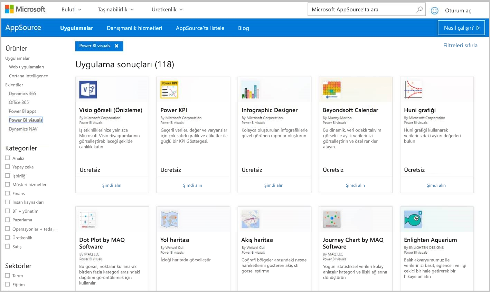
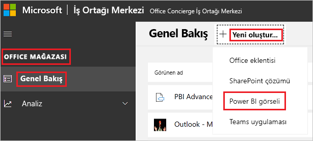

# Power BI görsellerini İş Ortağı Merkezi'nde yayımlama

Power BI görselinizi oluşturduktan sonra diğer kullanıcıların keşfetmesi ve kullanması için bunu AppSource'ta yayımlamak isteyebilirsiniz. Power BI görseli oluşturma hakkında daha fazla bilgi için bkz. [Power BI görseli geliştirme](custom-visual-develop-tutorial.md).

## AppSource nedir?

[AppSource](https://appsource.microsoft.com/marketplace/apps?product=power-bi-visuals), Microsoft ürünleriniz ve hizmetleriniz için SaaS uygulamalarını ve eklentilerini bulabileceğiniz yerdir.

## Power BI görselinizi göndermek için hazırlanma

Power BI görselini AppSource'a göndermeden önce [Power BI görselleriyle ilgili yönergeler](guidelines-powerbi-visuals.md) konusunu okuduğunuzdan ve [özel görselinizi test ettiğinizden](./submission-testing.md) emin olun.

Power BI görselinizi göndermeye hazır olduğunuzda görselinizin aşağıda listelenen tüm gereksinimleri karşıladığını doğrulayın.

| Öğe | Gerekli | Açıklama |
| --- | --- | --- |
| Pbiviz paketi |Evet |Power BI görselinizi tüm gerekli meta verileri içeren bir Pbiviz paketine yerleştirin. Görsel adı Görünen ad GUID Sürüm Açıklama Yazarın adı ve e-posta adresi |
| Örnek .pbix rapor dosyası |Evet |Görselinizi sergilemek için kullanıcıların görselle tanışmasına yardımcı olmanız gerekir. Görselin kullanıcıya sunduğu değeri vurgulayın, ayrıca kullanım ve biçimlendirme seçenekleriyle ilgili örnekler verin. En sona ekleyeceğiniz bir *"ipuçları"* sayfasına püf noktalarını ve kaçınılması gerekenleri girebilirsiniz. Örnek .pbix rapor dosyası, dış bağlantı olmadan çevrimdışı çalıştırılmalıdır. |
| Simge |Evet |Mağazada görünecek özel görsel logosunu eklemeniz gerekir. Bu logo .png, .jpg, .jpeg veya .gif biçiminde olabilir. Tam olarak 300 piksel (genişlik) x 300 piksel (yükseklik) boyutunda olmalıdır. **Önemli!** Simgeyi göndermeden önce [AppSource mağazası resim kılavuzunu](https://docs.microsoft.com/office/dev/store/craft-effective-appsource-store-images) dikkatle gözden geçirin. |
| Ekran görüntüleri |Evet |En az bir ekran görüntüsü ekleyin. Bu logo .png, .jpg, .jpeg veya .gif biçiminde olabilir. Boyutlar tam olarak 1366 piksel (genişlik) x 768 piksel (yükseklik) olmalıdır. Dosyanın boyutu 1024 KB'tan büyük olamaz. Kullanım kolaylığı sağlamak için ekran görüntülerinde gösterilen önemli özellikleri vurgulayan metin kutuları ekleyin. |
| Destek indirme bağlantısı |Evet |Müşterileriniz için destek URL'si sağlayın. Bu bağlantı, İş Ortağı Merkezi listenizin bir parçası olarak girilir ve AppSource’ta görsellerinizin listesine eriştiklerinde kullanıcılar tarafından görülebilir. URL'niz https:// veya https:// ile başlamalıdır. |
| Gizlilik belgesi bağlantısı |Evet |Görselin gizlilik ilkesinin bağlantısını sağlayın. Bu bağlantı, İş Ortağı Merkezi listenizin bir parçası olarak girilir ve AppSource’ta görsellerinizin listesine eriştiklerinde kullanıcılar tarafından görülebilir. Bağlantınız https:// veya https:// ile başlamalıdır. |
| Son kullanıcı lisans sözleşmesi (EULA) |Evet |Power BI görseliniz için bir EULA dosyası sağlamanız gerekir. [Standart sözleşme](https://go.microsoft.com/fwlink/?linkid=2041178), [Power BI görselleri sözleşmesi](https://visuals.azureedge.net/app-store/Power%20BI%20-%20Default%20Custom%20Visual%20EULA.pdf) veya kendi EULA’nız. |
| Video bağlantısı |Hayır |Kullanıcıların dikkatini özel görselinize çekmek için görselinizle ilgili bir videonun bağlantısını ekleyin. URL'niz https:// veya https:// ile başlamalıdır. |
| GitHub deposu |Hayır |Power BI görselinizin kaynaklarını ve örnek verileri içeren bir [GitHub](https://www.github.com) deposunun genel bağlantısını paylaşın. Bu sayede diğer geliştiricilere geri bildirim sağlama ve kodunuzda geliştirmeler önerme fırsatı sağlanır. |

## Uygulama paketi XML'si alma

Power BI görselini göndermek için Power BI ekibinden bir uygulama paketi XML'si almalısınız. Uygulama paketi XML'sini almak için Power BI görselleri gönderim ekibine e-posta gönderin ([pbivizsubmit@microsoft.com](mailto:pbivizsubmit@microsoft.com)).

**Pbiviz** paketini oluşturmadan önce **pbiviz.json** dosyasında aşağıdaki alanları doldurmalısınız:
* açıklama
* supportUrl
* yazar
* name
* e-posta

E-postanıza **pbiviz dosyasını** ve **örnek rapor pbix dosyasını** ekleyin. Power BI ekibi yanıt olarak talimatları ve yüklenecek uygulama paketi XML dosyasını gönderecektir. Görselinizi Office Geliştirici Merkezi'nden göndermek için bu XML uygulama paketini kullanmanız gerekir.

> [!NOTE]
> Kaliteyi yükseltmek ve var olan raporların çalışmaya devam etmesini sağlamak için, mevcut görsellerde yapılan güncelleştirmelerin mağaza onayından geçtikten sonra üretim ortamına ulaşması için ek olarak iki hafta geçmesi gerekir.

## AppSource'a gönderme

Power BI görselinizi AppSource'a göndermek için Power BI ekibinden bir uygulama paketi almalı ve ardından bunu İş Ortağı Merkezi'ne göndermelisiniz.

### Uygulama paketini alma

Görselinizi AppSource'a göndermeden önce **pbiviz** dosyasını ve **pbix** dosyasını e-posta ile Power BI ekibine göndermeniz gerekir. Böylece Power BI ekibi, dosyaları herkese açık paylaşım sunucusuna yükleyebilir. Aksi halde mağaza, dosyaları alamaz. 

Power BI ekibi yeni Power BI görsel gönderimleri, mevcut Power BI görsellerinin güncelleştirmeleri ve reddedilen gönderimlerin düzeltmeleri için dosyaları denetlemelidir.

### İş Ortağı Merkezi'ne gönderme

Power BI görselinizi İş Ortağı Merkezi'ne göndermek için İş Ortağı Merkezi'ne kaydolmanız gerekir. Henüz kaydolmadıysanız [İş Ortağı Merkezi'nde bir geliştirici hesabı açın](https://docs.microsoft.com/office/dev/store/open-a-developer-account).

>[!NOTE]
>**Bireysel yayıncılar**, şu yöntemlerden birini kullanarak Power BI görseli gönderebilir:
>* Eski bir Satıcı Panosu hesabınız varsa bu hesabın kimlik bilgilerini kullanarak İş Ortağı Merkezi'nde oturum açabilirsiniz.
>* Eski bir Satıcı Panosu hesabınız yoksa ve İş Ortağı Merkezi'ne kaydolmadıysanız iş e-posta adresinizi kullanarak [İş Ortağı Merkezi'nde bir geliştirici hesabı açmanız](https://docs.microsoft.com/office/dev/store/open-a-developer-account) gerekir.

Power BI görselinizi İş Ortağı Merkezi'ne göndermek için aşağıdaki adımları izleyin. Gönderim işlemi hakkında daha fazla bilgi için bkz. [Office çözümünüzü İş Ortağı Merkezi üzerinden AppSource'a gönderme](https://docs.microsoft.com/office/dev/store/use-partner-center-to-submit-to-appsource).

1. **İş Ortağı Merkezi**'nde oturum açın.

2. Sol bölmede **OFFICE MAĞAZASI**'nı seçin.

3. **Genel bakış**'ı seçin.

4. **Yeni oluştur**'u seçin ve açılan menüden **Power BI görseli**'ni seçin.

    

5. **Yeni Power BI görseli oluştur** penceresinde Power BI görseliniz için bir ad girin ve **Oluştur**'u seçin.

6. **Paketler**'i seçin ve Power BI görseli XML uygulama paketinizi karşıya yükleyin.

7. **Özellikler**'i seçin ve gerekli bilgileri sağlayın.

8. Ürününüz ek satın alma gerektiriyorsa **Ürün kurulumu**'nu seçin ve **İlişkili hizmet satın alma** onay kutusunu işaretleyin.

9. (İsteğe bağlı) Görselinizi [sertifikalamak](power-bi-custom-visuals-certified.md) istiyorsanız **Ürün kurulumu**'nu seçin ve **Power BI sertifikasyonu** onay kutusunu işaretleyin.
    >[!TIP]
    >Power BI sertifikasyon işlemi zaman alabilir. Yeni Power BI görseli oluşturuyorsanız, Power BI sertifikasyonu istemeden önce Power BI görselinizi İş Ortağı Merkezi'nde yayımlamanızı öneririz. Bu şekilde görselinizin yayımlanmasını geciktirmemiş olursunuz.

10. **Ürün kurulumu**'nu seçin ve **Gözden geçir ve yayımla**'ya tıklayın.

## Gönderme ve kullanma durumu takibi

[Doğrulama ilkelerini](https://docs.microsoft.com/legal/marketplace/certification-policies#1180-power-bi-visuals) inceleyebilirsiniz.

* Uygulamayı gönderdikten sonra durumunu [uygulama panosu](https://sellerdashboard.microsoft.com/Application/Summary/) sayfasından görüntüleyebilirsiniz.

* Power BI görselinizin ne zaman AppSource’dan indirilmeye hazır olacağını anlamak için Power BI görselleri [yayımlama zaman çizelgesini](power-bi-custom-visuals-certified.md#publication-timeline) gözden geçirin.

## Görselinizi onaylatma

Görseliniz oluşturulduktan sonra isterseniz görselinizi [sertifikalayabilirsiniz](power-bi-custom-visuals-certified.md).

## Sonraki adımlar

* [Power BI özel görseli geliştirme](custom-visual-develop-tutorial.md)

* [Power BI'daki Görselleştirmeler](../../visuals/power-bi-report-visualizations.md)  

* [Power BI’daki görseller](power-bi-custom-visuals.md)  

* [Power BI görselini sertifikalama](power-bi-custom-visuals-certified.md)

* Başka bir sorunuz mu var? [Power BI Topluluğu'na sorun](https://community.powerbi.com/)
