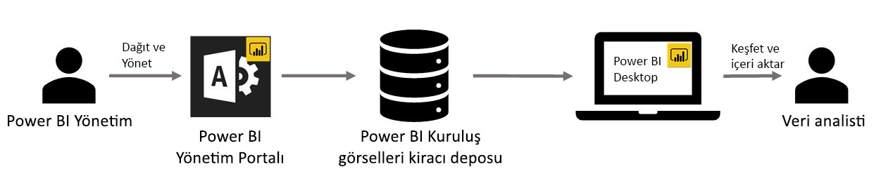

# Power BI’da kuruluşlara yönelik görseller

Power BI’da Power BI görsellerini kullanarak size göre uyarlanmış benzersiz türde bir görsel oluşturabilirsiniz. Power BI görselleri geliştiriciler tarafından, Power BI’a eklenmiş olan zengin görsellerin gereksinimlerini tam olarak karşılamadığı durumlarda oluşturulur.

Bazı kuruluşlarda Power BI görselleri daha da önemlidir ve bunlar kuruluşa özgü verilerin ya da bilgilerin aktarılması için gerekli olabilir, özel veri gereksinimlerine sahip olabilir ya da özel iş yöntemlerini vurgulayabilir. Bu durumdaki kuruluşların Power BI görselleri geliştirmesi, kuruluş genelinde paylaşması ve bakımlarının düzgün yapıldığından emin olması gerekir. Power BI görselleri, kuruluşların tam olarak bunu yapmasına olanak sağlar.

Aşağıdaki resimde, Power BI’daki Power BI kuruluş görsellerinin yöneticiden başlayıp geliştirme ve bakım aşamalarından geçerek veri analistinde sonlanan akış süreci gösterilmektedir.

Kuruluş görselleri, Power BI yöneticisi tarafından Yönetim portalından dağıtılır ve yönetilir. Görsel kuruluş deposuna dağıtıldıktan sonra kuruluştaki kullanıcılar bunları doğrudan Power BI Desktop’tan kolayca keşfedebilir ve Power BI kuruluş görsellerini raporlarında içeri aktarabilir.

Oluşturduğunuz raporlarda Power BI kuruluş görsellerini kullanma hakkında daha fazla bilgi için şu makaleye bakın: [Kuruluş görsellerini raporlarınızda içeri aktarma hakkında daha fazla bilgi](power-bi-custom-visuals.md).

## Power BI kuruluş görsellerini yönetme

Kuruluşunuzda Power BI kuruluş görsellerini yönetme, dağıtma ve yönetme hakkında daha fazla bilgi edinmek için şu makaleye bakın: [Power BI kuruluş görsellerinin dağıtımı ve yönetimi hakkında daha fazla bilgi](https://go.microsoft.com/fwlink/?linkid=866790).

> [!WARNING]
> Özel bir görsel, güvenlik veya gizlilik riski taşıyan kod içerebilir. Bir özel görseli kuruluş deposuna dağıtmadan önce görselin yazarına ve kaynağına güvendiğinizden emin olun.

## Önemli noktalar ve sınırlamalar

Bilmeniz gereken birçok önemli nokta ve sınırlama vardır.

Yönetici:

* Eski Power BI görselleri (yeni sürümü oluşturulan API’leri temel almayan Power BI görselleri gibi) desteklenmez

* Özel bir görsel depodan silinirse, silinen görseli kullanan tüm mevcut raporlar işlenmeyi durdurur. Depodan silme işlemi geri alınamaz. Özel bir görseli geçici olarak devre dışı bırakmak için "Devre dışı bırak" özelliğini kullanın.

Son kullanıcı:

* Power BI kuruluş görselleri, kuruluş deposundan içeri aktarılan özel görsellerdir. Tüm özel görsellerde olduğu gibi [PowerPoint’e aktarılamaz](https://docs.microsoft.com/power-bi/consumer/end-user-powerpoint) veya kullanıcı [rapor sayfalarına abone olduğunda](https://docs.microsoft.com/power-bi/consumer/end-user-subscribe) gönderilen e-postalarda görüntülenmez. Bu özellikler yalnızca doğrudan marketten içeri aktarılmış olan [sertifikalı Power BI görselleri](power-bi-custom-visuals-certified.md) için kullanılabilir.

* AppSource marketten alınan Visio görseli, PowerApps görseli, Mapbox görseli ve GlobeMap görseli kuruluş deposu aracılığıyla dağıtılırsa gösterilmez.

## Sorun giderme

Sorun giderme hakkında bilgi için [Power BI görsellerinizin sorunlarını giderme](power-bi-custom-visuals-troubleshoot.md) bağlantısını ziyaret edin.

## SSS

Daha fazla bilgi edinmek ve sorularınıza yanıt bulmak için [Power BI görselleri hakkında sık sorulan sorular](power-bi-custom-visuals-faq.md#organizational-power-bi-visuals) bağlantısını ziyaret edin.

Başka bir sorunuz mu var? [Power BI Topluluğu'na başvurun](https://community.powerbi.com/).
