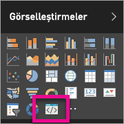

# Power BI görselleriyle ilgili sorunları giderme

## Hata ayıklama

**Pbiviz komutunun bulanamaması (veya benzer hatalar)**

Terminalinizde/komut satırınızda `pbiviz` komutunu çalıştırdığınızda yardım ekranını görmeniz gerekir. Görmezseniz, yükleme doğru yapılmamıştır. NodeJS 4.0 veya sonraki bir sürümünün yüklendiğinden emin olun.

**Hata ayıklama görselinin Görsel Öğeler sekmesinde bulunamaması**

**Görsel Öğeler** sekmesindeki hata ayıklama görseli bir istem simgesi gibi görünür.

Bu simgeyi görmüyorsanız görselin Power BI ayarlarında etkinleştirildiğinden emin olun.

> [!NOTE]
> Hata ayıklama görseli şu anda yalnızca Power BI hizmetinde kullanılabilir ve Power BI Desktop'ta veya mobil uygulamada kullanılamaz. Paketlenmiş görsel yine de her yerde çalışır.

**Görsel sunucuyla bağlantı kurulamıyor**

Görsel projenizin kökünde, terminalinizin komut satırına `pbiviz start` komutunu girerek görsel sunucuyu çalıştırın. Sunucu çalışmıyorsa SSL sertifikaları düzgün bir şekilde yüklenmemiş olabilir.

Tüm sorularınız, yorumlarınız veya sorunlarınız için Power BI görselleri destek takımına (pbicvsupport@microsoft.com) başvurmaktan çekinmeyin.

## Sonraki adımlar

Daha fazla bilgi edinmek için [Power BI görselleri hakkında sık sorulan sorular](power-bi-custom-visuals-faq.md#organizational-power-bi-visuals) bağlantısını ziyaret edin.