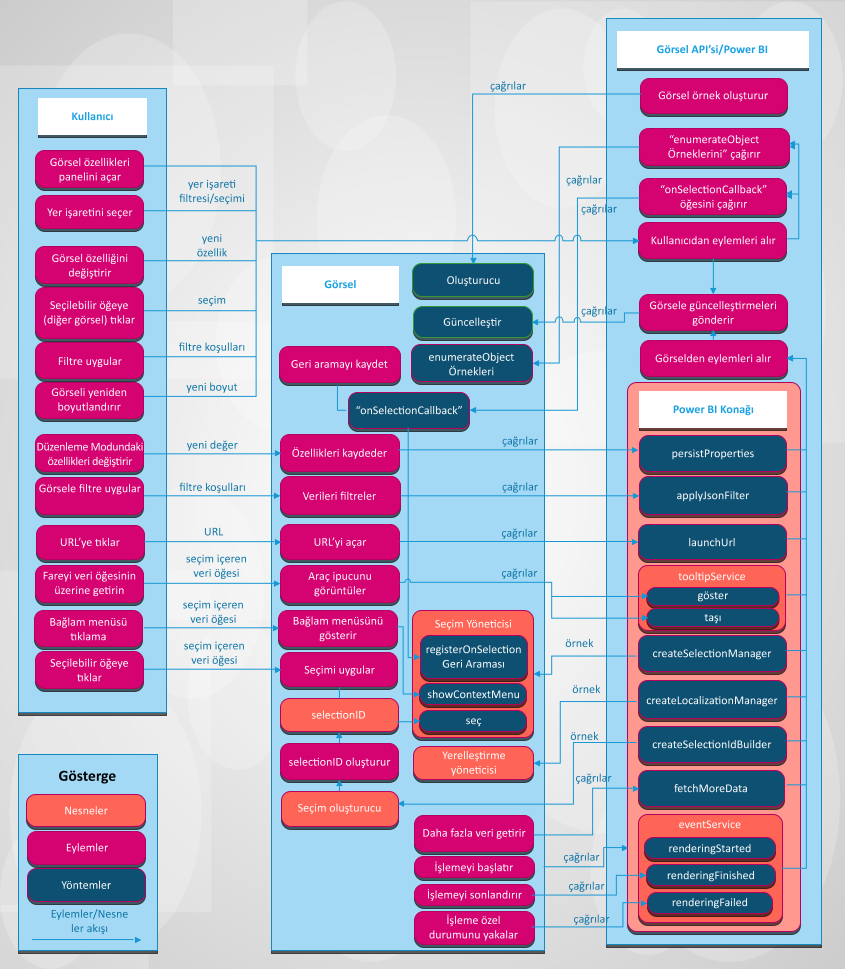

# Power BI görselleri sistem tümleştirmesi

Makalede görsellerin Power BI’la nasıl tümleştirildiği ve kullanıcının Power BI’da görselle nasıl etkileşim kurabileceği açıklanır. 

Aşağıdaki resimde kullanıcının gerçekleştirdiği yer işareti seçme gibi yaygın görsel tabanlı eylemlerin Power BI’da nasıl işlendiği gösterilir.

## Görseller Power BI’dan güncelleştirmeleri alır

Görsel, Power BI’dan güncelleştirmeleri almak için `update` yöntemini çağırır. `update` yöntemi genellikle görselin ana mantığını içerir ve grafiğin işlenmesinden veya verilerin görselleştirilmesinden sorumludur.

Görsel `update` yöntemini çağırdığında güncelleştirmeler tetiklenir.

## Eylem ve güncelleştirme düzenleri

Power BI görsellerinde eylemler ve izleyen güncelleştirmeler şu düzenlerden birinde gerçekleşir:

* Kullanıcı görselle Power BI aracılığıyla etkileşim kurar.
* Kullanıcı görselle doğrudan etkileşim kurar.
* Görsel Power BI ile etkileşim kurar.

### Kullanıcı görselle Power BI aracılığıyla etkileşim kurar

* Kullanıcı görselin özellikler panelini açar.

    Kullanıcı görselin özellikler panelini açtığında, Power BI görselin *capabilities.json* dosyasından desteklenen nesneleri ve özellikleri getirir. Özelliklerin gerçek değerlerini almak için Power BI görselin `enumerateObjectInstances` yöntemini çağırır. Görsel, özelliklerin gerçek değerlerini döndürür.

    Daha fazla bilgi için bkz. [Power BI görsellerinin becerileri ve özellikleri](capabilities.md).

* Biçim panelinde kullanıcı [görselin özelliğini değiştirir](../../visuals/power-bi-visualization-customize-title-background-and-legend.md).

    Kullanıcı biçim panelinde özelliğin değerini değiştirdiğinde, Power BI görselin `update` yöntemini çağırır. Power BI yeni `options` nesnesini `update` yöntemine geçirir. Nesneler yeni değerleri içerir.

    Daha fazla bilgi için bkz. [Power BI görsellerinin nesneleri ve özellikleri](objects-properties.md).

* Kullanıcı görseli yeniden boyutlandırır.

    Kullanıcı bir görselin boyutunu değiştirdiğinde Power BI yeni `options` nesnesiyle `update` yöntemini çağırır. `options` nesnelerinde görselin yeni genişliğini ve yüksekliğini içeren iç içe `viewport` nesneleri bulunur.

* Kullanıcı rapor, sayfa veya görsel düzeyinde bir filtre uygular.

    Power BI filtre koşulları temelinde verileri filtreler. Power BI görseli yeni verilerle güncelleştirmek için görselin `update` yöntemini çağırır.

    İç içe nesnelerden birinde yeni veriler olduğunda, görsel `options` nesnelerinin yeni güncelleştirmesini alır. Güncelleştirmenin nasıl gerçekleşeceği görselin veri görünümü eşleme yapılandırmasına bağlıdır.

    Daha fazla bilgi için bkz. [Power BI görsellerinde veri görünümü eşlemesini anlama](dataview-mappings.md).

* Kullanıcı raporun başka bir görselinden bir veri noktası seçer.

    Kullanıcı raporun başka bir görselinden veri noktasını seçtiğinde, Power BI seçilen veri noktalarını filtreler, vurgular ve görselin `update` yöntemini çağırır. Görsel yeni filtrelenmiş verileri veya bir dizi vurguyla aynı verileri alır.

    Daha fazla bilgi için bkz. [Power BI görsellerinde veri noktalarını vurgulama](highlight.md).

* Kullanıcı raporun yer işaretleri panelinde bir yer işareti seçer.

    Kullanıcı raporun yer işaretleri panelinde yer işaretini seçtiğinde iki eylemden biri gerçekleşebilir:

    * Power BI, `registerOnSelectionCallback` yöntemi tarafından geçirilen ve kaydedilen bir işlev çağırır. Geri arama işlevi ilgili yer işareti için seçim dizilerini alır.

    * Power BI, `options` nesnesinin içinde ilgili `filter` nesnesiyle `update` yöntemini çağırır.

    Her iki durumda da, alınan seçimlere veya `filter` nesnesine göre görselin durumunu değiştirmesi gerekir.

    Yer işaretleri ve filtreler hakkında daha fazla bilgi için bkz. [Power BI görsellerinde Görsel Filtreler API’si](filter-api.md).

### Kullanıcı görselle doğrudan etkileşim kurar

* Kullanıcı faresini bir veri öğesinin üzerine getirir.

    Görsel, Power BI Araç İpuçları API'si aracılığıyla veri noktası hakkında daha fazla bilgi görüntüleyebilir. Kullanıcı faresini bir görsel öğesinin üzerine getirdiğinde, görsel olayı işleyebilir ve ilişkili araç çubuğu öğesi hakkındaki verileri görüntüleyebilir. Görsel standart araç ipucunu veya rapor sayfası araç ipucunu görüntüleyebilir.

    Daha fazla bilgi için bkz. [Power BI görsellerinde araç çubuğu ipuçları](add-tooltips.md).

* Kullanıcı görsel özelliklerini değiştirir. (Örneğin kullanıcı ağacı genişletir ve görsel bu durumu özelliklere kaydeder.)

    Görsel Power BI API'si aracılığıyla özellik değerlerini kaydedebilir. Örneğin kullanıcı görselle etkileşimli çalışırken görselin özellik değerlerini kaydetmesi veya güncelleştirmesi gerekirse, görsel `presistProperties` yöntemini çağırabilir.

* Kullanıcı URL’yi seçer.

    Varsayılan olarak bir görsel doğrudan URL açamaz. Bunun yerine URL’yi yeni sekmede açmak için görsel `launchUrl` yöntemini çağırabilir ve URL’yi parametre olarak geçirebilir.

    Daha fazla bilgi için bkz. [Başlatma URL’si oluşturma](launch-url.md).

* Kullanıcı görsel aracılığıyla filtre uygular.

    Görsel, diğer görsellerdeki verileri filtrelemek için `applyJsonFilter` yöntemini çağırabilir ve koşulları geçirebilir. Temel, Gelişmiş ve Demet gibi çeşitli türlerdeki filtreler kullanılabilir.

    Daha fazla bilgi için bkz. [Power BI görsellerinde Görsel Filtreleri API’si](filter-api.md).

* Kullanıcı görseldeki öğeleri seçer.

    Power BI görselindeki seçimler hakkında daha fazla bilgi için bkz. [Power BI görsel seçimlerini kullanarak etkileşim ekleme](selection-api.md).

### Görsel Power BI ile etkileşim kurar

* Görsel Power BI'dan daha fazla veri ister.

    Görsel verileri parçalar halinde işler. `fetchMoreData` API’si yöntemi veri kümesinin sonraki parçası için istekte bulunur.

    Daha fazla bilgi için bkz. [Power BI’dan daha fazla veri getirme](fetch-more-data.md).

* Olay hizmeti tetiklenir.

    Power BI raporu PDF’ye dışarı aktarabilir veya e-postayla gönderebilir (yanızca sertifikalı görseller için geçerlidir). Power BI’ya işlemenin bittiğini ve görselin PDF olarak veya e-postayla yakalanmaya hazır olduğunu bildirmek için, görselin Olayları İşleme API’sini çağırması gerekir.

    Daha fazla bilgi için bkz. [Raporları Power BI'dan PDF'ye dışarı aktarma](../../consumer/end-user-pdf.md).

    Olay hizmeti hakkında bilgi edinmek için bkz. [Power BI görsellerinde olayları işleme](event-service.md).

## Sonraki adımlar

Görselleştirmeleri oluşturmak ve bunları Microsoft AppSource'a eklemekle mi ilgileniyorsunuz? Şu makalelere bakın:

* [Power BI daire kartı görseli geliştirme](./develop-circle-card.md)
* [Power BI görsellerini İş Ortağı Merkezi'nde yayımlama](office-store.md)
