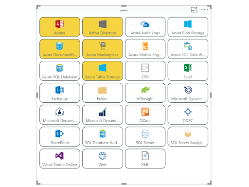
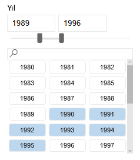
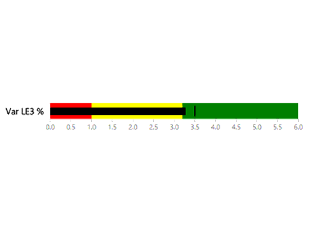
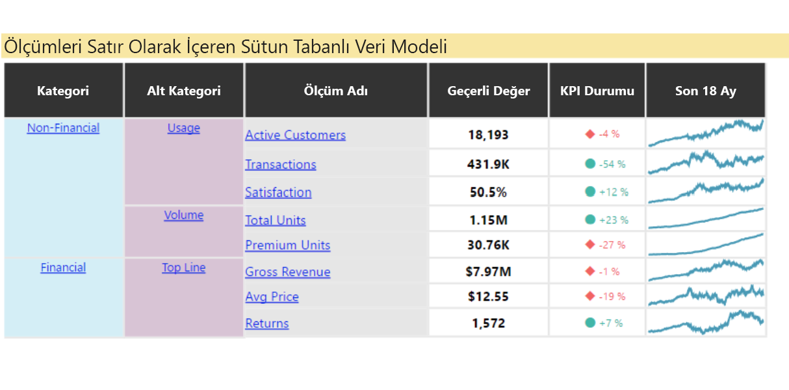
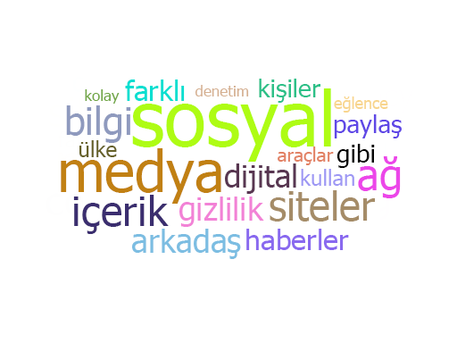
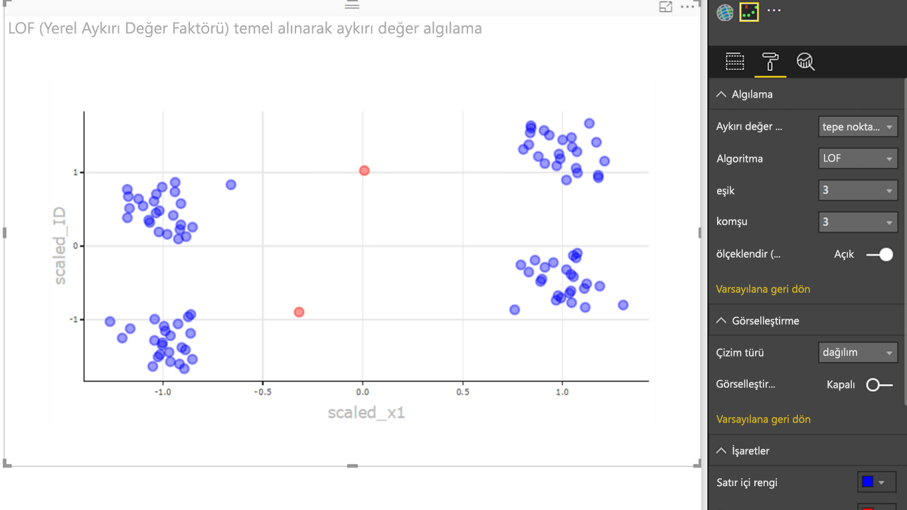

# Örnek Power BI görselleri

Bu Power BI görsellerini GitHub’dan indirebilir, kullanabilir ve değiştirebilirsiniz. Bu örnekler, Power BI ile geliştirme yaparken oluşan yaygın durumların nasıl ele alınacağını gösterir.

## Dilimleyiciler

Dilimleyici, rapordaki diğer görselleştirmelerde gösterilen veri bölümünü daraltır. Dilimleyiciler, Power BI’da verileri filtrelemenin pek çok yolundan biridir.

|   |  | |
| ------------- | ------------- | -------------|
| [Chiclet Slicer](https://github.com/Microsoft/powerbi-visuals-chicletslicer/)   Diğer görsellerde kanvas içi bir filtre olarak davranan görüntü veya metin düğmelerini gösterin | [Timeline slicer](https://github.com/Microsoft/powerbi-visuals-timeline/)  Tarihe göre filtreleyen grafiksel tarih aralığı seçicisi | [Dilimleyici örneği](https://github.com/Microsoft/powerbi-visuals-sampleslicer/)  Gelişmiş Filtreleme API’sinin kullanımını gösterir

## Grafikler

Çubuk grafikler, pasta grafikleri Word Cloud ve diğerlerini içeren galerimizden ilham alın.

|   |  | |
| ------------- | ------------- | -------------|
| [Aster Plot](https://github.com/Microsoft/powerbi-visuals-asterplot/)   Standart halka grafiğinin, tarama açısını yönlendirmek için ikinci bir değer kullanılarak elde edilen farklı bir yorumu | [Madde işareti grafiği](https://github.com/Microsoft/powerbi-visuals-bulletchart/)  Hedefleri izlemeye yönelik bağlam sağlamak için fazladan görsel öğeleri olan çubuk grafiği | [Chord](https://github.com/Microsoft/powerbi-visuals-chord/)  Bir matristeki verilerin arasındaki ilişkileri görüntüleyen bir grafiksel yöntem
|  | |  
| [Noktalı çizim](https://github.com/Microsoft/powerbi-visuals-dotplot/)  Sıklık dağıtımını harika bir görselle gösterir | [Dual KPI](https://github.com/Microsoft/powerbi-visuals-dualkpi/)  Eğilimlerini birleşik bir zaman çizgisi üzerinde göstererek iki ölçüyü zaman ekseninde verimli bir şekilde görselleştirir | [Gelişmiş Dağılım](https://github.com/Microsoft/powerbi-visuals-enhancedscatter/)  Mevcut dağılım grafiğindeki iyileştirmeler
| | | 
| [Kuvvet Grafı](https://github.com/Microsoft/powerbi-visuals-forcegraph/)  Varlıklar arasındaki bağlantıları göstermek için yararlı olan, eğimli bir yola sahip kuvvet düzeni şeması | [Gantt](https://github.com/Microsoft/powerbi-visuals-gantt/)  Proje zaman çizelgesini veya kaynaklarla yapılan zamanlamayı gösteren bir çubuk grafiği | [Table Heatmap](https://github.com/Microsoft/powerbi-visuals-heatmap/)  Tabloda renkler kullanarak verileri kolayca ve sezgisel bir şekilde karşılaştırın
|  |  |  
| [Histogram grafiği](https://github.com/Microsoft/powerbi-visuals-histogram/)  Verilerin sürekli bir aralık veya belirli bir zaman dilimi içindeki dağıtımını görselleştirir | [LineDot grafiği](https://github.com/Microsoft/powerbi-visuals-linedotchart/)  Hedef kitlenin verilere ilgisini çeken, animasyonlu noktaları olan animasyonlu çizgi grafiği | [Mekko chart](https://github.com/Microsoft/powerbi-visuals-mekkochart/)  Yüzde 100 yığılmış sütun grafiği ile yüzde 100 yığılmış çubuk grafiğinin bir karışımı tek bir görünümde birleştirilir
|  |  |  
| [Çoklu KPI](https://github.com/microsoft/PowerBI-visuals-MultiKPI/)   Birden çok mini grafik içeren destekleyici verilere sahip bir anahtar KPI içeren güçlü bir Çok KPI’lı görselleştirme | [Power KPI](https://github.com/microsoft/PowerBI-visuals-PowerKPI/)  Geçerli veriler, değer ve varyanslar için çok satırlı grafik ve etiketler ile güçlü bir KPI Göstergesi | [Power KPI Matrix](https://github.com/microsoft/PowerBI-visuals-PowerKPIMatrix/)  Dengeli karneleri ve sınırsız sayıdaki ölçümler ile KPI’ları kısa, kolay okunabilir bir listede izleyin
| |  |  
| [Eğilim grafiği](https://github.com/Microsoft/powerbi-visuals-pulsechart/)  Ana olayların açıklamalarını içeren bu çizgi grafiği, hikayelerin verilerle anlatılması için mükemmeldir| [Radar chart](https://github.com/Microsoft/powerbi-visuals-radarchart/)  Öznitelikleri karşılaştırmak için yararlı olan, tek bir kategorik eksen üzerinde çizilmiş birden çok ölçüyü gösterir | [Sankey chart](https://github.com/Microsoft/powerbi-visuals-sankey/)  Serinin genişliğinin akışın miktarına orantılı olduğu akış şeması
|  | | 
| [Akış grafiği](https://github.com/Microsoft/powerbi-visuals-streamgraph/)  Sıklıkla zaman içindeki değerleri görüntülemek için kullanılan, düzgün ilişkilendirmeli bir yığılmış alan grafiği | [Güneş ışığı grafiği](https://github.com/Microsoft/powerbi-visuals-sunburst/)  Hiyerarşik verileri bir şekilde görselleştirmek için çok düzeyli halka grafiği| [Tornado chart](https://github.com/Microsoft/powerbi-visuals-tornado/)  İki grup arasındaki değişkenlerin göreli önemini karşılaştırma
 | 
 | [Word Cloud](https://github.com/Microsoft/powerbi-visuals-wordcloud/)  Verilerinizde sık geçen metinlerden eğlendirici bir görsel oluşturun

## WebGL

WebGL, web içeriğinin bir HTML tuvalinde 2B ve 3B işleme yapmak için OpenGL ES 2.0 sürümünü temel alan bir API kullanmasına izin verir.

| |
| ------------- |
| [Dünya Haritası](https://github.com/Microsoft/powerbi-visuals-globemap/)  Konumları etkileşimli bir 3B haritaya çizme

## R görselleri

Bu örnekler, R görsellerinin ve betiklerinin analitik ve görsel gücünden nasıl yararlanılabileceğini gösterir.

| | | |
|------------- |------------- |------------- |------------- |
| [İlişkilendirme kuralları](https://github.com/Microsoft/powerbi-visuals-assorules/)  If-then deyimlerini kullanarak ilişkili değil gibi görünen veriler arasındaki ilişkileri ortaya çıkarma | [Kümeleme](https://github.com/Microsoft/powerbi-visuals-clustering-kmeans/)  K-ortalamalar algoritmasını kullanarak verilerinizdeki benzerlik gruplarını bulma | [Aykırı değerler ile kümeleme](https://github.com/microsoft/PowerBI-visuals-dbscan/)  Verilerinizdeki benzerlik gruplarını ve aykırı değerleri bulma
|  |  |  
| [Bağıntı çizimi](https://github.com/Microsoft/powerbi-visuals-corrplot/)  Bir veri tablosundaki en ilişkili değişkenleri vurgulama | [Karar ağacı grafiği](https://github.com/Microsoft/powerbi-visuals-decision-tree/)  Özyinelemeli bölümlendirme kullanarak istatistiksel olasılığı belirlemeye yönelik şematik, ağaç şeklindeki diyagram | [TBATS Tahmini](https://github.com/Microsoft/powerbi-visuals-forcasting-tbats/)  TBATS modelini kullanarak, birden çok mevsimselliğe sahip serilere yönelik zaman serisi tahmin etme
|  |  |  
| [ARIMA ile Tahmin](https://github.com/Microsoft/powerbi-visuals-forcastingarima/)  Autoregressive Integrated Moving Avg (ARIMA) kullanarak tarihsel verilere göre gelecek değerleri tahmin etme | [Huni grafiği](https://github.com/Microsoft/powerbi-visuals-funnel/)  Huni grafiği kullanarak verilerinizdeki aykırı değerleri bulma | [Aykırı değerleri algılama](https://github.com/Microsoft/powerbi-visuals-outliers-det/)  En uygun yöntemi ve çizimi kullanarak verilerinizdeki aykırı değerleri bulma
|  |  | 
| [Eğri grafik](https://github.com/Microsoft/powerbi-visuals-spline/)  Gürültülü verileri görselleştirme ve anlama | [Zaman serisi ayrıştırma grafiği](https://github.com/Microsoft/powerbi-visuals-timeseriesdecomposition/)  “Loess kullanarak Mevsimsellik ve Eğilim ayrıştırması” kullanarak zaman serisi bileşenlerini anlama | [Zaman serilerini tahmin etme grafiği](https://github.com/Microsoft/powerbi-visuals-forcasting-exp/)  Önceden gözlemlenen değerleri temel alarak gelecek değerleri tahmin etmek için üstel düzeltme modeli kullanma

## Sonraki adımlar

Power BI görseli oluşturmayı denemek için bkz. [Power BI daire kartı görseli geliştirme](develop-circle-card.md).
