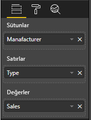

# <a name="add-interactivity-into-visual-by-power-bi-visuals-selections"></a>Power BI görsel seçimleriyle görsele etkileşim ekleme

Power BI görseller arasında iki yönlü etkileşim sağlar: seçim ve filtreleme. Aşağıdaki örnekte bir görseldeki öğelerin nasıl seçildiği ve rapordaki diğer görsellere yeni seçim durumunun nasıl bildirildiği gösterilir.

`Selection` nesnesi arabirime karşılık gelir:

```typescript
export interface ISelectionId {
    equals(other: ISelectionId): boolean;
    includes(other: ISelectionId, ignoreHighlight?: boolean): boolean;
    getKey(): string;
    getSelector(): Selector;
    getSelectorsByColumn(): SelectorsByColumn;
    hasIdentity(): boolean;
}
```

## <a name="how-to-use-selectionmanager-to-select-data-points"></a>Veri noktalarını seçmek için SelectionManager'ı kullanma

Görsel konak nesnesi seçim yöneticisi örneği oluşturma yöntemini sağlar. Seçim yöneticisi seçim yapmaktan, bağlam menüsünü göstermekten, geçerli seçimleri depolamaktan ve seçim durumunu denetlemekten sorumludur. Ayrıca seçim yöneticisinin bu eylemlere karşılık gelen yöntemleri vardır.

### <a name="create-an-instance-of-the-selection-manager"></a>Seçim yöneticisinin örneğini oluşturma

Seçim yöneticisi kullanmak için, seçim yöneticisinin örneğini oluşturmanız gerekir. Genellikle görseller seçim yöneticisi örneğini görsel nesnesinin `constructor` öğesinde oluşturur.

```typescript
export class Visual implements IVisual {
    private target: HTMLElement;
    private host: IVisualHost;
    private selectionManager: ISelectionManager;
    // ...
    constructor(options: VisualConstructorOptions) {
        this.host = options.host;
        // ...
        this.selectionManager = this.host.createSelectionManager();
    }
    // ...
}
```

### <a name="create-an-instance-of-the-selection-builder"></a>Seçim oluşturucusunun örneğini oluşturma

Seçim yöneticisi örneği oluşturulduğunda, görselin her veri noktası için `selections` oluşturmanız gerekir. Her veri noktasına seçim oluşturmak için görsel konak nesnesi `createSelectionIdBuilder` yöntemini sağlar. Bu yöntem `powerbi.visuals.ISelectionIdBuilder` arabirimiyle nesnenin örneğini döndürür:

```typescript
export interface ISelectionIdBuilder {
    withCategory(categoryColumn: DataViewCategoryColumn, index: number): this;
    withSeries(seriesColumn: DataViewValueColumns, valueColumn: DataViewValueColumn | DataViewValueColumnGroup): this;
    withMeasure(measureId: string): this;
    withMatrixNode(matrixNode: DataViewMatrixNode, levels: DataViewHierarchyLevel[]): this;
    withTable(table: DataViewTable, rowIndex: number): this;
    createSelectionId(): ISelectionId;
}
```

Bu nesnenin veri görünümü eşlemelerinin farklı türleri için `selections` oluşturmaya yönelik ilgili yöntemleri vardır.

> [!NOTE]
> `withTable` ve `withMatrixNode` yöntemleri Power BI görsellerinin API 2.5.0 sürümünde tanıtılmıştır.
> Tablo veya matris veri görünümü eşlemeleri için seçimler kullanmaya ihtiyacınız varsa, API'nin sürümünü 2.5.0 veya üzerine yükseltmelisiniz.

### <a name="create-selections-for-categorical-data-view-mapping"></a>Kategorik veri görünümü eşlemesi için seçimler oluşturma

Şimdi örnek veri kümesi için seçimlerin kategorik veri görünümünde nasıl temsil edildiğini gözden geçirelim:

| Üretici | Tür | Değer |
| - | - | - |
| Chrysler | Yerli Araba | 28883 |
| Chrysler | Yerli Kamyon | 117131 |
| Chrysler | İthal Araba | 0 |
| Chrysler | İthal Kamyon | 6362 |
| Ford | Yerli Araba | 50032 |
| Ford | Yerli Kamyon | 122446 |
| Ford | İthal Araba | 0 |
| Ford | İthal Kamyon | 0 |
| GM | Yerli Araba | 65426 |
| GM | Yerli Kamyon | 138122 |
| GM | İthal Araba | 197 |
| GM | İthal Kamyon | 0 |
| Honda | Yerli Araba | 51450 |
| Honda | Yerli Kamyon | 46115 |
| Honda | İthal Araba | 2932 |
| Honda | İthal Kamyon | 0 |
| Nissan | Yerli Araba | 51476 |
| Nissan | Yerli Kamyon | 47343 |
| Nissan | İthal Araba | 5485 |
| Nissan | İthal Kamyon | 1430 |
| Toyota | Yerli Araba | 55643 |
| Toyota | Yerli Kamyon | 61227 |
| Toyota | İthal Araba | 20799 |
| Toyota | İthal Kamyon | 23614 |

Görselde de aşağıdaki veri görünümü eşlemesi kullanılır:

```json
{
    "dataRoles": [
        {
            "displayName": "Columns",
            "name": "columns",
            "kind": "Grouping"
        },
        {
            "displayName": "Rows",
            "name": "rows",
            "kind": "Grouping"
        },
        {
            "displayName": "Values",
            "name": "values",
            "kind": "Measure"
        }
    ],
    "dataViewMappings": [
        {
            "categorical": {
                "categories": {
                    "for": {
                        "in": "columns"
                    }
                },
                "values": {
                    "group": {
                        "by": "rows",
                        "select": [
                            {
                                "for": {
                                    "in": "values"
                                }
                            }
                        ]
                    }
                }
            }
        }
    ]
}
```

Örnekte, `Manufacturer``columns` ve `Type``rows` olur. `rows` temelinde değerler gruplandırılarak oluşturulan bir seri vardır (`Type`).

Görselin de `Manufacturer` ve `Type` temelinde verileri dilimleyebilmesi gerekir.

Örneğin kullanıcı `Manufacturer` olarak `Chrysler` seçtiğinde diğer görseller aşağıdaki verileri göstermelidir:

| Üretici | Tür | Değer |
| - | - | - |
| **Chrysler** | Yerli Araba | 28883 |
| **Chrysler** | Yerli Kamyon | 117131 |
| **Chrysler** | İthal Araba | 0 |
| **Chrysler** | İthal Kamyon | 6362 |

Kullanıcı `Type` olarak `Import Car` seçtiğinde (seriye göre verileri seçtiğinde) diğer görseller aşağıdaki verileri göstermelidir:

| Üretici | Tür | Değer |
| - | - | - |
| Chrysler | **İthal Araba** | 0 |
| Ford | **İthal Araba** | 0 |
| GM | **İthal Araba** | 197 |
| Honda | **İthal Araba** | 2932 |
| Nissan | **İthal Araba** | 5485 |
| Toyota | **İthal Araba** | 20799 |


Görsel veri sepetleri doldurulmalıdır.



Kategori (sütunlar) olarak `Manufacturer`, seri (satırlar) olarak `Type` as series (rows) ve seriler için `Values` olarak `Value` vardır.

> [!NOTE]
> Seriler için `Values` gereklidir çünkü veri görünümü eşlemesine göre görsel `Values` öğelerinin `Rows` verilerine göre gruplandırılmasını bekler.

#### <a name="create-selections-for-categories"></a>Kategoriler için seçimler oluşturma

```typescript
// categories
const categories = dataView.categorical.categories;

// create label for 'Manufacturer' column
const p = document.createElement("p") as HTMLParagraphElement;
p.innerText = categories[0].source.displayName.toString();
this.target.appendChild(p);

// get count of category elements
const categoriesCount = categories[0].values.length;

// iterate all categories to generate selection and create button elements to use selections
for (let categoryIndex = 0; categoryIndex < categoriesCount; categoryIndex++) {
    const categoryValue: powerbi.PrimitiveValue = categories[0].values[categoryIndex];

    const categorySelectionId = this.host.createSelectionIdBuilder()
        .withCategory(categories[0], categoryIndex) // we have only one category (only one `Manufacturer` column)
        .createSelectionId();
    this.dataPoints.push({
        value: categoryValue,
        selection: categorySelectionId
    });
    console.log(categorySelectionId);

    // create button element to apply selection on click
    const button = document.createElement("button") as HTMLButtonElement;
    button.value = categoryValue.toString();
    button.innerText = categoryValue.toString();
    button.addEventListener("click", () => {
        // handle click event to apply correspond selection
        this.selectionManager.select(categorySelectionId);
    });
    this.target.appendChild(button);
}
```

Örnek kodda tüm kategorileri yinelediğimizi görebilirsiniz. Her yinelemede, seçim oluşturucusunun `withCategory` yöntemini çağırarak her kategoriye bir sonraki seçimi oluşturmak için `createSelectionIdBuilder` çağrısı yaparız. `createSelectionId` yöntemi, oluşturulan `selection` nesnesini döndürmek için son yöntem olarak kullanılır.

`withCategory` yönteminde `category` sütununu geçiririz; örnekte bu `Manufacturer` öğesi ve kategori öğesinin dizinidir.

#### <a name="create-selections-for-series"></a>Seriler için seçimler oluşturma

```typescript
// get groupped values for series
const series: powerbi.DataViewValueColumnGroup[] = dataView.categorical.values.grouped();

// create label for 'Type' column
const p2 = document.createElement("p") as HTMLParagraphElement;
p2.innerText = dataView.categorical.values.source.displayName;
this.target.appendChild(p2);

// iterate all series to generate selection and create button elements to use selections
series.forEach( (ser: powerbi.DataViewValueColumnGroup) => {
    // create selection id for series
    const seriesSelectionId = this.host.createSelectionIdBuilder()
        .withSeries(dataView.categorical.values, ser)
        .createSelectionId();

    this.dataPoints.push({
        value: ser.name,
        selection: seriesSelectionId
    });

    // create button element to apply selection on click
    const button = document.createElement("button") as HTMLButtonElement;
    button.value =ser.name.toString();
    button.innerText = ser.name.toString();
    button.addEventListener("click", () => {
        // handle click event to apply correspond selection
        this.selectionManager.select(seriesSelectionId);
    });
    this.target.appendChild(button);
});
```

### <a name="create-selections-for-table-data-view-mapping"></a>Tablo veri görünümü eşlemesi için seçimler oluşturma

Tablo veri görünümleri eşleme örneği

```json
{
    "dataRoles": [
        {
            "displayName": "Values",
            "name": "values",
            "kind": "GroupingOrMeasure"
        }
    ],
    "dataViewMappings": [
        {
            "table": {
                "rows": {
                    "for": {
                        "in": "values"
                    }
                }
            }
        }
    ]
}
```

Tablo veri görünümü eşlemesinin her satırına yönelik seçim oluşturmak için seçim oluşturucusunun `withTable` yöntemini çağırmalısınız.

```typescript
public update(options: VisualUpdateOptions) {
    const dataView = options.dataViews[0];
    dataView.table.rows.forEach((row: DataViewTableRow, rowIndex: number) => {
        this.target.appendChild(rowDiv);
        const selection: ISelectionId = this.host.createSelectionIdBuilder()
            .withTable(dataView.table, rowIndex)
            .createSelectionId();
    }
}
```

Görsel kodu tablonun satırlarını yineler ve her satır `withTable` tablo yöntemini çağırır. `withTable` yönteminin parametreleri `table` nesnesi ve tablo satırının dizinidir.

### <a name="create-selections-for-matrix-data-view-mapping"></a>Matris veri görünümü eşlemesi için seçimler oluşturma

```typescript
public update(options: VisualUpdateOptions) {
    const host = this.host;
    const rowLevels: powerbi.DataViewHierarchyLevel[] = dataView.matrix.rows.levels;
    const columnLevels: powerbi.DataViewHierarchyLevel[] = dataView.matrix.rows.levels;

    // iterate rows hierarchy
    nodeWalker(dataView.matrix.rows.root, rowLevels);
    // iterate columns hierarchy
    nodeWalker(dataView.matrix.columns.root, columnLevels);

    function nodeWalker(node: powerbi.DataViewMatrixNode, levels: powerbi.DataViewHierarchyLevel[]) {
        const nodeSelection = host.createSelectionIdBuilder().withMatrixNode(node, levels);

        if (node.children && node.children.length) {
            node.children.forEach(child => {
                nodeWalker(child, levels);
            });
        }
    }
}
```

Örnekte her düğüm ve alt düğüm için `nodeWalker` yinelemeli olarak çağrı yapar.

Her çağrıda `nodeWalker``nodeSelection` nesnesi oluşturur. Ayrıca her `nodeSelection`, ilgili düğümlerin `selection` öğesini temsil eder.

## <a name="select-datapoints-to-slice-other-visuals"></a>Diğer görselleri dilimlemek için veri noktalarını seçme

Kategorik veri görünümü eşlemesi için örnek seçim kodlarında, düğme öğeleri için tıklama işleyici oluşturduğumuzu gördünüz. İşleyici, seçim yöneticisinin `select` yöntemini çağırır ve seçim nesnesini geçirir.

```typescript
button.addEventListener("click", () => {
    // handle click event to apply correspond selection
    this.selectionManager.select(categorySelectionId);
});
```

`select` yönteminin arabirimi

```typescript
interface ISelectionManager {
    // ...
    select(selectionId: ISelectionId | ISelectionId[], multiSelect?: boolean): IPromise<ISelectionId[]>;
    // ...
}
```

`select` yönteminin seçim dizisini kabul edebildiğini gördünüz. Diğer bir deyişle görseliniz çeşitli veri noktaları seçebilir. İkinci parametre (`multiSelect`) çoklu seçimden sorumludur. Değer doğru ise Power BI önceki seçim durumunu temizlemez ve aksi takdirde önceki seçimin sıfırlayacağı geçerli seçimi uygular.

Normal bir `multiSelect` kullanım senaryosunda her olayda CTRL düğmesinin durumu işlenir.

```typescript
button.addEventListener("click", (mouseEvent) => {
    const multiSelect = (mouseEvent as MouseEvent).ctrlKey;
    this.selectionManager.select(seriesSelectionId, multiSelect);
});
```

## <a name="next-steps"></a>Sonraki adımlar

* [Görsel özellikleri veri noktalarına bağlamak için seçimlerin nasıl kullanıldığını öğrenin](objects-properties.md#objects-selector)

* [Yer işaretleri değiştirmede seçimlerin nasıl işlendiğini öğrenin](bookmarks-support.md#visuals-with-selection)

* [Görsellerin veri noktaları için bağlam menüsü eklemeyi öğrenin](context-menu.md)

* [Power BI Görsellerine seçimler eklemek için InteractivityUtils'in nasıl kullanıldığını öğrenin](utils-interactivity-selections.md)
