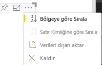

# <a name="sorting-options-for-power-bi-visuals"></a>Power BI görselleri için sıralama seçenekleri

Bu makalede *sıralama* seçeneklerinin Power BI görselleri için sıralama davranışını nasıl belirttiği açıklanır. 

Sıralama özelliği aşağıdaki parametrelerden birini gerektirir.

## <a name="default-sorting"></a>Varsayılan sıralama

`default` seçeneği en basit formdur. ‘DataMappings’ bölümünde sunulan verileri sıralama olanağı tanır. Seçenek veri eşlemelerinin kullanıcı tarafından sıralanmasını etkinleştirir ve sıralama yönünü belirtir.

```json
    "sorting": {
        "default": {   }
    }
```



## <a name="implicit-sorting"></a>Örtük sıralama

Örtük sıralama, her veri rolü için sıralamayı tanımlayan `clauses` dizi parametresiyle sıralama işlemidir. `implicit`, görselin kullanıcısının sıralama düzenini değiştiremeyeceği anlamına gelir. Power BI sıralama seçeneklerini görselin menüsünde göstermez. Öte yandan Power BI verileri belirtilen ayarlara göre sıralar.

`clauses` parametreleri iki parametre ile birkaç nesne içerebilir:

- `role` Sıralama için `DataMapping` nesnesini belirler
- `direction` Sıralama yönünü belirler (1 = Artan, 2 = Azalan)

```json
    "sorting": {
        "implicit": {
            "clauses": [
                {
                    "role": "category",
                    "direction": 1
                },
                {
                    "role": "measure",
                    "direction": 2
                }
            ]
        }
    }
```

## <a name="custom-sorting"></a>Özel sıralama

Özel sıralama, sıralamanın geliştirici tarafından görselin kodunda yönetildiği anlamına gelir.
