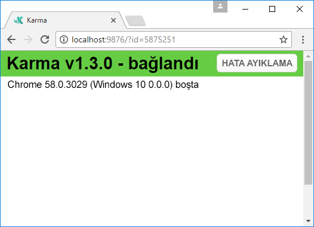
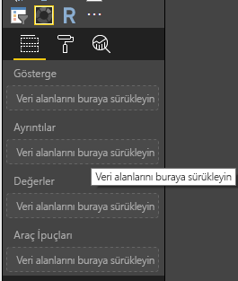
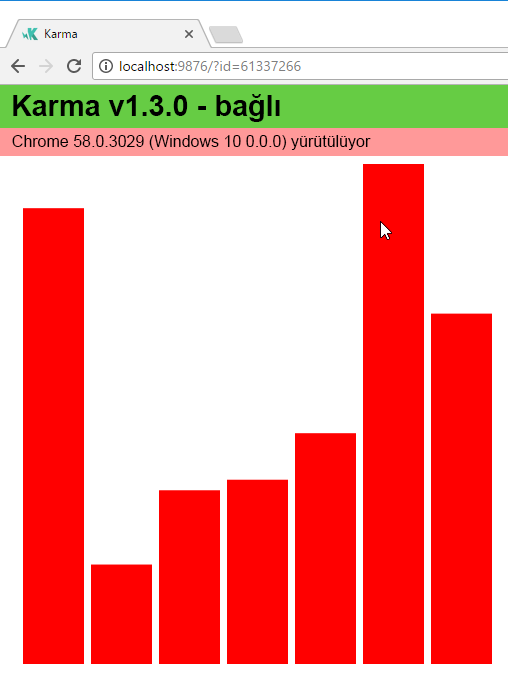
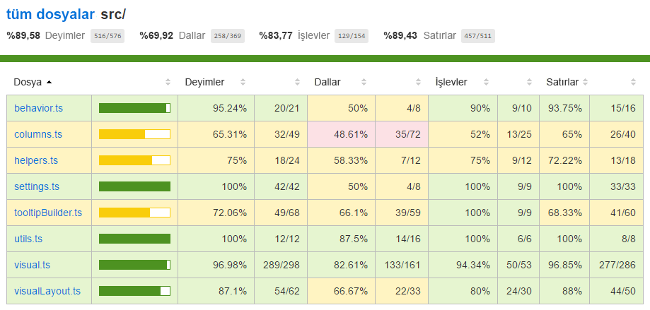

# <a name="tutorial-add-unit-tests-for-power-bi-visual-projects"></a>Öğretici: Power BI görsel projeleri için birim testleri ekleme

Bu makalede Power BI görselleriniz için birim testleri yazmayla ilgili temel bilgiler açıklanır ve şu işlemlerin nasıl yapıldığı anlatılır:

* Karma JavaScript test runner test çerçevesi Jasmine’i ayarlama.
* powerbi-visuals-utils-testutils paketini kullanma.
* Power BI görsellerinde birim testini basitleştirmeye yardımcı olması için sahte öğeler kullanma.

## <a name="prerequisites"></a>Önkoşullar

* Yüklü bir Power BI görselleri projesi
* Yapılandırılmış Node.js ortamı

## <a name="install-and-configure-the-karma-javascript-test-runner-and-jasmine"></a>Karma JavaScript test runner’ı ve Jasmine’i yükleme ve yapılandırma

Gerekli kitaplıkları *package.json* dosyasında `devDependencies` bölümüne ekleyin:

```json
"@babel/polyfill": "^7.2.5",
"@types/d3": "5.5.0",
"@types/jasmine": "2.5.37",
"@types/jasmine-jquery": "1.5.28",
"@types/jquery": "2.0.41",
"@types/karma": "3.0.0",
"@types/lodash-es": "4.17.1",
"coveralls": "3.0.2",
"istanbul-instrumenter-loader": "^3.0.1",
"jasmine": "2.5.2",
"jasmine-core": "2.5.2",
"jasmine-jquery": "2.1.1",
"jquery": "3.1.1",
"karma": "3.1.1",
"karma-chrome-launcher": "2.2.0",
"karma-coverage": "1.1.2",
"karma-coverage-istanbul-reporter": "^2.0.4",
"karma-jasmine": "2.0.1",
"karma-junit-reporter": "^1.2.0",
"karma-sourcemap-loader": "^0.3.7",
"karma-typescript": "^3.0.13",
"karma-typescript-preprocessor": "0.4.0",
"karma-webpack": "3.0.5",
"puppeteer": "1.17.0",
"style-loader": "0.23.1",
"ts-loader": "5.3.0",
"ts-node": "7.0.1",
"tslint": "^5.12.0",
"webpack": "4.26.0"
```

*Package.json* hakkında daha fazla bilgi edinmek için [npm-package.json](https://docs.npmjs.com/files/package.json) dosyasındaki açıklamaya bakın.

*Package.json* dosyasını kaydedin ve `package.json` konumunda aşağıdaki komutu çalıştırın:

```cmd
npm install
```

Paket yöneticisi *package.json* dosyasına eklenen tüm yeni paketleri yükler.

Birim testlerini çalıştırmak için test runner’ı ve `webpack` öğesini yapılandırın.

Aşağıdaki kod örnek bir *test.webpack.config.js* dosyasıdır:

```typescript
const path = require('path');
const webpack = require("webpack");

module.exports = {
    devtool: 'source-map',
    mode: 'development',
    optimization : {
        concatenateModules: false,
        minimize: false
    },
    module: {
        rules: [
            {
                test: /\.tsx?$/,
                use: 'ts-loader',
                exclude: /node_modules/
            },
            {
                test: /\.json$/,
                loader: 'json-loader'
            },
            {
                test: /\.tsx?$/i,
                enforce: 'post',
                include: /(src)/,
                exclude: /(node_modules|resources\/js\/vendor)/,
                loader: 'istanbul-instrumenter-loader',
                options: { esModules: true }
            },
            {
                test: /\.less$/,
                use: [
                    {
                        loader: 'style-loader'
                    },
                    {
                        loader: 'css-loader'
                    },
                    {
                        loader: 'less-loader',
                        options: {
                            paths: [path.resolve(__dirname, 'node_modules')]
                        }
                    }
                ]
            }
        ]
    },
    externals: {
        "powerbi-visuals-api": '{}'
    },
    resolve: {
        extensions: ['.tsx', '.ts', '.js', '.css']
    },
    output: {
        path: path.resolve(__dirname, ".tmp/test")
    },
    plugins: [
        new webpack.ProvidePlugin({
            'powerbi-visuals-api': null
        })
    ]
};
```

Aşağıdaki kod örnek bir *karma.conf.ts* dosyasıdır:

```typescript
"use strict";

const webpackConfig = require("./test.webpack.config.js");
const tsconfig = require("./test.tsconfig.json");
const path = require("path");

const testRecursivePath = "test/visualTest.ts";
const srcOriginalRecursivePath = "src/**/*.ts";
const coverageFolder = "coverage";

process.env.CHROME_BIN = require("puppeteer").executablePath();

import { Config, ConfigOptions } from "karma";

module.exports = (config: Config) => {
    config.set(<ConfigOptions>{
        mode: "development",
        browserNoActivityTimeout: 100000,
        browsers: ["ChromeHeadless"], // or Chrome to use locally installed Chrome browser
        colors: true,
        frameworks: ["jasmine"],
        reporters: [
            "progress",
            "junit",
            "coverage-istanbul"
        ],
        junitReporter: {
            outputDir: path.join(__dirname, coverageFolder),
            outputFile: "TESTS-report.xml",
            useBrowserName: false
        },
        singleRun: true,
        plugins: [
            "karma-coverage",
            "karma-typescript",
            "karma-webpack",
            "karma-jasmine",
            "karma-sourcemap-loader",
            "karma-chrome-launcher",
            "karma-junit-reporter",
            "karma-coverage-istanbul-reporter"
        ],
        files: [
            "node_modules/jquery/dist/jquery.min.js",
            "node_modules/jasmine-jquery/lib/jasmine-jquery.js",
            {
                pattern: './capabilities.json',
                watched: false,
                served: true,
                included: false
            },
            testRecursivePath,
            {
                pattern: srcOriginalRecursivePath,
                included: false,
                served: true
            }
        ],
        preprocessors: {
            [testRecursivePath]: ["webpack", "coverage"]
        },
        typescriptPreprocessor: {
            options: tsconfig.compilerOptions
        },
        coverageIstanbulReporter: {
            reports: ["html", "lcovonly", "text-summary", "cobertura"],
            dir: path.join(__dirname, coverageFolder),
            'report-config': {
                html: {
                    subdir: 'html-report'
                }
            },
            combineBrowserReports: true,
            fixWebpackSourcePaths: true,
            verbose: false
        },
        coverageReporter: {
            dir: path.join(__dirname, coverageFolder),
            reporters: [
                // reporters not supporting the `file` property
                { type: 'html', subdir: 'html-report' },
                { type: 'lcov', subdir: 'lcov' },
                // reporters supporting the `file` property, use `subdir` to directly
                // output them in the `dir` directory
                { type: 'cobertura', subdir: '.', file: 'cobertura-coverage.xml' },
                { type: 'lcovonly', subdir: '.', file: 'report-lcovonly.txt' },
                { type: 'text-summary', subdir: '.', file: 'text-summary.txt' },
            ]
        },
        mime: {
            "text/x-typescript": ["ts", "tsx"]
        },
        webpack: webpackConfig,
        webpackMiddleware: {
            stats: "errors-only"
        }
    });
};
```

Gerekirse bu yapılandırmayı değiştirebilirsiniz.

*Karma.conf.js* dosyasındaki kod aşağıdaki değişkenleri içerir:

* `recursivePathToTests`: Test kodunu bulur

* `srcRecursivePath`: Derleme sonrasında çıkış JavaScript kodunu bulur

* `srcCssRecursivePath`: Stillerle daha az dosya derlendikten sonra çıkış CSS’yi bulur

* `srcOriginalRecursivePath`: Görselinizin kaynak kodunu bulur

* `coverageFolder`: Kapsam raporunun nerede oluşturulacağını belirler

Yapılandırma dosyası aşağıdaki özellikleri içerir:

* `singleRun: true`: Testler sürekli tümleştirme (CI) sisteminde çalıştırılır veya tek bir kez çalıştırılabilir. Testlerinizde hata ayıklaması yapmak için ayarı *false* olarak değiştirebilirsiniz. Karma tarayıcıyı çalışır durumda tuttuğundan hata ayıklaması için konsolu kullanabilirsiniz.

* `files: [...]`: Bu dizide tarayıcıya yüklenecek dosyaları belirtebilirsiniz. Genellikle kaynak dosyalar, test çalışmaları ve kitaplıklar (Jasmine, test yardımcı programları) vardır. Gerekirse listeye başka dosyalar ekleyebilirsiniz.

* `preprocessors`: Bu bölümde birim testlerinden önce çalıştırılan eylemleri yapılandıracaksınız. Typescript’in JavaScript’e ön derlemesini yapar, kaynak eşleme dosyalarını hazırlar ve kod kapsamı raporunu oluştururlar. Testlerinizde hata ayıklaması yaparken `coverage` devre dışı bırakılabilir. Kapsam, test kapsamının denetim kodu için ek kod oluşturduğundan hata ayıklama testlerini karmaşıklaştırır.

Tüm Karma yapılandırmalarının açıklamaları için [Karma Yapılandırma Dosyası](https://karma-runner.github.io/1.0/config/configuration-file.html) sayfasına gidin.

Kolaylık olması için `scripts` içine bir test komutu ekleyebilirsiniz:

```json
{
    "scripts": {
        "pbiviz": "pbiviz",
        "start": "pbiviz start",
        "typings":"node node_modules/typings/dist/bin.js i",
        "lint": "tslint -r \"node_modules/tslint-microsoft-contrib\"  \"+(src|test)/**/*.ts\"",
        "pretest": "pbiviz package --resources --no-minify --no-pbiviz --no-plugin",
        "test": "karma start"
    }
    ...
}
```

Artık birim testlerinizi yazmaya başlamaya hazırsınız.

## <a name="check-the-dom-element-of-the-visual"></a>Görselin DOM öğesini denetleme

Görseli test etmek için ilk olarak görselin bir örneğini oluşturun.

### <a name="create-a-visual-instance-builder"></a>Görsel örneği oluşturucusu oluşturma

Aşağıdaki kodu kullanarak *test* klasörüne *visualBuilder.ts* dosyasını ekleyin:

```typescript
import {
    VisualBuilderBase
} from "powerbi-visuals-utils-testutils";

import {
    BarChart as VisualClass
} from "../src/visual";

import  powerbi from "powerbi-visuals-api";
import VisualConstructorOptions = powerbi.extensibility.visual.VisualConstructorOptions;

export class BarChartBuilder extends VisualBuilderBase<VisualClass> {
    constructor(width: number, height: number) {
        super(width, height);
    }

    protected build(options: VisualConstructorOptions) {
        return new VisualClass(options);
    }

    public get mainElement() {
        return this.element.children("svg.barChart");
    }
}
```

Görselinizin bir örneğini oluşturmak için `build` yöntemi vardır. `mainElement`, görselinizdeki “root” belge nesnesi modelinin (DOM) bir örneğini döndüren bir alma yöntemidir. Alıcı isteğe bağlıdır, ancak birim testini yazmayı kolaylaştırır.

Artık görselinizin örneğinin bir derlemesine sahipsiniz. Test çalışmasını yazalım. Test çalışması, görseliniz görüntülenirken oluşturulan SVG öğelerini denetler.

### <a name="create-a-typescript-file-to-write-test-cases"></a>Test çalışmalarını yazmak için TypeScript dosyası oluşturma

Aşağıdaki kodu kullanarak test çalışmaları için bir *visualTest.ts* dosyası ekleyin:

```typescript
import powerbi from "powerbi-visuals-api";

import { BarChartBuilder } from "./VisualBuilder";

import {
    BarChart as VisualClass
} from "../src/visual";

import VisualBuilder = powerbi.extensibility.visual.test.BarChartBuilder;

describe("BarChart", () => {
    let visualBuilder: VisualBuilder;
    let dataView: DataView;

    beforeEach(() => {
        visualBuilder = new VisualBuilder(500, 500);
    });

    it("root DOM element is created", () => {
        expect(visualBuilder.mainElement).toBeInDOM();
    });
});
```

Çeşitli yöntemler çağrılır:

* [`describe`](https://jasmine.github.io/api/2.6/global.html#describe): Test çalışmasını açıklar. Jasmine çerçevesi bağlamında genellikle bir belirtim paketini veya grubunu açıklar.

* `beforeEach`: [`describe`](https://jasmine.github.io/api/2.6/global.html#beforeEach) yönteminde tanımlanan her `it` yöntemi çağrısından önce çağrılır.

* [`it`](https://jasmine.github.io/api/2.6/global.html#it): Tek bir belirtimi tanımlar. `it` yöntemi bir veya birden fazla `expectations` içermelidir.

* [`expect`](https://jasmine.github.io/api/2.6/global.html#expect): Belirtim için bir beklenti oluşturur. Tüm beklentiler hiçbir hata olmadan geçerse belirtim başarılı olur.

* `toBeInDOM`: *Eşleştirici* yöntemlerinden biri. Eşleştiriciler hakkında daha fazla bilgi için bkz. [Jasmine Ad Alanı: eşleştiriciler](https://jasmine.github.io/api/2.6/matchers.html).

Jasmine hakkında daha fazla bilgi için bkz. [Jasmine çerçevesi belgeleri](https://jasmine.github.io/) sayfası.

### <a name="launch-unit-tests"></a>Birim testlerini başlatma

Bu test, görsellerin kök SVG öğesinin oluşturulup oluşturulmadığını denetler. Birim testini çalıştırmak için komut satırı aracına aşağıdaki komutu girin:

```cmd
npm run test
```

`karma.js` test çalışmasını Chrome tarayıcısında çalıştırır.



> [!NOTE]
> Google Chrome’u yerel olarak yüklemelisiniz.

Komut satırı penceresinde şu çıkışı alırsınız:

```cmd
> karma start

23 05 2017 12:24:26.842:WARN [watcher]: Pattern "E:/WORKSPACE/PowerBI/PowerBI-visuals-sampleBarChart/data/*.csv" does not match any file.
23 05 2017 12:24:30.836:WARN [karma]: No captured browser, open http://localhost:9876/
23 05 2017 12:24:30.849:INFO [karma]: Karma v1.3.0 server started at http://localhost:9876/
23 05 2017 12:24:30.850:INFO [launcher]: Launching browser Chrome with unlimited concurrency
23 05 2017 12:24:31.059:INFO [launcher]: Starting browser Chrome
23 05 2017 12:24:33.160:INFO [Chrome 58.0.3029 (Windows 10 0.0.0)]: Connected on socket /#2meR6hjXFmsE_fjiAAAA with id 5875251
Chrome 58.0.3029 (Windows 10 0.0.0): Executed 1 of 1 SUCCESS (0.194 secs / 0.011 secs)

=============================== Coverage summary ===============================
Statements   : 27.43% ( 65/237 )
Branches     : 19.84% ( 25/126 )
Functions    : 43.86% ( 25/57 )
Lines        : 20.85% ( 44/211 )
================================================================================
```

### <a name="how-to-add-static-data-for-unit-tests"></a>Birim testleri için statik veri ekleme

Aşağıdaki kodu kullanarak *test* klasöründe *visualData.ts* dosyasını oluşturun:

```typescript
import powerbi from "powerbi-visuals-api";
import DataView = powerbi.DataView;

import {
    testDataViewBuilder,
    getRandomNumbers
} from "powerbi-visuals-utils-testutils";

export class SampleBarChartDataBuilder extends TestDataViewBuilder {
    public static CategoryColumn: string = "category";
    public static MeasureColumn: string = "measure";

    public constructor() {
        super();
        ...
    }

    public getDataView(columnNames?: string[]): DataView {
        let dateView: any = this.createCategoricalDataViewBuilder([
            ...
        ],
        [
            ...
        ], columnNames).build();

        // there's client side computed maxValue
        let maxLocal = 0;
        this.valuesMeasure.forEach((item) => {
                if (item > maxLocal) {
                    maxLocal = item;
                }
        });
        (<any>dataView).categorical.values[0].maxLocal = maxLocal;
    }
}
```

`SampleBarChartDataBuilder` sınıfı, `TestDataViewBuilder` öğesini genişletir ve soyut `getDataView` yöntemini uygular.

Verileri veri alanı demetlerine yerleştirdiğinizde, Power BI verilerinize göre kategorik bir `dataview` nesnesi oluşturur.



Birim testlerinde, verileri yeniden oluşturmak için Power BI temel işlevleriniz yoktur. Ama statik verilerinizi kategorik `dataview` nesnesine eşlemeniz gerekir. `TestDataViewBuilder` sınıfı bu eşlemeyi yapmanıza yardımcı olabilir.

Veri Görünümü eşlemesi hakkında daha fazla bilgi için bkz. [DataViewMappings](https://github.com/Microsoft/PowerBI-visuals/blob/master/Capabilities/DataViewMappings.md).

`getDataView` yönteminde verilerinizi içeren `createCategoricalDataViewBuilder` yöntemini çağırırsınız.

`sampleBarChart` görseli [capabilities.json](https://github.com/Microsoft/PowerBI-visuals-sampleBarChart/blob/master/capabilities.json#L2) dosyasında dataRoles ve dataViewMapping nesnelerimiz vardır:

```json
"dataRoles": [
    {
        "displayName": "Category Data",
        "name": "category",
        "kind": "Grouping"
    },
    {
        "displayName": "Measure Data",
        "name": "measure",
        "kind": "Measure"
    }
],
"dataViewMappings": [
    {
        "conditions": [
            {
                "category": {
                    "max": 1
                },
                "measure": {
                    "max": 1
                }
            }
        ],
        "categorical": {
            "categories": {
                "for": {
                    "in": "category"
                }
            },
            "values": {
                "select": [
                    {
                        "bind": {
                            "to": "measure"
                        }
                    }
                ]
            }
        }
    }
],
```

Aynı eşlemeyi oluşturmak için şu parametreleri `createCategoricalDataViewBuilder` yöntemi olarak ayarlamanız gerekir:

```typescript
([
    {
        source: {
            displayName: "Category",
            queryName: SampleBarChartData.ColumnCategory,
            type: ValueType.fromDescriptor({ text: true }),
            roles: {
                Category: true
            },
        },
        values: this.valuesCategory
    }
],
[
    {
        source: {
            displayName: "Measure",
            isMeasure: true,
            queryName: SampleBarChartData.MeasureColumn,
            type: ValueType.fromDescriptor({ numeric: true }),
            roles: {
                Measure: true
            },
        },
        values: this.valuesMeasure
    },
], columnNames)
```

Burada `this.valuesCategory` bir kategori dizisidir:

```ts
public valuesCategory: string[] = ["Monday", "Tuesday", "Wednesday", "Thursday", "Friday", "Saturday", "Sunday"];
```

`this.valuesMeasure` de her kategori için ölçüm dizisidir:

```ts
public valuesMeasure: number[] = [742731.43, 162066.43, 283085.78, 300263.49, 376074.57, 814724.34, 570921.34];
```

Artık birim testinizde `SampleBarChartDataBuilder` sınıfını kullanabilirsiniz.

`ValueType` sınıfı powerbi-visuals-utils-testutils paketinde tanımlanır. `createCategoricalDataViewBuilder` yöntemi de `lodash` kitaplığını gerektirir.

Bu paketleri bağımlılıklara ekleyin.

`devDependencies` bölümündeki `package.json` dosyasında

```json
"lodash-es": "4.17.1",
"powerbi-visuals-utils-testutils": "2.2.0"
```

Çağır

```cmd
npm install
```

`lodash-es` kitaplığını yüklemek için.

Şimdi birim testini yeniden çalıştırabilirsiniz. Aşağıdaki çıkışı almanız gerekir:

```cmd
> karma start

23 05 2017 16:19:54.318:WARN [watcher]: Pattern "E:/WORKSPACE/PowerBI/PowerBI-visuals-sampleBarChart/data/*.csv" does not match any file.
23 05 2017 16:19:58.333:WARN [karma]: No captured browser, open http://localhost:9876/
23 05 2017 16:19:58.346:INFO [karma]: Karma v1.3.0 server started at http://localhost:9876/
23 05 2017 16:19:58.346:INFO [launcher]: Launching browser Chrome with unlimited concurrency
23 05 2017 16:19:58.394:INFO [launcher]: Starting browser Chrome
23 05 2017 16:19:59.873:INFO [Chrome 58.0.3029 (Windows 10 0.0.0)]: Connected on socket /#NcNTAGH9hWfGMCuEAAAA with id 3551106
Chrome 58.0.3029 (Windows 10 0.0.0): Executed 1 of 1 SUCCESS (1.266 secs / 1.052 secs)

=============================== Coverage summary ===============================
Statements   : 56.72% ( 135/238 )
Branches     : 32.54% ( 41/126 )
Functions    : 66.67% ( 38/57 )
Lines        : 52.83% ( 112/212 )
================================================================================
```

Görseliniz aşağıda gösterildiği gibi Chrome tarayıcısında açılır:



Özet, kapsamın arttığını gösterir. Geçerli kod kapsamı hakkında daha fazla bilgi edinmek için `coverage\index.html` dosyasını açın.


İsterseniz `src` klasörünün kapsamına da bakabilirsiniz:



Dosyanın kapsamında kaynak kodu görüntüleyebilirsiniz. Birim testleri sırasında belirli bir kod yürütülmezse `Coverage` yardımcı programları satırı kırmızıyla vurgulayabilir.


> [!IMPORTANT]
> Kod kapsamı, görselin iyi bir işlevsellik kapsamına sahip olduğunuz anlamına gelmez. Tek bir basit birim testi, `src\visual.ts` içinde yüzde 96’nın üzerinde kapsam sağlar.

## <a name="next-steps"></a>Sonraki adımlar

Görseliniz hazır olduğunda görselinizi yayına gönderebilirsiniz. Daha fazla bilgi için bkz. [Power BI görsellerini AppSource'a yayımlama](../office-store.md).
