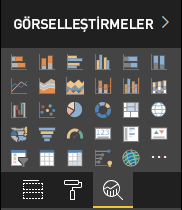

# <a name="power-bi-visual-project-structure"></a>Power BI görseli proje yapısı

Pbiviz yeni `<visual project name>` yürütüldükten sonra araç `<visual project name>` klasöründe temel dosya ve klasör yapısını oluşturur.

## <a name="visual-project-structure"></a>Görsel proje yapısı


* `.vscode` - VS Code için projenin ayarlarını içerir. Çalışma alanınızı yapılandırmak için `.vscode/settings.json` dosyasını düzenleyin. [Belgelerde VS Code ayarları hakkında](https://code.visualstudio.com/docs/getstarted/settings) daha fazla bilgi edinin

* `assets` klasöründe yalnızca `icon.png` dosyası vardır. Araç bu dosyayı Power BI'ın Görselleştirme bölmesinde görselin simgesi olarak kullanır.

    

* `node_modules` klasörü [Node Paket Yöneticisi tarafından yüklenen](https://docs.npmjs.com/files/folders.html) tüm paketleri içerir.

* `src` klasörü görselin kaynak kodunu içerir. Varsayılan olarak araç iki dosya oluşturur:

  * `visual.ts` - görselin ana kaynak kodu.

  * `settings.ts` - görsel için kod ayarları. Dosyadaki sınıflar [görsel özellikleriyle çalışmayı](./objects-properties.md#properties) basitleştirir.

* `style` klasöründe görselin stillerini içeren `visual.less` dosyası vardır.

* `capabilities.json` dosyası görselin ana özelliklerini ve ayarlarını içerir. Görselin desteklenen özellikleri, nesneleri ve veri görünümü eşlemesini bildirmesine olanak tanır.

    [Belgelerde özellikler hakkında](./capabilities.md) daha fazla bilgi edinin.

* Npm'nin `node_modules` ağacını veya `package.json` dosyasını değiştirdiği tüm işlemler için `package-lock.json` otomatik olarak oluşturulur.

    [NPM'nin resmi belgelerinde `package-lock.json` hakkında](https://docs.npmjs.com/files/package-lock.json) daha fazla bilgi edinin.

* `package.json`, proje paketini açıklar. Genellikle proje hakkındaki bilgileri, yazarlarını, projenin açıklamasını ve bağımlılıklarını içerir.

    [NPM'nin resmi belgelerinde `package.json` hakkında](https://docs.npmjs.com/files/package.json.html) daha fazla bilgi edinin.

* `pbiviz.json`, görsel meta verileri içerir. Görselin meta verilerini bu dosyada belirtin.

    Dosyanın normal içeriği:

  ```json
    {
        "visual": {
            "name": "<visual project name>",
            "displayName": "<visual project name>",
            "guid": "<visual project name>23D8B823CF134D3AA7CC0A5D63B20B7F",
            "visualClassName": "Visual",
            "version": "1.0.0",
            "description": "",
            "supportUrl": "",
            "gitHubUrl": ""
        },
        "apiVersion": "2.6.0",
        "author": { "name": "", "email": "" },
        "assets": { "icon": "assets/icon.png" },
        "externalJS": null,
        "style": "style/visual.less",
        "capabilities": "capabilities.json",
        "dependencies": null,
        "stringResources": []
    }
  ```

    burada

  * `name` - görselin dahili adı.

  * `displayName` - Power BI'ın kullanıcı arabiriminde görselin adı.

  * `guid` - görselin benzersiz kimliği.

  * `visualClassName` - görselin ana sınıfının adı. Görseli Power BI raporunda kullanmaya başlamak için Power BI bu sınıfın örneğini oluşturur.

  * `version` - görselin sürüm numarası.

  * `author` - Yazarın adını ve iletişim e-postasını içerir.

  * `assets` içinde `icon` - görselin simge dosyasının yolu.

  * `externalJS` görselde kullanılan JS kitaplıklarının yollarını içerir.

    > [!IMPORTANT]
    > Aracın en son sürümü (3.x.x veya üzeri) artık `externalJS` kullanmaz.

  * `style` stil dosyalarının yoludur.

  * `capabilities`, `capabilities.json` dosyasının yoludur.

  * `dependencies`, `dependencies.json` dosyasının yoludur. `dependencies.json` R tabanlı görsellerde kullanan R paketleri hakkında bilgi içerir.

  * `stringResources`, yerelleştirmeleri içeren dosyaların yollarından oluşmuş bir dizidir.

  [Belgelerde görsellerde yerelleştirme hakkında](./localization.md) daha fazla bilgi edinin

* `tsconfig.json`, TypeScript için yapılandırma dosyasıdır.

    [Resmi belgelerde TypeScript yapılandırması hakkında](https://www.typescriptlang.org/docs/handbook/tsconfig-json.html) daha fazla bilgi edinin

    `files` bölümündeki `tsconfig.json` dosyası, *.ts dosyasının yolunu içermelidir; burada görselin ana sınıfı `pbiviz.json` dosyasının `visualClassName` özelliğinde belirtilir.

* `tslint.json` dosyası TSLint yapılandırmasını içerir.

    [Resmi belgelerde TSLint yapılandırması hakkında](https://palantir.github.io/tslint/usage/configuration/) daha fazla bilgi edinin

## <a name="next-steps"></a>Sonraki adımlar

* Görselin, kullanıcının ve Power BI'ın birbiriyle nasıl etkileşim kurduğunu daha iyi anlamak için [görsel kavramı hakkındaki](./power-bi-visuals-concept.md) diğer belgeleri okuyun.

* [Adım adım kılavuzla](./custom-visual-develop-tutorial.md) sıfırdan kendi Power BI Görsellerinizi geliştirmeye başlayın.
