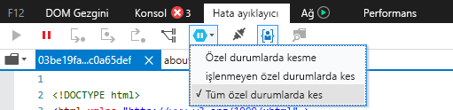
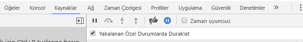

# <a name="how-to-debug-power-bi-visuals"></a>Power BI görsellerinde hata ayıklama

Bu sayfada görselinizi oluştururken hatalarını ayıklamaya yönelik bazı ipuçları gösterilir. Temel adımlar verilir ve standart ön uç uygulamalarıyla Power BI görselinin hata ayıklaması arasındaki farklar gösterilir.
Makaleyi okuduktan sonra kesme noktalarını, özel durumları günlüğe kaydetmeyi ve Chrome ile Microsoft Edge’de özel durumları yakalama işlemini kullanarak Power BI görsellerinde hata ayıklama işlemi yapabileceksiniz.

## <a name="using-breakpoints"></a>Kesme noktalarını kullanma

Görselin JavaScript kodu görsel her güncelleştirildiğinde tamamen yeniden yükleniyorsa, hata ayıklaması yapılan görsel yenilendiğinde eklemiş olduğunuz tüm kesme noktaları kaybolur. Geçici bir çözüm olarak kodunuzda `debugger` deyimini kullanın. Kodunuzda `debugger` kullanırken otomatik yeniden yüklemeyi kapatmanız önerilir.

```typescript
public update(options: VisualUpdateOptions) {
    console.log('Visual update', options);
    debugger;
    this.target.innerHTML = `<p>Update count: <em>${(this.updateCount</em></p>`;
}
```


## <a name="showing-exceptions"></a>Özel durumları gösterme

Görselinizde çalışırken tüm hataların Power BI hizmeti tarafından 'tüketildiğini' fark edersiniz. Bu, hatalı davranan görsellerin tüm uygulamada kararsızlığa yol açmasını engellemek için bilerek uygulanan bir Power BI özelliğidir.

Geçici bir çözüm olarak, özel durumlarınızı yakalamak ve günlüğe kaydetmek için kod ekleyin veya hata ayıklayıcınızı yakalanan özel durumlarda kesilecek şekilde ayarlayın.


## <a name="log-exceptions"></a>Günlük özel durumları

Power BI görselinizde özel durumları günlüğe kaydetmek için aşağıdaki kodu görselinize ekleyerek bir özel durum günlüğü dekoratörü tanımlayın.

```typescript
export function logExceptions(): MethodDecorator {
    return function (target: Object, propertyKey: string, descriptor: TypedPropertyDescriptor<any>): TypedPropertyDescriptor<any> {
        return {
            value: function () {
                try {
                    return descriptor.value.apply(this, arguments);
                } catch (e) {
                    console.error(e);
                    throw e;
                }
            }
        }
    }
}
```
Ardından hata günlüğünü görmek için her işlevde bu dekoratörü kullanabilirsiniz.

```typescript
@logExceptions()
public update(options: VisualUpdateOptions) {
```

## <a name="break-on-exceptions"></a>Özel durumlarda kesme

Ayrıca tarayıcıyı özel durumlarda kesecek şekilde ayarlayabilirsiniz. Bu ayar hata oluştuğunda kod yürütmeyi durdurur ve o noktada hata ayıklamanıza olanak tanır.

### <a name="edge"></a>Edge

1. Geliştirici araçlarını açın (F12).
2. **Hata Ayıklayıcı** sekmesine gidin.
3. **Özel durumlarda kes** simgesine (duraklatma simgesi olan altıgen) tıklayın.
4. **Tüm özel durumlarda kes**’i seçin.



## <a name="chrome"></a>Chrome

1. Geliştirici araçlarını açın (F12).
2. **Kaynaklar** sekmesine gidin.
3. **Özel durumlarda kes** simgesine (duraklatma simgesi olan dur işareti) tıklayın.
4. **Yakalanan Özel Durumlarda Duraklat** onay kutusunu seçin.



## <a name="next-steps"></a>Sonraki adımlar
* [Power BI görselleriyle ilgili sorunları giderme](power-bi-custom-visuals-troubleshoot.md)
* Daha fazla bilgi edinmek ve sorularınıza yanıt bulmak için [Power BI görselleri hakkında sık sorulan sorular](power-bi-custom-visuals-faq.md#organizational-power-bi-visuals) bağlantısını ziyaret edin
