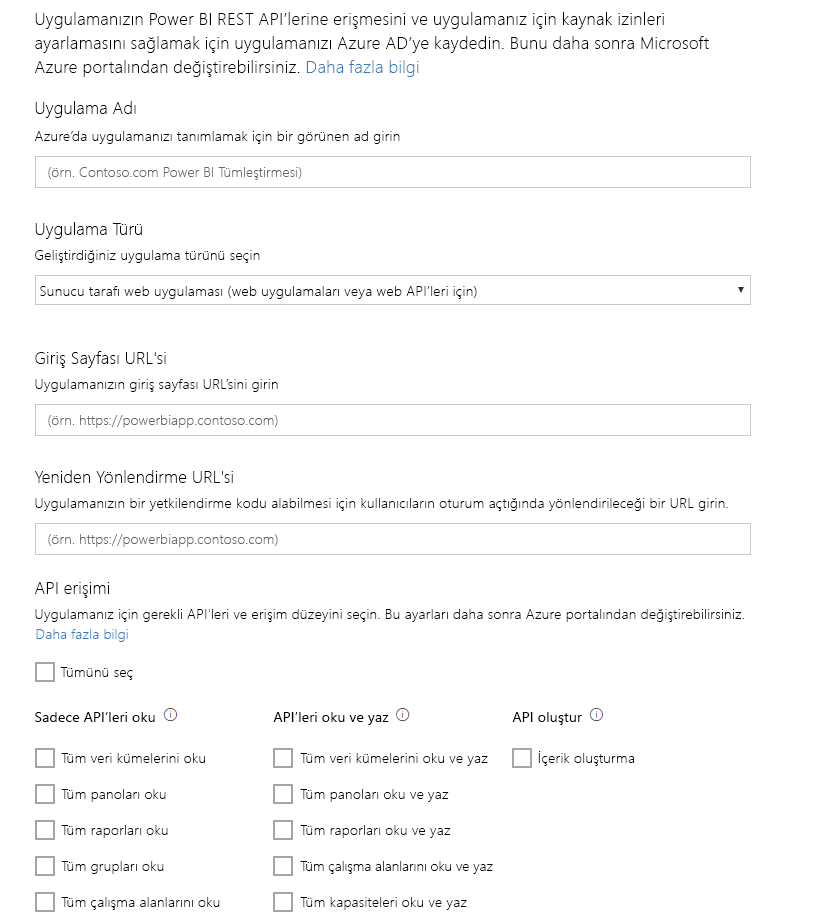

# 1. Adım: Bir uygulamayı Azure AD'ye kaydetme
Bu makale, [veri kümelerine veri göndermeye](walkthrough-push-data.md) ilişkin adım adım kılavuzun bir parçasıdır.

Power BI veri kümelerine veri gönderebilmek için ilk olarak uygulamanızı Azure AD'ye kaydetmeniz gerekir. Bunun nedeni, Azure AD'de uygulamanızı tanımlayan bir **İstemci Kimliği** edinecek olmanızdır. Azure AD, **İstemci Kimliği** olmadan uygulamanızın kimliğini doğrulayamaz.

> **Not**: Bir uygulamayı Power BI'a kaydedebilmeniz için öncelikle [Power BI'a kaydolmanız](create-an-azure-active-directory-tenant.md) gerekir.
> 
> 

Bir uygulamayı Azure AD'ye kaydetmeye ilişkin adımlar aşağıda açıklanmıştır.

## Bir Uygulamayı Azure AD'ye kaydetme
1. dev.powerbi.com/apps adresine gidin.
2. **Sign in with your existing account** (Mevcut hesabınızla oturum açın) seçeneğine tıklayın ve Power BI hesabınızda oturum açın.
3. **App Name** (Uygulama Adı) alanına bir uygulama adı (örneğin, "Örnek veri gönderme uygulaması") girin.
4. **App Type** (Uygulama Türü) için **Native app** (Yerel uygulama) seçeneğini belirleyin.
5. **https://login.live.com/oauth20_desktop.srf** gibi bir **Yeniden yönlendirme URL'si** girin. **Native client app** (Yerel istemci uygulaması) için yönlendirme URI'si girildiğinde, **Azure AD**'ye kimliği doğrulanacak belirli uygulama ile ilgili daha ayrıntılı bilgi sağlanmış olur. Bir istemci uygulamasının standart Uri’si https://login.live.com/oauth20_desktop.srf.
6. **Choose APIs to access** (Erişilecek API'leri seçin) bölümünde **Read and Write All Datasets** (Tüm Veri Kümelerini Okuma ve Yazma) seçeneğini belirleyin. Tüm Power BI uygulama izinleri için bkz. [Power BI İzinleri](power-bi-permissions.md).
7. **Register app**'e (Uygulamayı kaydet) tıklayın ve oluşturulan **İstemci Kimliğini** kaydedin. **İstemci Kimliği**, Azure AD'de uygulamayı tanımlar.

**Power BI'a Uygulama Kaydetme** sayfanız aşağıdaki gibi görünür:

Sonraki adımda, [kimlik doğrulaması erişim belirteci alma](walkthrough-push-data-get-token.md) işlemini nasıl gerçekleştireceğiniz gösterilmiştir.

[Sonraki Adım >](walkthrough-push-data-get-token.md)

## Sonraki adımlar
[Power BI'a kaydolma](create-an-azure-active-directory-tenant.md)  
[Kimlik doğrulaması erişim belirteci alma](walkthrough-push-data-get-token.md)  
[İzlenecek yol: Veri kümelerine veri gönderme](walkthrough-push-data.md)  
[Uygulamaları kaydetme](register-app.md)  
[Overview of Power BI REST API (Power BI REST API'sine Genel Bakış)](overview-of-power-bi-rest-api.md)  

Başka bir sorunuz mu var? [Power BI Topluluğu'na sorun](http://community.powerbi.com/)

