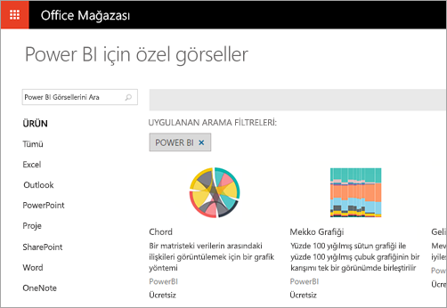
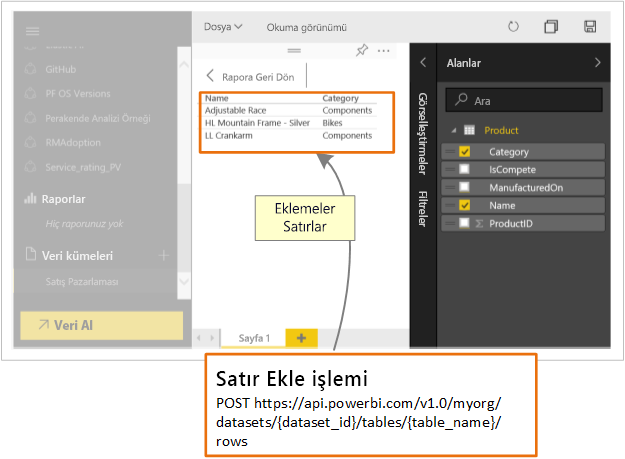

# Geliştiriciler Power BI ile neler yapabilir?

Geliştiriciler, Power BI içeriğini uygulamalara eklemek için farklı seçenekler deneyebilir. Geliştirici olarak **Power BI ile ekleme**, **özel görseller** ve **Power BI’ya veri gönderme** seçeneklerini kullanabilirsiniz.

## Power BI içeriğini ekleme

Power BI hizmetinde (SaaS) ve Azure’daki Power BI Embedded hizmetinde (PaaS), panolarınızı ve raporlarınızı eklemeye yönelik API’ler bulunur. Bu özellik, içeriğinizi eklerken panolar, ağ geçitleri ve çalışma alanları gibi en yeni Power BI özeliklerine erişebileceğiniz anlamına gelir.

Bir örnek uygulamayı indirmek ve hızlıca başlamak için [Ekleme kurulum aracını](https://aka.ms/embedsetup) inceleyebilirsiniz.

Size uygun olan çözümü seçin:

* [Embedding for your customers](embedding.md#embedding-for-your-customers) seçeneği, Power BI hesabı olmayan kullanıcılar için panolar ve raporlar eklemenize olanak sağlar. [Embed for your customers](https://aka.ms/embedsetup/AppOwnsData) çözümünü çalıştırın.

* [Embedding for your organization](embedding.md#embedding-for-your-organization) seçeneği, Power BI hizmetinin kapsamını genişletmenize olanak tanır. [Embed for your organization](https://aka.ms/embedsetup/UserOwnsData) çözümünü çalıştırın.

Power BI ile ekleme hakkında daha fazla bilgi için bkz. [Power BI ile Ekleme](embedding.md).

## Özel görseller geliştirme

Power BI ile özel görselleri kullanarak size veya şirketinize göre uyarlanmış benzersiz türde bir görsel oluşturabilirsiniz. Bu özel görseller genellikle geliştiriciler tarafından oluşturulur. Power BI’de yer alan çok sayıda görsel ihtiyaçlarınızı karşılamadığında oluşturulurlar.

Özel görseller, Power BI raporlarında kullanmak üzere görsellerinizi oluşturmanızı sağlar. Özel görseller bir JavaScript üst kümesi olan TypeScript dilinde yazılır. TypeScript, bazı gelişmiş özellikleri ve ES6/ES7 işlevine erken erişimi destekler. Görsel stili, basamaklı biçim tabloları (CSS) kullanılarak işlenir. Size kolaylık sağlamak adına, iç içe geçme, değişkenler, koşullar ve döngüler ve diğer özellikler gibi bazı gelişmiş özellikleri destekleyen LESS ön derleyicisini kullanıyoruz. Bu özelliklerden hiçbirini kullanmak istemiyorsanız less dosyasında yalın CSS yazmayı da tercih edebilirsiniz.

Özel görsel geliştirme hakkında daha fazla bilgi edinmeye başlamak için bkz. [Power BI özel görseli geliştirme](visuals/custom-visual-develop-tutorial.md).

## API otomasyonunu kullanma

Power BI, gerçek zamanlı olarak pek çok farklı veri kaynağından oluşturulabilen ve güncelleştirilebilen etkileşimli panolar görüntüler. REST çağrılarını destekleyen herhangi bir programlama dilini kullanarak, Power BI panosuyla gerçek zamanlı olarak tümleşebilen uygulamalar oluşturabilirsiniz. Ayrıca, Power BI kutucuklarını ve raporlarını da uygulamalara tümleştirebilirsiniz.

Geliştiriciler ayrıca etkileşimli raporlarda ve panolarda kullanılması mümkün kendi veri görselleştirmelerini de oluşturabilirler.

Power BI API ile yapabileceğiniz bazı şeyler için bkz. [Geliştiriciler Power BI API neler yapabilir](automation/overview-of-power-bi-rest-api.md)?

## Sonraki adımlar

[Power BI ile ekleme](embedding.md)  

[Power BI özel görseli geliştirme](https://microsoft.github.io/PowerBI-visuals/docs/step-by-step-lab/developing-a-power-bi-custom-visual/)

[Geliştiriciler Power BI API ile neler yapabilir?](automation/overview-of-power-bi-rest-api.md)

[Power BI Geliştirici Merkezi](https://powerbi.microsoft.com/developers/)