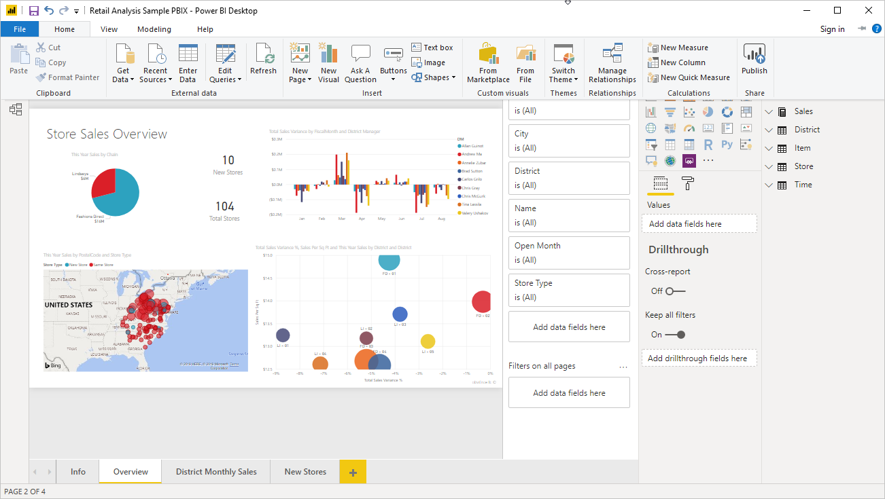
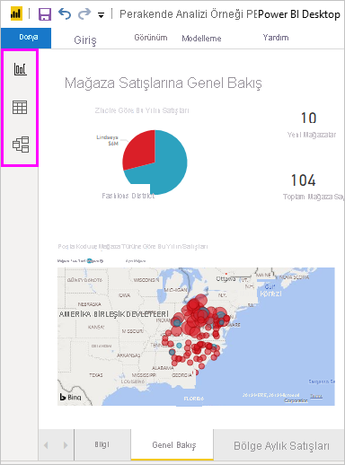
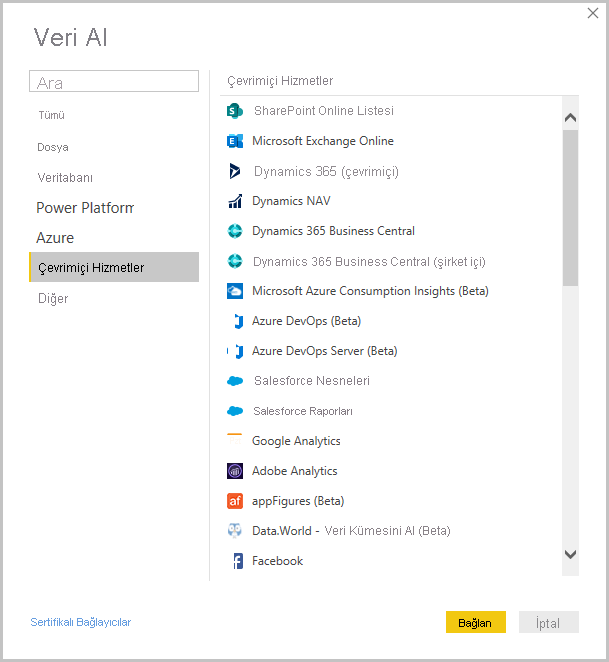
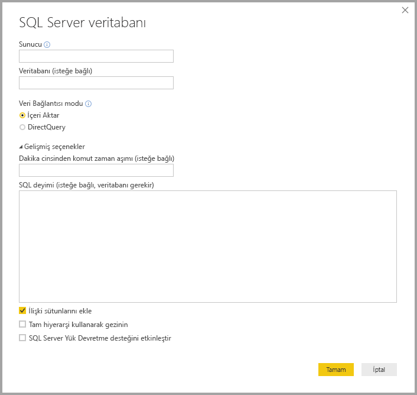
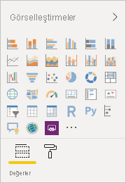
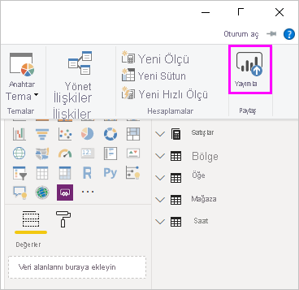

# Power BI Desktop nedir?

*Power BI Desktop*, yerel bilgisayarınıza yükleyebileceğiniz ücretsiz bir uygulamadır ve verilerinize bağlanmayı, verileri dönüştürmeyi ve verilerinizi görselleştirmeyi sağlar. Power BI Desktop sayesinde çok sayıda farklı veri kaynağına bağlanıp bu kaynakları bir veri modelinde birleştirebilirsiniz (bu süreç çoğunlukla *modelleme* olarak adlandırılır). Bu veri modeli görseller ve kuruluşunuzdaki diğer kişilerle rapor olarak paylaşabileceğiniz görsel koleksiyonları oluşturmanızı sağlar. İş zekası projelerinde çalışan çoğu kullanıcı, raporlar oluşturmak için Power BI Desktop kullanır ve sonra raporlarını başkalarıyla paylaşmak için *Power BI hizmetini* kullanır.

Power BI Desktop’ın en yaygın kullanım şekilleri aşağıda verilmiştir:

* Verilere bağlanma
* Bir veri modeli oluşturmak için bu verileri dönüştürme ve temizleme
* Verilerin görsel açıklamalarını sağlayan grafik gibi görseller oluşturma
* Bir veya daha fazla rapor sayfasında görsel koleksiyonu olan raporlar oluşturma
* Power BI hizmetini kullanarak raporları başkalarıyla paylaşma

Çoğunlukla bu tür görevlerden sorumlu kişilerin *veri analistleri* (bazı durumlarda yalnızca *analistler* olarak anılır) ya da iş zekası uzmanları (genellikle *rapor oluşturucular* olarak anılır) olduğu düşünülür. Ancak, kendisini çözümleyici veya rapor oluşturucu olarak görmeyen birçok kişi, ilgi çekici raporlar oluşturmak veya çeşitli kaynaklardan verileri çekmek ve veri modelleri oluşturmak için Power BI Desktop kullanır.

> [!IMPORTANT]
> Power BI Desktop müşteri geri bildirimlerini ve yeni özellikleri bir araya getirecek şekilde aylık olarak güncelleştirilir ve kullanıma sunulur. Yalnızca Power BI Desktop'ın en son sürümü desteklenir; Power BI Desktop için müşteri desteğine başvuran müşterilerden en son sürümü yükseltmeleri istenir. Power BI Desktop'ın en son sürümünü [Windows Store](https://aka.ms/pbidesktopstore)'dan alabileceğiniz gibi tüm desteklenen dilleri içeren ve bilgisayarınıza [indirip](https://www.microsoft.com/download/details.aspx?id=58494) yüklediğiniz tek bir yürütülebilir dosya olarak da elde edebilirsiniz.

Power BI Desktop’ta, tuvalin sol tarafından seçebileceğiniz üç görünüm bulunur. Göründükleri sırayla gösterilen görünümler aşağıdaki gibidir:
* **Rapor**: Bu görünüm, raporları ve görselleri oluşturduğunuz ve oluşturma zamanınızın büyük bir kısmının geçtiği yerdir.
* **Veri**: Bu görünümde raporunuzla ilişkili veri modelinde kullanılan tabloları, ölçümleri ve diğer verileri görebilir ve verileri raporun modelinde en iyi şekilde kullanmak üzere dönüştürebilirsiniz.
* **Model**: Bu görünümde, veri modelinizdeki tablolar arasındaki ilişkileri görüp yönetebilirsiniz.

Aşağıdaki görüntüde, tuvalin sol tarafında gösterildiği gibi üç görünüm gösterilmektedir:

 

## Verilere bağlanma
Power BI Desktop kullanmaya başlamak için ilk adım verilere bağlanmaktır. Power BI Desktop’tan bağlanabileceğiniz çok çeşitli türlerde veri kaynağı mevcuttur. 

Verilere bağlanmak için:

1. **Giriş** şeridinde **Veri Al** > **Diğer**'i seçin. 

   Power BI Desktop’ın bağlanabildiği çok sayıda kategoriyi içeren **Veri Al** penceresi açılır.

   

2. Bir veri türü seçtiğinizde, Power BI Desktop’ın sizin adınıza veri kaynağına bağlanması için gereken URL ve kimlik bilgileri gibi bilgiler istenir.

   

3. Bir veya daha fazla veri kaynağına bağlandıktan sonra verileri sizin için yararlı olacak şekilde dönüştürmek isteyebilirsiniz.

## Verileri dönüştürme ve temizleme, model oluşturma

Power BI Desktop’ta yerleşik [Power Query Düzenleyicisi](../transform-model/desktop-query-overview.md)’ni kullanarak verileri temizleyebilir ve dönüştürebilirsiniz. Power Query Düzenleyicisi ile verilerinizde, veri türünü değiştirme, sütunları kaldırma veya birden çok kaynaktan veri birleştirme gibi değişiklikler yapabilirsiniz. Biraz heykeltıraşlık gibidir; büyük bir kil (veya veri) bloğu ile başlayabilir, sonra verilerin şekli istediğiniz duruma gelene kadar gerektikçe parçaları tıraş edebilir ya da ekleyebilirsiniz. 

Power Query Düzenleyicisi'ni başlatmak için:

- **Giriş** şeridinde, **sorgular** bölümünde, **verileri Dönüştür**' ü seçin.

   **Power Query Düzenleyicisi** penceresi görüntülenir.

   

Verileri dönüştürürken uyguladığınız her adım (bir tabloyu yeniden adlandırma, bir veri türünü dönüştürme veya sütunları silme gibi) Power Query Düzenleyicisi tarafından kaydedilir. Bu sorgu veri kaynağına her bağlandığında, verilerin her zaman belirttiğiniz gibi şekillendirilmesi için o adımlar uygulanır.

Aşağıdaki görüntüde, şekillendirilmiş ve bir modele dönüştürülmüş sorgunun **Power Query Düzenleyicisi** penceresi gösterilmektedir.

 

Verileriniz istediğiniz gibi olana kadar görseller oluşturabilirsiniz. 

## Görsel oluşturma 

Bir veri modeli elde ettikten sonra *alanları* rapor tuvalinin üzerine sürükleyerek *görseller* oluşturabilirsiniz. Görsel, modelinizdeki verilerin grafiksel bir açıklamasıdır. Power BI Desktop'ta seçebileceğiniz farklı türde görseller vardır. Aşağıdaki görsel basit bir sütun grafiğini göstermektedir. 

Görsel oluşturmak veya değiştirmek için: 

- **Görselleştirmeler** bölmesinde görsel simgesini seçin. 

   

   Rapor tuvalinde seçili bir görseliniz varsa, seçili görsel seçtiğiniz türle değiştirilir. 

   Tuvalde bir görsel seçilmezse, seçiminize göre yeni bir görsel oluşturulur.

## Rapor oluşturma

Çoğunlukla, Power BI Desktop’ta modelinizi oluşturmak için kullandığınız verilerin çeşitli yönlerini gösteren bir görsel koleksiyonu oluşturmak istersiniz. Tek bir Power BI Desktop dosyasındaki bir görsel koleksiyonu *rapor* olarak adlandırılır. Tıpkı bir Excel dosyasında bir veya daha fazla çalışma sayfası olabileceği gibi bir raporda bir veya daha fazla sayfa olabilir.

Power BI Desktop ile, birden fazla kaynaktan verileri kullanarak kuruluşunuzdaki diğer kullanıcılarla paylaşabileceğiniz tek bir rapor halinde karmaşık ve görsel açıdan zengin raporlar oluşturabilirsiniz.

Aşağıdaki görüntüde bir Power BI Desktop raporunun **Genel Bakış** adlı birinci sayfasını görebilirsiniz (sekmeyi görüntünün altında görebilirsiniz). 

## Rapor paylaşma

Bir rapor başkalarıyla paylaşmaya hazır olduğunda raporu Power BI hizmetinde *yayımlayabilir* ve kuruluşunuzda bir Power BI lisansına sahip olan herkesin kullanımına sunabilirsiniz. 

Power BI Desktop raporunu yayımlamak için: 

1. **Giriş** şeridinde **Yayımla**'yı seçin.

   

   Power BI Desktop, Power BI hesabınızı kullanarak sizi Power BI hizmetine bağlar. 

2. Sonra çalışma alanınız, bir ekip çalışma alanı ya da Power BI hizmetindeki başka bir konum gibi Power BI hizmetinde raporu paylaşmak istediğiniz yeri seçmenizi ister. 

   Power BI hizmetinde rapor paylaşmak için bir Power BI lisansına sahip olmanız gerekir.

## Sonraki adımlar

Power BI Desktop'ı kullanmaya başlamak için ilk olarak uygulamayı indirip yüklemeniz gerekir. Power BI Desktop’ı edinmenin iki yolu vardır:

* [Microsoft Store’dan Power BI Desktop’ı edinme](https://aka.ms/pbidesktopstore)
* [Web’den Power BI Desktop'ı indirme](https://www.microsoft.com/download/details.aspx?id=58494)
