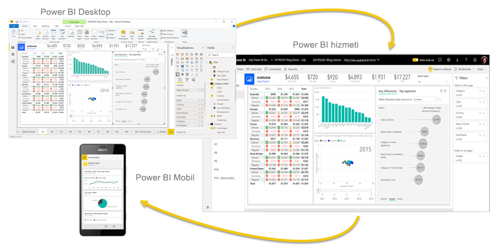
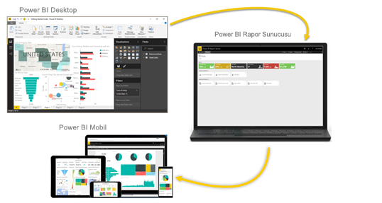

# Power BI nedir?
**Power BI**, birbirinden bağımsız veri kaynaklarınızı tutarlı, görsel olarak sürükleyici ve etkileşimli öngörülere dönüştürmenizi sağlamak için birlikte çalışan yazılım hizmetlerinden, uygulamalardan ve bağlayıcılardan oluşan bir koleksiyondur. Verileriniz bir Excel elektronik tablosu veya bulut tabanlı ve şirket içi hibrit veri ambarları koleksiyonu olabilir. Power BI veri kaynaklarınıza kolayca bağlanmanızı, önemli noktaları görselleştirmenizi ve keşfetmenizi, bunu herkesle veya istediğiniz kişilerle paylaşmanızı sağlar.

## Power BI'ın bileşenleri
Power BI, şu üç temel öğe dahil olmak üzere bir arada çalışan birkaç farklı bileşenden oluşur: 
- **Power BI Desktop** adlı bir Windows masaüstü uygulaması.
- **Power BI hizmeti** adlı bir çevrimiçi SaaS (*Hizmet olarak Yazılım*). 
- Windows, iOS ve Android cihazlar için Power BI **mobil uygulamaları**.

Bu üç bileşen (Power BI Desktop, hizmet ve mobil uygulamalar) ihtiyaçlarınıza veya sahip olduğunuz role uygun iş içgörüleri oluşturmanıza, paylaşmanıza ve kullanmanıza olanak sağlamak için tasarlanmıştır.

Power BI'da bu üç bileşenin dışında iki öğe daha vardır:

- **Power BI Report Builder**, Power BI hizmetinde paylaşılabilecek sayfalandırılmış raporlar oluşturmayı sağlar. Bu makalenin ilerleyen bölümlerinde [sayfalandırılmış raporlar](#paginated-reports-in-the-power-bi-service) hakkında daha fazla bilgi edineceksiniz.
- **Power BI Rapor Sunucusu**, Power BI Desktop'ta oluşturduğunuz Power BI raporlarınızı yayımlayabileceğiniz şirket içi rapor sunucusudur. Bu makalenin ilerleyen bölümlerinde [Power BI Rapor Sunucusu](#on-premises-reporting-with-power-bi-report-server) hakkında daha fazla bilgi edineceksiniz.

## Power BI, rolünüzle nasıl eşleşir?
Power BI'ı nasıl kullandığınız bir projedeki veya ekipteki rolünüze bağlıdır. Başka rollerdeki kullanıcılar Power BI'ı farklı şekillerde kullanabilir.

Örneğin, **Power BI hizmetini** öncelikli olarak raporları ve panoları görüntülemek için kullanabilirsiniz. Sürekli hesaplama yapan, iş raporları oluşturan iş arkadaşınız raporları oluşturmak ve sonra da bunları görüntüleyebileceğiniz Power BI hizmetine yayımlamak için **Power BI Desktop**'ı veya **Power BI Report Builder**'ı yoğun olarak kullanabilir. Satış departmanındaki başka biri, satış kotalarındaki ilerleme durumu izlemek ve yeni olası müşteri bilgilerinde detaya gitmek için asıl olarak **Power BI telefon uygulamasını** kullanabilir.

Geliştiriciyseniz, Power BI API’lerini kullanarak veri kümelerine veri gönderebilir veya pano ve raporları kendi özel uygulamalarınıza ekleyebilirsiniz. Yeni bir görsel için fikriniz mi var? Kendi başınıza oluşturun ve başkalarıyla paylaşın.  

Bununla birlikte, ne elde etmek istediğinize veya belirli bir proje için sahip olduğunuz role bağlı olarak farklı zamanlarda Power BI'ın her bileşenini kullanabilirsiniz.

Power BI'ı nasıl kullandığınız, Power BI'ın hangi özelliğinin veya hizmetinin sizin durumunuza en uygun araç olduğuna bağlı olabilir. Örneğin, bir yandan Power BI hizmetindeki gerçek zamanlı bir panoda envanter ve üretim sürecini izlerken diğer yandan kendi ekibiniz için müşteri ilişkilerine yönelik istatistiklerle ilgili raporlar oluşturmak üzere Power BI Desktop'ı kullanabilirsiniz. Bir Power BI veri kümesini temel alan, postayla gönderilebilir raporlardan oluşan sayfalandırılmış bir rapor oluşturabilirsiniz. Power BI'ın her bölümü kullanılabilir, onu bu kadar esnek ve cazip yapan da budur.

Rolünüzle ilgili belgeleri keşfetme:
- [*İşletme kullanıcıları*](../consumer/end-user-consumer.md) için Power BI
- [*Rapor oluşturucuları*](desktop-what-is-desktop.md) için Power BI Desktop
- [*Kurumsal rapor oluşturucuları*](../paginated-reports/paginated-reports-report-builder-power-bi.md) için Power BI Report Builder
- [*Yöneticileri*](../admin/service-admin-administering-power-bi-in-your-organization.md) için Power BI
- *Geliştiriciler* için Power BI
    * [Power BI ile tümleşik analiz](../developer/embedded/embedding.md)
    * [Azure'da Power BI Embedded nedir?](../developer/embedded/azure-pbie-what-is-power-bi-embedded.md)
    * [Power BI’daki görseller](../developer/visuals/power-bi-custom-visuals.md)
    * [Geliştiriciler Power BI API ile neler yapabilir?](../developer/automation/overview-of-power-bi-rest-api.md)

## Power BI'daki iş akışı
Power BI’da kullanılan ortak bir iş akışı, Power BI Desktop’ta veri kaynaklarına bağlanarak ve rapor oluşturarak başlar. Ardından bu raporu Power BI Desktop'tan Power BI hizmetine yayımlar ve paylaşırsınız. Bu sayede Power BI hizmetindeki ve mobil cihazlardaki işletme kullanıcıları raporu görüntüleyebilir ve raporla etkileşimli çalışabilir.

Bu yaygın bir iş akışıdır ve üç ana Power BI öğesinin birbirini nasıl tamamladığını gösterir.

Burada ayrıntılı bir [Power BI Desktop ve Power BI hizmeti karşılaştırması](../fundamentals/service-service-vs-desktop.md) bulabilirsiniz.

## Power BI hizmetinde sayfalandırılmış raporlar

Bir diğer iş akışı da Power BI hizmetindeki sayfalandırılmış raporları kapsar. Kurumsal rapor oluşturucuları, yazdırılacak veya paylaşılacak sayfalandırılmış raporlar oluşturabilir. Bu kullanıcılar ayrıca bu raporları Power BI hizmetinde de paylaşabilir. *Sayfalandırılmış* olarak adlandırılmalarının nedeni, bir sayfaya düzgün yerleştirilecek şekilde biçimlendirilmiş olmalarıdır. Bu seçenek genellikle operasyonel raporlar veya faturalar ya da dökümler gibi yazdırılacak formlar için kullanılır. Tablo birden fazla sayfaya yayılsa bile tüm verileri bir tabloda gösterirler. Power BI Report Builder, sayfalandırılmış raporlar yazmaya yarayan bağımsız bir araçtır.

:::image type="content" source="media/power-bi-overview/paginated-report-invoice-power-bi-service.png" alt-text="Power BI hizmetindeki sayfalandırılmış raporun ekran görüntüsü.":::

Power BI hizmetindeki [sayfalandırılmış raporlar](../paginated-reports/paginated-reports-report-builder-power-bi.md) hakkında daha fazla bilgi edinin.

## Power BI rapor sunucusu ile şirket içi raporlama

Peki raporlarınızın şirket içinde, güvenlik duvarının arkasında kalması gerekiyorsa ne yapabilirsiniz?  Okumaya devam edin.

Power BI Rapor Sunucusu tarafından sağlanan kullanıma hazır araçları ve hizmetleri kullanarak Power BI Desktop ile Power BI raporları, Report Builder ile de sayfalandırılmış raporlar oluşturabilir, dağıtabilir ve bunları yönetebilirsiniz.

Power BI Rapor Sunucusu, güvenlik duvarınızın arkasında dağıttığınız ve sonra raporlarınızı bir web tarayıcısında, mobil cihazda veya e-posta olarak görüntülemeyi içeren farklı yöntemlerle doğru kullanıcılara ilettiğiniz bir çözümdür. Power BI Rapor Sunucusu bulutta Power BI ile uyumlu olduğundan, hazır olduğunuzda buluta taşıyabilirsiniz. 

[Power BI Rapor Sunucusu](../report-server/get-started.md) hakkında daha fazla bilgi edinin.

## Sonraki adımlar
- [Hızlı başlangıç: Power BI hizmetini öğrenme](../consumer/end-user-experience.md)   
- [Öğretici: Power BI hizmeti ile çalışmaya başlama](service-get-started.md)
- [Hızlı başlangıç: Power BI Desktop'taki verilere bağlanma](../connect-data/desktop-quickstart-connect-to-data.md)
