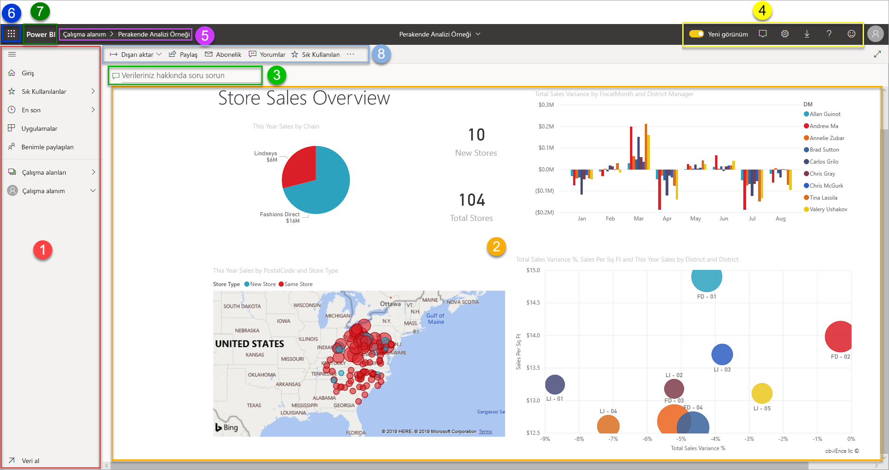

# Power BI hizmetinde tasarımcılara yönelik temel kavramlar

Bu makalenin amacı Power BI hizmetinde yolunuzu bulmanızı sağlamaktır: farklı öğeler nelerdir, birlikte nasıl çalışırlar ve bunlarla nasıl çalışabilirsiniz? Zaten [Power BI hizmetine kaydolduysanız](service-self-service-signup-for-power-bi.md) ve [veri eklediyseniz](../connect-data/service-get-data.md) bu makaleden daha iyi yararlanabilirsiniz. Bir tasarımcı olarak, normal iş akışınız genellikle Power BI Desktop'ta raporlar oluşturmakla başlar. Ardından bunları Power BI hizmetine yayımlarsınız ve burada raporlarda değişiklik yapmaya devam edebilirsiniz. Ayrıca Power BI hizmetinde raporlarınızı temel alan panolar da oluşturabilirsiniz. 

Bu makale için, henüz kendi raporlarınız yoksa [Power BI örneklerinden](../create-reports/sample-datasets.md) birini yüklemeyi deneyin.

Power BI hizmetini tarayıcıda açtığınızda kendi Giriş ekranınızdan başlarsınız. Burada görebileceğiniz öğeler şunlardır:

1. Gezinti bölmesi
2. Microsoft 365 uygulama başlatıcısı
3. Power BI giriş düğmesi
4. Simge düğmeleri (ayarlar, yardım ve geri bildirim gibi)
5. Arama kutusu
6. Sık kullanılan panolar, raporlar ve çalışma alanları
7. Son panolar, raporlar ve çalışma alanları
8. Çalışma alanlarınız

Siz ve raporlarınızın ve panolarınızın son kullanıcıları, tarayıcıdaki Power BI hizmetinde aynı başlangıç deneyimine sahipsiniz.

Daha sonra bu özelliklerin ayrıntısına ineceğiz ancak şimdi bazı Power BI kavramlarını inceleyelim. Öte yandan önce bu videoyu izlemeniz de faydalı olabilir.  Videoda Will, temel kavramları inceliyor ve sizi Power BI hizmetinde bir tura çıkarıyor.

<iframe width="560" height="315" src="https://www.youtube.com/embed/B2vd4MQrz4M" frameborder="0" allowfullscreen></iframe>

## Power BI kavramları
Power BI'ın başlıca beş yapı taşı şunlardır: *panolar*, *raporlar*, *çalışma kitapları*, *veri kümeleri* ve *veri akışları*. Bunların hepsi *çalışma alanları* olarak düzenlenir ve *kapasiteler* üzerinde oluşturulur.  Beş yapı taşını ayrıntılı olarak incelemeden önce kapasiteleri ve çalışma alanlarını anlamanız önemli olduğundan bu kavramla başlayacağız.

## Kapasiteler
Kapasiteler, Power BI içeriğinizi barındırmak ve sunmak için kullanılan bir dizi kaynağı (depolama, işlemci ve bellek) temsil eden temel bir Power BI kavramıdır. Kapasiteler _paylaşımlı_ veya _ayrılmıştır_. Paylaşılan kapasite diğer Microsoft müşterileriyle paylaşılırken, ayrılmış kapasite ise tamamen tek bir müşteriye ayrılmıştır. Ayrılmış kapasiteler [abonelik](../admin/service-premium-what-is.md)gerektirir ve [Premium kapasiteleri yönetme](../admin/service-premium-capacity-manage.md) makalesinde tam olarak açıklanmaktadır.

Varsayılan olarak, çalışma alanları paylaşılan bir kapasitede oluşturulur. Paylaşılan kapasitede iş yükleri, diğer müşterilerle paylaşılan hesaplama kaynaklarında çalışır. Kapasitenin kaynakları paylaşması gerektiğinden, “tarafsızlığı” sağlamak için maksimum model boyutu (1 GB) ve maksimum günlük yenileme sıklığı (günde sekiz defa) gibi sınırlamalar uygulanır.

## Çalışma alanları
Çalışma alanları kapasitelerde oluşturulur. Çalışma alanları, Power BI'daki panolar, raporlar, çalışma kitapları, veri kümeleri ve veri akışları için kapsayıcı görevi görür.

İki tür çalışma alanı vardır: *Çalışma alanım* ve *çalışma alanları*.

- *Çalışma alanım*, Power BI müşterilerinin kendi içeriği üzerinde çalışma yapabileceği kişisel çalışma alanıdır. Çalışma Alanım sayfasına yalnızca siz erişebilirsiniz. Çalışma Alanım sayfanızda panoları ve raporları paylaşabilirsiniz. Panolar ve raporlar üzerinde işbirliği yapmak veya uygulama oluşturmak istiyorsanız, bir çalışma alanında çalışmak istersiniz.

-  *Çalışma alanları*, iş arkadaşlarıyla işbirliği yapmak ve içerik paylaşmak için kullanılır. Çalışma alanlarınıza iş arkadaşlarınızı ekleyerek panolar, raporlar, çalışma kitapları ve veri kümeleri üzerinde işbirliği yapabilirsiniz. Bir özel durum haricinde, tüm çalışma alanı üyelerinin Power BI Pro lisansı olmalıdır. [Yeni çalışma alanları](../collaborate-share/service-create-the-new-workspaces.md) hakkında daha fazla bilgi edinin. 

    Çalışma alanlarında ayrıca kuruluşunuz için *uygulama* oluşturur, yayımlar ve yönetirsiniz. Bunları bir Power BI uygulamasını oluşturacak içerik için hazırlık alanı ve kapsayıcı olarak düşünebilirsiniz. Peki *uygulama* nedir? Uygulama, kuruluşunuzdaki Power BI tüketicilerine ana ölçümleri sunmak için oluşturulmuş bir pano ve rapor koleksiyonudur. Uygulamalar etkileşimlidir ancak tüketiciler bunları düzenleyemez. Uygulama kullanıcılarının (uygulamalara erişim sahibi olan iş arkadaşlarınız) Pro lisansına sahip olmasına gerek yoktur.  

Paylaşma hakkında genel olarak daha fazla bilgi edinmek için [Çalışmanızın panolarını paylaşmanın yolları](../collaborate-share/service-how-to-collaborate-distribute-dashboards-reports.md) ile başlayın.

Şimdi Power BI'ın beş yapı taşına geçelim.

## Veri akışları
*Veri akışı*, kuruluşların verileri farklı kaynaklardan birleştirmelerine yardımcı olur. Bunlar isteğe bağlıdır ve genellikle karmaşık ya da daha büyük projelerde kullanılır. Bunlar, veri kümeleri tarafından kullanılmak üzere hazırlanan verileri temsil eder. Ancak raporlama için doğrudan kaynak olarak kullanılamazlar. Bunlar, kapsamlı Microsoft veri bağlayıcıları koleksiyonundan yararlanarak şirket içi ve bulut tabanlı veri kaynaklarından veri alımını sağlar.

Veri akışları yalnızca çalışma alanlarında oluşturulur ve yönetilir (ancak *Çalışma Alanım*’da değil) ve Azure Data Lake Storage 2. Nesil’deki Common Data Model’da (CDM) varlık olarak depolanır. Bunlar genellikle güncel verileri depolamak için yinelenen şekilde yenilenmek üzere zamanlanır. Veri kümeleriniz tarafından kullanılmak ve muhtemelen yeniden kullanılmak üzere veri hazırlamak için harikadırlar. Daha fazla bilgi için [Power BI’da self servis veri hazırlama](../transform-model/dataflows/dataflows-introduction-self-service.md) makalesine bakın.

Veriler olmadan panonuz veya raporunuz olamayacağından (boş panolarınız veya raporlarınız olabilir ancak bunlar veri içerene kadar kullanışlı değildir) **veri kümelerini** tanıyalım.

## Veri kümeleri
Bir *veri kümesi*, *içeri aktardığınız* veya *bağlandığınız* bir veri koleksiyonudur. Power BI, her türden veri kaynağına bağlanmanın ve bunları içeri aktarmanın yanı sıra hepsini tek bir yerde toplamanızı sağlar. Veri kümeleri veri akışlarının verilerini de kaynak olarak kullanabilir.

Veri kümeleri, *çalışma alanlarıyla* ilişkilendirilmiştir ve tek bir veri kümesi, birden fazla çalışma alanına ait olabilir. Bir çalışma alanını açtığınızda ilişkilendirilmiş veri kümeleri, **Veri kümeleri** sekmesinde listelenir. Listelenen her bir veri kümesi tek bir veri kaynağını (örneğin; OneDrive'daki bir Excel çalışma kitabı veya tablosal bir şirket içi SSAS veri kümesi). Desteklenen birçok veri kaynağı olmakla birlikte yenilerini eklemeye de hiç ara vermiyoruz. [Power BI ile kullanılabilen veri kümesi türlerinin](../connect-data/service-get-data.md) listesine göz atın.

Aşağıdaki örnekte "Sales and marketing" çalışma alanını seçtim ve **Veri kümeleri** sekmesine tıkladım.

**BİR** veri kümesi...

* bir veya daha fazla çalışma alanında tekrar tekrar kullanılabilir.
* birçok farklı raporda kullanılabilir.
* Söz konusu veri kümesindeki görselleştirmeler farklı birçok panoda görüntülenebilir.

  

[Bir veri kümesine bağlanmak veya veri kümesini içeri aktarmak](../connect-data/service-get-data.md) için gezinti bölmesinin en altındaki **Veri Al**'ı seçin. İlgili kaynağa bağlanmak veya kaynağı içeri aktarmak ve veri kümesini etkin çalışma alanına eklemek için yönergeleri uygulayın. Yeni veri kümeleri sarı yıldız işareti ile gösterilir. Power BI'da gerçekleştirdiğiniz çalışmalar, temel alınan veri kümesinde değişikliğe neden olmaz.

Bir çalışma alanı üyesi tarafından eklenen veri kümeleri *yönetici*, *üye* veya *katkıda bulunan* rolüne sahip diğer çalışma alanı üyeleri tarafından görülebilir.

Veri kümeleri yenilenebilir, yeniden adlandırılabilir, araştırılabilir ve kaldırılabilir. Veri kümesi kullanarak sıfırdan rapor oluşturabilir veya [hızlı öngörülerden](../create-reports/service-insights.md) faydalanabilirsiniz.  Veri kümesi kullanan raporları ve panoları görmek için **İlişkilileri görüntüle**'yi seçin. Araştırmak için veri kümesini seçmeniz gerekir. Aslında burada yaptığınız, veri kümesini, görselleştirmeler oluşturarak verilerinizin detaylarına gitmeye başlayabileceğiniz rapor düzenleyicisinde açmaktır.

Öyleyse, sonraki konumuz olan raporlara geçelim.

### Derinlemesine
* [Power BI hizmetindeki veri kümeleri](../connect-data/service-datasets-understand.md)
* [Power BI hizmetindeki veri kümesi modları](../connect-data/service-dataset-modes-understand.md)
* [Power BI Premium nedir?](../admin/service-premium-what-is.md)
* [Power BI için veri alma](../connect-data/service-get-data.md)
* [Power BI için örnek veri kümeleri](../create-reports/sample-datasets.md)

## Raporlar
Power BI raporu çizgi grafikler, haritalar ve ağaç haritaları gibi görselleştirmeler içeren bir veya birden fazla sayfadan oluşur. Görselleştirmelere **_görseller_** adı da verilir. Bir rapordaki görselleştirmelerin tümü tek bir veri kümesinden gelir. Power BI'da sıfırdan rapor oluşturabilir, çalışma arkadaşlarınızın sizinle paylaştığı panolarla içeri aktarabilirsiniz veya Excel, Power BI Desktop, veritabanları ve SaaS uygulamaları’ndan veritabanlarına bağlanırken bunları Power BI oluşturabilir.  Örneğin, Power View sayfaları içeren bir Excel çalışma kitabına bağlandığınızda Power BI, söz konusu sayfaları temel alan bir rapor oluşturur. Bir SaaS uygulamasına bağlandığınızda ise Power BI, önceden oluşturulmuş bir raporu içeri aktarır.

Raporları görüntülemek ve raporlarla etkileşimli çalışmak için iki mod vardır: *Okuma görünümü* ve *Düzenleme görünümü*. Bir raporu açtığınızda rapor Okuma görünümünde açılır. Düzenleme izinleriniz varsa, sol üst köşede **Raporu düzenle** seçeneğini görürsünüz ve raporu Düzenleme görünümünde görüntüleyebilirsiniz.  Rapor bir çalışma alanındaysa *yönetici*, *üye* veya *katkıda bulunan* rolüne sahip herkes tarafından düzenlenebilir. Bu kişiler raporun Düzenleme görünümünün tüm araştırma, tasarlama, derleme ve paylaşma özelliklerine erişebilirler. Raporu paylaştıkları kişiler Okuma görünümünde söz konusu raporu araştırabilir ve raporla etkileşimli çalışabilir.

Bir çalışma alanını açtığınızda ilişkilendirilmiş raporlar, **Raporlar** sekmesinde listelenir. Listelenen her bir rapor, temel alınan veri kümelerinden yalnızca birine dayalı bir veya daha fazla görselleştirme sayfasını temsil eder. Bir raporu açmak için seçin.

Bir uygulamayı açtığınızda bir pano görüntülenir.  Rapordan sabitlenmiş pano kutucuklarını (ilerleyen bölümlerde kutucuklar ayrıntılı olarak anlatılır) seçerek kaynak raporlara erişebilirsiniz. Tüm kutucukların raporlardan sabitlenmediğini, bir rapora ulaşmak için birden fazla kutucuğa tıklamanız gerekebileceğini unutmayın.

Raporlar varsayılan olarak Okuma Görünümü'nde açılır.  Raporu, Düzenleme Görünümü'nde açmak için **Raporu düzenle**'yi seçmeniz yeterlidir (gerekli izinlere sahipseniz).

Aşağıdaki örnekte "Sales and marketing" çalışma alanını seçtim ve **Raporlar** sekmesine tıkladım.

**BİR** rapor...

* tek bir çalışma alanında yer alır.
* Bu çalışma alanı içindeki birden fazla panoyla ilişkilendirilebilir. Söz konusu rapordan sabitlenen kutucuklar birden fazla panoda görünebilir.
* bir veri kümesindeki veriler kullanılarak oluşturulabilir. Power BI Desktop birden fazla veri kümesini tek bir raporda birleştirebilir ve bu rapor Power BI'a aktarılabilir.

  

### Derinlemesine
- [Veri kümesini içeri aktararak Power BI hizmetinde rapor oluşturma](../create-reports/service-report-create-new.md)
- [Power BI mobil uygulamaları için raporları iyileştirme](../create-reports/desktop-create-phone-report.md)

## Panolar
*Pano*, **Power BI hizmetinde** sizin oluşturduğunuz veya bir iş arkadaşınız tarafından **Power BI hizmetinde** oluşturulup sizinle paylaşılan bir öğedir. Bir veya daha fazla kutucuk ve pencere öğesi içeren (veya hiç içermeyen) tek bir tuvaldir. Bir rapordan veya [Soru-Cevap](../consumer/end-user-q-and-a.md) özelliğinden sabitlenmiş olan her bir kutucuk, veri kümesinden oluşturulmuş ve panoya sabitlenmiş tek bir [görselleştirme](../visuals/power-bi-report-visualizations.md) görüntüler. Rapor sayfalarının tamamı da bir panoya tek bir kutucuk olarak sabitlenebilir. Panonuza, bu genel bakış konusunda ele alınamayacak kadar fazla sayıda yöntemle kutucuklar ekleyebilirsiniz. Daha fazla bilgi edinmek için bkz. [Power BI'daki pano kutucukları](../create-reports/service-dashboard-tiles.md).

Panolar neden oluşturulur?  Nedenlerden bazıları şunlardır:

* karar vermek için gereken tüm bilgileri tek bir bakışta görmek.
* işinizle ilgili en önemli bilgileri izlemek.
* tüm iş arkadaşlarının aynı doğrultuda ilerlediğinden, aynı bilgileri görüntülediğinden ve kullandığından emin olmak.
* bir işletme, ürün, iş birimi veya pazarlama kampanyası vb. için durumu izlemesi yapmak
* geniş bir panonun kişiselleştirilmiş (sizin için önemli olan tüm ölçümleri içeren) bir görünümünü oluşturmak.

Bir çalışma alanını açtığınızda ilişkilendirilmiş panolar, **Panolar** sekmesinde listelenir. Bir panoyu açmak için seçin. Bir uygulamayı açtığınızda bir pano görüntülenir.  Her bir pano, temel alınan veri kümelerinin belirli bir alt kümesine ilişkin özelleştirilmiş bir görünümü temsil eder.  Pano size aitse temel alınan veri kümelerinde de düzenleme erişimi sahibi olursunuz.  Pano sizinle paylaşıldıysa panoyla ve temel alınan raporlarla etkileşim kurabilirsiniz ancak yaptığınız değişiklikleri kaydedemezsiniz.

[Pano paylaşmak](../collaborate-share/service-share-dashboards.md) için kullanabileceğiniz birçok farklı yöntem vardır. Pano paylaşmak için Power BI Pro gerekir ve bu uygulama paylaşılan bir panoyu görüntülemek için de gerekli olabilir.

**BİR** pano...

* tek bir çalışma alanıyla ilişkilendirilir
* birçok farklı veri kümesindeki görselleştirmeleri görüntüleyebilir
* birçok farklı rapordaki görselleştirmeleri görüntüleyebilir
* diğer araçlardan (örneğin, Excel) sabitlenen görselleştirmeleri görüntüleyebilir

  

### Derinlemesine
* [Boş pano oluşturma ve veri alma](../create-reports/service-dashboard-create.md).
* [Bir panoyu yineleme](../create-reports/service-dashboard-copy.md)
* [Bir panonun telefon görünümünü oluşturma](../create-reports/service-create-dashboard-mobile-phone-view.md)

## Çalışma kitapları
Çalışma kitapları özel bir veri kümesi türüdür. Yukarıdaki **Veri kümeleri** bölümünü okuduysanız, çalışma kitapları hakkında da bilmeniz gereken hemen her şeyi biliyorsunuzdur. Ancak Excel çalışma kitaplarının Power BI'da neden bazen **Veri kümesi**, bazen de **Çalışma kitabı** olarak sınıflandırıldığını merak ediyor olabilirsiniz.

Excel dosyalarını **Veri al** komutuyla kullandığınızda dosyada *İçeri Aktar* veya *Bağlan* seçeneklerine sahip olursunuz. Bağlan'ı seçtiğinizde çalışma kitabınız, Power BI'da tıpkı Excel Online'daki gibi görünecektir. Ancak, Excel Online’dan farklı olarak çalışma sayfalarınızdaki öğeleri doğrudan panolarınıza sabitlemenize yardımcı olacak harika özellikler edineceksiniz.

Çalışma kitabınızı Power BI’da düzenleyemezsiniz. Ancak, bazı değişiklikler yapmanız gerekirse Düzenle'ye tıklayıp çalışma kitabınızı Excel Online'da düzenlemeyi veya bilgisayarınızdaki Excel'de açmayı tercih edebilirsiniz. Yaptığınız değişiklikler OneDrive'daki çalışma kitabına kaydedilir.

### Derinlemesine
* [Excel çalışma kitabı dosyalarından veri alma](../connect-data/service-excel-workbook-files.md)
* [Excel'deki içeriği Power BI'da yayımlama](../connect-data/service-publish-from-excel.md)

## Çalışma Alanım'da bir pano
Çalışma alanlarını ve yapı taşlarını inceledik. Şimdi bunları bir araya getirelim ve Power BI hizmetinde pano deneyimini oluşturan parçaları gözden geçirelim.

### 1. **Gezinti bölmesi**
Gezinti bölmesini kullanarak çalışma alanlarınızı ve Power BI yapı taşlarını (panolar, raporlar, çalışma kitapları ve veri kümeleri) bulup aralarında geçiş yapabilirsiniz.  

  

* [Power BI'a veri kümesi, rapor ve pano eklemek için](../connect-data/service-get-data.md)**Veri Al**'ı seçin.
* Gezinti bölmesini bu simgeyle genişletip daraltın .
* **Sık Kullanılanlar**'ı seçerek sık kullandığınız içerikleri açabilir veya yönetebilirsiniz.
* **Son görüntülenen**'i seçerek en son incelediğiniz içeriği görüntüleyebilir ve açabilirsiniz
* **Uygulamalar**'ı seçerek bir uygulamayı görüntüleyebilir, açabilir veya silebilirsiniz.
* İş arkadaşlarınızdan biri sizinle bir içerik mi paylaştı? Aradığınız içeriği bulmak ve sıralamak için **Benimle paylaşılan**'ı seçebilirsiniz.
* **Çalışma alanları**'nı seçerek çalışma alanlarınızı görüntüleyebilir ve açabilirsiniz.

Şu öğelere tek tıklayın:

* bir simgeyi veya başlığı içerik görünümünde açabilirsiniz
* sağ ok simgesinden (>) Sık Kullanılanlar, Son Görüntülenen ve Çalışma Alanları menülerini açabilirsiniz.
* **Çalışma Alanım**'daki kaydırılabilir pano, rapor, çalışma kitabı ve veri kümesi listesini görüntülemek için köşeli çift ayraç simgesi.

### 2. **Tuval**
Bir pano açtığımız için tuval alanında görselleştirme kutucukları görüntülenir. Örneğin, rapor düzenleyicisini açmış olsaydık tuval alanında bir rapor sayfası görüntülenecekti.

Panolar [kutucuklardan](../create-reports/service-dashboard-tiles.md) oluşur.  Kutucuklar Düzenleme görünümü'nde, Soru-Cevap'ta ve başka panolarda oluşturulur; ayrıca Excel'den, SSRS'den ve daha fazlasından sabitlenebilir. Doğrudan panoya eklenen özel kutucuk türüne [pencere öğesi](../create-reports/service-dashboard-add-widget.md) adı verilir. Bir panoda görünen kutucuklar buraya rapor oluşturucusu/sahibi tarafından özel olarak yerleştirilmiştir.  Bir panoya kutucuk ekleme eylemi *sabitleme* olarak adlandırılır.

Daha fazla bilgi için bkz. [Panolar](#dashboards) (yukarıda).

### 3. **Soru-Cevap soru kutusu**
Verilerinizi araştırmanın bir yolu da soru sormak ve Power BI'dan görselleştirme biçiminde bir cevap almaktır. Soru-Cevap, bir panoya veya rapora içerik eklemek için kullanılabilir.

Soru-Cevap, panoya bağlı veri kümelerinde sorunuza cevap arar.  Söz konusu panoya sabitlenmiş en az bir kutucuğu bulunan veri kümelerine, bağlı veri kümeleri denir.

Siz sorunuzu yazmaya başlar başlamaz Soru-Cevap sizi Soru-Cevap sayfasına götürür. Yazdığınız sırada Soru-Cevap, başka bir şekilde ifade etme, otomatik doldurma, öneriler ve daha fazlasıyla doğru soruyu sormanıza ve en iyi cevabı almanıza yardımcı olur. Memnun olduğunuz bir görselleştirme (cevap) bulunduğunda bunu panonuza sabitleyin. Daha fazla bilgi için bkz. [Power BI'daki Soru-Cevap](../consumer/end-user-q-and-a.md).

### 4. **Siyah üst bilgi çubuğundaki simgeler**
Sağ üst köşedeki simgeler; ayarlar, bildirimler, indirmeler, yardım alma, **Yeni görünümü** açıp kapatma ve Power BI ekibine geri bildirim sağlamaya yönelik kaynaklarınızdır.  

### 5. **Pano başlığı** (gezinti yolu veya içerik haritaları)
Etkin olan çalışma alanını ve panoyu belirlemek her zaman kolay olmayabileceğinden Power BI sizin için bir gezinti yolu oluşturur.  Bu örnekte çalışma alanını (Çalışma alanım) ve pano başlığını (Retail Analysis Sample) görüyoruz.  Bir rapor açmış olsaydık raporun adı gezinti yolunun sonuna eklenmiş olacaktı.  Yolun her bölümü etkin bir köprüdür.  

Pano başlığından sonra bir "C" simgesi olduğuna dikkat edin. Bu panonun [veri sınıflandırma etiketi](../create-reports/service-data-classification.md) "gizli" olarak belirlenmiştir. Bu etiket, verilerin hassasiyet ve güvenlik düzeyini tanımlar. Yöneticiniz veri sınıflandırma özelliğini etkinleştirdiyse her panoda varsayılan bir etiket kümesi bulunur. Pano sahiplerinin etiketi panonun güvenlik düzeyine göre değiştirmeleri gerekir.

### 6. **Microsoft 365 uygulama başlatıcısı**
Uygulama başlatıcısını kullanarak tüm Microsoft 365 uygulamalarınıza tek tıklamayla ulaşabilirsiniz. Buradan e-posta, belgeler, takvim ve diğer uygulamaları hızla başlatabilirsiniz.

### 7. **Power BI giriş**
**Power BI**'ın seçilmesi sizi Power BI giriş sayfasına döndürür.

   

### 8. **Gri menü çubuğundaki etiketli simgeler**
Ekranın bu bölümünde içerikle (bu durumda pano) etkileşim kurmak için kullanabileceğiniz ek seçenekler bulunur.  Etiketli simgelerin yanı sıra, **Diğer seçenekler (...)** öğesinin seçilmesi halinde panoyu yineleme, yazdırma ve yenileme gibi seçeneklerle de karşılaşılır.

   

## Sonraki adımlar
- [Power BI nedir?](power-bi-overview.md)  
- [Power BI videoları](videos.md)  
- [Rapor düzenleyicisi: tura katılın](../create-reports/service-the-report-editor-take-a-tour.md)
- Başka bir sorunuz mu var? [Power BI Topluluğu'na sorun](https://community.powerbi.com/)