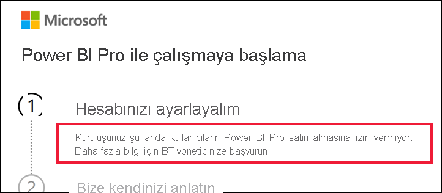

# Power BI Pro’yu satın alma devre dışıysa yapılması gerekenler

Power BI Pro’yu satın almaya çalıştığınız ancak kuruluşunuzun kullanıcılarına bunu yapma izni vermediğini belirten bir ileti aldınız. Pek çok nedenden dolayı, bazı kuruluşlar üyelerin Power BI Pro’yu self servis satın almasını engeller.  Örneğin, kuruluşunuz tüm lisansların ve aboneliklerin merkezi bir BT departmanı veya yardım masası tarafından yönetileceğine dair bir ilkesi olabilir. 

## Çözüm
Satın alma işlemini tamamlamak için, BT departmanınıza veya yardım masanıza başvurun ve [lisans sağlanması için yönergeleri izlemelerini](../admin/service-admin-manage-licenses.md) isteyin.

## Sonraki adımlar
[Lisans türüne göre Power BI özellikleri](service-features-license-type.md)