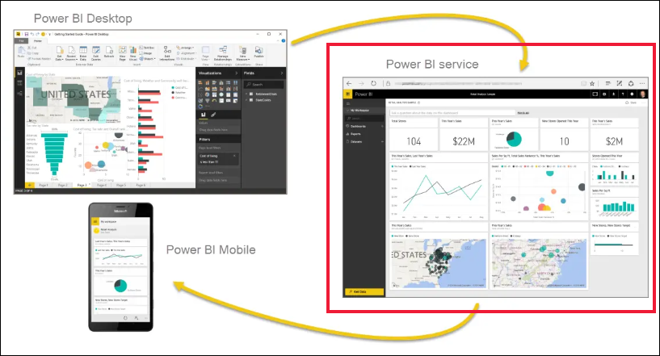
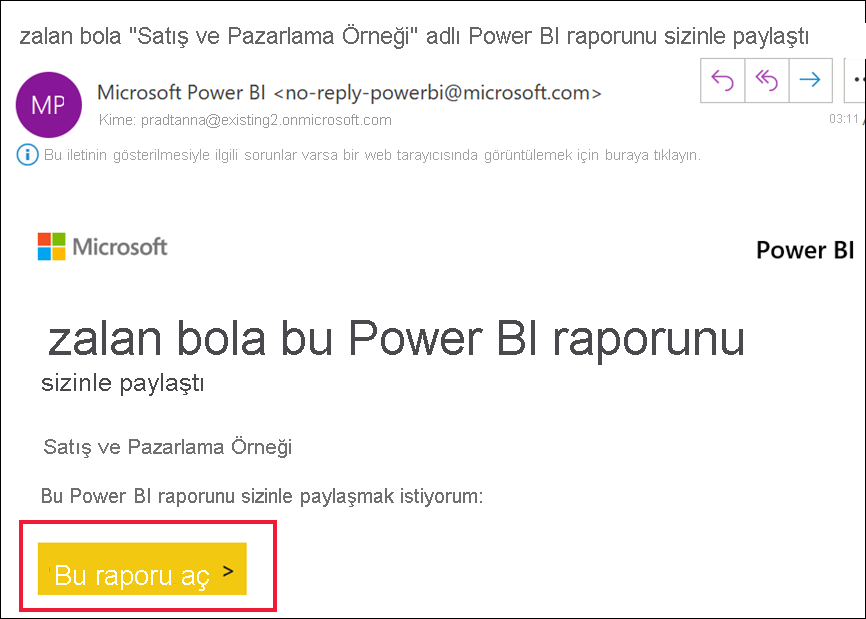
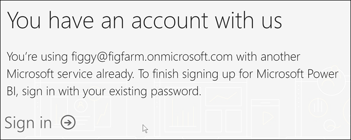
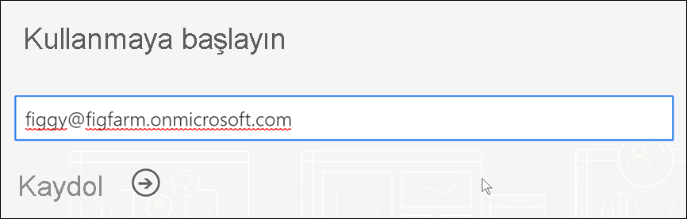
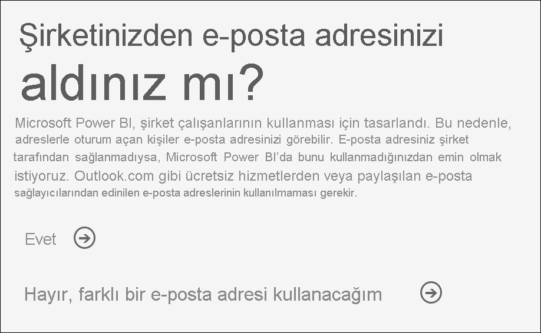
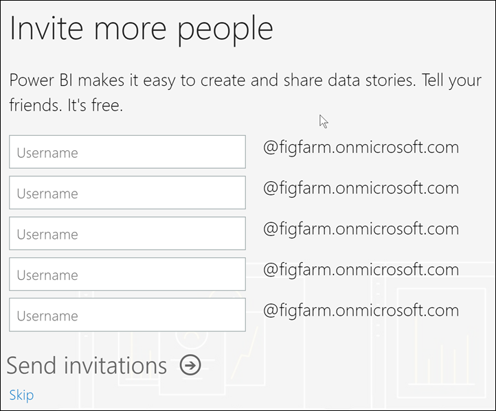
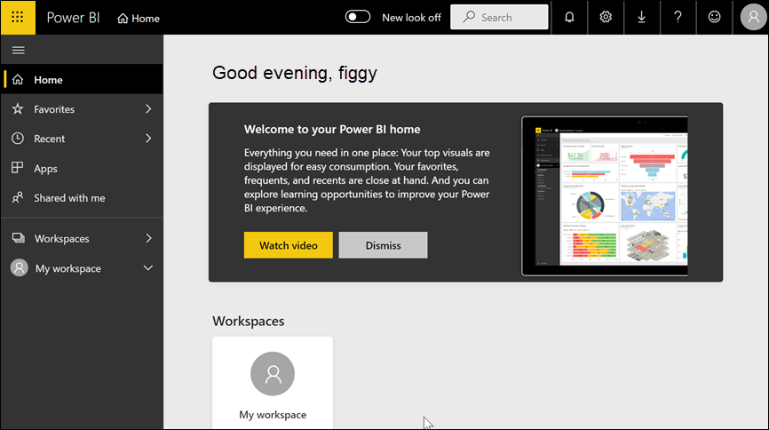
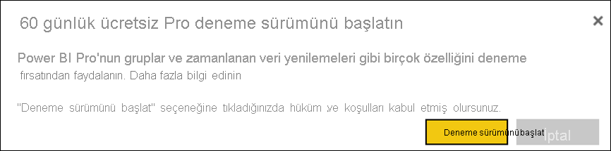

# Power BI hizmetine bireysel olarak kaydolma

Power BI, kişisel veri analizi ve görselleştirme aracınız olabileceği gibi grup projeleri, departmanlar veya tüm şirket için analiz ve karar mekanizması olarak da kullanılabilir. Bu makalede bireysel olarak Power BI’a nasıl kaydolacağınız açıklanır. Genel yönetici veya faturalama yöneticisiyseniz, bkz. [Kuruluşunuz için Power BI lisanslaması](../admin/service-admin-licensing-organization.md).

## Power BI nedir?
Power BI, daha derin veri içgörüleri sağlamak için akıllı veri görselleştirmeleriyle sezgisel kullanıcı deneyimini bir araya getiren birleştirilmiş bir self servis ve kurumsal iş zekası platformudur. Raporlar Teams, SharePoint, PowerPoint gibi Microsoft araçlarının veya diğer üretkenlik ürünlerinin içinde paylaşılabilir. İki yardımcı uygulamayla birlikte çevrimiçi bir SaaS (Hizmet olarak Yazılım) şeklinde sunulur: Raporlar oluşturmaya yönelik Power BI Desktop adlı bir Microsoft Windows masaüstü uygulaması ve raporları iOS ile Android cihazlarda kullanmaya yönelik yerel mobil BI uygulamaları. 

Bu üç bileşen (Desktop, hizmet ve mobil uygulamalar) kullanıcıların ihtiyaçlarına veya sahip oldukları role uygun iş içgörüleri oluşturmasına, paylaşmasına ve kullanmasına olanak sağlamak için tasarlanmıştır.

## Power BI hizmetine kaydolma
Bu makalede, bireysel olarak **Power BI hizmetine** kaydolma adımları açıklanır. Power BI Desktop’u indirmeye veya mobil uygulamaları yüklemeye ilişkin yardıma ihtiyaç duyuyorsanız lütfen bunun yerine aşağıdaki makalelere başvurun:
- [Power BI Desktop (tamamen ücretsiz bir şekilde indirilebilir)](desktop-get-the-desktop.md)    
- [Power BI mobil uygulamaları (tamamen ücretsiz bir şekilde indirilebilir)](../consumer/mobile/mobile-apps-for-mobile-devices.md)

## Desteklenen e-posta adresleri

Kayıt işlemine başlamadan önce, Power BI'a kaydolmak için kullanabileceğiniz e-posta adresi türlerini öğrenmeniz önemlidir:

* Power BI'a kaydolmak için bir iş veya okul e-posta adresi kullanmanız gerekir. Tüketici e-posta hizmetleri veya telekomünikasyon sağlayıcıları tarafından sağlanan e-posta adreslerini kullanarak kaydolamazsınız. Bunlar outlook.com, hotmail.com, gmail.com ve diğer adreslerdir. İş veya okul hesabınız yoksa [alternatif kaydolma yolları hakkında bilgi edinin](../admin/service-admin-signing-up-for-power-bi-with-a-new-office-365-trial.md).

* Power BI'a kaydolurken .gov veya .mil adreslerini kullanabilirsiniz ama bunun için farklı bir işlem gerekir. Daha fazla bilgi için bkz. [ABD Kamu kuruluşunuzu Power BI hizmetine kaydetme](../admin/service-govus-signup.md).

## Power BI hizmetine kaydolma

Power BI hesabına kaydolmak için şu adımları izleyin. Bu işlemi tamamladıktan sonra Çalışma Alanım’ı kullanarak Power BI hizmetini kendi kendinize denemek, Power BI Premium kapasitesine atanmış bir Power BI çalışma alanından içerik kullanmak veya bireysel bir Power BI Pro deneme sürümü başlatmak için kullanabileceğiniz bir Power BI (ücretsiz) lisansına sahip olursunuz. Daha fazla bilgi için bkz. [Lisans türüne göre Power BI özellikleri](service-features-license-type.md). 

Tam kaydolma adımları kuruluşunuza ve işlemi başlatmak için tıkladığınız öğeye göre değişiklik gösterebilir. Bu nedenle, aşağıda gösterilen tüm ekranlarla karşılaşmayabilirsiniz. Power BI hizmetine bireysel olarak kaydolmaya yönelik pek çok farklı yol vardır. Bu makaledeki adımlar, en yaygın iki yol için geçerlidir.      
- **Ücretsiz olarak deneyin** veya **Ücretsiz olarak başlayın** düğmelerinden1 birini seçersiniz.     
- Power BI panosu, raporu veya uygulamasının bağlantısını içeren bir e-posta alırsınız. Daha önce Power BI hesabınızda oturum açmadınız.

    1powerbi.microsoft.com adresinde, ilgili Microsoft ürünlerinde ve belgeler ile pazarlama makalelerinde **Ücretsiz olarak deneyin** türünde düğmeler bulabilirsiniz.

### 1\. Adım

- [powerbi.microsoft.com](https://powerbi.com) adresinden **Ücretsiz olarak deneyin** veya **Ücretsiz olarak başlayın** seçeneklerinden birini belirleyin. Bir düğmeyi iki kez seçmeniz gerekebilir.

        

- Alternatif olarak Power BI panosu, raporu veya uygulamasının e-posta bağlantısını seçin.

        

1. Microsoft 365 sizi tanır ve zaten yüklü bir Microsoft hizmetine sahip olduğunuzu bilir. **Oturum aç**'ı seçin.

        
    
1. Şu iletişim kutularından biriyle karşılaşabilirsiniz. 
    - İstenirse kuruluş hesabınızı kullanarak oturum açın.

            

    - Böyle bir ileti alırsanız Hotmail, Gmail veya Outlook gibi bir kullanıcı adresi yerine iş veya okul e-posta adresi kullandığınızdan emin olun. [Desteklenen e-posta adreslerini yukarıda](#supported-email-addresses) bulabilirsiniz.

       
   
    - Böyle bir ileti alırsanız hüküm ve koşulları gözden geçirin. Kabul ediyorsanız **Başlat**’ı seçin. 

        

1. Dilerseniz size katılmaları için bazı iş arkadaşlarınızı davet edebilirsiniz.

       

1. Bu noktada, Microsoft’un [yeni bir kiracı ayarlamasını](../admin/service-admin-signing-up-for-power-bi-with-a-new-office-365-trial.md) beklemeniz gerekebilir. Aksi takdirde, Power BI hizmeti tarayıcınızda açılır.

        

## Power BI Pro için bireysel ücretsiz denemeye kaydolma
Power BI hesabınızda ilk kez oturum açtığınız için tebrikler! Ücretsiz bir lisansa2 sahipsiniz. Power BI hizmetini keşfetmeye başladığınızda, bireysel bir Power BI Pro denemesine yükseltmek isteyip istemediğinizi soran açılır pencerelerle karşılaşırsınız. [Power BI hizmetinin bazı özellikleri için Pro lisansı gerekir](../consumer/end-user-license.md). 60 günlük Power BI Pro bağımsız deneme sürümünü kullanmaya başlamak isterseniz **Denemeyi başlat** seçeneğini belirleyin.  

    

2 Bazı kuruluşlarda, varsayılan Power BI hizmetiniz bir **Power BI Pro** lisansı olabilir. Örneğin, Microsoft 365’in bazı sürümleri Power BI Pro lisansı içerir. Kullanıcı lisansınızı nasıl arayacağınızı öğrenmek için bkz. [Hangi lisansa sahibim?](../consumer/end-user-license.md)

## Deneme süresi sonu

Ücretiz Power BI Pro bağımsız deneme sürümünüzün süresi dolduğunda, lisansınız yeniden Power BI (ücretsiz) lisansı olarak değişir. Deneme sürümü uzatılamaz. Artık Power BI Pro lisansı gerektiren özelliklere erişemezsiniz. Daha fazla bilgi için bkz. [Lisans türüne göre özellikler](service-features-license-type.md).    

Power BI (ücretsiz) lisansı yeterliyse başka bir şey yapmanız gerekmez. Power BI Pro özelliklerinden yararlanmak için **Hemen satın al**’ı seçerek veya [Power BI fiyatlandırması](https://powerbi.microsoft.com/pricing) sayfasını ziyaret ederek bir Pro lisansı satın alın.

      

Self servis satın alma kullanılamıyorsa Power BI Pro lisansı satın almak için yöneticinize başvurun.

## Kayıt işleminin sorunlarını giderme

Çoğu durumda, açıklanan işlemi yaparak Power BI'a kaydolabilirsiniz. Kaydolmanızı engelleyebilecek bazı sorunlar olası geçici çözümleriyle birlikte aşağıdaki tabloda açıklanmıştır.

| Belirti / Hata İletisi | Neden ve Geçici Çözüm |
| ----------------------- | -------------------- |
| <strong>Kişisel e-posta adresleri (örneğin nancy@gmail.com)</strong> Kayıt sırasında aşağıdakine benzer bir ileti alırsınız:    *Kişisel bir e-posta adresi girdiniz: Şirket verilerinizi güvenli bir şekilde depolayabilmemiz için lütfen iş e-posta adresinizi girin.*    veya    *Bu, kişisel bir e-posta adresi gibi görünüyor. Şirketinizdeki diğer kişilerle bağlantı kurmanızı sağlayabilmemiz için iş e-posta adresinizi girin. Endişelenmeyin. Adresinizi kimseyle paylaşmayacağız.* | Power BI, tüketici e-posta hizmetleri veya telekomünikasyon sağlayıcıları tarafından sağlanan e-posta adreslerini desteklemez.    Kaydolma işlemini tamamlamak için iş yeriniz veya okulunuz tarafından atanmış bir e-posta adresini kullanarak yeniden deneyin.    Hala kaydolamadıysanız ve daha ileri düzey bir kurulum işlemi yapmak istiyorsanız [yeni bir Microsoft 365 deneme sürümü aboneliğine kaydolup söz konusu e-posta adresini buraya kaydolmak için kullanabilirsiniz](../admin/service-admin-signing-up-for-power-bi-with-a-new-office-365-trial.md).    Ayrıca, mevcut bir kullanıcının [sizi konuk olarak davet etmesini](../admin/service-admin-azure-ad-b2b.md) de sağlayabilirsiniz. |
| **Self servis kayıt devre dışı**: Kayıt sırasında şuna benzer bir ileti alırsınız:    *Kayıt işleminizi tamamlayamadık. Microsoft Power BI için kayıt işlemi, BT departmanınız tarafından devre dışı bırakılmış. Kayıt işleminizi tamamlamak için BT departmanınız ile iletişim kurun.*    | Kuruluşunuzun [Şirket Yöneticisi](https://docs.microsoft.com/azure/active-directory/users-groups-roles/directory-assign-admin-roles.md) Power BI için self servis kaydolma özelliğini devre dışı bırakmıştır.    Kaydolma işlemini tamamlamak için, Şirket Yöneticinize başvurun ve ondan [kaydı etkinleştirmek için yönergeleri izlemesini](../admin/service-admin-disable-self-service.md) isteyin.    Microsoft 365'e bir iş ortağı aracılığıyla kaydolmanız durumunda da bu sorunla karşılaşabilirsiniz. Bu durumda, size Microsoft 365’i sağlamaktan sorumlu kuruluşa başvurun. |
| **E-posta adresiniz bir Microsoft 365 kimliği değil** Kayıt sırasında şuna benzer bir ileti alırsınız:    *contoso.com adresinizi bulamadık.  İşte veya okulda farklı bir kimlik mi kullanıyorsunuz?    Bu kimlikle oturum açmayı deneyin, işe yaramazsa BT departmanınızla iletişime geçin.* | Kuruluşunuz Microsoft 365 ve diğer Microsoft hizmetlerinde oturum açmak için sizin e-posta adresinizden farklı kimlikler kullanıyor.  Örneğin, e-posta adresiniz Nancy.Smith@contoso.com, kimliğiniz ise nancys@contoso.com olabilir.    Kaydolma işlemini tamamlamak için kuruluşunuzun Microsoft 365 veya diğer Microsoft hizmetlerinde oturum açmak üzere size atadığı kimliği kullanın.  Bunun ne olduğunu bilmiyorsanız Şirket Yöneticinize başvurun.    Hala kaydolamadıysanız ve daha ileri düzey bir kurulum işlemi yapmak istiyorsanız [yeni bir Microsoft 365 deneme sürümü aboneliğine kaydolup söz konusu e-posta adresini buraya kaydolmak için kullanabilirsiniz](../admin/service-admin-signing-up-for-power-bi-with-a-new-office-365-trial.md). |
Power BI’da oturum açma, parolanızı tanımıyor  |  Bazen birkaç kere denemek gerekebilir. Parolanızı birkaç kere yeniden denemenize rağmen oturum açamazsanız tarayıcınızı Gizli (Chrome) veya InPrivate (Microsoft Edge) modunda çalıştırmayı deneyin.

## Sonraki adımlar

[Lisans türüne göre Power BI özellikleri](../consumer/end-user-features.md)    
[Yardım bulmaya yönelik ipuçları](../fundamentals/service-tips-for-finding-help.md)    

Başka bir sorunuz mu var? [Power BI Topluluğu'na sorun](https://community.powerbi.com/)
